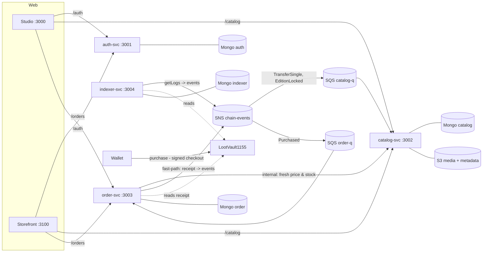

# LootVault

A multi-store NFT marketplace for game collectibles. Publishers open a store and list editions of digital cards; collectors browse, fill a cart and pay on-chain. Ownership and payment live on an EVM chain, and everything else is NestJS microservices on MongoDB.

**What it demonstrates**
- **Microservices with clear boundaries.**
  - `auth` signs users in with Sign-In with Ethereum.
  - `catalog` owns stores and items and handles search.
  - `order` runs checkout, payment confirmation and stats.
  - `indexer` reads the chain.
  - Each service has its own database.
- **A deliberately "dumb" smart contract.** Prices, discounts and limits live off-chain, in a checkout the platform signs with EIP-712. The contract enforces only signatures, replay protection, the supply cap and exact payment.
- **No overselling.** A soft stock check runs at checkout. The on-chain supply cap is the hard guarantee: `npm run demo:race` sends 20 buyers after 5 copies, exactly 5 win, and the database matches the chain.
- **Hybrid payment confirmation.**
  - A fast path confirms an order right after its transaction is mined.
  - An indexer acts as a safety net for transactions the fast path never saw.
  - Both publish identical event ids, and every consumer uses an inbox in the same Mongo transaction as its state change, so each event takes effect exactly once.
- **AWS-native messaging.** SNS fans out to SQS queues with dead-letter queues. Locally this runs on moto; on AWS, Lambda triggers replace the in-process pollers.

## Architecture



## Run it locally

Prerequisites: Docker, and Node 22. `nvm use` reads `.nvmrc`.

```bash
nvm use
npm install
npm run infra:up        # mongo (replica set), moto (S3/SNS/SQS), anvil (persistent chain)
npm run bootstrap       # .env, AWS resources, contract deploy (all idempotent)
npm run dev             # 4 services in watch mode (keep this terminal open)
```

In a second terminal:

```bash
npm run seed            # 2 stores x 6 NFTs, through the public APIs
npm run demo:smoke      # publish -> checkout -> pay -> confirm -> projections
npm run demo:race       # 20 buyers race for 5 copies
npm run doctor          # health of everything above
```

| Service | URL | Swagger |
|---|---|---|
| auth-svc | http://localhost:3001/auth | http://localhost:3001/auth/docs |
| catalog-svc | http://localhost:3002/catalog | http://localhost:3002/catalog/docs |
| order-svc | http://localhost:3003/orders | http://localhost:3003/orders/docs |
| indexer-svc | http://localhost:3004/indexer/health | http://localhost:3004/indexer/docs |

Local wallets are anvil's public test accounts. `scripts/lib/accounts.mjs` lists them by role:
- #3 and #4 are the publishers;
- #5 and #6 are the buyers.

## Scripts

| Command | What it does |
|---|---|
| `npm test` | All suites: scripts, shared, the 5 NestJS packages, and the contract (Hardhat) |
| `npm run build` | Builds the packages and all 4 services |
| `npm run bootstrap` | Merges new keys from `.env.example` into `.env`, creates the S3, SNS and SQS resources, and deploys the contract unless it is already on-chain (`deploy:local -- --force` redeploys) |
| `npm run doctor` | Checks Node, `.env`, Mongo, moto, chain, contract, signer key, AWS resources and that the dead-letter queues are empty, and reports whether each service is up |
| `npm run dlq:redrive` | Moves every message from the catalog and order dead-letter queues back to their source queues (after you fixed what made a consumer fail) |
| `npm run infra:reset` | Wipes all local state (volumes). Afterwards run `infra:up`, `bootstrap`, `dev` and `seed` again |

## Layout

```
apps/        auth-svc · catalog-svc · order-svc · indexer-svc   (NestJS 11)
packages/    contracts (Hardhat 3, Solidity) · shared (EIP-712, events, ABI) · nest-common (config, errors, auth, inbox, SNS/SQS)
scripts/     bootstrap, seed, demos, doctor
docs/        design spec, plans, decision records
```

## Known limitations

These are deliberate MVP trade-offs, each with a guard in place:

- **`TransferBatch` is not indexed.** Purchases mint one `TransferSingle` per line, so `sold` and holdings are always correct for sales. A later `safeBatchTransferFrom` between wallets is not reflected in "My collection".
- **Soft stock can be held by many wallets.** One buyer can hold at most `MAX_PENDING_ORDERS_PER_BUYER` open checkouts (default 3, otherwise `429 TOO_MANY_PENDING_ORDERS`), and an unpaid checkout expires after `CHECKOUT_TTL_SECONDS`. Someone with many wallets can still reserve stock for a few minutes, but the on-chain supply cap means nothing is ever oversold.
- **Confirmations.** `CONFIRMATIONS` is 0 locally. On a public chain, set it to 3 or more. The fast path then answers `202 PENDING_TX` until the receipt is deep enough, and the indexer lags the head by the same amount, so a reorg cannot leave an order `PAID` without a real transaction.
- **A publisher can shrink supply while a signed checkout is open.** The first sale then locks the edition on-chain at the `maxSupply` that checkout was signed with, and `EditionLocked` overwrites the catalog's `supply` to match the chain. Catalog and chain stay consistent; the publisher's edit is reverted, and that is visible in the studio. After the lock (`editionLocked`), supply edits are refused with `409 SUPPLY_LOCKED`.
- **After `infra:reset` or a new chain**, the indexer cursor from the old chain is gone together with the volumes. Redeploying to a new contract address starts a fresh cursor automatically.

## Troubleshooting

- **`AWS resources` fails in `npm run doctor`.** moto keeps its state in memory and loses it when its container restarts. Run `npm run bootstrap`, then `npm run seed -- --force` if you need the seed images back.
- **`LootVault1155 deployed` fails.** The chain volume was wiped. Run `npm run infra:reset`, then the full bootstrap again (`infra:up`, `bootstrap`, `dev`, `seed`). Running only `bootstrap` redeploys the contract on the new chain, but the indexer cursor and the Mongo projections (catalog sold counts and holdings, orders) still belong to the old chain, so the new chain would never be indexed. The indexer logs `cursor N is ahead of chain head M: the chain was reset` when it sees this.
- **`Dead-letter queues empty` fails.** A consumer gave up on a message after 5 receives. Read the catalog or order service log for the error, fix the cause, then run `npm run dlq:redrive` to put the messages back on their queues. Handlers are idempotent (inbox), so redriving is safe.
- **anvil's image is built locally** from Debian and GitHub Releases rather than pulled from ghcr.io, which returned 403 in some environments.

The design spec is in `docs/superpowers/specs/2026-10-03-lootvault-design.md`.
