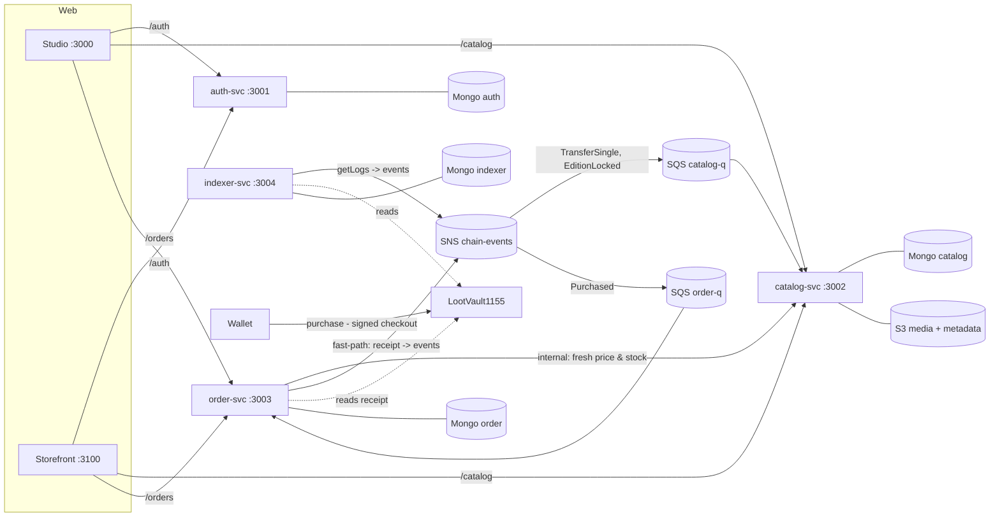

# LootVault Plan 2: Backend MVP (4 NestJS services, local ops, end-to-end demos)

> **For agentic workers:** REQUIRED SUB-SKILL: Use superpowers:subagent-driven-development (recommended) or superpowers:executing-plans to implement this plan task-by-task. Steps use checkbox (`- [ ]`) syntax for tracking.

**Goal:** Build the runnable backend MVP. A publisher can sign in, open a store and publish NFTs. A buyer can search, check out, pay on-chain and get confirmed. Catalog projections, sales stats and the oversell guarantee are all proven end to end by `npm run demo:smoke` and `npm run demo:race` against the local Docker stack.

**Architecture:**
- Four NestJS 11 services, each with its own Mongo database:
  - `auth-svc` (SIWE → JWT)
  - `catalog-svc` (stores, items, S3 media, search, holdings)
  - `order-svc` (platform-signed EIP-712 checkout, fast-path confirmation, stats)
  - `indexer-svc` (getLogs cursor → SNS)
- Shared building blocks live in `packages/nest-common`:
  - zod config, error envelope, pino with request ids
  - JWT and internal-key guards, pagination
  - Mongo-transaction inbox, SNS publisher, SQS poller
- `@lootvault/shared` gains the JSON wire formats and a single `toChainEvents()` decoder. The fast-path and the indexer both use it, so they emit identical event ids.
- Locally, SNS→SQS runs on moto, and in-process pollers stand in for Lambda triggers.

**Tech Stack:** Node 22, NestJS 11.2, Mongoose 8.24, zod 4, nestjs-pino 4.6, viem 2.57 (incl. `viem/siwe`), AWS SDK v3 (S3, SNS, SQS, presigned POST), Jest 30 + ts-jest 29.4, mongodb-memory-server 11, supertest 7, concurrently 10.

**Spec:** `docs/superpowers/specs/2026-10-03-lootvault-design.md` (§3, §5, §7, §8, §9). **Carry-forwards from Plan 1:** `docs/superpowers/plans/2026-10-03-plan-1-carry-forwards.md` ("Plan 2 must do").

**Provenance:** every code block below was run in a scratch clone of this repo before this plan was written.
- **Full suite:** 125 tests green, broken down as:

  | Suite | Tests |
  |---|---|
  | scripts | 6 |
  | shared | 20 |
  | nest-common | 11 |
  | auth | 6 |
  | catalog | 16 |
  | order | 31 |
  | indexer | 5 |
  | contracts | 30 |

- **Stack and demos against the real Docker stack:** `nest build` succeeded for all 4 services; `npm run bootstrap`, `dev`, `doctor` (13 ✔), `seed`, `demo:smoke` (PASSED) and `demo:race` all ran.
- **Race demo result:** 20 buyers; 9 got signed checkouts and 11 got `INSUFFICIENT_STOCK`; on-chain 5 succeeded and 4 reverted `SoldOut`; minted = sold = PAID = 5.

Copy the code verbatim. If something differs in your environment, investigate the root cause before changing any code.

## Global Constraints

- **Node:** `>=22.13` via `.nvmrc`. Start every shell with `source ~/.nvm/nvm.sh && nvm use` (the default shell has Node 20). zsh: quote globs.
- **NestJS:** **11** (`^11.2.7`), even though NestJS 12 exists, because the spec pins 11. Companion versions:
  - `@nestjs/cli ^11.0.24`, `@nestjs/mongoose ^11.0.4`, `@nestjs/swagger ^11.4.7`, `@nestjs/jwt ^11.0.2`, `@nestjs/schedule ^6.1.3`
  - `mongoose ^8.24.4`
  - `nestjs-pino ^4.6.1`, `pino ^9.14.0`, `pino-http ^10.5.0`, `pino-pretty ^13.1.3`
  - `zod ^4.6.5`
  - `class-validator ^0.14.2`, `class-transformer ^0.5.1`
  - `@aws-sdk/* ^3.1146.0`
  - `jest ^30.5.2`, `ts-jest ^29.4.14`, `@types/jest ^30.0.0`
  - `mongodb-memory-server ^11.3.0`
  - `supertest ^7.3.1`, `@types/supertest ^7.2.1`, `@types/express ^5.0.6`
  - `concurrently ^10.0.5`
  - TypeScript stays `~5.9.3`.
- **TS config for Nest packages:** `module`/`moduleResolution` `nodenext`, `experimentalDecorators`, `emitDecoratorMetadata`, `isolatedModules: true` (ts-jest requires it with nodenext), `strictPropertyInitialization: false`. The packages compile to CommonJS because there is no `"type": "module"`.
- **Ports and route prefixes:**

  | Service | Port | Prefix |
  |---|---|---|
  | auth | `3001` | `/auth` |
  | catalog | `3002` | `/catalog` |
  | orders | `3003` | `/orders` |
  | indexer | `3004` | `/indexer` |

  Every service exposes `GET /<prefix>/health` and Swagger at `/<prefix>/docs`.
- **Error envelope:** `{ "error": { "code", "message", "details"? } }`. Validation failures → `400 VALIDATION_FAILED` with the messages as `details`.
- **Wire conventions:**
  - tokenIds are **decimal strings**.
  - Wei amounts are decimal strings in the API and `Decimal128` in Mongo.
  - Addresses and hashes are **lower-case** in the DB and in events.
  - Event id is `chainId:txHash:logIndex`.
  - Event types: `chain.Purchased`, `chain.TransferSingle`, `chain.EditionLocked`.
- **Mongo databases:** `lootvault_auth`, `lootvault_catalog`, `lootvault_order`, `lootvault_indexer` (each overridable by env).
- **Local AWS resources:**
  - bucket `lootvault-media`
  - topic `lootvault-chain-events`
  - queue `lootvault-catalog-q` ← TransferSingle and EditionLocked
  - queue `lootvault-order-q` ← Purchased
  - each queue has a `-dlq` with `maxReceiveCount` 5
- **anvil roles** (public test keys, see `scripts/lib/accounts.mjs`):

  | Account | Role |
  |---|---|
  | #3 | publisher A, store `pixel-legends` |
  | #4 | publisher B, store `mythic-forge` |
  | #5, #6 | buyers |
  | #7, #8 | smoke publisher and buyer |
  | #9 | race publisher |

- **Commits:** end with `Co-Authored-By:` naming the model that actually authored the commit, and add the decision trailers `Constraint:`, `Rejected:`, `Confidence:`, `Scope-risk:` when you make a decision.
- **Paths:** run every command from the repo root unless a step says otherwise.

## File map

| Path | Responsibility |
|---|---|
| `packages/shared/src/{wire,chain-events}.ts` | JSON-safe checkout and the single log→event decoder |
| `packages/nest-common/src/config/env.ts` | `.env` discovery and zod config (`AppConfigModule`, `APP_CONFIG`, `InjectConfig`) |
| `packages/nest-common/src/errors/*` | `AppError` and the global error-envelope filter |
| `packages/nest-common/src/http/*` | `configureApp()` (prefix, validation, filter, CORS, Swagger) and offset pagination |
| `packages/nest-common/src/logging/*` | pino logger with `x-request-id` |
| `packages/nest-common/src/auth/*` | `CommonAuthModule`, `JwtAuthGuard`, `OptionalJwtAuthGuard`, `InternalKeyGuard`, `@CurrentUser()` |
| `packages/nest-common/src/inbox/*` | exactly-once event application (Mongo transaction + `processed_events`) |
| `packages/nest-common/src/messaging/*` | SNS `EventPublisher`, local `SqsPoller`, AWS client config |
| `packages/nest-common/src/testing/*` | `startMongo()` (in-memory replica set) and `createTestApp()` |
| `apps/auth-svc` | SIWE nonce/verify → JWT, `/auth/me` |
| `apps/catalog-svc` | stores, items (studio + storefront), uploads (presigned POST), holdings, internal batch API, chain-event projections |
| `apps/order-svc` | cart rules, pricing, order state machine, signed checkout, confirm fast-path, Purchased consumer, sweeper, stats |
| `apps/indexer-svc` | conditional-cursor log indexer publishing to SNS |
| `scripts/*` | `ensure-env`, `aws-init`, `deploy-local` (guarded), `seed`, `demo-smoke`, `demo-race`, `doctor` |
| `README.md` | how to run the MVP |

---
### Task 1: `@lootvault/shared`: wire formats, `toChainEvents`, `EditionLocked`, id helpers

**Files:**
- Modify: `packages/shared/src/ids.ts`, `packages/shared/src/events.ts`, `packages/shared/src/index.ts`
- Create: `packages/shared/src/wire.ts`, `packages/shared/src/chain-events.ts`
- Test: `packages/shared/src/ids.test.ts` and `packages/shared/src/events.test.ts` (both replaced in full), plus new `packages/shared/src/wire.test.ts` and `packages/shared/src/chain-events.test.ts`

**Interfaces:**
- Consumes: `lootVault1155Abi`, `CheckoutMessage`, `eventId` (Plan 1).
- Produces:
  - **ids:**
    - `isItemTokenId(tokenId: bigint): boolean`
    - `itemIdFromTokenId(tokenId: bigint): string`; now throws outside `[0, 2^96)`
    - `tokenIdToString(tokenId: bigint): string` (decimal)
    - `tokenIdHex64(tokenId: bigint): string`
    - `metadataKey(tokenId: bigint): string` → `metadata/<hex64>.json`
  - **events:**
    - `EVENT_TYPES.EditionLocked = "chain.EditionLocked"`
    - `EditionLockedData { tokenId: string; creator: Address; maxSupply: string }`
    - `EditionLockedEvent`
    - `ChainEvent` now also covers `EditionLockedEvent`
  - **wire:**
    - `CheckoutWire`, `CheckoutLineWire`
    - `checkoutToWire(c: CheckoutMessage): CheckoutWire`
    - `checkoutFromWire(w: CheckoutWire): CheckoutMessage`
  - **chain events:**
    - `ChainEventContext { chainId: number; contract: Address; blockTimestamp(blockNumber: bigint): number; correlationId?: string }`
    - `toChainEvents(logs: Log[], ctx: ChainEventContext): ChainEvent[]`. It drops logs from other contracts and unrelated events, lower-cases values, uses decimal strings, and sorts by (block, logIndex).

- [ ] **Step 1: Write the failing tests**

`packages/shared/src/ids.test.ts`:
```ts
import assert from "node:assert/strict";
import { describe, it } from "node:test";

import {
  isItemTokenId,
  itemIdFromTokenId,
  metadataFileName,
  metadataKey,
  tokenIdFromItemId,
  tokenIdHex64,
  tokenIdToString,
} from "./ids";

describe("ids", () => {
  const itemId = "66fd2c1e9b1d4a0012ab34cd";

  it("maps a Mongo ObjectId to a uint256 tokenId and back", () => {
    const tokenId = tokenIdFromItemId(itemId);
    assert.equal(tokenId, BigInt("0x66fd2c1e9b1d4a0012ab34cd"));
    assert.equal(itemIdFromTokenId(tokenId), itemId);
  });

  it("left-pads small tokenIds back to 24 hex chars", () => {
    assert.equal(itemIdFromTokenId(1n), "000000000000000000000001");
  });

  it("rejects strings that are not 24-char hex ObjectIds", () => {
    assert.throws(() => tokenIdFromItemId("not-an-id"), /ObjectId/);
  });

  it("builds the ERC-1155 {id} metadata file name (64 lowercase hex, no 0x)", () => {
    assert.equal(metadataFileName(tokenIdFromItemId(itemId)), `${"0".repeat(40)}66fd2c1e9b1d4a0012ab34cd.json`);
  });

  it("rejects tokenIds outside the 96-bit item range", () => {
    assert.equal(isItemTokenId((1n << 96n) - 1n), true);
    assert.equal(isItemTokenId(1n << 96n), false);
    assert.equal(isItemTokenId(-1n), false);
    assert.throws(() => itemIdFromTokenId(1n << 96n), /outside the item range/);
  });

  it("uses decimal strings as the canonical tokenId form", () => {
    assert.equal(tokenIdToString(tokenIdFromItemId(itemId)), BigInt("0x66fd2c1e9b1d4a0012ab34cd").toString(10));
  });

  it("derives the metadata object key from the 64-hex tokenId", () => {
    const tokenId = tokenIdFromItemId(itemId);
    assert.equal(tokenIdHex64(tokenId).length, 64);
    assert.equal(metadataKey(tokenId), `metadata/${tokenIdHex64(tokenId)}.json`);
  });
});
```

`packages/shared/src/events.test.ts`:
```ts
import assert from "node:assert/strict";
import { describe, it } from "node:test";

import { EVENT_TYPES, eventId } from "./events";

describe("events", () => {
  it("builds deterministic event ids with a lower-cased tx hash", () => {
    assert.equal(eventId(31337, "0xABCDEF", 3), "31337:0xabcdef:3");
  });

  it("exposes the three chain event types", () => {
    assert.deepEqual(EVENT_TYPES, {
      Purchased: "chain.Purchased",
      TransferSingle: "chain.TransferSingle",
      EditionLocked: "chain.EditionLocked",
    });
  });
});
```

`packages/shared/src/wire.test.ts`:
```ts
import assert from "node:assert/strict";
import { describe, it } from "node:test";
import { zeroAddress } from "viem";

import type { CheckoutMessage } from "./eip712";
import { checkoutFromWire, checkoutToWire } from "./wire";

describe("checkout wire format", () => {
  const checkout: CheckoutMessage = {
    orderId: `0x${"ab".repeat(32)}`,
    buyer: zeroAddress,
    deadline: 1_700_000_300n,
    lines: [{ tokenId: (1n << 95n) + 7n, creator: zeroAddress, quantity: 2n, unitPrice: 10n ** 18n, maxSupply: 5n }],
  };

  it("serialises every uint256 as a decimal string so JSON.stringify works", () => {
    assert.throws(() => JSON.stringify(checkout), /BigInt/);
    const wire = checkoutToWire(checkout);
    assert.equal(wire.lines[0].tokenId, ((1n << 95n) + 7n).toString());
    assert.equal(wire.lines[0].unitPrice, "1000000000000000000");
    assert.equal(wire.deadline, "1700000300");
    assert.doesNotThrow(() => JSON.stringify(wire));
  });

  it("round-trips losslessly through JSON", () => {
    const back = checkoutFromWire(JSON.parse(JSON.stringify(checkoutToWire(checkout))));
    assert.deepEqual(back, checkout);
  });
});
```

`packages/shared/src/chain-events.test.ts`:
```ts
import assert from "node:assert/strict";
import { describe, it } from "node:test";
import { encodeAbiParameters, encodeEventTopics, getAbiItem, type Address, type Hex, type Log } from "viem";

import { lootVault1155Abi } from "./abi/lootVault1155";
import { toChainEvents } from "./chain-events";

const CONTRACT = "0x5FbDB2315678afecb367f032d93F642f64180aa3" as Address;
const BUYER = "0x70997970C51812dc3A010C7d01b50e0d17dc79C8" as Address;
const CREATOR = "0x3C44CdDdB6a900fa2b585dd299e03d12FA4293BC" as Address;
const ZERO = "0x0000000000000000000000000000000000000000" as Address;
const TX = "0xAAAA000000000000000000000000000000000000000000000000000000000001" as Hex;
const ORDER = "0xBBBB000000000000000000000000000000000000000000000000000000000002" as Hex;

type EventName = "Purchased" | "TransferSingle" | "EditionLocked" | "ApprovalForAll";

function makeLog(eventName: EventName, args: Record<string, unknown>, at: { block: bigint; index: number; address?: Address }): Log {
  const item = getAbiItem({ abi: lootVault1155Abi, name: eventName }) as { inputs: readonly { name: string; type: string; indexed?: boolean }[] };
  const nonIndexed = item.inputs.filter((input) => !input.indexed);
  return {
    address: at.address ?? CONTRACT,
    topics: encodeEventTopics({ abi: lootVault1155Abi, eventName, args } as never) as Log["topics"],
    data: encodeAbiParameters(nonIndexed, nonIndexed.map((input) => args[input.name])),
    blockNumber: at.block,
    blockHash: `0x${"cd".repeat(32)}`,
    logIndex: at.index,
    transactionHash: TX,
    transactionIndex: 0,
    removed: false,
  } as Log;
}

const ctx = { chainId: 31337, contract: CONTRACT, blockTimestamp: (block: bigint) => 1_700_000_000 + Number(block) };

describe("toChainEvents", () => {
  const logs = [
    makeLog("Purchased", { orderId: ORDER, buyer: BUYER, total: 2000n, fee: 50n }, { block: 7n, index: 3 }),
    makeLog("TransferSingle", { operator: BUYER, from: ZERO, to: BUYER, id: 42n, value: 2n }, { block: 7n, index: 2 }),
    makeLog("EditionLocked", { tokenId: 42n, creator: CREATOR, maxSupply: 5n }, { block: 7n, index: 1 }),
  ];

  it("decodes the three LootVault events into lower-case, decimal-string envelopes", () => {
    const events = toChainEvents(logs, ctx);
    assert.deepEqual(
      events.map((e) => e.type),
      ["chain.EditionLocked", "chain.TransferSingle", "chain.Purchased"],
    );
    const purchased = events[2];
    assert.equal(purchased.id, `31337:${TX.toLowerCase()}:3`);
    assert.equal(purchased.txHash, TX.toLowerCase());
    assert.equal(purchased.blockNumber, 7);
    assert.equal(purchased.blockTimestamp, 1_700_000_007);
    assert.deepEqual(purchased.data, { orderId: ORDER.toLowerCase(), buyer: BUYER.toLowerCase(), total: "2000", fee: "50" });
    assert.deepEqual(events[1].data, { operator: BUYER.toLowerCase(), from: ZERO, to: BUYER.toLowerCase(), id: "42", value: "2" });
    assert.deepEqual(events[0].data, { tokenId: "42", creator: CREATOR.toLowerCase(), maxSupply: "5" });
  });

  it("drops logs from other contracts (forged events) and unrelated event types", () => {
    const forged = makeLog("Purchased", { orderId: ORDER, buyer: BUYER, total: 1n, fee: 0n }, { block: 8n, index: 0, address: CREATOR });
    const approval = makeLog("ApprovalForAll", { account: BUYER, operator: CREATOR, approved: true }, { block: 8n, index: 1 });
    assert.deepEqual(toChainEvents([forged, approval], ctx), []);
  });

  it("produces the same ids for the same logs regardless of input order (fast-path == indexer)", () => {
    const a = toChainEvents(logs, ctx).map((e) => e.id);
    const b = toChainEvents([...logs].reverse(), ctx).map((e) => e.id);
    assert.deepEqual(a, b);
  });

  it("stamps an optional correlation id", () => {
    const [event] = toChainEvents([logs[0]], { ...ctx, correlationId: "req-1" });
    assert.equal(event.correlationId, "req-1");
  });
});
```

- [ ] **Step 2: Run the tests to verify they fail**

Run: `source ~/.nvm/nvm.sh && nvm use && npm test -w @lootvault/shared`
Expected: FAIL. tsc errors such as `Module './ids' has no exported member 'isItemTokenId'` and `Cannot find module './wire'`/`'./chain-events'`.

- [ ] **Step 3: Implement**

`packages/shared/src/ids.ts`:
```ts
const OBJECT_ID = /^[0-9a-f]{24}$/i;
/** Item tokenIds come from 12-byte Mongo ObjectIds, so they are always below 2^96. */
const ITEM_TOKEN_ID_LIMIT = 1n << 96n;

/** Mongo ObjectId (24 hex chars) -> uint256 tokenId. */
export function tokenIdFromItemId(itemId: string): bigint {
  if (!OBJECT_ID.test(itemId)) throw new Error(`Not a Mongo ObjectId: ${itemId}`);
  return BigInt(`0x${itemId}`);
}

/** True when a tokenId can belong to a catalog item (0 <= id < 2^96). */
export function isItemTokenId(tokenId: bigint): boolean {
  return tokenId >= 0n && tokenId < ITEM_TOKEN_ID_LIMIT;
}

/**
 * uint256 tokenId -> Mongo ObjectId hex (lower-case, left-padded to 24 chars).
 * Throws for ids outside the item range (e.g. minted with a leaked signer key);
 * consumers should treat such tokens as unknown.
 */
export function itemIdFromTokenId(tokenId: bigint): string {
  if (!isItemTokenId(tokenId)) throw new Error(`tokenId ${tokenId} is outside the item range`);
  return tokenId.toString(16).padStart(24, "0");
}

/** Canonical tokenId form in the database, events and APIs: a decimal string. */
export function tokenIdToString(tokenId: bigint): string {
  return tokenId.toString(10);
}

/** ERC-1155 `{id}` substitution value: 64 lower-case hex chars, no 0x prefix. */
export function tokenIdHex64(tokenId: bigint): string {
  return tokenId.toString(16).padStart(64, "0");
}

/** File name of a token's metadata JSON: `<tokenIdHex64>.json`. */
export function metadataFileName(tokenId: bigint): string {
  return `${tokenIdHex64(tokenId)}.json`;
}

/**
 * Object-storage key of a token's metadata. Matches the contract URI template
 * `<base>/metadata/{id}.json`, so never append it to a template that already ends in `{id}.json`.
 */
export function metadataKey(tokenId: bigint): string {
  return `metadata/${metadataFileName(tokenId)}`;
}
```

`packages/shared/src/events.ts`:
```ts
import type { Address, Hex } from "viem";

export const EVENT_TYPES = {
  Purchased: "chain.Purchased",
  TransferSingle: "chain.TransferSingle",
  EditionLocked: "chain.EditionLocked",
} as const;

export type EventType = (typeof EVENT_TYPES)[keyof typeof EVENT_TYPES];

/** Envelope published to SNS by the indexer and by order-svc's fast-path. */
export interface EventEnvelope<TType extends EventType, TData> {
  /** `${chainId}:${txHash}:${logIndex}`: identical whichever path published it. */
  id: string;
  type: TType;
  chainId: number;
  blockNumber: number;
  /** Unix seconds. */
  blockTimestamp: number;
  txHash: Hex;
  logIndex: number;
  correlationId?: string;
  data: TData;
}

/**
 * Wire conventions for every `data` payload:
 * - amounts and token ids are decimal strings (wei / `tokenIdToString`), so JSON stays lossless;
 * - addresses and hashes are lower-case.
 */
export interface PurchasedData {
  orderId: Hex;
  buyer: Address;
  total: string;
  fee: string;
}

export interface TransferSingleData {
  operator: Address;
  from: Address;
  to: Address;
  /** tokenId, decimal string. */
  id: string;
  value: string;
}

export interface EditionLockedData {
  /** tokenId, decimal string. */
  tokenId: string;
  creator: Address;
  maxSupply: string;
}

export type PurchasedEvent = EventEnvelope<typeof EVENT_TYPES.Purchased, PurchasedData>;
export type TransferSingleEvent = EventEnvelope<typeof EVENT_TYPES.TransferSingle, TransferSingleData>;
export type EditionLockedEvent = EventEnvelope<typeof EVENT_TYPES.EditionLocked, EditionLockedData>;
export type ChainEvent = PurchasedEvent | TransferSingleEvent | EditionLockedEvent;

export function eventId(chainId: number, txHash: Hex, logIndex: number): string {
  return `${chainId}:${txHash.toLowerCase()}:${logIndex}`;
}
```

`packages/shared/src/wire.ts`:
```ts
import type { Address, Hex } from "viem";

import type { CheckoutMessage } from "./eip712";

/** JSON-safe form of a CheckoutLine: every uint256 is a decimal string. */
export interface CheckoutLineWire {
  tokenId: string;
  creator: Address;
  quantity: string;
  unitPrice: string;
  maxSupply: string;
}

/** JSON-safe form of a CheckoutMessage, as returned by `POST /orders/checkout`. */
export interface CheckoutWire {
  orderId: Hex;
  buyer: Address;
  lines: CheckoutLineWire[];
  deadline: string;
}

export function checkoutToWire(checkout: CheckoutMessage): CheckoutWire {
  return {
    orderId: checkout.orderId,
    buyer: checkout.buyer,
    deadline: checkout.deadline.toString(),
    lines: checkout.lines.map((line) => ({
      tokenId: line.tokenId.toString(),
      creator: line.creator,
      quantity: line.quantity.toString(),
      unitPrice: line.unitPrice.toString(),
      maxSupply: line.maxSupply.toString(),
    })),
  };
}

export function checkoutFromWire(wire: CheckoutWire): CheckoutMessage {
  return {
    orderId: wire.orderId,
    buyer: wire.buyer,
    deadline: BigInt(wire.deadline),
    lines: wire.lines.map((line) => ({
      tokenId: BigInt(line.tokenId),
      creator: line.creator,
      quantity: BigInt(line.quantity),
      unitPrice: BigInt(line.unitPrice),
      maxSupply: BigInt(line.maxSupply),
    })),
  };
}
```

`packages/shared/src/chain-events.ts`:
```ts
import { parseEventLogs, type Address, type Hex, type Log } from "viem";

import { lootVault1155Abi } from "./abi/lootVault1155";
import { EVENT_TYPES, eventId, type ChainEvent } from "./events";

export interface ChainEventContext {
  chainId: number;
  /** LootVault1155 address. Logs emitted by any other contract are ignored (they could be forged). */
  contract: Address;
  /** Unix seconds of the block a log was mined in. */
  blockTimestamp: (blockNumber: bigint) => number;
  correlationId?: string;
}

const lower = <T extends string>(value: T) => value.toLowerCase() as T;

/**
 * Turn raw logs into chain events. The order-svc fast-path (one receipt) and the indexer
 * (getLogs ranges) both call this, so a log always yields the same event with the same id.
 * Unrelated events and logs from other contracts are dropped; output is sorted by (block, logIndex).
 */
export function toChainEvents(logs: Log[], ctx: ChainEventContext): ChainEvent[] {
  const contract = lower(ctx.contract);
  const ours = logs.filter((log) => lower(log.address) === contract && log.blockNumber !== null);
  const parsed = parseEventLogs({
    abi: lootVault1155Abi,
    logs: ours,
    eventName: ["Purchased", "TransferSingle", "EditionLocked"],
  });

  const events = parsed.map((log): ChainEvent => {
    const blockNumber = log.blockNumber as bigint;
    const txHash = lower(log.transactionHash as Hex);
    const logIndex = log.logIndex as number;
    const base = {
      id: eventId(ctx.chainId, txHash, logIndex),
      chainId: ctx.chainId,
      blockNumber: Number(blockNumber),
      blockTimestamp: ctx.blockTimestamp(blockNumber),
      txHash,
      logIndex,
      ...(ctx.correlationId ? { correlationId: ctx.correlationId } : {}),
    };
    switch (log.eventName) {
      case "Purchased":
        return {
          ...base,
          type: EVENT_TYPES.Purchased,
          data: {
            orderId: lower(log.args.orderId),
            buyer: lower(log.args.buyer),
            total: log.args.total.toString(),
            fee: log.args.fee.toString(),
          },
        };
      case "TransferSingle":
        return {
          ...base,
          type: EVENT_TYPES.TransferSingle,
          data: {
            operator: lower(log.args.operator),
            from: lower(log.args.from),
            to: lower(log.args.to),
            id: log.args.id.toString(),
            value: log.args.value.toString(),
          },
        };
      case "EditionLocked":
        return {
          ...base,
          type: EVENT_TYPES.EditionLocked,
          data: {
            tokenId: log.args.tokenId.toString(),
            creator: lower(log.args.creator),
            maxSupply: log.args.maxSupply.toString(),
          },
        };
    }
  });

  return events.sort((a, b) => a.blockNumber - b.blockNumber || a.logIndex - b.logIndex);
}
```

`packages/shared/src/index.ts`:
```ts
export * from "./abi/lootVault1155";
export * from "./chain-events";
export * from "./eip712";
export * from "./events";
export * from "./ids";
export * from "./wire";

export const LOCAL_CHAIN_ID = 31337;
export const BASE_SEPOLIA_CHAIN_ID = 84532;
```

- [ ] **Step 4: Run the tests to verify they pass**

Run: `npm test -w @lootvault/shared && npm run test:contracts`
Expected: shared `# pass 20`, `# fail 0`, and contracts still `30 passing`. The ABI drift guard and the contract tests import shared.

- [ ] **Step 5: Commit**

```bash
git add packages/shared
git commit -m "feat(shared): JSON wire format for checkouts and a single log-to-event decoder

Constraint: fast-path and indexer must emit byte-identical events (same ids) from the same log
Rejected: per-service decoders | two code paths would drift and break inbox de-duplication
Confidence: high
Scope-risk: low
Co-Authored-By: <the model that authored the commit> <noreply@anthropic.com>"
```

---

### Task 2: `@lootvault/nest-common` core: config, errors, HTTP conventions, logging, auth guards, test harness

**Files:**
- Modify: `package.json` (root). It gains the test-tooling devDependencies, and the `postinstall`/`build:packages` scripts now also build nest-common.
- Create: `packages/nest-common/{package.json,tsconfig.json,tsconfig.build.json}`
- Create, under `packages/nest-common/src/`:
  - `config/env.ts`
  - `errors/app-error.ts`, `errors/app-exception.filter.ts`
  - `http/configure-app.ts`, `http/pagination.ts`
  - `logging/logger.module.ts`
  - `auth/{auth.types,jwt-auth.guard,internal-key.guard,current-user.decorator,auth.module}.ts`
  - `testing/index.ts`, `index.ts`
- Test: `packages/nest-common/src/config/env.spec.ts`, `packages/nest-common/src/errors/app-exception.filter.spec.ts`

**Interfaces:**
- **Config:**
  - `APP_CONFIG` (symbol), `InjectConfig()`
  - `AppConfigModule.forRoot(schema: z.ZodType)`. Global; runs `loadEnvFile()` then `parseConfig(schema)`.
  - `loadEnvFile(start?: string, maxDepth?: number): string | undefined`. Walks up to the nearest `.env`; never overrides existing env.
  - `parseConfig(schema, env?)`
- **Errors:**
  - `AppError(code: string, status: number, message?: string, details?: unknown)`
  - `toErrorResponse(e)`, `AppExceptionFilter`
- **HTTP:**
  - `configureApp(app, { prefix, title })`
  - `PageQueryDto { page=1; limit=20 (max 50) }`, `Page<T> { items; page; limit; total }`
  - `paginate(query, find(skip, limit), count())`
- **Logging:** `createLoggerModule(serviceName)`
- **Auth:**
  - `CommonAuthModule.forRoot()`. Global; registers `JwtModule` from `APP_CONFIG.JWT_SECRET`/`JWT_TTL_SECONDS`.
  - `JwtAuthGuard`, `OptionalJwtAuthGuard` (both set `req.user: AuthUser { address }`, lower-case)
  - `InternalKeyGuard` (`x-internal-key` == `INTERNAL_API_KEY`)
  - `@CurrentUser()`, `AuthConfig`
- **Testing** (`@lootvault/nest-common/testing`):
  - `startMongo(): Promise<{ uri; stop }>` (in-memory single-node replica set)
  - `createTestApp(AppModule, { prefix, env, override? })`. Sets env, compiles, applies `configureApp`, then `init()`.

- [ ] **Step 1: Scaffold the package and update the root `package.json`**

`package.json` (root, full content after this task):
```json
{
  "name": "lootvault",
  "private": true,
  "description": "Multi-store NFT marketplace: NestJS microservices, MongoDB, Next.js, Solidity, AWS",
  "workspaces": [
    "packages/*",
    "apps/*"
  ],
  "engines": {
    "node": ">=22.13.0"
  },
  "scripts": {
    "postinstall": "npm run build:packages",
    "build:packages": "npm run build -w @lootvault/shared && npm run build -w @lootvault/nest-common",
    "test:shared": "npm test -w @lootvault/shared",
    "test:contracts": "npm test -w @lootvault/contracts",
    "test:scripts": "node --test \"scripts/**/*.test.mjs\"",
    "doctor": "node scripts/doctor.mjs",
    "infra:up": "docker compose up -d --build --wait",
    "infra:down": "docker compose down",
    "infra:reset": "docker compose down -v",
    "deploy:local": "npm run deploy -w @lootvault/contracts -- --network localhost && node scripts/sync-deployment-env.mjs localhost"
  },
  "devDependencies": {
    "@nestjs/cli": "^11.0.24",
    "@nestjs/testing": "^11.2.7",
    "@types/express": "^5.0.6",
    "@types/jest": "^30.0.0",
    "@types/node": "^22.15.0",
    "@types/supertest": "^7.2.1",
    "jest": "^30.5.2",
    "mongodb-memory-server": "^11.3.0",
    "prettier": "^3.6.2",
    "supertest": "^7.3.1",
    "ts-jest": "^29.4.14",
    "typescript": "~5.9.3"
  }
}
```
`packages/nest-common/package.json`:
```json
{
  "name": "@lootvault/nest-common",
  "version": "0.1.0",
  "private": true,
  "description": "Cross-cutting NestJS building blocks shared by the LootVault services",
  "main": "dist/index.js",
  "types": "dist/index.d.ts",
  "exports": {
    ".": "./dist/index.js",
    "./testing": "./dist/testing/index.js"
  },
  "typesVersions": {
    "*": {
      "testing": [
        "dist/testing/index.d.ts"
      ]
    }
  },
  "files": [
    "dist"
  ],
  "scripts": {
    "build": "rm -rf dist && tsc -p tsconfig.build.json",
    "test": "jest",
    "build:watch": "tsc -p tsconfig.build.json --watch --preserveWatchOutput",
    "typecheck": "tsc -p tsconfig.json --noEmit"
  },
  "dependencies": {
    "@aws-sdk/client-sns": "^3.1146.0",
    "@aws-sdk/client-sqs": "^3.1146.0",
    "@lootvault/shared": "*",
    "@nestjs/common": "^11.2.7",
    "@nestjs/core": "^11.2.7",
    "@nestjs/jwt": "^11.0.2",
    "@nestjs/mongoose": "^11.0.4",
    "@nestjs/platform-express": "^11.2.7",
    "@nestjs/swagger": "^11.4.7",
    "class-transformer": "^0.5.1",
    "class-validator": "^0.14.2",
    "mongoose": "^8.24.4",
    "nestjs-pino": "^4.6.1",
    "pino": "^9.14.0",
    "pino-http": "^10.5.0",
    "pino-pretty": "^13.1.3",
    "reflect-metadata": "^0.2.2",
    "rxjs": "^7.8.2",
    "zod": "^4.6.5"
  },
  "jest": {
    "testEnvironment": "node",
    "rootDir": "src",
    "testRegex": ".*\\.spec\\.ts$",
    "transform": {
      "^.+\\.ts$": [
        "ts-jest",
        {
          "tsconfig": "tsconfig.json"
        }
      ]
    },
    "testTimeout": 60000
  }
}
```
`packages/nest-common/tsconfig.json`:
```json
{
  "extends": "../../tsconfig.base.json",
  "compilerOptions": {
    "module": "nodenext",
    "moduleResolution": "nodenext",
    "rootDir": "src",
    "outDir": "dist",
    "types": ["node", "jest"],
    "experimentalDecorators": true,
    "emitDecoratorMetadata": true,
    "isolatedModules": true,
    "strictPropertyInitialization": false
  },
  "include": ["src"]
}
```

`packages/nest-common/tsconfig.build.json`:
```json
{
  "extends": "./tsconfig.json",
  "compilerOptions": { "types": ["node"] },
  "exclude": ["src/**/*.spec.ts"]
}
```

- [ ] **Step 2: Write the failing tests**

`packages/nest-common/src/config/env.spec.ts`:
```ts
import { mkdirSync, mkdtempSync, writeFileSync } from "node:fs";
import { tmpdir } from "node:os";
import { join } from "node:path";

import { z } from "zod";

import { loadEnvFile, parseConfig } from "./env";

describe("parseConfig", () => {
  const schema = z.object({ PORT: z.coerce.number().int(), JWT_SECRET: z.string().min(8) });

  it("coerces and returns typed values", () => {
    expect(parseConfig(schema, { PORT: "3001", JWT_SECRET: "long-enough" })).toEqual({ PORT: 3001, JWT_SECRET: "long-enough" });
  });

  it("lists every invalid key in one error", () => {
    expect(() => parseConfig(schema, { PORT: "abc" })).toThrow(/PORT[\s\S]*JWT_SECRET/);
  });
});

describe("loadEnvFile", () => {
  it("finds the .env of an ancestor directory without overriding existing variables", () => {
    const root = mkdtempSync(join(tmpdir(), "lv-env-"));
    const service = join(root, "apps", "svc");
    mkdirSync(service, { recursive: true });
    writeFileSync(join(root, ".env"), "LV_TEST_FROM_FILE=file\nLV_TEST_KEEP=file\n");
    process.env.LV_TEST_KEEP = "process";

    expect(loadEnvFile(service)).toBe(join(root, ".env"));
    expect(process.env.LV_TEST_FROM_FILE).toBe("file");
    expect(process.env.LV_TEST_KEEP).toBe("process");
  });
});
```

`packages/nest-common/src/errors/app-exception.filter.spec.ts`:
```ts
import { BadRequestException, NotFoundException } from "@nestjs/common";

import { AppError } from "./app-error";
import { toErrorResponse } from "./app-exception.filter";

describe("toErrorResponse", () => {
  it("renders an AppError with its code, status and details", () => {
    expect(toErrorResponse(new AppError("SLUG_TAKEN", 409, "Slug already used", { slug: "x" }))).toEqual({
      status: 409,
      body: { error: { code: "SLUG_TAKEN", message: "Slug already used", details: { slug: "x" } } },
    });
  });

  it("turns ValidationPipe errors into VALIDATION_FAILED with the messages as details", () => {
    const { status, body } = toErrorResponse(new BadRequestException(["name must be a string"]));
    expect(status).toBe(400);
    expect(body.error).toEqual({ code: "VALIDATION_FAILED", message: "Request validation failed", details: ["name must be a string"] });
  });

  it("maps framework HttpExceptions to a code by status", () => {
    expect(toErrorResponse(new NotFoundException("Cannot GET /x")).body.error).toEqual({ code: "NOT_FOUND", message: "Cannot GET /x" });
  });

  it("hides unknown errors behind an opaque 500", () => {
    expect(toErrorResponse(new Error("db password is hunter2"))).toEqual({
      status: 500,
      body: { error: { code: "INTERNAL_ERROR", message: "Unexpected error" } },
    });
  });
});
```

- [ ] **Step 3: Run the tests to verify they fail**

Run: `source ~/.nvm/nvm.sh && nvm use && npm install --ignore-scripts && npm test -w @lootvault/nest-common`
Expected: FAIL. Jest reports `Cannot find module './env'` and `Cannot find module './app-error'`. `--ignore-scripts` skips the root postinstall build, because nest-common has no sources yet.

- [ ] **Step 4: Implement**

`packages/nest-common/src/config/env.ts`:
```ts
import { existsSync, readFileSync } from "node:fs";
import { dirname, join } from "node:path";
import { parseEnv } from "node:util";

import { type DynamicModule, Inject, Module } from "@nestjs/common";
import type { z } from "zod";

export const APP_CONFIG = Symbol("APP_CONFIG");

/** Injects the parsed, typed service config registered by `AppConfigModule.forRoot`. */
export const InjectConfig = () => Inject(APP_CONFIG);

/**
 * Loads the nearest `.env` walking up from `start`. Services run with cwd = apps/<svc> while the
 * monorepo keeps a single root `.env`. Existing environment variables win; no file (Lambda) is a no-op.
 */
export function loadEnvFile(start = process.cwd(), maxDepth = 4): string | undefined {
  let dir = start;
  for (let depth = 0; depth <= maxDepth; depth += 1) {
    const candidate = join(dir, ".env");
    if (existsSync(candidate)) {
      for (const [key, value] of Object.entries(parseEnv(readFileSync(candidate, "utf8")))) {
        if (process.env[key] === undefined) process.env[key] = value;
      }
      return candidate;
    }
    const parent = dirname(dir);
    if (parent === dir) break;
    dir = parent;
  }
  return undefined;
}

/** Validates `env` against a zod schema and fails fast with every problem listed. */
export function parseConfig<T extends z.ZodType>(schema: T, env: NodeJS.ProcessEnv = process.env): z.infer<T> {
  const result = schema.safeParse(env);
  if (!result.success) {
    const issues = result.error.issues.map((issue) => `  - ${issue.path.join(".")}: ${issue.message}`).join("\n");
    throw new Error(`Invalid configuration:\n${issues}\nSee .env.example`);
  }
  return result.data;
}

@Module({})
export class AppConfigModule {
  static forRoot<T extends z.ZodType>(schema: T): DynamicModule {
    return {
      module: AppConfigModule,
      global: true,
      providers: [
        {
          provide: APP_CONFIG,
          useFactory: () => {
            loadEnvFile();
            return parseConfig(schema);
          },
        },
      ],
      exports: [APP_CONFIG],
    };
  }
}
```

`packages/nest-common/src/errors/app-error.ts`:
```ts
/** A domain error with a stable machine-readable code, rendered as `{ error: { code, message, details } }`. */
export class AppError extends Error {
  constructor(
    readonly code: string,
    readonly status: number,
    message?: string,
    readonly details?: unknown,
  ) {
    super(message ?? code);
    this.name = "AppError";
  }
}
```

`packages/nest-common/src/errors/app-exception.filter.ts`:
```ts
import { type ArgumentsHost, Catch, type ExceptionFilter, HttpException, Logger } from "@nestjs/common";
import type { Response } from "express";

import { AppError } from "./app-error";

export interface ErrorBody {
  error: { code: string; message: string; details?: unknown };
}

const CODES_BY_STATUS: Record<number, string> = {
  400: "BAD_REQUEST",
  401: "UNAUTHORIZED",
  403: "FORBIDDEN",
  404: "NOT_FOUND",
  409: "CONFLICT",
  413: "PAYLOAD_TOO_LARGE",
  429: "TOO_MANY_REQUESTS",
};

/** Maps any thrown value to the API error envelope. Unknown errors become an opaque 500. */
export function toErrorResponse(exception: unknown): { status: number; body: ErrorBody } {
  if (exception instanceof AppError) {
    const { code, message, details } = exception;
    return { status: exception.status, body: { error: { code, message, ...(details === undefined ? {} : { details }) } } };
  }
  if (exception instanceof HttpException) {
    const status = exception.getStatus();
    const response = exception.getResponse();
    const message = typeof response === "string" ? response : (response as { message?: unknown }).message;
    if (status === 400 && Array.isArray(message)) {
      return { status, body: { error: { code: "VALIDATION_FAILED", message: "Request validation failed", details: message } } };
    }
    return {
      status,
      body: { error: { code: CODES_BY_STATUS[status] ?? "HTTP_ERROR", message: typeof message === "string" ? message : exception.message } },
    };
  }
  return { status: 500, body: { error: { code: "INTERNAL_ERROR", message: "Unexpected error" } } };
}

@Catch()
export class AppExceptionFilter implements ExceptionFilter {
  private readonly logger = new Logger(AppExceptionFilter.name);

  catch(exception: unknown, host: ArgumentsHost): void {
    const { status, body } = toErrorResponse(exception);
    if (status >= 500) this.logger.error(exception instanceof Error ? exception.stack : String(exception));
    host.switchToHttp().getResponse<Response>().status(status).json(body);
  }
}
```

`packages/nest-common/src/http/configure-app.ts`:
```ts
import { type INestApplication, ValidationPipe } from "@nestjs/common";
import { DocumentBuilder, SwaggerModule } from "@nestjs/swagger";
import { Logger } from "nestjs-pino";

import { AppExceptionFilter } from "../errors/app-exception.filter";

export interface ConfigureAppOptions {
  /** Route prefix owned by the service, e.g. "catalog" -> every route lives under /catalog. */
  prefix: string;
  /** Swagger title. */
  title: string;
}

/**
 * Applies the conventions every service shares: pino logger, global route prefix,
 * whitelist validation, the error envelope, CORS and Swagger at `/<prefix>/docs`.
 */
export function configureApp(app: INestApplication, options: ConfigureAppOptions): void {
  app.useLogger(app.get(Logger));
  app.setGlobalPrefix(options.prefix);
  app.useGlobalPipes(new ValidationPipe({ whitelist: true, forbidNonWhitelisted: true, transform: true }));
  app.useGlobalFilters(new AppExceptionFilter());
  app.enableCors({ origin: true, exposedHeaders: ["x-request-id"] });
  app.enableShutdownHooks();

  const document = SwaggerModule.createDocument(
    app,
    new DocumentBuilder().setTitle(options.title).setVersion("1.0").addBearerAuth().build(),
  );
  SwaggerModule.setup(`${options.prefix}/docs`, app, document);
}
```

`packages/nest-common/src/http/pagination.ts`:
```ts
import { ApiPropertyOptional } from "@nestjs/swagger";
import { Type } from "class-transformer";
import { IsInt, IsOptional, Max, Min } from "class-validator";

export class PageQueryDto {
  @ApiPropertyOptional({ minimum: 1, default: 1 })
  @IsOptional()
  @Type(() => Number)
  @IsInt()
  @Min(1)
  page: number = 1;

  @ApiPropertyOptional({ minimum: 1, maximum: 50, default: 20 })
  @IsOptional()
  @Type(() => Number)
  @IsInt()
  @Min(1)
  @Max(50)
  limit: number = 20;
}

export interface Page<T> {
  items: T[];
  page: number;
  limit: number;
  total: number;
}

/** Offset pagination over any data source: `find(skip, limit)` + `count()`. */
export async function paginate<T>(
  query: PageQueryDto,
  find: (skip: number, limit: number) => Promise<T[]>,
  count: () => Promise<number>,
): Promise<Page<T>> {
  const [items, total] = await Promise.all([find((query.page - 1) * query.limit, query.limit), count()]);
  return { items, page: query.page, limit: query.limit, total };
}
```

`packages/nest-common/src/logging/logger.module.ts`:
```ts
import { randomUUID } from "node:crypto";

import { type DynamicModule, RequestMethod } from "@nestjs/common";
import { LoggerModule } from "nestjs-pino";

/**
 * Structured JSON logs (pretty-printed locally) with a request id taken from `x-request-id`
 * or generated, echoed back in the response so a single id traces a request across services.
 * Options are read when the module is created, so LOG_LEVEL / LOG_PRETTY set by tests apply.
 */
export function createLoggerModule(service: string): DynamicModule {
  return LoggerModule.forRootAsync({
    useFactory: () => {
      const pretty = process.env.NODE_ENV !== "production" && process.env.LOG_PRETTY !== "false";
      return {
        // Express 5 wildcard syntax (the default "*" triggers a path-to-regexp deprecation warning).
        forRoutes: [{ path: "{*path}", method: RequestMethod.ALL }],
        pinoHttp: {
          name: service,
          level: process.env.LOG_LEVEL ?? "info",
          genReqId: (req, res) => {
            const id = (req.headers["x-request-id"] as string | undefined) ?? randomUUID();
            res.setHeader("x-request-id", id);
            return id;
          },
          autoLogging: { ignore: (req) => req.url?.endsWith("/health") ?? false },
          redact: ["req.headers.authorization", 'req.headers["x-internal-key"]'],
          transport: pretty ? { target: "pino-pretty", options: { singleLine: true, translateTime: "HH:MM:ss" } } : undefined,
        },
      };
    },
  });
}
```

`packages/nest-common/src/auth/auth.types.ts`:
```ts
/** The authenticated principal: a wallet address, always lower-case. */
export interface AuthUser {
  address: `0x${string}`;
}

export interface AuthConfig {
  JWT_SECRET: string;
  JWT_TTL_SECONDS?: number;
  INTERNAL_API_KEY?: string;
}
```

`packages/nest-common/src/auth/jwt-auth.guard.ts`:
```ts
import { type CanActivate, type ExecutionContext, Injectable } from "@nestjs/common";
import { JwtService } from "@nestjs/jwt";
import type { Request } from "express";

import { AppError } from "../errors/app-error";
import type { AuthUser } from "./auth.types";

type AuthedRequest = Request & { user?: AuthUser };

function bearerToken(req: Request): string | undefined {
  const header = req.headers.authorization;
  return header?.startsWith("Bearer ") ? header.slice(7) : undefined;
}

function verify(jwt: JwtService, token: string): AuthUser {
  try {
    const payload = jwt.verify<{ sub: string }>(token);
    return { address: payload.sub.toLowerCase() as AuthUser["address"] };
  } catch {
    throw new AppError("UNAUTHORIZED", 401, "Invalid or expired token");
  }
}

/** Requires a valid `Authorization: Bearer <jwt>`; sets `req.user`. */
@Injectable()
export class JwtAuthGuard implements CanActivate {
  constructor(private readonly jwt: JwtService) {}

  canActivate(context: ExecutionContext): boolean {
    const req = context.switchToHttp().getRequest<AuthedRequest>();
    const token = bearerToken(req);
    if (!token) throw new AppError("UNAUTHORIZED", 401, "Missing bearer token");
    req.user = verify(this.jwt, token);
    return true;
  }
}

/** Like JwtAuthGuard, but anonymous requests pass (`req.user` stays undefined). */
@Injectable()
export class OptionalJwtAuthGuard implements CanActivate {
  constructor(private readonly jwt: JwtService) {}

  canActivate(context: ExecutionContext): boolean {
    const req = context.switchToHttp().getRequest<AuthedRequest>();
    const token = bearerToken(req);
    if (token) req.user = verify(this.jwt, token);
    return true;
  }
}
```

`packages/nest-common/src/auth/internal-key.guard.ts`:
```ts
import { timingSafeEqual } from "node:crypto";

import { type CanActivate, type ExecutionContext, Injectable } from "@nestjs/common";
import type { Request } from "express";

import { InjectConfig } from "../config/env";
import { AppError } from "../errors/app-error";
import type { AuthConfig } from "./auth.types";

/** Service-to-service guard: `x-internal-key` must equal INTERNAL_API_KEY (constant-time compare). */
@Injectable()
export class InternalKeyGuard implements CanActivate {
  constructor(@InjectConfig() private readonly config: AuthConfig) {}

  canActivate(context: ExecutionContext): boolean {
    const expected = this.config.INTERNAL_API_KEY;
    const provided = context.switchToHttp().getRequest<Request>().headers["x-internal-key"];
    if (!expected || typeof provided !== "string") throw new AppError("UNAUTHORIZED", 401, "Missing internal key");
    const a = Buffer.from(provided);
    const b = Buffer.from(expected);
    if (a.length !== b.length || !timingSafeEqual(a, b)) throw new AppError("UNAUTHORIZED", 401, "Invalid internal key");
    return true;
  }
}
```

`packages/nest-common/src/auth/current-user.decorator.ts`:
```ts
import { createParamDecorator, type ExecutionContext } from "@nestjs/common";

import type { AuthUser } from "./auth.types";

/** The caller set by JwtAuthGuard / OptionalJwtAuthGuard (undefined when anonymous). */
export const CurrentUser = createParamDecorator(
  (_: unknown, context: ExecutionContext): AuthUser | undefined => context.switchToHttp().getRequest().user,
);
```

`packages/nest-common/src/auth/auth.module.ts`:
```ts
import { type DynamicModule, Module } from "@nestjs/common";
import { JwtModule } from "@nestjs/jwt";

import { APP_CONFIG } from "../config/env";
import type { AuthConfig } from "./auth.types";
import { InternalKeyGuard } from "./internal-key.guard";
import { JwtAuthGuard, OptionalJwtAuthGuard } from "./jwt-auth.guard";

/** Global JWT verification (and signing, for auth-svc) plus the auth guards. Needs AppConfigModule. */
@Module({})
export class CommonAuthModule {
  static forRoot(): DynamicModule {
    return {
      module: CommonAuthModule,
      global: true,
      imports: [
        JwtModule.registerAsync({
          inject: [APP_CONFIG],
          useFactory: (config: AuthConfig) => ({
            secret: config.JWT_SECRET,
            signOptions: { expiresIn: config.JWT_TTL_SECONDS ?? 7200 },
          }),
        }),
      ],
      providers: [JwtAuthGuard, OptionalJwtAuthGuard, InternalKeyGuard],
      exports: [JwtModule, JwtAuthGuard, OptionalJwtAuthGuard, InternalKeyGuard],
    };
  }
}
```

`packages/nest-common/src/testing/index.ts`:
```ts
import type { INestApplication, Type } from "@nestjs/common";
import { Test, type TestingModuleBuilder } from "@nestjs/testing";
import { MongoMemoryReplSet } from "mongodb-memory-server";

import { configureApp } from "../http/configure-app";

/** In-memory single-node replica set (transactions work) for integration tests. */
export async function startMongo(): Promise<{ uri: string; stop: () => Promise<void> }> {
  const replSet = await MongoMemoryReplSet.create({ replSet: { count: 1, storageEngine: "wiredTiger" } });
  return { uri: replSet.getUri(), stop: async () => void (await replSet.stop()) };
}

export interface TestAppOptions {
  prefix: string;
  /** Environment for the service config; applied before the module is compiled. */
  env: Record<string, string>;
  /** Replace providers (e.g. external clients) before compiling. */
  override?: (builder: TestingModuleBuilder) => TestingModuleBuilder;
}

/** Boots a service module exactly like main.ts does (prefix, pipes, error filter), but in-process. */
export async function createTestApp(appModule: Type<unknown>, options: TestAppOptions): Promise<INestApplication> {
  Object.assign(process.env, { LOG_LEVEL: "silent", LOG_PRETTY: "false", ...options.env });
  let builder = Test.createTestingModule({ imports: [appModule] });
  if (options.override) builder = options.override(builder);
  const moduleRef = await builder.compile();
  const app = moduleRef.createNestApplication({ bufferLogs: true });
  configureApp(app, { prefix: options.prefix, title: "test" });
  await app.init();
  return app;
}
```
`packages/nest-common/src/index.ts` (core exports; Task 3 adds inbox and messaging):
```ts
export * from "./auth/auth.module";
export * from "./auth/auth.types";
export * from "./auth/current-user.decorator";
export * from "./auth/internal-key.guard";
export * from "./auth/jwt-auth.guard";
export * from "./config/env";
export * from "./errors/app-error";
export * from "./errors/app-exception.filter";
export * from "./http/configure-app";
export * from "./http/pagination";
export * from "./logging/logger.module";
```

- [ ] **Step 5: Run the tests to verify they pass**

Run: `npm run build:packages && npm run typecheck -w @lootvault/nest-common && npm test -w @lootvault/nest-common`
Expected: the build is clean, and `Tests: 7 passed, 7 total` with no ts-jest warnings.

- [ ] **Step 6: Commit**

```bash
git add package.json package-lock.json packages/nest-common
git commit -m "feat(nest-common): config, error envelope, pino request ids, JWT/internal guards, test harness

Constraint: NestJS 11 + nodenext needs isolatedModules for ts-jest; Jest sandboxes process.env so loadEnvFile parses .env itself
Rejected: @nestjs/config | zod schema per service gives typed config with one error listing every problem
Confidence: high
Scope-risk: low
Co-Authored-By: <the model that authored the commit> <noreply@anthropic.com>"
```

---

### Task 3: `@lootvault/nest-common` inbox and messaging (exactly-once consumers, SNS publisher, SQS poller)

**Files:**
- Create: `packages/nest-common/src/inbox/{processed-event.schema,inbox.service,inbox.module}.ts`, `packages/nest-common/src/messaging/{aws,event-publisher,sqs-poller}.ts`
- Modify: `packages/nest-common/src/index.ts` (adds the inbox and messaging exports)
- Test: `packages/nest-common/src/inbox/inbox.service.spec.ts`, `packages/nest-common/src/messaging/sqs-poller.spec.ts`

**Interfaces:**
- Consumes: `startMongo` (Task 2), `ChainEvent` (Task 1).
- Produces:
  - **Inbox:**
    - `InboxModule`. Needs a root Mongoose connection to a replica set.
    - `InboxService.runOnce(event: { id; type }, apply: (session) => Promise<void>): Promise<"processed" | "duplicate">`
    - `ProcessedEvent` (collection `processed_events`)
  - **AWS:** `AwsConfig { AWS_REGION; AWS_ENDPOINT_URL? }`, `awsClientConfig(config)`
  - **Publishing:**
    - `EVENT_PUBLISHER` (symbol), `EventPublisher { publish(events: ChainEvent[]): Promise<void> }`
    - `SnsEventPublisher`
    - `eventPublisherProvider`. Reads `SNS_TOPIC_ARN`, `AWS_*` from `APP_CONFIG`.
  - **Consuming:**
    - `ChainEventHandler`
    - `SqsPoller(sqs, queueUrl, handle, logger, waitTimeSeconds=10)` with `.start()`, `.stop()`, `.pollOnce()`. It deletes a message on success and leaves it for redelivery and the DLQ on failure.

- [ ] **Step 1: Write the failing tests**

`packages/nest-common/src/inbox/inbox.service.spec.ts`:
```ts
import { Test } from "@nestjs/testing";
import { getModelToken, MongooseModule, Prop, Schema, SchemaFactory } from "@nestjs/mongoose";
import type { Model } from "mongoose";

import { startMongo } from "../testing";
import { InboxModule } from "./inbox.module";
import { InboxService } from "./inbox.service";
import { ProcessedEvent } from "./processed-event.schema";

@Schema({ collection: "counters" })
class Counter {
  @Prop({ type: String })
  _id: string;

  @Prop({ default: 0 })
  value: number;
}
const CounterSchema = SchemaFactory.createForClass(Counter);

describe("InboxService", () => {
  let mongo: Awaited<ReturnType<typeof startMongo>>;
  let inbox: InboxService;
  let counters: Model<Counter>;
  let processed: Model<ProcessedEvent>;
  let close: () => Promise<void>;

  beforeAll(async () => {
    mongo = await startMongo();
    const moduleRef = await Test.createTestingModule({
      imports: [
        MongooseModule.forRoot(mongo.uri, { dbName: "inbox_test" }),
        MongooseModule.forFeature([{ name: Counter.name, schema: CounterSchema }]),
        InboxModule,
      ],
    }).compile();
    inbox = moduleRef.get(InboxService);
    counters = moduleRef.get(getModelToken(Counter.name));
    processed = moduleRef.get(getModelToken(ProcessedEvent.name));
    await counters.create({ _id: "sold", value: 0 });
    await processed.init(); // build the _id index before concurrent inserts
    close = () => moduleRef.close();
  });

  afterAll(async () => {
    await close();
    await mongo.stop();
  });

  const increment = (session: Parameters<Parameters<InboxService["runOnce"]>[1]>[0]) =>
    counters.updateOne({ _id: "sold" }, { $inc: { value: 1 } }, { session }).then(() => undefined);

  it("applies an event once even when it is delivered twice", async () => {
    const event = { id: "31337:0xabc:1", type: "chain.TransferSingle" };
    expect(await inbox.runOnce(event, increment)).toBe("processed");
    expect(await inbox.runOnce(event, increment)).toBe("duplicate");
    expect((await counters.findById("sold"))?.value).toBe(1);
  });

  it("applies concurrent duplicates exactly once", async () => {
    const event = { id: "31337:0xabc:2", type: "chain.TransferSingle" };
    const results = await Promise.all(Array.from({ length: 5 }, () => inbox.runOnce(event, increment)));
    expect(results.filter((r) => r === "processed")).toHaveLength(1);
    expect((await counters.findById("sold"))?.value).toBe(2);
  });

  it("rolls back the inbox row when the handler fails, so a retry can succeed", async () => {
    const event = { id: "31337:0xabc:3", type: "chain.TransferSingle" };
    await expect(
      inbox.runOnce(event, async (session) => {
        await increment(session);
        throw new Error("boom");
      }),
    ).rejects.toThrow("boom");
    expect(await processed.exists({ _id: event.id })).toBeNull();
    expect((await counters.findById("sold"))?.value).toBe(2);

    expect(await inbox.runOnce(event, increment)).toBe("processed");
    expect((await counters.findById("sold"))?.value).toBe(3);
  });
});
```

`packages/nest-common/src/messaging/sqs-poller.spec.ts`:
```ts
import { DeleteMessageCommand, ReceiveMessageCommand, type SQSClient } from "@aws-sdk/client-sqs";
import type { LoggerService } from "@nestjs/common";
import type { ChainEvent } from "@lootvault/shared";

import { SqsPoller } from "./sqs-poller";

const logger: LoggerService = { log: jest.fn(), error: jest.fn(), warn: jest.fn() };

function fakeSqs(bodies: unknown[]) {
  const sent: unknown[] = [];
  const client = {
    send: jest.fn(async (command: unknown) => {
      sent.push(command);
      if (command instanceof ReceiveMessageCommand) {
        return { Messages: bodies.map((body, i) => ({ MessageId: `m${i}`, ReceiptHandle: `r${i}`, Body: JSON.stringify(body) })) };
      }
      return {};
    }),
  } as unknown as SQSClient;
  return { client, sent };
}

describe("SqsPoller.pollOnce", () => {
  it("deletes handled messages and leaves failed ones for redelivery", async () => {
    const { client, sent } = fakeSqs([{ id: "ok" }, { id: "bad" }]);
    const handle = jest.fn(async (event: ChainEvent) => {
      if (event.id === "bad") throw new Error("handler failed");
    });

    const handled = await new SqsPoller(client, "queue-url", handle, logger, 0).pollOnce();

    expect(handled).toBe(1);
    expect(handle).toHaveBeenCalledTimes(2);
    const deletes = sent.filter((c) => c instanceof DeleteMessageCommand) as DeleteMessageCommand[];
    expect(deletes.map((d) => d.input.ReceiptHandle)).toEqual(["r0"]);
    expect(logger.error).toHaveBeenCalledWith(expect.stringContaining("m1"), "SqsPoller");
  });
});
```

- [ ] **Step 2: Run the tests to verify they fail**

Run: `source ~/.nvm/nvm.sh && nvm use && npm test -w @lootvault/nest-common`
Expected: FAIL. The 2 new suites report `Cannot find module './inbox.module'` and `'./sqs-poller'`; the 7 existing tests still pass. The first run downloads a MongoDB binary (~100 MB) for mongodb-memory-server.

- [ ] **Step 3: Implement**

`packages/nest-common/src/inbox/processed-event.schema.ts`:
```ts
import { Prop, Schema, SchemaFactory } from "@nestjs/mongoose";

/** One row per consumed event id: the inbox that makes at-least-once delivery effectively-once. */
@Schema({ collection: "processed_events", versionKey: false })
export class ProcessedEvent {
  @Prop({ type: String })
  _id: string;

  @Prop({ required: true })
  type: string;

  @Prop({ default: () => new Date() })
  processedAt: Date;
}

export const ProcessedEventSchema = SchemaFactory.createForClass(ProcessedEvent);
```

`packages/nest-common/src/inbox/inbox.service.ts`:
```ts
import { Injectable } from "@nestjs/common";
import { InjectConnection, InjectModel } from "@nestjs/mongoose";
import type { ClientSession, Connection, Model } from "mongoose";

import { ProcessedEvent } from "./processed-event.schema";

const isDuplicateKey = (error: unknown) => (error as { code?: number } | null)?.code === 11000;

export type InboxResult = "processed" | "duplicate";

/**
 * Inbox pattern: the event id is recorded in the SAME Mongo transaction as the state change,
 * so a redelivered event (SQS retry, or fast-path + indexer publishing the same log) is applied once.
 */
@Injectable()
export class InboxService {
  constructor(
    @InjectConnection() private readonly connection: Connection,
    @InjectModel(ProcessedEvent.name) private readonly processed: Model<ProcessedEvent>,
  ) {}

  async runOnce(event: { id: string; type: string }, apply: (session: ClientSession) => Promise<void>): Promise<InboxResult> {
    try {
      await this.connection.transaction(async (session) => {
        await this.processed.create([{ _id: event.id, type: event.type }], { session });
        await apply(session);
      });
      return "processed";
    } catch (error) {
      if (isDuplicateKey(error)) return "duplicate";
      throw error;
    }
  }
}
```

`packages/nest-common/src/inbox/inbox.module.ts`:
```ts
import { Module } from "@nestjs/common";
import { MongooseModule } from "@nestjs/mongoose";

import { InboxService } from "./inbox.service";
import { ProcessedEvent, ProcessedEventSchema } from "./processed-event.schema";

/** Requires a root MongooseModule connection to a replica set (transactions). */
@Module({
  imports: [MongooseModule.forFeature([{ name: ProcessedEvent.name, schema: ProcessedEventSchema }])],
  providers: [InboxService],
  exports: [InboxService],
})
export class InboxModule {}
```

`packages/nest-common/src/messaging/aws.ts`:
```ts
export interface AwsConfig {
  AWS_REGION: string;
  /** Set locally to the moto emulator; unset on AWS. */
  AWS_ENDPOINT_URL?: string;
}

/** Client config for any AWS SDK v3 client; credentials come from the default provider chain. */
export function awsClientConfig(config: AwsConfig): { region: string; endpoint?: string } {
  return { region: config.AWS_REGION, ...(config.AWS_ENDPOINT_URL ? { endpoint: config.AWS_ENDPOINT_URL } : {}) };
}
```

`packages/nest-common/src/messaging/event-publisher.ts`:
```ts
import { PublishCommand, SNSClient } from "@aws-sdk/client-sns";
import type { Provider } from "@nestjs/common";
import type { ChainEvent } from "@lootvault/shared";

import { APP_CONFIG } from "../config/env";
import { type AwsConfig, awsClientConfig } from "./aws";

export const EVENT_PUBLISHER = Symbol("EVENT_PUBLISHER");

export interface EventPublisher {
  /** Publishes in order; resolves once every event is accepted by the bus. */
  publish(events: ChainEvent[]): Promise<void>;
}

/** SNS fan-out; the `type` message attribute drives each queue's filter policy. */
export class SnsEventPublisher implements EventPublisher {
  constructor(
    private readonly sns: SNSClient,
    private readonly topicArn: string,
  ) {}

  async publish(events: ChainEvent[]): Promise<void> {
    for (const event of events) {
      await this.sns.send(
        new PublishCommand({
          TopicArn: this.topicArn,
          Message: JSON.stringify(event),
          MessageAttributes: { type: { DataType: "String", StringValue: event.type } },
        }),
      );
    }
  }
}

export const eventPublisherProvider: Provider = {
  provide: EVENT_PUBLISHER,
  inject: [APP_CONFIG],
  useFactory: (config: AwsConfig & { SNS_TOPIC_ARN: string }) =>
    new SnsEventPublisher(new SNSClient(awsClientConfig(config)), config.SNS_TOPIC_ARN),
};
```

`packages/nest-common/src/messaging/sqs-poller.ts`:
```ts
import { DeleteMessageCommand, ReceiveMessageCommand, type SQSClient } from "@aws-sdk/client-sqs";
import type { LoggerService } from "@nestjs/common";
import type { ChainEvent } from "@lootvault/shared";

export type ChainEventHandler = (event: ChainEvent) => Promise<void>;

/**
 * Local-only SQS consumer (on AWS, Lambda's SQS event source does this job).
 * Long-polls, hands each message to `handle`, deletes it on success. A failing message is left
 * in the queue: SQS redelivers it after the visibility timeout and moves it to the DLQ after
 * maxReceiveCount attempts.
 */
export class SqsPoller {
  private running = false;
  private abort = new AbortController();
  private loop?: Promise<void>;

  constructor(
    private readonly sqs: SQSClient,
    private readonly queueUrl: string,
    private readonly handle: ChainEventHandler,
    private readonly logger: LoggerService,
    private readonly waitTimeSeconds = 10,
  ) {}

  start(): void {
    if (this.running) return;
    this.running = true;
    this.abort = new AbortController();
    this.loop = this.run();
  }

  async stop(): Promise<void> {
    this.running = false;
    this.abort.abort();
    await this.loop;
  }

  /** Receives and processes one batch; returns how many messages were handled successfully. */
  async pollOnce(): Promise<number> {
    const response = await this.sqs.send(
      new ReceiveMessageCommand({ QueueUrl: this.queueUrl, MaxNumberOfMessages: 10, WaitTimeSeconds: this.waitTimeSeconds }),
      { abortSignal: this.abort.signal },
    );
    let handled = 0;
    for (const message of response.Messages ?? []) {
      try {
        await this.handle(JSON.parse(message.Body ?? "{}") as ChainEvent);
        await this.sqs.send(new DeleteMessageCommand({ QueueUrl: this.queueUrl, ReceiptHandle: message.ReceiptHandle }));
        handled += 1;
      } catch (error) {
        this.logger.error(`Message ${message.MessageId} failed; it will be retried: ${(error as Error).message}`, SqsPoller.name);
      }
    }
    return handled;
  }

  private async run(): Promise<void> {
    while (this.running) {
      try {
        await this.pollOnce();
      } catch (error) {
        if (!this.running) break;
        this.logger.warn(`Polling ${this.queueUrl} failed: ${(error as Error).message}`, SqsPoller.name);
        await new Promise((resolve) => setTimeout(resolve, 1000));
      }
    }
  }
}
```

`packages/nest-common/src/index.ts`:
```ts
export * from "./auth/auth.module";
export * from "./auth/auth.types";
export * from "./auth/current-user.decorator";
export * from "./auth/internal-key.guard";
export * from "./auth/jwt-auth.guard";
export * from "./config/env";
export * from "./errors/app-error";
export * from "./errors/app-exception.filter";
export * from "./http/configure-app";
export * from "./http/pagination";
export * from "./inbox/inbox.module";
export * from "./inbox/inbox.service";
export * from "./inbox/processed-event.schema";
export * from "./logging/logger.module";
export * from "./messaging/aws";
export * from "./messaging/event-publisher";
export * from "./messaging/sqs-poller";
```

- [ ] **Step 4: Run the tests to verify they pass**

Run: `npm run build:packages && npm run typecheck -w @lootvault/nest-common && npm test -w @lootvault/nest-common`
Expected: `Tests: 11 passed, 11 total`, including "applies concurrent duplicates exactly once" and "rolls back the inbox row when the handler fails".

- [ ] **Step 5: Commit**

```bash
git add packages/nest-common
git commit -m "feat(nest-common): Mongo-transaction inbox, SNS publisher and local SQS poller

Constraint: idempotency key must commit in the same transaction as the side effect
Rejected: idempotency table in another store (DynamoDB/Redis) | a crash between the two writes loses or duplicates effects
Confidence: high
Scope-risk: low
Co-Authored-By: <the model that authored the commit> <noreply@anthropic.com>"
```

---

### Task 4: `auth-svc`: Sign-In with Ethereum → JWT

**Files:**
- Create: `apps/auth-svc/{package.json,nest-cli.json,tsconfig.json,tsconfig.build.json}`
- Create, under `apps/auth-svc/src/`: `config.ts`, `user.schema.ts`, `nonce.schema.ts`, `auth.dto.ts`, `auth.service.ts`, `auth.controller.ts`, `app.module.ts`, `main.ts`
- Test: `apps/auth-svc/src/auth.e2e.spec.ts`

**Interfaces:**
- **Consumes:** nest-common `AppConfigModule`, `createLoggerModule`, `CommonAuthModule`, `JwtAuthGuard`, `CurrentUser`, `configureApp`, `AppError`, `createTestApp`, `startMongo`.
- **Produces (HTTP):**

  | Route | Behaviour |
  |---|---|
  | `GET /auth/nonce?address=` | `{ nonce, expiresAt }` |
  | `POST /auth/verify { message, signature }` | `{ accessToken, address, expiresAt }` |
  | `GET /auth/me` (Bearer) | `{ address, createdAt, lastLoginAt }` |
  | `GET /auth/health` | health |

  Errors: `401` `NONCE_INVALID` | `SIWE_DOMAIN_NOT_ALLOWED` | `SIWE_WRONG_CHAIN` | `SIWE_BAD_SIGNATURE` | `SIWE_EXPIRED` | `SIWE_MALFORMED`.
- **Env:** `AUTH_PORT`, `MONGO_URL`, `AUTH_DB`, `JWT_SECRET` (≥16), `JWT_TTL_SECONDS`, `CHAIN_ID`, `SIWE_ALLOWED_DOMAINS` (CSV), `NONCE_TTL_SECONDS`.

- [ ] **Step 1: Scaffold the package**

`apps/auth-svc/package.json`:
```json
{
  "name": "@lootvault/auth-svc",
  "version": "0.1.0",
  "private": true,
  "description": "Sign-In with Ethereum (EIP-4361) -> JWT",
  "scripts": {
    "build": "nest build",
    "start": "node dist/main.js",
    "start:dev": "nest start --watch --preserveWatchOutput",
    "test": "jest",
    "typecheck": "tsc -p tsconfig.json --noEmit"
  },
  "dependencies": {
    "@lootvault/nest-common": "*",
    "@lootvault/shared": "*",
    "@nestjs/common": "^11.2.7",
    "@nestjs/core": "^11.2.7",
    "@nestjs/jwt": "^11.0.2",
    "@nestjs/mongoose": "^11.0.4",
    "@nestjs/platform-express": "^11.2.7",
    "@nestjs/swagger": "^11.4.7",
    "class-transformer": "^0.5.1",
    "class-validator": "^0.14.2",
    "mongoose": "^8.24.4",
    "nestjs-pino": "^4.6.1",
    "reflect-metadata": "^0.2.2",
    "rxjs": "^7.8.2",
    "viem": "^2.57.2",
    "zod": "^4.6.5"
  },
  "jest": {
    "testEnvironment": "node",
    "rootDir": "src",
    "testRegex": ".*\\.spec\\.ts$",
    "transform": {
      "^.+\\.ts$": [
        "ts-jest",
        {
          "tsconfig": "tsconfig.json"
        }
      ]
    },
    "testTimeout": 60000
  }
}
```

`apps/auth-svc/nest-cli.json`:
```json
{
  "$schema": "https://json.schemastore.org/nest-cli",
  "sourceRoot": "src",
  "compilerOptions": { "deleteOutDir": true, "tsConfigPath": "tsconfig.build.json" }
}
```

`apps/auth-svc/tsconfig.json`:
```json
{
  "extends": "../../tsconfig.base.json",
  "compilerOptions": {
    "module": "nodenext",
    "moduleResolution": "nodenext",
    "rootDir": "src",
    "outDir": "dist",
    "types": ["node", "jest"],
    "experimentalDecorators": true,
    "emitDecoratorMetadata": true,
    "isolatedModules": true,
    "strictPropertyInitialization": false
  },
  "include": ["src"]
}
```

`apps/auth-svc/tsconfig.build.json`:
```json
{
  "extends": "./tsconfig.json",
  "compilerOptions": { "types": ["node"] },
  "exclude": ["src/**/*.spec.ts"]
}
```

- [ ] **Step 2: Write the failing e2e test**

`apps/auth-svc/src/auth.e2e.spec.ts`:
```ts
import type { INestApplication } from "@nestjs/common";
import { createTestApp, startMongo } from "@lootvault/nest-common/testing";
import request from "supertest";
import { privateKeyToAccount } from "viem/accounts";
import { createSiweMessage } from "viem/siwe";

import { AppModule } from "./app.module";

// anvil's public test accounts #3 and #4
const publisher = privateKeyToAccount("0x7c852118294e51e653712a81e05800f419141751be58f605c371e15141b007a6");
const stranger = privateKeyToAccount("0x47e179ec197488593b187f80a00eb0da91f1b9d0b13f8733639f19c30a34926a");

describe("auth-svc (SIWE -> JWT)", () => {
  let mongo: Awaited<ReturnType<typeof startMongo>>;
  let app: INestApplication;
  const http = () => request(app.getHttpServer());

  beforeAll(async () => {
    mongo = await startMongo();
    app = await createTestApp(AppModule, {
      prefix: "auth",
      env: {
        MONGO_URL: mongo.uri,
        AUTH_DB: "auth_test",
        JWT_SECRET: "test-secret-at-least-16",
        CHAIN_ID: "31337",
        SIWE_ALLOWED_DOMAINS: "localhost:3000,localhost:3100",
      },
    });
  });

  afterAll(async () => {
    await app.close();
    await mongo.stop();
  });

  async function signIn(overrides: { domain?: string; chainId?: number; signer?: typeof publisher } = {}) {
    const nonceRes = await http().get("/auth/nonce").query({ address: publisher.address }).expect(200);
    const message = createSiweMessage({
      address: publisher.address,
      chainId: overrides.chainId ?? 31337,
      domain: overrides.domain ?? "localhost:3000",
      nonce: nonceRes.body.nonce,
      uri: "http://localhost:3000",
      version: "1",
    });
    const signature = await (overrides.signer ?? publisher).signMessage({ message });
    return { message, signature };
  }

  it("issues a JWT for a valid signed message and resolves /auth/me", async () => {
    const { message, signature } = await signIn();
    const res = await http().post("/auth/verify").send({ message, signature }).expect(200);
    expect(res.body.address).toBe(publisher.address.toLowerCase());

    const me = await http().get("/auth/me").set("authorization", `Bearer ${res.body.accessToken}`).expect(200);
    expect(me.body.address).toBe(publisher.address.toLowerCase());
  });

  it("rejects a replayed message because the nonce is single-use", async () => {
    const signed = await signIn();
    await http().post("/auth/verify").send(signed).expect(200);
    const replay = await http().post("/auth/verify").send(signed).expect(401);
    expect(replay.body.error.code).toBe("NONCE_INVALID");
  });

  it.each([
    [{ domain: "evil.example" }, "SIWE_DOMAIN_NOT_ALLOWED"],
    [{ chainId: 1 }, "SIWE_WRONG_CHAIN"],
    [{ signer: stranger }, "SIWE_BAD_SIGNATURE"],
  ])("rejects %o with %s", async (overrides, code) => {
    const signed = await signIn(overrides);
    const res = await http().post("/auth/verify").send(signed).expect(401);
    expect(res.body.error.code).toBe(code);
  });

  it("validates input and requires a bearer token", async () => {
    const bad = await http().get("/auth/nonce").query({ address: "not-an-address" }).expect(400);
    expect(bad.body.error.code).toBe("VALIDATION_FAILED");
    const anon = await http().get("/auth/me").expect(401);
    expect(anon.body.error.code).toBe("UNAUTHORIZED");
  });
});
```

- [ ] **Step 3: Run it to verify it fails**

Run: `source ~/.nvm/nvm.sh && nvm use && npm install && npm test -w @lootvault/auth-svc`
Expected: FAIL with `Cannot find module './app.module'`.

- [ ] **Step 4: Implement**

`apps/auth-svc/src/config.ts`:
```ts
import { z } from "zod";

export const authConfigSchema = z.object({
  AUTH_PORT: z.coerce.number().int().default(3001),
  MONGO_URL: z.string().min(1),
  AUTH_DB: z.string().default("lootvault_auth"),
  JWT_SECRET: z.string().min(16),
  JWT_TTL_SECONDS: z.coerce.number().int().positive().default(7200),
  CHAIN_ID: z.coerce.number().int(),
  /** Hosts allowed in the SIWE `domain` field, e.g. "localhost:3000,localhost:3100". */
  SIWE_ALLOWED_DOMAINS: z.string().transform((value) => value.split(",").map((d) => d.trim()).filter(Boolean)),
  NONCE_TTL_SECONDS: z.coerce.number().int().positive().default(300),
});

export type AuthSvcConfig = z.infer<typeof authConfigSchema>;
```

`apps/auth-svc/src/user.schema.ts`:
```ts
import { Prop, Schema, SchemaFactory } from "@nestjs/mongoose";

@Schema({ collection: "users", versionKey: false, timestamps: { createdAt: true, updatedAt: false } })
export class User {
  /** Lower-case wallet address. */
  @Prop({ type: String })
  _id: string;

  @Prop()
  lastLoginAt: Date;

  createdAt: Date;
}

export const UserSchema = SchemaFactory.createForClass(User);
```

`apps/auth-svc/src/nonce.schema.ts`:
```ts
import { Prop, Schema, SchemaFactory } from "@nestjs/mongoose";

/** A single-use SIWE nonce. The TTL index purges expired rows; consumption also checks expiresAt. */
@Schema({ collection: "nonces", versionKey: false })
export class Nonce {
  @Prop({ type: String })
  _id: string;

  /** Lower-case address the nonce was issued for. */
  @Prop({ required: true })
  address: string;

  @Prop({ type: Date, required: true, index: { expires: 0 } })
  expiresAt: Date;
}

export const NonceSchema = SchemaFactory.createForClass(Nonce);
```

`apps/auth-svc/src/auth.dto.ts`:
```ts
import { ApiProperty } from "@nestjs/swagger";
import { IsEthereumAddress, IsString, Matches, MaxLength } from "class-validator";

export class NonceQueryDto {
  @ApiProperty({ example: "0x90F79bf6EB2c4f870365E785982E1f101E93b906" })
  @IsEthereumAddress()
  address: string;
}

export class VerifyDto {
  @ApiProperty({ description: "EIP-4361 message exactly as signed" })
  @IsString()
  @MaxLength(4000)
  message: string;

  @ApiProperty({ example: "0x..." })
  @Matches(/^0x[0-9a-fA-F]+$/)
  signature: `0x${string}`;
}
```

`apps/auth-svc/src/auth.service.ts`:
```ts
import { Injectable } from "@nestjs/common";
import { JwtService } from "@nestjs/jwt";
import { InjectModel } from "@nestjs/mongoose";
import { AppError, InjectConfig } from "@lootvault/nest-common";
import type { Model } from "mongoose";
import { isAddressEqual, recoverMessageAddress, type Hex } from "viem";
import { generateSiweNonce, parseSiweMessage, validateSiweMessage } from "viem/siwe";

import type { AuthSvcConfig } from "./config";
import { Nonce } from "./nonce.schema";
import { User } from "./user.schema";

const unauthorized = (code: string, message: string) => new AppError(code, 401, message);

@Injectable()
export class AuthService {
  constructor(
    @InjectModel(User.name) private readonly users: Model<User>,
    @InjectModel(Nonce.name) private readonly nonces: Model<Nonce>,
    private readonly jwt: JwtService,
    @InjectConfig() private readonly config: AuthSvcConfig,
  ) {}

  async issueNonce(address: string): Promise<{ nonce: string; expiresAt: string }> {
    const nonce = generateSiweNonce();
    const expiresAt = new Date(Date.now() + this.config.NONCE_TTL_SECONDS * 1000);
    await this.nonces.create({ _id: nonce, address: address.toLowerCase(), expiresAt });
    return { nonce, expiresAt: expiresAt.toISOString() };
  }

  async verify(message: string, signature: Hex): Promise<{ accessToken: string; address: string; expiresAt: string }> {
    const parsed = parseSiweMessage(message);
    if (!parsed.address || !parsed.nonce || !parsed.domain || parsed.chainId === undefined) {
      throw unauthorized("SIWE_MALFORMED", "Not a valid Sign-In with Ethereum message");
    }
    if (!this.config.SIWE_ALLOWED_DOMAINS.includes(parsed.domain)) {
      throw unauthorized("SIWE_DOMAIN_NOT_ALLOWED", `Domain ${parsed.domain} is not allowed`);
    }
    if (parsed.chainId !== this.config.CHAIN_ID) {
      throw unauthorized("SIWE_WRONG_CHAIN", `Expected chain ${this.config.CHAIN_ID}`);
    }
    if (!validateSiweMessage({ message: parsed })) {
      throw unauthorized("SIWE_EXPIRED", "Message is expired or not yet valid");
    }
    const signer = await recoverMessageAddress({ message, signature }).catch(() => undefined);
    if (!signer || !isAddressEqual(signer, parsed.address)) {
      throw unauthorized("SIWE_BAD_SIGNATURE", "Signature does not match the message address");
    }

    // Consume the nonce atomically: a replayed message finds nothing to delete.
    const address = parsed.address.toLowerCase();
    const consumed = await this.nonces.findOneAndDelete({ _id: parsed.nonce, address, expiresAt: { $gt: new Date() } });
    if (!consumed) throw unauthorized("NONCE_INVALID", "Nonce is unknown, expired or already used");

    await this.users.updateOne({ _id: address }, { $set: { lastLoginAt: new Date() } }, { upsert: true });
    const accessToken = await this.jwt.signAsync({ sub: address });
    const expiresAt = new Date(Date.now() + this.config.JWT_TTL_SECONDS * 1000).toISOString();
    return { accessToken, address, expiresAt };
  }

  async me(address: string): Promise<{ address: string; createdAt: Date; lastLoginAt: Date }> {
    const user = await this.users.findById(address).lean();
    if (!user) throw new AppError("USER_NOT_FOUND", 404, "User not found");
    return { address: user._id, createdAt: user.createdAt, lastLoginAt: user.lastLoginAt };
  }
}
```

`apps/auth-svc/src/auth.controller.ts`:
```ts
import { Body, Controller, Get, HttpCode, Post, Query, UseGuards } from "@nestjs/common";
import { ApiBearerAuth, ApiTags } from "@nestjs/swagger";
import { type AuthUser, CurrentUser, JwtAuthGuard } from "@lootvault/nest-common";

import { NonceQueryDto, VerifyDto } from "./auth.dto";
import { AuthService } from "./auth.service";

@ApiTags("auth")
@Controller()
export class AuthController {
  constructor(private readonly auth: AuthService) {}

  @Get("nonce")
  nonce(@Query() query: NonceQueryDto) {
    return this.auth.issueNonce(query.address);
  }

  @Post("verify")
  @HttpCode(200)
  verify(@Body() body: VerifyDto) {
    return this.auth.verify(body.message, body.signature);
  }

  @Get("me")
  @UseGuards(JwtAuthGuard)
  @ApiBearerAuth()
  me(@CurrentUser() user: AuthUser) {
    return this.auth.me(user.address);
  }

  @Get("health")
  health() {
    return { status: "ok" };
  }
}
```

`apps/auth-svc/src/app.module.ts`:
```ts
import { Module } from "@nestjs/common";
import { MongooseModule } from "@nestjs/mongoose";
import { APP_CONFIG, AppConfigModule, CommonAuthModule, createLoggerModule } from "@lootvault/nest-common";

import { AuthController } from "./auth.controller";
import { AuthService } from "./auth.service";
import { authConfigSchema, type AuthSvcConfig } from "./config";
import { Nonce, NonceSchema } from "./nonce.schema";
import { User, UserSchema } from "./user.schema";

@Module({
  imports: [
    AppConfigModule.forRoot(authConfigSchema),
    createLoggerModule("auth-svc"),
    CommonAuthModule.forRoot(),
    MongooseModule.forRootAsync({
      inject: [APP_CONFIG],
      useFactory: (config: AuthSvcConfig) => ({ uri: config.MONGO_URL, dbName: config.AUTH_DB }),
    }),
    MongooseModule.forFeature([
      { name: User.name, schema: UserSchema },
      { name: Nonce.name, schema: NonceSchema },
    ]),
  ],
  controllers: [AuthController],
  providers: [AuthService],
})
export class AppModule {}
```

`apps/auth-svc/src/main.ts`:
```ts
import "reflect-metadata";

import { NestFactory } from "@nestjs/core";
import { APP_CONFIG, configureApp } from "@lootvault/nest-common";

import { AppModule } from "./app.module";
import type { AuthSvcConfig } from "./config";

async function bootstrap(): Promise<void> {
  const app = await NestFactory.create(AppModule, { bufferLogs: true });
  configureApp(app, { prefix: "auth", title: "LootVault auth-svc" });
  await app.listen(app.get<AuthSvcConfig>(APP_CONFIG).AUTH_PORT);
}

void bootstrap();
```

- [ ] **Step 5: Run the tests and the build**

Run: `npm run typecheck -w @lootvault/auth-svc && npm test -w @lootvault/auth-svc && npm run build -w @lootvault/auth-svc`
Expected: `Tests: 6 passed, 6 total`, and `apps/auth-svc/dist/main.js` exists.

- [ ] **Step 6: Commit**

```bash
git add package-lock.json apps/auth-svc
git commit -m "feat(auth-svc): Sign-In with Ethereum with single-use nonces, issuing JWTs

Constraint: nonce consumed atomically (findOneAndDelete) only after the signature verifies
Rejected: trusting a client-supplied address (nftify-api login) | anyone could impersonate any wallet
Confidence: high
Scope-risk: low
Co-Authored-By: <the model that authored the commit> <noreply@anthropic.com>"
```

---

### Task 5: `catalog-svc` HTTP API: stores, items (studio + storefront), uploads, holdings, internal batch

**Files:**
- Create: `apps/catalog-svc/{package.json,nest-cli.json,tsconfig.json,tsconfig.build.json}`
- Create, under `apps/catalog-svc/src/`:
  - `config.ts`
  - `media/{media-storage,uploads.controller}.ts`
  - `stores/{store.schema,stores.dto,stores.service,stores.controller}.ts`
  - `items/{item.schema,items.dto,items.service,studio-items.controller,storefront.controller}.ts`
  - `holdings/{holding.schema,holdings.controller}.ts`
  - `internal/internal.controller.ts`
  - `health.controller.ts`, `app.module.ts`, `main.ts`
- Test: `apps/catalog-svc/src/test-support.ts`, `apps/catalog-svc/src/catalog.e2e.spec.ts`

**Interfaces:**
- **Consumes:** nest-common core (Task 2); shared `metadataKey`, `tokenIdFromItemId`, `tokenIdToString`.
- **Produces (HTTP, prefix `/catalog`):**

  | Group | Routes |
  |---|---|
  | Uploads | `POST /uploads/presign {contentType}` (Bearer; png/jpeg/webp/gif) → `{ url, fields, key, publicUrl }` |
  | Stores | `POST /stores` (Bearer; one per wallet: `409 STORE_EXISTS`/`SLUG_TAKEN`) · `GET /stores` · `GET /stores/me` · `GET /stores/:slug` |
  | Studio items | `POST /items` · `PATCH /items/:id` (`409 SUPPLY_LOCKED` once `sold > 0`; `403 FORBIDDEN` for other owners) · `POST /items/:id/publish` (writes metadata to `metadataKey(tokenId)`) · `POST /items/:id/unpublish` · `GET /me/items` |
  | Storefront | `GET /stores/:slug/items?q&minPrice&maxPrice&inStock&sort=newest\|price_asc\|price_desc&page&limit` (LIVE only) · `GET /items/:id` (optional Bearer; non-LIVE only for the owner; includes `store {id, slug, name}`) |
  | Holdings | `GET /holdings/:address` |
  | Internal | `POST /internal/items/batch {ids}` (`x-internal-key`) → `InternalItemView[]` (`id, storeId, storeSlug, ownerAddress, tokenId, name, imageUrl, status, priceWei, supply, sold`) |

- **Item JSON:** `{ id, storeId, ownerAddress, tokenId, name, description, imageUrl, supply, sold, remaining, priceWei, status, createdAt, updatedAt }`
- **DI tokens:** `MEDIA_STORAGE` / `MediaStorage { presignImageUpload(contentType); putJson(key, doc) }`. `StoresService`, `ItemsService`, `Item`, `Holding`, `holdingId(address, tokenId)` are used by Task 6.
- **Env:** `CATALOG_PORT`, `MONGO_URL`, `CATALOG_DB`, `JWT_SECRET`, `INTERNAL_API_KEY`, `AWS_REGION`, `AWS_ENDPOINT_URL`, `MEDIA_BUCKET`, `MEDIA_PUBLIC_URL`, `STOREFRONT_URL`, `CATALOG_QUEUE_URL`, `SQS_POLLING`.

- [ ] **Step 1: Scaffold the package**

`apps/catalog-svc/package.json`:
```json
{
  "name": "@lootvault/catalog-svc",
  "version": "0.1.0",
  "private": true,
  "description": "Stores, NFT items, media uploads, storefront search, holdings",
  "scripts": {
    "build": "nest build",
    "start": "node dist/main.js",
    "start:dev": "nest start --watch --preserveWatchOutput",
    "test": "jest",
    "typecheck": "tsc -p tsconfig.json --noEmit"
  },
  "dependencies": {
    "@aws-sdk/client-s3": "^3.1146.0",
    "@aws-sdk/client-sqs": "^3.1146.0",
    "@aws-sdk/s3-presigned-post": "^3.1146.0",
    "@lootvault/nest-common": "*",
    "@lootvault/shared": "*",
    "@nestjs/common": "^11.2.7",
    "@nestjs/core": "^11.2.7",
    "@nestjs/jwt": "^11.0.2",
    "@nestjs/mongoose": "^11.0.4",
    "@nestjs/platform-express": "^11.2.7",
    "@nestjs/swagger": "^11.4.7",
    "class-transformer": "^0.5.1",
    "class-validator": "^0.14.2",
    "mongoose": "^8.24.4",
    "nestjs-pino": "^4.6.1",
    "reflect-metadata": "^0.2.2",
    "rxjs": "^7.8.2",
    "viem": "^2.57.2",
    "zod": "^4.6.5"
  },
  "jest": {
    "testEnvironment": "node",
    "rootDir": "src",
    "testRegex": ".*\\.spec\\.ts$",
    "transform": {
      "^.+\\.ts$": [
        "ts-jest",
        {
          "tsconfig": "tsconfig.json"
        }
      ]
    },
    "testTimeout": 60000
  }
}
```

`apps/catalog-svc/nest-cli.json`:
```json
{
  "$schema": "https://json.schemastore.org/nest-cli",
  "sourceRoot": "src",
  "compilerOptions": { "deleteOutDir": true, "tsConfigPath": "tsconfig.build.json" }
}
```

`apps/catalog-svc/tsconfig.json`:
```json
{
  "extends": "../../tsconfig.base.json",
  "compilerOptions": {
    "module": "nodenext",
    "moduleResolution": "nodenext",
    "rootDir": "src",
    "outDir": "dist",
    "types": ["node", "jest"],
    "experimentalDecorators": true,
    "emitDecoratorMetadata": true,
    "isolatedModules": true,
    "strictPropertyInitialization": false
  },
  "include": ["src"]
}
```

`apps/catalog-svc/tsconfig.build.json`:
```json
{
  "extends": "./tsconfig.json",
  "compilerOptions": { "types": ["node"] },
  "exclude": ["src/**/*.spec.ts"]
}
```

- [ ] **Step 2: Write the failing e2e tests**

`apps/catalog-svc/src/test-support.ts`:
```ts
import type { INestApplication } from "@nestjs/common";
import { JwtService } from "@nestjs/jwt";
import { createTestApp } from "@lootvault/nest-common/testing";

import { AppModule } from "./app.module";
import { MEDIA_STORAGE, type MediaStorage } from "./media/media-storage";

export const INTERNAL_KEY = "internal-key-for-tests";

/** In-memory MediaStorage that records written JSON documents. */
export class FakeMediaStorage implements MediaStorage {
  readonly documents = new Map<string, unknown>();

  async presignImageUpload(contentType: string) {
    return { url: "http://media.test/upload", fields: { "Content-Type": contentType }, key: "media/x.png", publicUrl: "http://media.test/media/x.png" };
  }

  async putJson(key: string, document: unknown) {
    this.documents.set(key, document);
    return `http://media.test/${key}`;
  }
}

export async function createCatalogTestApp(mongoUri: string, media: MediaStorage): Promise<INestApplication> {
  return createTestApp(AppModule, {
    prefix: "catalog",
    env: {
      MONGO_URL: mongoUri,
      CATALOG_DB: `catalog_test_${Date.now()}`,
      JWT_SECRET: "test-secret-at-least-16",
      INTERNAL_API_KEY: INTERNAL_KEY,
      MEDIA_PUBLIC_URL: "http://media.test",
      SQS_POLLING: "false",
    },
    override: (builder) => builder.overrideProvider(MEDIA_STORAGE).useValue(media),
  });
}

export const bearer = (app: INestApplication, address: string) =>
  `Bearer ${app.get(JwtService).sign({ sub: address.toLowerCase() })}`;
```

`apps/catalog-svc/src/catalog.e2e.spec.ts`:
```ts
import type { INestApplication } from "@nestjs/common";
import { getModelToken } from "@nestjs/mongoose";
import { startMongo } from "@lootvault/nest-common/testing";
import { metadataKey } from "@lootvault/shared";
import type { Model } from "mongoose";
import request from "supertest";

import { Item } from "./items/item.schema";
import { bearer, createCatalogTestApp, FakeMediaStorage, INTERNAL_KEY } from "./test-support";

const ALICE = "0x90f79bf6eb2c4f870365e785982e1f101e93b906";
const BOB = "0x15d34aaf54267db7d7c367839aaf71a00a2c6a65";
const ETH = 10n ** 18n;

describe("catalog-svc HTTP API", () => {
  let mongo: Awaited<ReturnType<typeof startMongo>>;
  let app: INestApplication;
  const media = new FakeMediaStorage();
  const http = () => request(app.getHttpServer());
  const asAlice = () => bearer(app, ALICE);
  const asBob = () => bearer(app, BOB);

  beforeAll(async () => {
    mongo = await startMongo();
    app = await createCatalogTestApp(mongo.uri, media);
  });

  afterAll(async () => {
    await app.close();
    await mongo.stop();
  });

  async function createItem(fields: Record<string, unknown>) {
    const res = await http()
      .post("/catalog/items")
      .set("authorization", asAlice())
      .send({ name: "Card", imageUrl: "http://media.test/media/a.png", supply: 5, priceWei: (ETH / 100n).toString(), ...fields })
      .expect(201);
    return res.body;
  }

  describe("stores", () => {
    it("creates one store per wallet with a unique slug", async () => {
      const res = await http()
        .post("/catalog/stores")
        .set("authorization", asAlice())
        .send({ slug: "pixel-legends", name: "Pixel Legends", description: "Retro cards" })
        .expect(201);
      expect(res.body).toMatchObject({ slug: "pixel-legends", ownerAddress: ALICE });

      const again = await http().post("/catalog/stores").set("authorization", asAlice()).send({ slug: "other", name: "x" }).expect(409);
      expect(again.body.error.code).toBe("STORE_EXISTS");

      const taken = await http().post("/catalog/stores").set("authorization", asBob()).send({ slug: "pixel-legends", name: "x" }).expect(409);
      expect(taken.body.error.code).toBe("SLUG_TAKEN");
    });

    it("serves the caller's store, a store by slug and the store list", async () => {
      await http().get("/catalog/stores/me").set("authorization", asAlice()).expect(200);
      await http().get("/catalog/stores/me").set("authorization", asBob()).expect(404);
      expect((await http().get("/catalog/stores/pixel-legends").expect(200)).body.name).toBe("Pixel Legends");
      expect((await http().get("/catalog/stores").expect(200)).body.total).toBe(1);
    });

    it("validates the slug format", async () => {
      const res = await http().post("/catalog/stores").set("authorization", asBob()).send({ slug: "Bad Slug!", name: "x" }).expect(400);
      expect(res.body.error.code).toBe("VALIDATION_FAILED");
    });
  });

  describe("items: studio lifecycle", () => {
    it("creates drafts that only the owner can see", async () => {
      const item = await createItem({ name: "Ember Drake" });
      expect(item).toMatchObject({ status: "DRAFT", supply: 5, sold: 0, remaining: 5, ownerAddress: ALICE });
      expect(BigInt(item.tokenId)).toBe(BigInt(`0x${item.id}`));

      await http().get(`/catalog/items/${item.id}`).expect(404);
      await http().get(`/catalog/items/${item.id}`).set("authorization", asAlice()).expect(200);
      expect((await http().get("/catalog/stores/pixel-legends/items").expect(200)).body.total).toBe(0);
    });

    it("publishes ERC-1155 metadata at metadata/<hex64>.json and lists the item", async () => {
      const item = await createItem({ name: "Frost Wyrm", description: "Ice breath" });
      const published = await http().post(`/catalog/items/${item.id}/publish`).set("authorization", asAlice()).expect(200);
      expect(published.body.status).toBe("LIVE");

      const doc = media.documents.get(metadataKey(BigInt(item.tokenId))) as Record<string, unknown>;
      expect(doc).toMatchObject({ name: "Frost Wyrm", description: "Ice breath", image: item.imageUrl });
      expect(doc.external_url).toBe(`http://localhost:3100/s/pixel-legends/items/${item.id}`);

      const page = await http().get("/catalog/stores/pixel-legends/items").expect(200);
      expect(page.body.items.map((i: { id: string }) => i.id)).toContain(item.id);
      const detail = await http().get(`/catalog/items/${item.id}`).expect(200);
      expect(detail.body.store).toMatchObject({ slug: "pixel-legends" });
    });

    it("rejects edits from another wallet and hides unpublished items", async () => {
      const item = await createItem({ name: "Thorn Golem" });
      await http().post(`/catalog/items/${item.id}/publish`).set("authorization", asAlice()).expect(200);
      const forbidden = await http().patch(`/catalog/items/${item.id}`).set("authorization", asBob()).send({ name: "x" }).expect(403);
      expect(forbidden.body.error.code).toBe("FORBIDDEN");

      await http().post(`/catalog/items/${item.id}/unpublish`).set("authorization", asAlice()).expect(200);
      await http().get(`/catalog/items/${item.id}`).expect(404);
    });

    it("locks the edition size once a copy has sold", async () => {
      const item = await createItem({ name: "Sun Phoenix" });
      await http().patch(`/catalog/items/${item.id}`).set("authorization", asAlice()).send({ supply: 7 }).expect(200);
      await app.get<Model<Item>>(getModelToken(Item.name)).updateOne({ _id: item.id }, { $set: { sold: 1 } });

      const locked = await http().patch(`/catalog/items/${item.id}`).set("authorization", asAlice()).send({ supply: 9 }).expect(409);
      expect(locked.body.error.code).toBe("SUPPLY_LOCKED");
      await http().patch(`/catalog/items/${item.id}`).set("authorization", asAlice()).send({ priceWei: "5" }).expect(200);
    });
  });

  describe("storefront search", () => {
    beforeAll(async () => {
      const items = [
        { name: "Storm Kraken", priceWei: (3n * ETH / 100n).toString(), supply: 2 },
        { name: "Storm Titan", priceWei: (1n * ETH / 100n).toString(), supply: 2 },
        { name: "Moss Sprite", priceWei: (2n * ETH / 100n).toString(), supply: 2 },
      ];
      for (const fields of items) {
        const item = await createItem(fields);
        await http().post(`/catalog/items/${item.id}/publish`).set("authorization", asAlice()).expect(200);
      }
      const titan = await app.get<Model<Item>>(getModelToken(Item.name)).findOne({ name: "Storm Titan" });
      await titan!.updateOne({ $set: { sold: 2 } });
    });

    const names = (res: request.Response) => res.body.items.map((i: { name: string }) => i.name);

    it("searches by text and sorts by price", async () => {
      const res = await http().get("/catalog/stores/pixel-legends/items").query({ q: "storm", sort: "price_asc" }).expect(200);
      expect(names(res)).toEqual(["Storm Titan", "Storm Kraken"]);
    });

    it("filters by price range and stock", async () => {
      const ranged = await http()
        .get("/catalog/stores/pixel-legends/items")
        .query({ minPrice: (2n * ETH / 100n).toString(), maxPrice: (3n * ETH / 100n).toString(), sort: "price_desc" })
        .expect(200);
      expect(names(ranged)).toEqual(["Storm Kraken", "Moss Sprite"]);

      const inStock = await http().get("/catalog/stores/pixel-legends/items").query({ q: "storm", inStock: "true" }).expect(200);
      expect(names(inStock)).toEqual(["Storm Kraken"]);
    });

    it("paginates", async () => {
      const res = await http().get("/catalog/stores/pixel-legends/items").query({ limit: 2, page: 2 }).expect(200);
      expect(res.body).toMatchObject({ page: 2, limit: 2 });
      expect(res.body.items).toHaveLength(Math.min(2, res.body.total - 2));
    });
  });

  describe("uploads and internal API", () => {
    it("presigns only image content types", async () => {
      await http().post("/catalog/uploads/presign").set("authorization", asAlice()).send({ contentType: "image/png" }).expect(201);
      const bad = await http().post("/catalog/uploads/presign").set("authorization", asAlice()).send({ contentType: "text/html" }).expect(400);
      expect(bad.body.error.code).toBe("VALIDATION_FAILED");
    });

    it("serves fresh item data to services holding the internal key", async () => {
      const item = await createItem({ name: "Batch Me" });
      await http().post("/catalog/internal/items/batch").send({ ids: [item.id] }).expect(401);
      const res = await http().post("/catalog/internal/items/batch").set("x-internal-key", INTERNAL_KEY).send({ ids: [item.id] }).expect(200);
      expect(res.body).toEqual([
        expect.objectContaining({ id: item.id, storeSlug: "pixel-legends", ownerAddress: ALICE, status: "DRAFT", supply: 5, sold: 0 }),
      ]);
    });
  });
});
```

- [ ] **Step 3: Run them to verify they fail**

Run: `source ~/.nvm/nvm.sh && nvm use && npm install && npm test -w @lootvault/catalog-svc`
Expected: FAIL with `Cannot find module './app.module'`.

- [ ] **Step 4: Implement**

`apps/catalog-svc/src/config.ts`:
```ts
import { z } from "zod";

export const catalogConfigSchema = z.object({
  CATALOG_PORT: z.coerce.number().int().default(3002),
  MONGO_URL: z.string().min(1),
  CATALOG_DB: z.string().default("lootvault_catalog"),
  JWT_SECRET: z.string().min(16),
  INTERNAL_API_KEY: z.string().min(16),
  AWS_REGION: z.string().default("ap-southeast-1"),
  AWS_ENDPOINT_URL: z.string().url().optional(),
  MEDIA_BUCKET: z.string().default("lootvault-media"),
  /** Public base URL of the media bucket, e.g. http://localhost:4566/lootvault-media */
  MEDIA_PUBLIC_URL: z.string().url(),
  /** Used for the `external_url` field of token metadata. */
  STOREFRONT_URL: z.string().url().default("http://localhost:3100"),
  CATALOG_QUEUE_URL: z.string().url().optional(),
  /** Local only: poll CATALOG_QUEUE_URL in-process (on AWS a Lambda event source does it). */
  SQS_POLLING: z.stringbool().default(false),
});

export type CatalogConfig = z.infer<typeof catalogConfigSchema>;
```

`apps/catalog-svc/src/media/media-storage.ts`:
```ts
import { randomUUID } from "node:crypto";

import { PutObjectCommand, type S3Client } from "@aws-sdk/client-s3";
import { createPresignedPost } from "@aws-sdk/s3-presigned-post";

export const MEDIA_STORAGE = Symbol("MEDIA_STORAGE");

export const IMAGE_EXTENSIONS = {
  "image/png": "png",
  "image/jpeg": "jpg",
  "image/webp": "webp",
  "image/gif": "gif",
} as const;
export type ImageContentType = keyof typeof IMAGE_EXTENSIONS;
export const MAX_IMAGE_BYTES = 5 * 1024 * 1024;

export interface PresignedUpload {
  /** POST target for a multipart form: all `fields`, then the `file` field last. */
  url: string;
  fields: Record<string, string>;
  key: string;
  publicUrl: string;
}

export interface MediaStorage {
  presignImageUpload(contentType: ImageContentType): Promise<PresignedUpload>;
  /** Writes a JSON document and returns its public URL. */
  putJson(key: string, document: unknown): Promise<string>;
}

/** S3 (moto locally): browsers upload directly with a size- and type-restricted presigned POST. */
export class S3MediaStorage implements MediaStorage {
  constructor(
    private readonly s3: S3Client,
    private readonly bucket: string,
    private readonly publicBaseUrl: string,
  ) {}

  async presignImageUpload(contentType: ImageContentType): Promise<PresignedUpload> {
    const key = `media/${randomUUID()}.${IMAGE_EXTENSIONS[contentType]}`;
    const { url, fields } = await createPresignedPost(this.s3, {
      Bucket: this.bucket,
      Key: key,
      Conditions: [
        ["content-length-range", 1, MAX_IMAGE_BYTES],
        ["eq", "$Content-Type", contentType],
      ],
      Fields: { "Content-Type": contentType },
      Expires: 300,
    });
    return { url, fields, key, publicUrl: `${this.publicBaseUrl}/${key}` };
  }

  async putJson(key: string, document: unknown): Promise<string> {
    await this.s3.send(
      new PutObjectCommand({
        Bucket: this.bucket,
        Key: key,
        Body: JSON.stringify(document),
        ContentType: "application/json",
        CacheControl: "no-cache",
      }),
    );
    return `${this.publicBaseUrl}/${key}`;
  }
}
```

`apps/catalog-svc/src/media/uploads.controller.ts`:
```ts
import { Body, Controller, Inject, Post, UseGuards } from "@nestjs/common";
import { ApiBearerAuth, ApiProperty, ApiTags } from "@nestjs/swagger";
import { JwtAuthGuard } from "@lootvault/nest-common";
import { IsIn } from "class-validator";

import { IMAGE_EXTENSIONS, type ImageContentType, MEDIA_STORAGE, type MediaStorage } from "./media-storage";

class PresignDto {
  @ApiProperty({ enum: Object.keys(IMAGE_EXTENSIONS) })
  @IsIn(Object.keys(IMAGE_EXTENSIONS))
  contentType: ImageContentType;
}

@ApiTags("uploads")
@ApiBearerAuth()
@UseGuards(JwtAuthGuard)
@Controller("uploads")
export class UploadsController {
  constructor(@Inject(MEDIA_STORAGE) private readonly media: MediaStorage) {}

  /** Presigned POST for one image (<= 5 MB, png/jpeg/webp/gif). */
  @Post("presign")
  presign(@Body() body: PresignDto) {
    return this.media.presignImageUpload(body.contentType);
  }
}
```

`apps/catalog-svc/src/stores/store.schema.ts`:
```ts
import { Prop, Schema, SchemaFactory } from "@nestjs/mongoose";
import type { HydratedDocument } from "mongoose";

@Schema({ collection: "stores", versionKey: false, timestamps: { createdAt: true, updatedAt: false } })
export class Store {
  @Prop({ required: true, unique: true })
  slug: string;

  /** One store per wallet (lower-case). */
  @Prop({ required: true, unique: true })
  ownerAddress: string;

  @Prop({ required: true })
  name: string;

  @Prop({ default: "" })
  description: string;

  @Prop()
  logoUrl?: string;

  createdAt: Date;
}

export type StoreDocument = HydratedDocument<Store>;
export const StoreSchema = SchemaFactory.createForClass(Store);

export interface StoreView {
  id: string;
  slug: string;
  name: string;
  description: string;
  logoUrl: string | null;
  ownerAddress: string;
  createdAt: Date;
}

export function toStoreView(store: StoreDocument): StoreView {
  return {
    id: store._id.toHexString(),
    slug: store.slug,
    name: store.name,
    description: store.description,
    logoUrl: store.logoUrl ?? null,
    ownerAddress: store.ownerAddress,
    createdAt: store.createdAt,
  };
}
```

`apps/catalog-svc/src/stores/stores.dto.ts`:
```ts
import { ApiProperty, ApiPropertyOptional } from "@nestjs/swagger";
import { IsOptional, IsString, IsUrl, Length, Matches, MaxLength } from "class-validator";

export class CreateStoreDto {
  @ApiProperty({ example: "pixel-legends", description: "3-32 chars: lower-case letters, digits, inner dashes" })
  @Matches(/^[a-z0-9][a-z0-9-]{1,30}[a-z0-9]$/, { message: "slug must be 3-32 chars of a-z, 0-9 and inner dashes" })
  slug: string;

  @ApiProperty({ example: "Pixel Legends" })
  @IsString()
  @Length(1, 60)
  name: string;

  @ApiPropertyOptional()
  @IsOptional()
  @IsString()
  @MaxLength(500)
  description?: string;

  @ApiPropertyOptional()
  @IsOptional()
  @IsUrl({ require_tld: false })
  logoUrl?: string;
}
```

`apps/catalog-svc/src/stores/stores.service.ts`:
```ts
import { Injectable, type OnModuleInit } from "@nestjs/common";
import { InjectModel } from "@nestjs/mongoose";
import { AppError, type Page, type PageQueryDto, paginate } from "@lootvault/nest-common";
import type { Model } from "mongoose";

import { Store, type StoreDocument, type StoreView, toStoreView } from "./store.schema";
import type { CreateStoreDto } from "./stores.dto";

const storeNotFound = () => new AppError("STORE_NOT_FOUND", 404, "Store not found");

@Injectable()
export class StoresService implements OnModuleInit {
  constructor(@InjectModel(Store.name) private readonly stores: Model<Store>) {}

  async onModuleInit(): Promise<void> {
    await this.stores.init(); // unique indexes must exist before the first insert
  }

  async create(owner: string, dto: CreateStoreDto): Promise<StoreView> {
    if (await this.stores.exists({ ownerAddress: owner })) {
      throw new AppError("STORE_EXISTS", 409, "This wallet already owns a store");
    }
    try {
      const store = await this.stores.create({ ...dto, ownerAddress: owner });
      return toStoreView(store);
    } catch (error) {
      const keyPattern = (error as { code?: number; keyPattern?: Record<string, unknown> }).keyPattern;
      if ((error as { code?: number }).code === 11000) {
        throw keyPattern?.ownerAddress
          ? new AppError("STORE_EXISTS", 409, "This wallet already owns a store")
          : new AppError("SLUG_TAKEN", 409, `Slug "${dto.slug}" is taken`);
      }
      throw error;
    }
  }

  list(query: PageQueryDto): Promise<Page<StoreView>> {
    return paginate(
      query,
      async (skip, limit) => (await this.stores.find().sort({ createdAt: -1 }).skip(skip).limit(limit)).map(toStoreView),
      () => this.stores.countDocuments(),
    );
  }

  async bySlug(slug: string): Promise<StoreDocument> {
    const store = await this.stores.findOne({ slug });
    if (!store) throw storeNotFound();
    return store;
  }

  async byOwner(owner: string): Promise<StoreDocument> {
    const store = await this.stores.findOne({ ownerAddress: owner });
    if (!store) throw storeNotFound();
    return store;
  }

  async byIds(ids: string[]): Promise<StoreDocument[]> {
    return this.stores.find({ _id: { $in: ids } });
  }
}
```

`apps/catalog-svc/src/stores/stores.controller.ts`:
```ts
import { Body, Controller, Get, Param, Post, Query, UseGuards } from "@nestjs/common";
import { ApiBearerAuth, ApiTags } from "@nestjs/swagger";
import { type AuthUser, CurrentUser, JwtAuthGuard, PageQueryDto } from "@lootvault/nest-common";

import { toStoreView } from "./store.schema";
import { CreateStoreDto } from "./stores.dto";
import { StoresService } from "./stores.service";

@ApiTags("stores")
@Controller("stores")
export class StoresController {
  constructor(private readonly stores: StoresService) {}

  @Post()
  @UseGuards(JwtAuthGuard)
  @ApiBearerAuth()
  create(@CurrentUser() user: AuthUser, @Body() body: CreateStoreDto) {
    return this.stores.create(user.address, body);
  }

  @Get()
  list(@Query() query: PageQueryDto) {
    return this.stores.list(query);
  }

  // Declared before ":slug" so "me" is not treated as a slug.
  @Get("me")
  @UseGuards(JwtAuthGuard)
  @ApiBearerAuth()
  async mine(@CurrentUser() user: AuthUser) {
    return toStoreView(await this.stores.byOwner(user.address));
  }

  @Get(":slug")
  async bySlug(@Param("slug") slug: string) {
    return toStoreView(await this.stores.bySlug(slug));
  }
}
```

`apps/catalog-svc/src/items/item.schema.ts`:
```ts
import { Prop, Schema, SchemaFactory } from "@nestjs/mongoose";
import { type HydratedDocument, Types } from "mongoose";

export const ITEM_STATUSES = ["DRAFT", "LIVE", "HIDDEN"] as const;
export type ItemStatus = (typeof ITEM_STATUSES)[number];

@Schema({ collection: "items", versionKey: false, timestamps: true })
export class Item {
  @Prop({ type: Types.ObjectId, required: true })
  storeId: Types.ObjectId;

  @Prop({ required: true })
  ownerAddress: string;

  /** uint256 tokenId of this item, decimal string (derived from _id). */
  @Prop({ required: true, unique: true })
  tokenId: string;

  @Prop({ required: true })
  name: string;

  @Prop({ default: "" })
  description: string;

  @Prop({ required: true })
  imageUrl: string;

  /** Edition size. Editable only before the first sale; after it, the chain (EditionLocked) is authoritative. */
  @Prop({ required: true, min: 1 })
  supply: number;

  /** Projection of minted copies, updated from TransferSingle mint events. */
  @Prop({ default: 0, min: 0 })
  sold: number;

  @Prop({ type: Types.Decimal128, required: true })
  priceWei: Types.Decimal128;

  @Prop({ type: String, enum: ITEM_STATUSES, default: "DRAFT" })
  status: ItemStatus;

  createdAt: Date;
  updatedAt: Date;
}

export type ItemDocument = HydratedDocument<Item>;
export const ItemSchema = SchemaFactory.createForClass(Item);
ItemSchema.index({ name: "text", description: "text" });
ItemSchema.index({ storeId: 1, status: 1, createdAt: -1 });
ItemSchema.index({ storeId: 1, status: 1, priceWei: 1 });

export interface ItemView {
  id: string;
  storeId: string;
  ownerAddress: string;
  tokenId: string;
  name: string;
  description: string;
  imageUrl: string;
  supply: number;
  sold: number;
  remaining: number;
  /** Decimal string, wei. */
  priceWei: string;
  status: ItemStatus;
  createdAt: Date;
  updatedAt: Date;
}

export function toItemView(item: ItemDocument): ItemView {
  return {
    id: item._id.toHexString(),
    storeId: item.storeId.toHexString(),
    ownerAddress: item.ownerAddress,
    tokenId: item.tokenId,
    name: item.name,
    description: item.description,
    imageUrl: item.imageUrl,
    supply: item.supply,
    sold: item.sold,
    remaining: Math.max(item.supply - item.sold, 0),
    priceWei: item.priceWei.toString(),
    status: item.status,
    createdAt: item.createdAt,
    updatedAt: item.updatedAt,
  };
}
```

`apps/catalog-svc/src/items/items.dto.ts`:
```ts
import { ApiProperty, ApiPropertyOptional, PartialType } from "@nestjs/swagger";
import { PageQueryDto } from "@lootvault/nest-common";
import { Transform, Type } from "class-transformer";
import { IsBoolean, IsIn, IsInt, IsOptional, IsString, IsUrl, Length, Matches, Max, MaxLength, Min } from "class-validator";

const WEI = /^[1-9]\d{0,29}$/;
const WEI_MESSAGE = "must be a positive integer amount of wei, as a decimal string";

export class CreateItemDto {
  @ApiProperty({ example: "Ember Drake" })
  @IsString()
  @Length(1, 80)
  name: string;

  @ApiPropertyOptional()
  @IsOptional()
  @IsString()
  @MaxLength(1000)
  description?: string;

  @ApiProperty({ description: "publicUrl returned by POST /catalog/uploads/presign" })
  @IsUrl({ require_tld: false })
  imageUrl: string;

  @ApiProperty({ minimum: 1, maximum: 10000 })
  @Type(() => Number)
  @IsInt()
  @Min(1)
  @Max(10000)
  supply: number;

  @ApiProperty({ example: "10000000000000000", description: "Price per copy in wei" })
  @Matches(WEI, { message: `priceWei ${WEI_MESSAGE}` })
  priceWei: string;
}

export class UpdateItemDto extends PartialType(CreateItemDto) {}

export const STOREFRONT_SORTS = ["newest", "price_asc", "price_desc"] as const;
export type StorefrontSort = (typeof STOREFRONT_SORTS)[number];

export class StorefrontQueryDto extends PageQueryDto {
  @ApiPropertyOptional({ description: "Full-text search over name and description" })
  @IsOptional()
  @IsString()
  @MaxLength(100)
  q?: string;

  @ApiPropertyOptional({ description: "Minimum price in wei" })
  @IsOptional()
  @Matches(/^\d{1,30}$/, { message: `minPrice ${WEI_MESSAGE}` })
  minPrice?: string;

  @ApiPropertyOptional({ description: "Maximum price in wei" })
  @IsOptional()
  @Matches(/^\d{1,30}$/, { message: `maxPrice ${WEI_MESSAGE}` })
  maxPrice?: string;

  @ApiPropertyOptional({ description: "Only items with copies left" })
  @IsOptional()
  @Transform(({ value }) => value === true || value === "true")
  @IsBoolean()
  inStock?: boolean;

  @ApiPropertyOptional({ enum: STOREFRONT_SORTS, default: "newest" })
  @IsOptional()
  @IsIn(STOREFRONT_SORTS)
  sort: StorefrontSort = "newest";
}
```

`apps/catalog-svc/src/items/items.service.ts`:
```ts
import { Inject, Injectable, type OnModuleInit } from "@nestjs/common";
import { InjectModel } from "@nestjs/mongoose";
import { AppError, InjectConfig, type Page, type PageQueryDto, paginate } from "@lootvault/nest-common";
import { metadataKey, tokenIdFromItemId, tokenIdToString } from "@lootvault/shared";
import { type FilterQuery, isValidObjectId, type Model, type SortOrder, Types } from "mongoose";

import type { CatalogConfig } from "../config";
import { MEDIA_STORAGE, type MediaStorage } from "../media/media-storage";
import { StoresService } from "../stores/stores.service";
import { Item, type ItemDocument, type ItemView, toItemView } from "./item.schema";
import type { CreateItemDto, StorefrontQueryDto, StorefrontSort, UpdateItemDto } from "./items.dto";

const itemNotFound = () => new AppError("ITEM_NOT_FOUND", 404, "Item not found");

const SORTS: Record<StorefrontSort, Record<string, SortOrder>> = {
  newest: { createdAt: -1, _id: -1 },
  price_asc: { priceWei: 1, _id: 1 },
  price_desc: { priceWei: -1, _id: -1 },
};

export interface PublicItemView extends ItemView {
  store: { id: string; slug: string; name: string };
}

export interface InternalItemView {
  id: string;
  storeId: string;
  storeSlug: string;
  ownerAddress: string;
  tokenId: string;
  name: string;
  imageUrl: string;
  status: Item["status"];
  priceWei: string;
  supply: number;
  sold: number;
}

@Injectable()
export class ItemsService implements OnModuleInit {
  constructor(
    @InjectModel(Item.name) private readonly items: Model<Item>,
    private readonly stores: StoresService,
    @Inject(MEDIA_STORAGE) private readonly media: MediaStorage,
    @InjectConfig() private readonly config: CatalogConfig,
  ) {}

  async onModuleInit(): Promise<void> {
    await this.items.init(); // text + unique indexes before the first query
  }

  async create(owner: string, dto: CreateItemDto): Promise<ItemView> {
    const store = await this.stores.byOwner(owner);
    const _id = new Types.ObjectId();
    const item = await this.items.create({
      _id,
      storeId: store._id,
      ownerAddress: owner,
      tokenId: tokenIdToString(tokenIdFromItemId(_id.toHexString())),
      name: dto.name,
      description: dto.description ?? "",
      imageUrl: dto.imageUrl,
      supply: dto.supply,
      priceWei: Types.Decimal128.fromString(dto.priceWei),
    });
    return toItemView(item);
  }

  async update(owner: string, id: string, dto: UpdateItemDto): Promise<ItemView> {
    const item = await this.owned(owner, id);
    if (dto.supply !== undefined && dto.supply !== item.supply && item.sold > 0) {
      throw new AppError("SUPPLY_LOCKED", 409, "Edition size is fixed on-chain after the first sale");
    }
    const metadataChanged = ["name", "description", "imageUrl"].some(
      (field) => dto[field as keyof UpdateItemDto] !== undefined && dto[field as keyof UpdateItemDto] !== item.get(field),
    );
    if (dto.name !== undefined) item.name = dto.name;
    if (dto.description !== undefined) item.description = dto.description;
    if (dto.imageUrl !== undefined) item.imageUrl = dto.imageUrl;
    if (dto.supply !== undefined) item.supply = dto.supply;
    if (dto.priceWei !== undefined) item.priceWei = Types.Decimal128.fromString(dto.priceWei);
    await item.save();
    if (item.status === "LIVE" && metadataChanged) await this.writeMetadata(item);
    return toItemView(item);
  }

  async publish(owner: string, id: string): Promise<ItemView> {
    const item = await this.owned(owner, id);
    if (item.status !== "LIVE") {
      await this.writeMetadata(item);
      item.status = "LIVE";
      await item.save();
    }
    return toItemView(item);
  }

  async unpublish(owner: string, id: string): Promise<ItemView> {
    const item = await this.owned(owner, id);
    if (item.status === "LIVE") {
      item.status = "HIDDEN";
      await item.save();
    }
    return toItemView(item);
  }

  async listMine(owner: string, query: PageQueryDto): Promise<Page<ItemView>> {
    const store = await this.stores.byOwner(owner);
    const filter = { storeId: store._id };
    return paginate(
      query,
      async (skip, limit) => (await this.items.find(filter).sort(SORTS.newest).skip(skip).limit(limit)).map(toItemView),
      () => this.items.countDocuments(filter),
    );
  }

  async listStorefront(slug: string, query: StorefrontQueryDto): Promise<Page<ItemView>> {
    const store = await this.stores.bySlug(slug);
    const filter: FilterQuery<Item> = { storeId: store._id, status: "LIVE" };
    if (query.q) filter.$text = { $search: query.q };
    if (query.minPrice || query.maxPrice) {
      filter.priceWei = {
        ...(query.minPrice ? { $gte: Types.Decimal128.fromString(query.minPrice) } : {}),
        ...(query.maxPrice ? { $lte: Types.Decimal128.fromString(query.maxPrice) } : {}),
      };
    }
    if (query.inStock) filter.$expr = { $lt: ["$sold", "$supply"] };
    return paginate(
      query,
      async (skip, limit) => (await this.items.find(filter).sort(SORTS[query.sort]).skip(skip).limit(limit)).map(toItemView),
      () => this.items.countDocuments(filter),
    );
  }

  /** LIVE items are public; drafts and hidden items are visible to their owner only. */
  async getPublic(id: string, viewer?: string): Promise<PublicItemView> {
    const item = isValidObjectId(id) ? await this.items.findById(id) : null;
    if (!item || (item.status !== "LIVE" && item.ownerAddress !== viewer)) throw itemNotFound();
    const [store] = await this.stores.byIds([item.storeId.toHexString()]);
    return { ...toItemView(item), store: { id: store._id.toHexString(), slug: store.slug, name: store.name } };
  }

  /** Fresh price/status/stock for order-svc's checkout. Unknown ids are omitted. */
  async batch(ids: string[]): Promise<InternalItemView[]> {
    const items = await this.items.find({ _id: { $in: ids.filter((id) => isValidObjectId(id)) } });
    const stores = new Map(
      (await this.stores.byIds([...new Set(items.map((i) => i.storeId.toHexString()))])).map((s) => [s._id.toHexString(), s.slug]),
    );
    return items.map((item) => ({
      id: item._id.toHexString(),
      storeId: item.storeId.toHexString(),
      storeSlug: stores.get(item.storeId.toHexString()) ?? "",
      ownerAddress: item.ownerAddress,
      tokenId: item.tokenId,
      name: item.name,
      imageUrl: item.imageUrl,
      status: item.status,
      priceWei: item.priceWei.toString(),
      supply: item.supply,
      sold: item.sold,
    }));
  }

  private async owned(owner: string, id: string): Promise<ItemDocument> {
    const item = isValidObjectId(id) ? await this.items.findById(id) : null;
    if (!item) throw itemNotFound();
    if (item.ownerAddress !== owner) throw new AppError("FORBIDDEN", 403, "This item belongs to another store");
    return item;
  }

  /** ERC-1155 metadata at metadata/<tokenIdHex64>.json, matching the contract's `{id}` URI template. */
  private async writeMetadata(item: ItemDocument): Promise<void> {
    const [store] = await this.stores.byIds([item.storeId.toHexString()]);
    await this.media.putJson(metadataKey(BigInt(item.tokenId)), {
      name: item.name,
      description: item.description,
      image: item.imageUrl,
      external_url: `${this.config.STOREFRONT_URL}/s/${store.slug}/items/${item._id.toHexString()}`,
      attributes: [{ trait_type: "Store", value: store.name }],
    });
  }
}
```

`apps/catalog-svc/src/items/studio-items.controller.ts`:
```ts
import { Body, Controller, Get, HttpCode, Param, Patch, Post, Query, UseGuards } from "@nestjs/common";
import { ApiBearerAuth, ApiTags } from "@nestjs/swagger";
import { type AuthUser, CurrentUser, JwtAuthGuard, PageQueryDto } from "@lootvault/nest-common";

import { CreateItemDto, UpdateItemDto } from "./items.dto";
import { ItemsService } from "./items.service";

/** Publisher-side item management (Studio). Every route acts on the caller's own store. */
@ApiTags("studio items")
@ApiBearerAuth()
@UseGuards(JwtAuthGuard)
@Controller()
export class StudioItemsController {
  constructor(private readonly items: ItemsService) {}

  @Post("items")
  create(@CurrentUser() user: AuthUser, @Body() body: CreateItemDto) {
    return this.items.create(user.address, body);
  }

  @Patch("items/:id")
  update(@CurrentUser() user: AuthUser, @Param("id") id: string, @Body() body: UpdateItemDto) {
    return this.items.update(user.address, id, body);
  }

  @Post("items/:id/publish")
  @HttpCode(200)
  publish(@CurrentUser() user: AuthUser, @Param("id") id: string) {
    return this.items.publish(user.address, id);
  }

  @Post("items/:id/unpublish")
  @HttpCode(200)
  unpublish(@CurrentUser() user: AuthUser, @Param("id") id: string) {
    return this.items.unpublish(user.address, id);
  }

  @Get("me/items")
  mine(@CurrentUser() user: AuthUser, @Query() query: PageQueryDto) {
    return this.items.listMine(user.address, query);
  }
}
```

`apps/catalog-svc/src/items/storefront.controller.ts`:
```ts
import { Controller, Get, Param, Query, UseGuards } from "@nestjs/common";
import { ApiTags } from "@nestjs/swagger";
import { type AuthUser, CurrentUser, OptionalJwtAuthGuard } from "@lootvault/nest-common";

import { StorefrontQueryDto } from "./items.dto";
import { ItemsService } from "./items.service";

@ApiTags("storefront")
@Controller()
export class StorefrontController {
  constructor(private readonly items: ItemsService) {}

  @Get("stores/:slug/items")
  list(@Param("slug") slug: string, @Query() query: StorefrontQueryDto) {
    return this.items.listStorefront(slug, query);
  }

  @Get("items/:id")
  @UseGuards(OptionalJwtAuthGuard)
  get(@Param("id") id: string, @CurrentUser() user?: AuthUser) {
    return this.items.getPublic(id, user?.address);
  }
}
```

`apps/catalog-svc/src/holdings/holding.schema.ts`:
```ts
import { Prop, Schema, SchemaFactory } from "@nestjs/mongoose";

/** Balance projection from ERC-1155 TransferSingle events. _id = `${address}:${tokenId}`. */
@Schema({ collection: "holdings", versionKey: false })
export class Holding {
  @Prop({ type: String })
  _id: string;

  @Prop({ required: true, index: true })
  address: string;

  @Prop({ required: true })
  tokenId: string;

  @Prop({ required: true })
  itemId: string;

  @Prop({ default: 0 })
  balance: number;
}

export const HoldingSchema = SchemaFactory.createForClass(Holding);
export const holdingId = (address: string, tokenId: string) => `${address}:${tokenId}`;
```

`apps/catalog-svc/src/holdings/holdings.controller.ts`:
```ts
import { Controller, Get, Param } from "@nestjs/common";
import { InjectModel } from "@nestjs/mongoose";
import { ApiTags } from "@nestjs/swagger";
import { AppError } from "@lootvault/nest-common";
import type { Model } from "mongoose";
import { isAddress } from "viem";

import { Item, toItemView } from "../items/item.schema";
import { Holding } from "./holding.schema";

@ApiTags("holdings")
@Controller("holdings")
export class HoldingsController {
  constructor(
    @InjectModel(Holding.name) private readonly holdings: Model<Holding>,
    @InjectModel(Item.name) private readonly items: Model<Item>,
  ) {}

  /** "My collection": tokens an address currently holds, with their item details. */
  @Get(":address")
  async forAddress(@Param("address") address: string) {
    if (!isAddress(address)) throw new AppError("VALIDATION_FAILED", 400, "address must be an Ethereum address");
    const holdings = await this.holdings.find({ address: address.toLowerCase(), balance: { $gt: 0 } }).lean();
    const items = new Map((await this.items.find({ _id: { $in: holdings.map((h) => h.itemId) } })).map((i) => [i._id.toHexString(), i]));
    return holdings
      .filter((h) => items.has(h.itemId))
      .map((h) => ({ tokenId: h.tokenId, balance: h.balance, item: toItemView(items.get(h.itemId)!) }));
  }
}
```

`apps/catalog-svc/src/internal/internal.controller.ts`:
```ts
import { Body, Controller, HttpCode, Post, UseGuards } from "@nestjs/common";
import { ApiHeader, ApiProperty, ApiTags } from "@nestjs/swagger";
import { InternalKeyGuard } from "@lootvault/nest-common";
import { ArrayMaxSize, ArrayMinSize, IsMongoId } from "class-validator";

import { ItemsService } from "../items/items.service";

class BatchItemsDto {
  @ApiProperty({ type: [String] })
  @ArrayMinSize(1)
  @ArrayMaxSize(20)
  @IsMongoId({ each: true })
  ids: string[];
}

/** Service-to-service API (order-svc checkout). Not for browsers. */
@ApiTags("internal")
@ApiHeader({ name: "x-internal-key", required: true })
@UseGuards(InternalKeyGuard)
@Controller("internal")
export class InternalController {
  constructor(private readonly items: ItemsService) {}

  @Post("items/batch")
  @HttpCode(200)
  batch(@Body() body: BatchItemsDto) {
    return this.items.batch(body.ids);
  }
}
```

`apps/catalog-svc/src/health.controller.ts`:
```ts
import { Controller, Get } from "@nestjs/common";
import { ApiTags } from "@nestjs/swagger";

@ApiTags("health")
@Controller("health")
export class HealthController {
  @Get()
  health() {
    return { status: "ok" };
  }
}
```

`apps/catalog-svc/src/main.ts`:
```ts
import "reflect-metadata";

import { NestFactory } from "@nestjs/core";
import { APP_CONFIG, configureApp } from "@lootvault/nest-common";

import { AppModule } from "./app.module";
import type { CatalogConfig } from "./config";

async function bootstrap(): Promise<void> {
  const app = await NestFactory.create(AppModule, { bufferLogs: true });
  configureApp(app, { prefix: "catalog", title: "LootVault catalog-svc" });
  await app.listen(app.get<CatalogConfig>(APP_CONFIG).CATALOG_PORT);
}

void bootstrap();
```
`apps/catalog-svc/src/app.module.ts` (HTTP only; Task 6 adds the event consumer):
```ts
import { S3Client } from "@aws-sdk/client-s3";
import { Module } from "@nestjs/common";
import { MongooseModule } from "@nestjs/mongoose";
import {
  APP_CONFIG,
  AppConfigModule,
  awsClientConfig,
  CommonAuthModule,
  createLoggerModule,
} from "@lootvault/nest-common";

import { type CatalogConfig, catalogConfigSchema } from "./config";
import { HealthController } from "./health.controller";
import { HoldingsController } from "./holdings/holdings.controller";
import { Holding, HoldingSchema } from "./holdings/holding.schema";
import { InternalController } from "./internal/internal.controller";
import { Item, ItemSchema } from "./items/item.schema";
import { ItemsService } from "./items/items.service";
import { StorefrontController } from "./items/storefront.controller";
import { StudioItemsController } from "./items/studio-items.controller";
import { MEDIA_STORAGE, S3MediaStorage } from "./media/media-storage";
import { UploadsController } from "./media/uploads.controller";
import { Store, StoreSchema } from "./stores/store.schema";
import { StoresController } from "./stores/stores.controller";
import { StoresService } from "./stores/stores.service";

@Module({
  imports: [
    AppConfigModule.forRoot(catalogConfigSchema),
    createLoggerModule("catalog-svc"),
    CommonAuthModule.forRoot(),
    MongooseModule.forRootAsync({
      inject: [APP_CONFIG],
      useFactory: (config: CatalogConfig) => ({ uri: config.MONGO_URL, dbName: config.CATALOG_DB }),
    }),
    MongooseModule.forFeature([
      { name: Store.name, schema: StoreSchema },
      { name: Item.name, schema: ItemSchema },
      { name: Holding.name, schema: HoldingSchema },
    ]),
  ],
  controllers: [
    HealthController,
    StoresController,
    StudioItemsController,
    StorefrontController,
    HoldingsController,
    UploadsController,
    InternalController,
  ],
  providers: [
    StoresService,
    ItemsService,
    {
      provide: MEDIA_STORAGE,
      inject: [APP_CONFIG],
      useFactory: (config: CatalogConfig) =>
        new S3MediaStorage(
          new S3Client({ ...awsClientConfig(config), forcePathStyle: Boolean(config.AWS_ENDPOINT_URL) }),
          config.MEDIA_BUCKET,
          config.MEDIA_PUBLIC_URL,
        ),
    },
  ],
})
export class AppModule {}
```

- [ ] **Step 5: Run the tests and the build**

Run: `npm run typecheck -w @lootvault/catalog-svc && npm test -w @lootvault/catalog-svc && npm run build -w @lootvault/catalog-svc`
Expected: `Tests: 12 passed, 12 total`; build clean.

- [ ] **Step 6: Commit**

```bash
git add package-lock.json apps/catalog-svc
git commit -m "feat(catalog-svc): stores, items with S3 metadata, storefront search, holdings, internal batch API

Constraint: edition size editable only while sold == 0 (contract locks it at first sale)
Rejected: browser uploads through the API | presigned POST with size/type conditions keeps bytes off the service
Confidence: high
Scope-risk: low
Co-Authored-By: <the model that authored the commit> <noreply@anthropic.com>"
```

---

### Task 6: `catalog-svc` chain projections: `sold`, holdings and edition size from events (inbox + SQS)

**Files:**
- Create: `apps/catalog-svc/src/events/catalog-events.handler.ts`, `apps/catalog-svc/src/events/catalog-consumer.ts`
- Modify: `apps/catalog-svc/src/app.module.ts` (adds `InboxModule`, `CatalogEventsHandler`, `CatalogConsumer`)
- Test: `apps/catalog-svc/src/events/catalog-events.handler.spec.ts`

**Interfaces:**
- **Consumes:** `InboxService`, `SqsPoller`, `awsClientConfig` (Task 3); `Item`, `Holding`, `holdingId` (Task 5); shared `EVENT_TYPES`, `isItemTokenId`, `itemIdFromTokenId`.
- **Produces:**
  - `CatalogEventsHandler.handle(event: ChainEvent): Promise<void>`:

    | Event | Effect |
    |---|---|
    | `EditionLocked` | `items.supply = maxSupply` |
    | `TransferSingle` mint (`from = 0x0`) | `sold += value` |
    | `TransferSingle` (any) | `from` balance −= value, `to` balance += value |
    | Unknown or out-of-range tokens | no-op |
    | `Purchased` | ignored |

  - `CatalogConsumer` polls `CATALOG_QUEUE_URL` when `SQS_POLLING=true`.

- [ ] **Step 1: Write the failing test**

`apps/catalog-svc/src/events/catalog-events.handler.spec.ts`:
```ts
import type { INestApplication } from "@nestjs/common";
import { getModelToken } from "@nestjs/mongoose";
import { startMongo } from "@lootvault/nest-common/testing";
import type { ChainEvent } from "@lootvault/shared";
import type { Model } from "mongoose";
import request from "supertest";

import { Holding } from "../holdings/holding.schema";
import { Item } from "../items/item.schema";
import { bearer, createCatalogTestApp, FakeMediaStorage } from "../test-support";
import { CatalogEventsHandler } from "./catalog-events.handler";

const OWNER = "0x90f79bf6eb2c4f870365e785982e1f101e93b906";
const BUYER = "0x9965507d1a55bcc2695c58ba16fb37d819b0a4dc";
const FRIEND = "0x976ea74026e726554db657fa54763abd0c3a0aa9";
const ZERO = "0x0000000000000000000000000000000000000000";

let seq = 0;
const envelope = (type: ChainEvent["type"], data: unknown): ChainEvent =>
  ({ id: `31337:0xtx:${++seq}`, type, chainId: 31337, blockNumber: 1, blockTimestamp: 1, txHash: "0xtx", logIndex: seq, data }) as ChainEvent;

describe("CatalogEventsHandler", () => {
  let mongo: Awaited<ReturnType<typeof startMongo>>;
  let app: INestApplication;
  let handler: CatalogEventsHandler;
  let items: Model<Item>;
  let holdings: Model<Holding>;
  let tokenId: string;
  let itemId: string;

  beforeAll(async () => {
    mongo = await startMongo();
    app = await createCatalogTestApp(mongo.uri, new FakeMediaStorage());
    handler = app.get(CatalogEventsHandler);
    items = app.get(getModelToken(Item.name));
    holdings = app.get(getModelToken(Holding.name));

    const auth = bearer(app, OWNER);
    await request(app.getHttpServer()).post("/catalog/stores").set("authorization", auth).send({ slug: "evt-store", name: "Evt" }).expect(201);
    const item = await request(app.getHttpServer())
      .post("/catalog/items")
      .set("authorization", auth)
      .send({ name: "Evt Card", imageUrl: "http://media.test/a.png", supply: 3, priceWei: "100" })
      .expect(201);
    tokenId = item.body.tokenId;
    itemId = item.body.id;
  });

  afterAll(async () => {
    await app.close();
    await mongo.stop();
  });

  it("mirrors the on-chain edition size from EditionLocked", async () => {
    await handler.handle(envelope("chain.EditionLocked", { tokenId, creator: OWNER, maxSupply: "4" }));
    expect((await items.findById(itemId))?.supply).toBe(4);
  });

  it("counts mints as sold and credits the buyer, exactly once per event", async () => {
    const mint = envelope("chain.TransferSingle", { operator: BUYER, from: ZERO, to: BUYER, id: tokenId, value: "2" });
    await handler.handle(mint);
    await handler.handle(mint); // redelivered

    expect((await items.findById(itemId))?.sold).toBe(2);
    expect((await holdings.findById(`${BUYER}:${tokenId}`))?.balance).toBe(2);
  });

  it("moves balances on secondary transfers without touching sold", async () => {
    await handler.handle(envelope("chain.TransferSingle", { operator: BUYER, from: BUYER, to: FRIEND, id: tokenId, value: "1" }));
    expect((await holdings.findById(`${BUYER}:${tokenId}`))?.balance).toBe(1);
    expect((await holdings.findById(`${FRIEND}:${tokenId}`))?.balance).toBe(1);
    expect((await items.findById(itemId))?.sold).toBe(2);

    const collection = await request(app.getHttpServer()).get(`/catalog/holdings/${FRIEND}`).expect(200);
    expect(collection.body).toEqual([expect.objectContaining({ tokenId, balance: 1, item: expect.objectContaining({ id: itemId }) })]);
  });

  it("ignores tokens that are not catalog items", async () => {
    const outOfRange = (1n << 200n).toString();
    await handler.handle(envelope("chain.TransferSingle", { operator: BUYER, from: ZERO, to: BUYER, id: outOfRange, value: "1" }));
    await handler.handle(envelope("chain.TransferSingle", { operator: BUYER, from: ZERO, to: BUYER, id: "12345", value: "1" }));
    expect(await holdings.countDocuments({ tokenId: { $in: [outOfRange, "12345"] } })).toBe(0);
  });
});
```

- [ ] **Step 2: Run it to verify it fails**

Run: `source ~/.nvm/nvm.sh && nvm use && npm test -w @lootvault/catalog-svc`
Expected: FAIL. The new suite reports `Cannot find module './catalog-events.handler'`.

- [ ] **Step 3: Implement**

`apps/catalog-svc/src/events/catalog-events.handler.ts`:
```ts
import { Injectable } from "@nestjs/common";
import { InjectModel } from "@nestjs/mongoose";
import { InboxService } from "@lootvault/nest-common";
import {
  type ChainEvent,
  type EditionLockedEvent,
  EVENT_TYPES,
  isItemTokenId,
  itemIdFromTokenId,
  type TransferSingleEvent,
} from "@lootvault/shared";
import type { ClientSession, Model } from "mongoose";
import { zeroAddress } from "viem";

import { Holding, holdingId } from "../holdings/holding.schema";
import { Item } from "../items/item.schema";

/**
 * Catalog's projections of chain state. Every event goes through the inbox, so redelivery
 * (SQS retries, fast-path + indexer publishing the same log) changes nothing.
 * Tokens that do not belong to a catalog item (e.g. minted with a leaked key) are ignored.
 */
@Injectable()
export class CatalogEventsHandler {
  constructor(
    private readonly inbox: InboxService,
    @InjectModel(Item.name) private readonly items: Model<Item>,
    @InjectModel(Holding.name) private readonly holdings: Model<Holding>,
  ) {}

  async handle(event: ChainEvent): Promise<void> {
    switch (event.type) {
      case EVENT_TYPES.EditionLocked:
        await this.inbox.runOnce(event, (session) => this.onEditionLocked(event, session));
        return;
      case EVENT_TYPES.TransferSingle:
        await this.inbox.runOnce(event, (session) => this.onTransfer(event, session));
        return;
      default:
        return; // Purchased is order-svc's concern.
    }
  }

  /** The chain fixed the edition size at the first sale; mirror it. */
  private async onEditionLocked(event: EditionLockedEvent, session: ClientSession): Promise<void> {
    await this.items.updateOne({ tokenId: event.data.tokenId }, { $set: { supply: Number(event.data.maxSupply) } }, { session });
  }

  private async onTransfer(event: TransferSingleEvent, session: ClientSession): Promise<void> {
    const { from, to, id: tokenId, value } = event.data;
    if (!isItemTokenId(BigInt(tokenId))) return;
    const itemId = itemIdFromTokenId(BigInt(tokenId));
    if (!(await this.items.exists({ _id: itemId }).session(session))) return;

    const amount = Number(value);
    if (from === zeroAddress) {
      await this.items.updateOne({ _id: itemId }, { $inc: { sold: amount } }, { session });
    } else {
      await this.holdings.updateOne({ _id: holdingId(from, tokenId) }, { $inc: { balance: -amount } }, { session });
    }
    if (to !== zeroAddress) {
      await this.holdings.updateOne(
        { _id: holdingId(to, tokenId) },
        { $inc: { balance: amount }, $setOnInsert: { address: to, tokenId, itemId } },
        { upsert: true, session },
      );
    }
  }
}
```

`apps/catalog-svc/src/events/catalog-consumer.ts`:
```ts
import { SQSClient } from "@aws-sdk/client-sqs";
import { Injectable, Logger, type OnApplicationBootstrap, type OnApplicationShutdown } from "@nestjs/common";
import { awsClientConfig, InjectConfig, SqsPoller } from "@lootvault/nest-common";

import type { CatalogConfig } from "../config";
import { CatalogEventsHandler } from "./catalog-events.handler";

/** Local dev: polls catalog-q in-process. On AWS the same handler is driven by a Lambda SQS trigger. */
@Injectable()
export class CatalogConsumer implements OnApplicationBootstrap, OnApplicationShutdown {
  private readonly logger = new Logger(CatalogConsumer.name);
  private poller?: SqsPoller;

  constructor(
    private readonly handler: CatalogEventsHandler,
    @InjectConfig() private readonly config: CatalogConfig,
  ) {}

  onApplicationBootstrap(): void {
    if (!this.config.SQS_POLLING || !this.config.CATALOG_QUEUE_URL) return;
    this.poller = new SqsPoller(
      new SQSClient(awsClientConfig(this.config)),
      this.config.CATALOG_QUEUE_URL,
      (event) => this.handler.handle(event),
      this.logger,
    );
    this.poller.start();
    this.logger.log(`Polling ${this.config.CATALOG_QUEUE_URL}`);
  }

  async onApplicationShutdown(): Promise<void> {
    await this.poller?.stop();
  }
}
```

`apps/catalog-svc/src/app.module.ts`:
```ts
import { S3Client } from "@aws-sdk/client-s3";
import { Module } from "@nestjs/common";
import { MongooseModule } from "@nestjs/mongoose";
import {
  APP_CONFIG,
  AppConfigModule,
  awsClientConfig,
  CommonAuthModule,
  createLoggerModule,
  InboxModule,
} from "@lootvault/nest-common";

import { type CatalogConfig, catalogConfigSchema } from "./config";
import { CatalogConsumer } from "./events/catalog-consumer";
import { CatalogEventsHandler } from "./events/catalog-events.handler";
import { HealthController } from "./health.controller";
import { HoldingsController } from "./holdings/holdings.controller";
import { Holding, HoldingSchema } from "./holdings/holding.schema";
import { InternalController } from "./internal/internal.controller";
import { Item, ItemSchema } from "./items/item.schema";
import { ItemsService } from "./items/items.service";
import { StorefrontController } from "./items/storefront.controller";
import { StudioItemsController } from "./items/studio-items.controller";
import { MEDIA_STORAGE, S3MediaStorage } from "./media/media-storage";
import { UploadsController } from "./media/uploads.controller";
import { Store, StoreSchema } from "./stores/store.schema";
import { StoresController } from "./stores/stores.controller";
import { StoresService } from "./stores/stores.service";

@Module({
  imports: [
    AppConfigModule.forRoot(catalogConfigSchema),
    createLoggerModule("catalog-svc"),
    CommonAuthModule.forRoot(),
    MongooseModule.forRootAsync({
      inject: [APP_CONFIG],
      useFactory: (config: CatalogConfig) => ({ uri: config.MONGO_URL, dbName: config.CATALOG_DB }),
    }),
    MongooseModule.forFeature([
      { name: Store.name, schema: StoreSchema },
      { name: Item.name, schema: ItemSchema },
      { name: Holding.name, schema: HoldingSchema },
    ]),
    InboxModule,
  ],
  controllers: [
    HealthController,
    StoresController,
    StudioItemsController,
    StorefrontController,
    HoldingsController,
    UploadsController,
    InternalController,
  ],
  providers: [
    StoresService,
    ItemsService,
    CatalogEventsHandler,
    CatalogConsumer,
    {
      provide: MEDIA_STORAGE,
      inject: [APP_CONFIG],
      useFactory: (config: CatalogConfig) =>
        new S3MediaStorage(
          new S3Client({ ...awsClientConfig(config), forcePathStyle: Boolean(config.AWS_ENDPOINT_URL) }),
          config.MEDIA_BUCKET,
          config.MEDIA_PUBLIC_URL,
        ),
    },
  ],
})
export class AppModule {}
```

- [ ] **Step 4: Run the tests and the build**

Run: `npm run typecheck -w @lootvault/catalog-svc && npm test -w @lootvault/catalog-svc && npm run build -w @lootvault/catalog-svc`
Expected: `Tests: 16 passed, 16 total`.

- [ ] **Step 5: Commit**

```bash
git add apps/catalog-svc
git commit -m "feat(catalog-svc): project sold, holdings and edition size from chain events exactly once

Constraint: chain is the source of truth; EditionLocked overwrites any off-chain supply drift
Confidence: high
Scope-risk: low
Co-Authored-By: <the model that authored the commit> <noreply@anthropic.com>"
```

---

### Task 7: `order-svc` domain: cart rules, pricing, order state machine (pure functions)

**Files:**
- Create: `apps/order-svc/{package.json,nest-cli.json,tsconfig.json,tsconfig.build.json}`
- Create, under `apps/order-svc/src/domain/`: `catalog-item.ts`, `cart-rules.ts`, `pricing.ts`, `order-state.ts`
- Test, under `apps/order-svc/src/domain/`: `cart-rules.spec.ts`, `pricing.spec.ts`, `order-state.spec.ts`

**Interfaces:**
- **Produces:**
  - `CatalogItem`, which is the catalog internal batch item shape.
  - **Cart rules:**
    - `CartLineInput { itemId; quantity }`, `MAX_CART_LINES = 10`, `MAX_LINE_QUANTITY = 10`
    - `validateCart(lines)` throws `400 CART_INVALID`.
    - `assertCheckoutable(lines, items: Map<string, CatalogItem>, pending: Map<string, number>)` throws:
      - `409 ITEM_UNAVAILABLE` (`details.itemId`)
      - `400 MIXED_STORES`
      - `409 INSUFFICIENT_STOCK` (`details { itemId, available }`)
  - **Pricing:**
    - `PricedLine { itemId; tokenId; name; imageUrl; quantity; unitPriceWei: bigint; creator; maxSupply }`
    - `priceLines(lines, items)`. This is the hook for discounts.
    - `orderTotal(lines): bigint`
  - **Order state:**
    - `ORDER_STATUSES`, `OrderStatus`
    - `canTransition(from, to)`
    - `statusesThatCanBecome(to)`. Transitions: PENDING→PAID, PENDING→EXPIRED, EXPIRED→PAID.

- [ ] **Step 1: Scaffold the package**

`apps/order-svc/package.json`:
```json
{
  "name": "@lootvault/order-svc",
  "version": "0.1.0",
  "private": true,
  "description": "Checkout (platform-signed EIP-712), payment confirmation, orders and sales stats",
  "scripts": {
    "build": "nest build",
    "start": "node dist/main.js",
    "start:dev": "nest start --watch --preserveWatchOutput",
    "test": "jest",
    "typecheck": "tsc -p tsconfig.json --noEmit"
  },
  "dependencies": {
    "@aws-sdk/client-sqs": "^3.1146.0",
    "@lootvault/nest-common": "*",
    "@lootvault/shared": "*",
    "@nestjs/common": "^11.2.7",
    "@nestjs/core": "^11.2.7",
    "@nestjs/jwt": "^11.0.2",
    "@nestjs/mongoose": "^11.0.4",
    "@nestjs/platform-express": "^11.2.7",
    "@nestjs/schedule": "^6.1.3",
    "@nestjs/swagger": "^11.4.7",
    "class-transformer": "^0.5.1",
    "class-validator": "^0.14.2",
    "mongoose": "^8.24.4",
    "nestjs-pino": "^4.6.1",
    "reflect-metadata": "^0.2.2",
    "rxjs": "^7.8.2",
    "viem": "^2.57.2",
    "zod": "^4.6.5"
  },
  "jest": {
    "testEnvironment": "node",
    "rootDir": "src",
    "testRegex": ".*\\.spec\\.ts$",
    "transform": {
      "^.+\\.ts$": [
        "ts-jest",
        {
          "tsconfig": "tsconfig.json"
        }
      ]
    },
    "testTimeout": 60000
  }
}
```

`apps/order-svc/nest-cli.json`:
```json
{
  "$schema": "https://json.schemastore.org/nest-cli",
  "sourceRoot": "src",
  "compilerOptions": { "deleteOutDir": true, "tsConfigPath": "tsconfig.build.json" }
}
```

`apps/order-svc/tsconfig.json`:
```json
{
  "extends": "../../tsconfig.base.json",
  "compilerOptions": {
    "module": "nodenext",
    "moduleResolution": "nodenext",
    "rootDir": "src",
    "outDir": "dist",
    "types": ["node", "jest"],
    "experimentalDecorators": true,
    "emitDecoratorMetadata": true,
    "isolatedModules": true,
    "strictPropertyInitialization": false
  },
  "include": ["src"]
}
```

`apps/order-svc/tsconfig.build.json`:
```json
{
  "extends": "./tsconfig.json",
  "compilerOptions": { "types": ["node"] },
  "exclude": ["src/**/*.spec.ts"]
}
```

- [ ] **Step 2: Write the failing tests**

`apps/order-svc/src/domain/cart-rules.spec.ts`:
```ts
import type { CatalogItem } from "./catalog-item";
import { assertCheckoutable, validateCart } from "./cart-rules";

const item = (overrides: Partial<CatalogItem> = {}): CatalogItem => ({
  id: "a".repeat(24),
  storeId: "s1",
  storeSlug: "store",
  ownerAddress: "0x90f79bf6eb2c4f870365e785982e1f101e93b906",
  tokenId: "1",
  name: "Card",
  imageUrl: "http://x/y.png",
  status: "LIVE",
  priceWei: "100",
  supply: 5,
  sold: 0,
  ...overrides,
});

const codeOf = (fn: () => void) => {
  try {
    fn();
  } catch (error) {
    return (error as { code: string }).code;
  }
  return "OK";
};

describe("validateCart", () => {
  it.each([
    [[], "CART_INVALID"],
    [[{ itemId: "a", quantity: 0 }], "CART_INVALID"],
    [[{ itemId: "a", quantity: 11 }], "CART_INVALID"],
    [[{ itemId: "a", quantity: 1 }, { itemId: "a", quantity: 1 }], "CART_INVALID"],
    [Array.from({ length: 11 }, (_, i) => ({ itemId: `i${i}`, quantity: 1 })), "CART_INVALID"],
    [[{ itemId: "a", quantity: 10 }], "OK"],
  ])("%j -> %s", (lines, expected) => {
    expect(codeOf(() => validateCart(lines))).toBe(expected);
  });
});

describe("assertCheckoutable", () => {
  const a = item({ id: "a" });
  const b = item({ id: "b", storeId: "s2" });

  it("rejects missing or unpublished items", () => {
    expect(codeOf(() => assertCheckoutable([{ itemId: "zz", quantity: 1 }], new Map([["a", a]]), new Map()))).toBe("ITEM_UNAVAILABLE");
    const hidden = item({ id: "h", status: "HIDDEN" });
    expect(codeOf(() => assertCheckoutable([{ itemId: "h", quantity: 1 }], new Map([["h", hidden]]), new Map()))).toBe("ITEM_UNAVAILABLE");
  });

  it("rejects carts spanning two stores", () => {
    const lines = [{ itemId: "a", quantity: 1 }, { itemId: "b", quantity: 1 }];
    expect(codeOf(() => assertCheckoutable(lines, new Map([["a", a], ["b", b]]), new Map()))).toBe("MIXED_STORES");
  });

  it("counts sold and pending copies against the supply", () => {
    const nearlyGone = item({ id: "a", supply: 5, sold: 3 });
    const items = new Map([["a", nearlyGone]]);
    expect(codeOf(() => assertCheckoutable([{ itemId: "a", quantity: 2 }], items, new Map()))).toBe("OK");
    expect(codeOf(() => assertCheckoutable([{ itemId: "a", quantity: 2 }], items, new Map([["a", 1]])))).toBe("INSUFFICIENT_STOCK");
  });
});
```

`apps/order-svc/src/domain/pricing.spec.ts`:
```ts
import type { CatalogItem } from "./catalog-item";
import { orderTotal, priceLines } from "./pricing";

describe("pricing", () => {
  const items = new Map<string, CatalogItem>([
    ["a", { id: "a", storeId: "s", storeSlug: "s", ownerAddress: "0x90f79bf6eb2c4f870365e785982e1f101e93b906", tokenId: "7", name: "A", imageUrl: "u", status: "LIVE", priceWei: "1000000000000000000", supply: 5, sold: 0 }],
    ["b", { id: "b", storeId: "s", storeSlug: "s", ownerAddress: "0x90f79bf6eb2c4f870365e785982e1f101e93b906", tokenId: "8", name: "B", imageUrl: "u", status: "LIVE", priceWei: "3", supply: 9, sold: 0 }],
  ]);

  it("signs the listed price per copy and carries creator + edition size", () => {
    const [line] = priceLines([{ itemId: "a", quantity: 2 }], items);
    expect(line).toMatchObject({ tokenId: "7", unitPriceWei: 10n ** 18n, quantity: 2, maxSupply: 5, creator: "0x90f79bf6eb2c4f870365e785982e1f101e93b906" });
  });

  it("totals with bigint precision", () => {
    expect(orderTotal(priceLines([{ itemId: "a", quantity: 2 }, { itemId: "b", quantity: 3 }], items))).toBe(2n * 10n ** 18n + 9n);
  });
});
```

`apps/order-svc/src/domain/order-state.spec.ts`:
```ts
import { canTransition, statusesThatCanBecome } from "./order-state";

describe("order state machine", () => {
  it.each([
    ["PENDING", "PAID", true],
    ["PENDING", "EXPIRED", true],
    ["EXPIRED", "PAID", true],
    ["PAID", "EXPIRED", false],
    ["PAID", "PENDING", false],
    ["EXPIRED", "PENDING", false],
  ] as const)("%s -> %s allowed: %s", (from, to, allowed) => {
    expect(canTransition(from, to)).toBe(allowed);
  });

  it("derives the conditional-update guards", () => {
    expect(statusesThatCanBecome("PAID")).toEqual(["PENDING", "EXPIRED"]);
    expect(statusesThatCanBecome("EXPIRED")).toEqual(["PENDING"]);
  });
});
```

- [ ] **Step 3: Run them to verify they fail**

Run: `source ~/.nvm/nvm.sh && nvm use && npm install && npm test -w @lootvault/order-svc`
Expected: FAIL. Cannot find modules `./cart-rules`, `./pricing`, `./order-state`.

- [ ] **Step 4: Implement**

`apps/order-svc/src/domain/catalog-item.ts`:
```ts
/** Item data as returned by catalog-svc's internal batch API. */
export interface CatalogItem {
  id: string;
  storeId: string;
  storeSlug: string;
  ownerAddress: `0x${string}`;
  tokenId: string;
  name: string;
  imageUrl: string;
  status: "DRAFT" | "LIVE" | "HIDDEN";
  priceWei: string;
  supply: number;
  sold: number;
}
```

`apps/order-svc/src/domain/cart-rules.ts`:
```ts
import { AppError } from "@lootvault/nest-common";

import type { CatalogItem } from "./catalog-item";

export interface CartLineInput {
  itemId: string;
  quantity: number;
}

export const MAX_CART_LINES = 10;
export const MAX_LINE_QUANTITY = 10;

const invalid = (message: string) => new AppError("CART_INVALID", 400, message);

/** Shape rules that need no data: 1-10 distinct items, 1-10 copies each. */
export function validateCart(lines: CartLineInput[]): void {
  if (lines.length === 0) throw invalid("Cart is empty");
  if (lines.length > MAX_CART_LINES) throw invalid(`At most ${MAX_CART_LINES} different items per order`);
  const seen = new Set<string>();
  for (const line of lines) {
    if (!Number.isInteger(line.quantity) || line.quantity < 1 || line.quantity > MAX_LINE_QUANTITY) {
      throw invalid(`Quantity must be 1-${MAX_LINE_QUANTITY}`);
    }
    if (seen.has(line.itemId)) throw invalid("Each item may appear only once");
    seen.add(line.itemId);
  }
}

/**
 * Rules that need fresh catalog data. `pending` = copies held by unexpired PENDING orders.
 * This "soft" stock check is best-effort (concurrent checkouts can both pass it);
 * the contract's supply cap is the hard guarantee.
 */
export function assertCheckoutable(lines: CartLineInput[], items: Map<string, CatalogItem>, pending: Map<string, number>): void {
  for (const line of lines) {
    const item = items.get(line.itemId);
    if (!item || item.status !== "LIVE") {
      throw new AppError("ITEM_UNAVAILABLE", 409, "An item in the cart is not for sale", { itemId: line.itemId });
    }
  }
  const storeIds = new Set(lines.map((line) => items.get(line.itemId)!.storeId));
  if (storeIds.size > 1) throw new AppError("MIXED_STORES", 400, "A cart can only contain items from one store");

  for (const line of lines) {
    const item = items.get(line.itemId)!;
    const available = item.supply - item.sold - (pending.get(line.itemId) ?? 0);
    if (line.quantity > available) {
      throw new AppError("INSUFFICIENT_STOCK", 409, `Only ${Math.max(available, 0)} left of "${item.name}"`, {
        itemId: line.itemId,
        available: Math.max(available, 0),
      });
    }
  }
}
```

`apps/order-svc/src/domain/pricing.ts`:
```ts
import type { CartLineInput } from "./cart-rules";
import type { CatalogItem } from "./catalog-item";

export interface PricedLine {
  itemId: string;
  tokenId: string;
  name: string;
  imageUrl: string;
  quantity: number;
  /** The price the platform signs; the contract charges exactly this. */
  unitPriceWei: bigint;
  creator: `0x${string}`;
  maxSupply: number;
}

/**
 * Turns validated cart lines into signed-checkout lines. Today the unit price is the listed
 * price; this is the single place to apply discounts, promotions or per-buyer pricing.
 */
export function priceLines(lines: CartLineInput[], items: Map<string, CatalogItem>): PricedLine[] {
  return lines.map((line) => {
    const item = items.get(line.itemId)!;
    return {
      itemId: item.id,
      tokenId: item.tokenId,
      name: item.name,
      imageUrl: item.imageUrl,
      quantity: line.quantity,
      unitPriceWei: BigInt(item.priceWei),
      creator: item.ownerAddress,
      maxSupply: item.supply,
    };
  });
}

export function orderTotal(lines: PricedLine[]): bigint {
  return lines.reduce((sum, line) => sum + line.unitPriceWei * BigInt(line.quantity), 0n);
}
```

`apps/order-svc/src/domain/order-state.ts`:
```ts
export const ORDER_STATUSES = ["PENDING", "PAID", "EXPIRED"] as const;
export type OrderStatus = (typeof ORDER_STATUSES)[number];

/**
 * PENDING -> PAID     on a Purchased event
 * PENDING -> EXPIRED  when the deadline (+ grace) passes without one
 * EXPIRED -> PAID     when the event arrives late: the chain is the source of truth
 */
const TRANSITIONS: Record<OrderStatus, readonly OrderStatus[]> = {
  PENDING: ["PAID", "EXPIRED"],
  EXPIRED: ["PAID"],
  PAID: [],
};

export function canTransition(from: OrderStatus, to: OrderStatus): boolean {
  return TRANSITIONS[from].includes(to);
}

/** Statuses an order may be in for a conditional update to `to` (use as `status: { $in: ... }`). */
export function statusesThatCanBecome(to: OrderStatus): OrderStatus[] {
  return ORDER_STATUSES.filter((from) => canTransition(from, to));
}
```

- [ ] **Step 5: Run the tests to verify they pass**

Run: `npm run typecheck -w @lootvault/order-svc && npm test -w @lootvault/order-svc`
Expected: typecheck is clean; `Tests: 18 passed, 18 total`.

- [ ] **Step 6: Commit**

```bash
git add package-lock.json apps/order-svc
git commit -m "feat(order-svc): cart rules, pricing hook and order state machine as pure functions

Constraint: business rules stay off-chain and unit-testable; pricing is the single hook for discounts
Confidence: high
Scope-risk: low
Co-Authored-By: <the model that authored the commit> <noreply@anthropic.com>"
```

---

### Task 8: `order-svc` service: signed checkout, confirm fast-path, Purchased consumer, sweeper, stats

**Files:**
- Create, under `apps/order-svc/src/`:
  - `config.ts`
  - `orders/{order.schema,orders.dto,checkout-signer,orders.service,order-sweeper,orders.controller}.ts`
  - `catalog/catalog.client.ts`
  - `chain/chain-reader.ts`
  - `events/{purchased.handler,order-consumer}.ts`
  - `app.module.ts`, `main.ts`
- Test: `apps/order-svc/src/test-support.ts`, `apps/order-svc/src/orders.e2e.spec.ts`

**Interfaces:**
- **Consumes:** Task 7 domain; nest-common inbox/publisher/poller (Task 3); shared `checkoutTypedData`, `checkoutToWire`, `toChainEvents`, `EVENT_TYPES`.
- **Produces (HTTP, prefix `/orders`):**

  | Route | Behaviour |
  |---|---|
  | `POST /checkout {lines}` (Bearer) | `{ order, purchase: { chainId, contract, checkout: CheckoutWire, signature, value } }` |
  | `POST /:id/confirm {txHash}` (Bearer, buyer) | `200 { status: "PAID", order }` or `202 { status: "PENDING_TX" }`; errors `422 TX_INVALID` / `TX_MISMATCH`, `404 ORDER_NOT_FOUND` |
  | `GET /me`, `GET /store/me` | `?status&page&limit` |
  | `GET /store/me/stats` | `{ grossWei, feeWei, netWei, ordersPaid, itemsSold, last7Days[{date, grossWei, orders}] }` |
  | `GET /recent-sales?storeId\|itemId&limit` | recent sales |
  | `GET /:id` | buyer or seller only |
  | `GET /health` | health |

  `503 CATALOG_UNAVAILABLE` when the catalog call fails (fail closed).
- **DI tokens:** `CATALOG_CLIENT` (`HttpCatalogClient`), `CHAIN_READER` (`ViemChainReader`), `EVENT_PUBLISHER`; `CheckoutSigner.sign(message)`, `PurchasedHandler.handle(event)`, `OrderSweeper.sweep(now?)`.
- **Env:** `ORDER_PORT`, `MONGO_URL`, `ORDER_DB`, `JWT_SECRET`, `INTERNAL_API_KEY`, `CATALOG_URL`, `CHAIN_ID`, `RPC_URL`, `CONTRACT_ADDRESS`, `PLATFORM_SIGNER_KEY`, `CHECKOUT_TTL_SECONDS`, `EXPIRY_GRACE_SECONDS`, `AWS_*`, `SNS_TOPIC_ARN`, `ORDER_QUEUE_URL`, `SQS_POLLING`, `SWEEPER_ENABLED`.

- [ ] **Step 1: Write the failing e2e tests**

`apps/order-svc/src/test-support.ts`:
```ts
import type { INestApplication } from "@nestjs/common";
import { JwtService } from "@nestjs/jwt";
import { AppError, EVENT_PUBLISHER, type EventPublisher } from "@lootvault/nest-common";
import { createTestApp } from "@lootvault/nest-common/testing";
import { type ChainEvent, lootVault1155Abi } from "@lootvault/shared";
import { encodeAbiParameters, encodeEventTopics, getAbiItem, type Hex, type Log, type TransactionReceipt } from "viem";

import { AppModule } from "./app.module";
import { CATALOG_CLIENT, type CatalogClient } from "./catalog/catalog.client";
import { CHAIN_READER, type ChainReader } from "./chain/chain-reader";
import type { CatalogItem } from "./domain/catalog-item";

export const CONTRACT = "0x5fbdb2315678afecb367f032d93f642f64180aa3";
export const PLATFORM = "0x70997970C51812dc3A010C7d01b50e0d17dc79C8";

export class FakeCatalog implements CatalogClient {
  readonly items = new Map<string, CatalogItem>();
  down = false;

  async getItems(ids: string[]): Promise<CatalogItem[]> {
    if (this.down) throw new AppError("CATALOG_UNAVAILABLE", 503, "Catalog is unavailable, please retry");
    return ids.flatMap((id) => (this.items.has(id) ? [this.items.get(id)!] : []));
  }
}

export class FakeChain implements ChainReader {
  readonly receipts = new Map<string, TransactionReceipt>();

  async getReceipt(txHash: Hex) {
    return this.receipts.get(txHash.toLowerCase()) ?? null;
  }

  async getBlockTimestamp() {
    return 1_700_000_000;
  }
}

export class FakePublisher implements EventPublisher {
  readonly published: ChainEvent[] = [];

  async publish(events: ChainEvent[]) {
    this.published.push(...events);
  }
}

export async function createOrderTestApp(mongoUri: string, fakes: { catalog: FakeCatalog; chain: FakeChain; publisher: FakePublisher }) {
  return createTestApp(AppModule, {
    prefix: "orders",
    env: {
      MONGO_URL: mongoUri,
      ORDER_DB: `order_test_${Date.now()}`,
      JWT_SECRET: "test-secret-at-least-16",
      INTERNAL_API_KEY: "internal-key-for-tests",
      CHAIN_ID: "31337",
      RPC_URL: "http://127.0.0.1:1",
      CONTRACT_ADDRESS: CONTRACT,
      PLATFORM_SIGNER_KEY: "0x59c6995e998f97a5a0044966f0945389dc9e86dae88c7a8412f4603b6b78690d",
      SQS_POLLING: "false",
      SWEEPER_ENABLED: "false",
    },
    override: (builder) =>
      builder
        .overrideProvider(CATALOG_CLIENT)
        .useValue(fakes.catalog)
        .overrideProvider(CHAIN_READER)
        .useValue(fakes.chain)
        .overrideProvider(EVENT_PUBLISHER)
        .useValue(fakes.publisher),
  });
}

export const bearer = (app: INestApplication, address: string) =>
  `Bearer ${app.get(JwtService).sign({ sub: address.toLowerCase() })}`;

type EventName = "Purchased" | "TransferSingle" | "EditionLocked";

export function encodeLog(eventName: EventName, args: Record<string, unknown>, logIndex: number, address: string = CONTRACT): Log {
  const item = getAbiItem({ abi: lootVault1155Abi, name: eventName }) as { inputs: readonly { name: string; type: string; indexed?: boolean }[] };
  const nonIndexed = item.inputs.filter((input) => !input.indexed);
  return {
    address,
    topics: encodeEventTopics({ abi: lootVault1155Abi, eventName, args } as never) as Log["topics"],
    data: encodeAbiParameters(nonIndexed, nonIndexed.map((input) => args[input.name])),
    blockNumber: 12n,
    blockHash: `0x${"cd".repeat(32)}`,
    logIndex,
    transactionHash: `0x${"0".repeat(63)}1`,
    transactionIndex: 0,
    removed: false,
  } as Log;
}

export function receipt(txHash: Hex, logs: Log[], overrides: Partial<TransactionReceipt> = {}): TransactionReceipt {
  return {
    transactionHash: txHash,
    status: "success",
    to: CONTRACT,
    blockNumber: 12n,
    logs: logs.map((log) => ({ ...log, transactionHash: txHash })),
    ...overrides,
  } as TransactionReceipt;
}
```

`apps/order-svc/src/orders.e2e.spec.ts`:
```ts
import type { INestApplication } from "@nestjs/common";
import { getModelToken } from "@nestjs/mongoose";
import { startMongo } from "@lootvault/nest-common/testing";
import { checkoutFromWire, checkoutTypedData, type CheckoutWire } from "@lootvault/shared";
import type { Model } from "mongoose";
import request from "supertest";
import { type Hex, recoverTypedDataAddress } from "viem";

import type { CatalogItem } from "./domain/catalog-item";
import { PurchasedHandler } from "./events/purchased.handler";
import { OrderSweeper } from "./orders/order-sweeper";
import { Order } from "./orders/order.schema";
import { bearer, CONTRACT, createOrderTestApp, encodeLog, FakeCatalog, FakeChain, FakePublisher, PLATFORM, receipt } from "./test-support";

const SELLER = "0x90f79bf6eb2c4f870365e785982e1f101e93b906";
const BUYER = "0x9965507d1a55bcc2695c58ba16fb37d819b0a4dc";
const OTHER = "0x976ea74026e726554db657fa54763abd0c3a0aa9";
const ZERO = "0x0000000000000000000000000000000000000000";
const ITEM_A = "66fd2c1e9b1d4a0012ab0001";
const ITEM_B = "66fd2c1e9b1d4a0012ab0002";
const ITEM_OTHER_STORE = "66fd2c1e9b1d4a0012ab0003";

const catalogItem = (id: string, overrides: Partial<CatalogItem> = {}): CatalogItem => ({
  id,
  storeId: "store-1",
  storeSlug: "pixel-legends",
  ownerAddress: SELLER,
  tokenId: BigInt(`0x${id}`).toString(),
  name: `Card ${id.slice(-1)}`,
  imageUrl: "http://media.test/a.png",
  status: "LIVE",
  priceWei: "1000",
  supply: 5,
  sold: 0,
  ...overrides,
});

let txSeq = 0;
const nextTx = (): Hex => `0x${(++txSeq).toString(16).padStart(64, "0")}`;

describe("order-svc", () => {
  let mongo: Awaited<ReturnType<typeof startMongo>>;
  let app: INestApplication;
  let orders: Model<Order>;
  const catalog = new FakeCatalog();
  const chain = new FakeChain();
  const publisher = new FakePublisher();
  const http = () => request(app.getHttpServer());
  const asBuyer = () => bearer(app, BUYER);

  beforeAll(async () => {
    mongo = await startMongo();
    app = await createOrderTestApp(mongo.uri, { catalog, chain, publisher });
    orders = app.get(getModelToken(Order.name));
    catalog.items.set(ITEM_A, catalogItem(ITEM_A, { supply: 100 })); // many tests hold PENDING copies of A
    catalog.items.set(ITEM_B, catalogItem(ITEM_B, { priceWei: "250", supply: 1 }));
    catalog.items.set(ITEM_OTHER_STORE, catalogItem(ITEM_OTHER_STORE, { storeId: "store-2" }));
  });

  afterAll(async () => {
    await app.close();
    await mongo.stop();
  });

  function checkout(lines: { itemId: string; quantity: number }[], token = asBuyer()) {
    return http().post("/orders/checkout").set("authorization", token).send({ lines });
  }

  /** Simulates the buyer's on-chain purchase and returns a receipt containing the contract's logs. */
  function mined(body: { order: { orderId: Hex; totalWei: string }; purchase: { checkout: CheckoutWire } }, extraLogs = [] as ReturnType<typeof encodeLog>[]) {
    const txHash = nextTx();
    const line = body.purchase.checkout.lines[0];
    chain.receipts.set(
      txHash,
      receipt(txHash, [
        encodeLog("TransferSingle", { operator: BUYER, from: ZERO, to: BUYER, id: BigInt(line.tokenId), value: BigInt(line.quantity) }, 0),
        encodeLog("Purchased", { orderId: body.order.orderId, buyer: BUYER, total: BigInt(body.order.totalWei), fee: 25n }, 1),
        ...extraLogs,
      ]),
    );
    return txHash;
  }

  describe("checkout", () => {
    it("creates a PENDING order and returns a checkout signed by the platform key", async () => {
      const res = await checkout([{ itemId: ITEM_A, quantity: 2 }, { itemId: ITEM_B, quantity: 1 }]).expect(201);
      const { order, purchase } = res.body;

      expect(order).toMatchObject({ status: "PENDING", buyer: BUYER, sellerAddress: SELLER, storeSlug: "pixel-legends", totalWei: "2250" });
      expect(purchase).toMatchObject({ chainId: 31337, contract: CONTRACT, value: "2250" });
      expect(purchase.checkout.lines[0]).toEqual({ tokenId: catalogItem(ITEM_A).tokenId, creator: SELLER, quantity: "2", unitPrice: "1000", maxSupply: "100" });

      const signer = await recoverTypedDataAddress({
        ...checkoutTypedData(31337, CONTRACT, checkoutFromWire(purchase.checkout)),
        signature: purchase.signature,
      });
      expect(signer).toBe(PLATFORM);
      expect(Number(purchase.checkout.deadline) - Math.floor(Date.now() / 1000)).toBeGreaterThan(290);
    });

    it.each([
      [[{ itemId: ITEM_A, quantity: 11 }], 400, "VALIDATION_FAILED"],
      [[{ itemId: ITEM_A, quantity: 1 }, { itemId: ITEM_A, quantity: 1 }], 400, "CART_INVALID"],
      [[{ itemId: ITEM_A, quantity: 1 }, { itemId: ITEM_OTHER_STORE, quantity: 1 }], 400, "MIXED_STORES"],
      [[{ itemId: "66fd2c1e9b1d4a0012ab0999", quantity: 1 }], 409, "ITEM_UNAVAILABLE"],
    ])("rejects %j with %s %s", async (lines, status, code) => {
      const res = await checkout(lines).expect(status);
      expect(res.body.error.code).toBe(code);
    });

    it("soft-reserves copies held by unexpired PENDING orders", async () => {
      // ITEM_B has supply 1 and the first test's order still holds it.
      const res = await checkout([{ itemId: ITEM_B, quantity: 1 }]).expect(409);
      expect(res.body.error).toMatchObject({ code: "INSUFFICIENT_STOCK", details: { itemId: ITEM_B, available: 0 } });
    });

    it("fails closed when the catalog is down", async () => {
      catalog.down = true;
      const res = await checkout([{ itemId: ITEM_A, quantity: 1 }]).expect(503);
      catalog.down = false;
      expect(res.body.error.code).toBe("CATALOG_UNAVAILABLE");
    });
  });

  describe("confirm (fast-path)", () => {
    it("answers 202 while the transaction is not mined", async () => {
      const { body } = await checkout([{ itemId: ITEM_A, quantity: 1 }]).expect(201);
      const res = await http().post(`/orders/${body.order.id}/confirm`).set("authorization", asBuyer()).send({ txHash: nextTx() }).expect(202);
      expect(res.body).toEqual({ status: "PENDING_TX" });
    });

    it("marks the order PAID from the receipt and publishes the decoded events once", async () => {
      const { body } = await checkout([{ itemId: ITEM_A, quantity: 1 }]).expect(201);
      const txHash = mined(body);
      publisher.published.length = 0;

      const res = await http().post(`/orders/${body.order.id}/confirm`).set("authorization", asBuyer()).send({ txHash }).expect(200);
      expect(res.body.order).toMatchObject({ status: "PAID", txHash, feeWei: "25" });
      expect(publisher.published.map((e) => e.type)).toEqual(["chain.TransferSingle", "chain.Purchased"]);

      // Confirming again (double click) and the indexer's copy of the event change nothing.
      await http().post(`/orders/${body.order.id}/confirm`).set("authorization", asBuyer()).send({ txHash }).expect(200);
      await app.get(PurchasedHandler).handle(publisher.published[1]);
      expect(await orders.countDocuments({ orderId: body.order.orderId, status: "PAID" })).toBe(1);
    });

    it("ignores forged Purchased logs emitted by another contract", async () => {
      const { body } = await checkout([{ itemId: ITEM_A, quantity: 1 }]).expect(201);
      const txHash = nextTx();
      chain.receipts.set(
        txHash,
        receipt(txHash, [encodeLog("Purchased", { orderId: body.order.orderId, buyer: BUYER, total: 1000n, fee: 0n }, 0, OTHER)]),
      );
      const res = await http().post(`/orders/${body.order.id}/confirm`).set("authorization", asBuyer()).send({ txHash }).expect(422);
      expect(res.body.error.code).toBe("TX_MISMATCH");
    });

    it("rejects failed transactions, other contracts and other buyers", async () => {
      const { body } = await checkout([{ itemId: ITEM_A, quantity: 1 }]).expect(201);
      const reverted = mined(body);
      chain.receipts.set(reverted, { ...chain.receipts.get(reverted)!, status: "reverted" });
      expect((await http().post(`/orders/${body.order.id}/confirm`).set("authorization", asBuyer()).send({ txHash: reverted }).expect(422)).body.error.code).toBe("TX_INVALID");

      const ok = mined(body);
      await http().post(`/orders/${body.order.id}/confirm`).set("authorization", bearer(app, OTHER)).send({ txHash: ok }).expect(404);
    });
  });

  describe("lifecycle", () => {
    it("expires stale PENDING orders and lets a late Purchased event mark them PAID", async () => {
      const { body } = await checkout([{ itemId: ITEM_A, quantity: 1 }]).expect(201);
      await orders.updateOne({ orderId: body.order.orderId }, { $set: { deadline: new Date(Date.now() - 10 * 60_000) } });

      expect(await app.get(OrderSweeper).sweep()).toBeGreaterThanOrEqual(1);
      expect((await orders.findOne({ orderId: body.order.orderId }))?.status).toBe("EXPIRED");

      const txHash = mined(body);
      await http().post(`/orders/${body.order.id}/confirm`).set("authorization", asBuyer()).send({ txHash }).expect(200);
      expect((await orders.findOne({ orderId: body.order.orderId }))?.status).toBe("PAID");
    });

    it("reports seller stats, sales lists and public recent sales", async () => {
      const seller = bearer(app, SELLER);
      const stats = await http().get("/orders/store/me/stats").set("authorization", seller).expect(200);
      expect(stats.body.ordersPaid).toBe(2);
      expect(BigInt(stats.body.grossWei)).toBe(2000n);
      expect(BigInt(stats.body.netWei)).toBe(2000n - 50n);
      expect(stats.body.itemsSold).toBe(2);
      expect(stats.body.last7Days).toHaveLength(7);

      const sales = await http().get("/orders/store/me").query({ status: "PAID" }).set("authorization", seller).expect(200);
      expect(sales.body.total).toBe(2);

      const recent = await http().get("/orders/recent-sales").query({ itemId: ITEM_A }).expect(200);
      expect(recent.body).toHaveLength(2);
      expect(recent.body[0]).toMatchObject({ buyer: BUYER, quantity: 1 });

      const mine = await http().get("/orders/me").set("authorization", asBuyer()).expect(200);
      expect(mine.body.total).toBeGreaterThanOrEqual(5);
    });
  });
});
```

- [ ] **Step 2: Run them to verify they fail**

Run: `source ~/.nvm/nvm.sh && nvm use && npm test -w @lootvault/order-svc`
Expected: FAIL. The new suite reports `Cannot find module './app.module'`; the 18 domain tests still pass.

- [ ] **Step 3: Implement**

`apps/order-svc/src/config.ts`:
```ts
import { isAddress } from "viem";
import { z } from "zod";

export const orderConfigSchema = z.object({
  ORDER_PORT: z.coerce.number().int().default(3003),
  MONGO_URL: z.string().min(1),
  ORDER_DB: z.string().default("lootvault_order"),
  JWT_SECRET: z.string().min(16),
  INTERNAL_API_KEY: z.string().min(16),
  CATALOG_URL: z.string().url().default("http://localhost:3002"),
  CHAIN_ID: z.coerce.number().int(),
  RPC_URL: z.string().url(),
  CONTRACT_ADDRESS: z
    .string()
    .refine((value) => isAddress(value), "must be an address")
    .transform((value) => value.toLowerCase() as `0x${string}`),
  PLATFORM_SIGNER_KEY: z.string().regex(/^0x[0-9a-fA-F]{64}$/, "must be a 32-byte hex private key").transform((v) => v as `0x${string}`),
  CHECKOUT_TTL_SECONDS: z.coerce.number().int().positive().default(300),
  /** Extra time after the deadline before a PENDING order expires (indexer lag). */
  EXPIRY_GRACE_SECONDS: z.coerce.number().int().nonnegative().default(120),
  AWS_REGION: z.string().default("ap-southeast-1"),
  AWS_ENDPOINT_URL: z.string().url().optional(),
  SNS_TOPIC_ARN: z.string().default(""),
  ORDER_QUEUE_URL: z.string().url().optional(),
  SQS_POLLING: z.stringbool().default(false),
  SWEEPER_ENABLED: z.stringbool().default(false),
});

export type OrderConfig = z.infer<typeof orderConfigSchema>;
```

`apps/order-svc/src/orders/order.schema.ts`:
```ts
import { Prop, Schema, SchemaFactory } from "@nestjs/mongoose";
import { type HydratedDocument, Types } from "mongoose";

import { ORDER_STATUSES, type OrderStatus } from "../domain/order-state";

@Schema({ _id: false, versionKey: false })
export class OrderLine {
  @Prop({ required: true })
  itemId: string;

  @Prop({ required: true })
  tokenId: string;

  @Prop({ required: true })
  name: string;

  @Prop({ required: true })
  imageUrl: string;

  @Prop({ required: true, min: 1 })
  quantity: number;

  @Prop({ type: Types.Decimal128, required: true })
  unitPriceWei: Types.Decimal128;
}

@Schema({ collection: "orders", versionKey: false, timestamps: true })
export class Order {
  /** bytes32 hex (lower-case) used on-chain; single-use per the contract. */
  @Prop({ required: true, unique: true })
  orderId: string;

  @Prop({ required: true })
  buyer: string;

  @Prop({ required: true })
  storeId: string;

  @Prop({ required: true })
  storeSlug: string;

  @Prop({ required: true })
  sellerAddress: string;

  @Prop({ type: [SchemaFactory.createForClass(OrderLine)], required: true })
  lines: OrderLine[];

  @Prop({ type: Types.Decimal128, required: true })
  totalWei: Types.Decimal128;

  @Prop({ type: Types.Decimal128 })
  feeWei?: Types.Decimal128;

  @Prop({ type: String, enum: ORDER_STATUSES, default: "PENDING" })
  status: OrderStatus;

  @Prop({ required: true })
  deadline: Date;

  @Prop()
  txHash?: string;

  @Prop()
  paidAt?: Date;

  createdAt: Date;
}

export type OrderDocument = HydratedDocument<Order>;
export const OrderSchema = SchemaFactory.createForClass(Order);
OrderSchema.index({ buyer: 1, createdAt: -1 });
OrderSchema.index({ sellerAddress: 1, status: 1, paidAt: -1 });
OrderSchema.index({ storeId: 1, status: 1, paidAt: -1 });
OrderSchema.index({ "lines.itemId": 1, status: 1, paidAt: -1 });
OrderSchema.index({ status: 1, deadline: 1 });

export interface OrderView {
  id: string;
  orderId: string;
  buyer: string;
  storeId: string;
  storeSlug: string;
  sellerAddress: string;
  lines: { itemId: string; tokenId: string; name: string; imageUrl: string; quantity: number; unitPriceWei: string }[];
  totalWei: string;
  feeWei: string | null;
  status: OrderStatus;
  deadline: Date;
  txHash: string | null;
  paidAt: Date | null;
  createdAt: Date;
}

export function toOrderView(order: OrderDocument): OrderView {
  return {
    id: order._id.toHexString(),
    orderId: order.orderId,
    buyer: order.buyer,
    storeId: order.storeId,
    storeSlug: order.storeSlug,
    sellerAddress: order.sellerAddress,
    lines: order.lines.map((line) => ({
      itemId: line.itemId,
      tokenId: line.tokenId,
      name: line.name,
      imageUrl: line.imageUrl,
      quantity: line.quantity,
      unitPriceWei: line.unitPriceWei.toString(),
    })),
    totalWei: order.totalWei.toString(),
    feeWei: order.feeWei?.toString() ?? null,
    status: order.status,
    deadline: order.deadline,
    txHash: order.txHash ?? null,
    paidAt: order.paidAt ?? null,
    createdAt: order.createdAt,
  };
}
```

`apps/order-svc/src/catalog/catalog.client.ts`:
```ts
import { AppError } from "@lootvault/nest-common";

import type { CatalogItem } from "../domain/catalog-item";

export const CATALOG_CLIENT = Symbol("CATALOG_CLIENT");

export interface CatalogClient {
  getItems(ids: string[], requestId?: string): Promise<CatalogItem[]>;
}

const unavailable = () => new AppError("CATALOG_UNAVAILABLE", 503, "Catalog is unavailable, please retry");

/** Synchronous call for checkout: price, status and stock must be fresh. Fails closed. */
export class HttpCatalogClient implements CatalogClient {
  constructor(
    private readonly baseUrl: string,
    private readonly internalKey: string,
    private readonly timeoutMs = 3000,
  ) {}

  async getItems(ids: string[], requestId?: string): Promise<CatalogItem[]> {
    let response: Response;
    try {
      response = await fetch(`${this.baseUrl}/catalog/internal/items/batch`, {
        method: "POST",
        headers: {
          "content-type": "application/json",
          "x-internal-key": this.internalKey,
          ...(requestId ? { "x-request-id": requestId } : {}),
        },
        body: JSON.stringify({ ids }),
        signal: AbortSignal.timeout(this.timeoutMs),
      });
    } catch {
      throw unavailable();
    }
    if (!response.ok) throw unavailable();
    return (await response.json()) as CatalogItem[];
  }
}
```

`apps/order-svc/src/chain/chain-reader.ts`:
```ts
import { type Hex, type PublicClient, type TransactionReceipt, TransactionReceiptNotFoundError } from "viem";

export const CHAIN_READER = Symbol("CHAIN_READER");

export interface ChainReader {
  /** null while the transaction is not mined yet (or unknown). */
  getReceipt(txHash: Hex): Promise<TransactionReceipt | null>;
  /** Unix seconds. */
  getBlockTimestamp(blockNumber: bigint): Promise<number>;
}

export class ViemChainReader implements ChainReader {
  constructor(private readonly client: PublicClient) {}

  async getReceipt(txHash: Hex): Promise<TransactionReceipt | null> {
    try {
      return await this.client.getTransactionReceipt({ hash: txHash });
    } catch (error) {
      if (error instanceof TransactionReceiptNotFoundError) return null;
      throw error;
    }
  }

  async getBlockTimestamp(blockNumber: bigint): Promise<number> {
    return Number((await this.client.getBlock({ blockNumber })).timestamp);
  }
}
```

`apps/order-svc/src/orders/checkout-signer.ts`:
```ts
import { Injectable } from "@nestjs/common";
import { InjectConfig } from "@lootvault/nest-common";
import { type CheckoutMessage, checkoutTypedData } from "@lootvault/shared";
import type { Hex } from "viem";
import { type PrivateKeyAccount, privateKeyToAccount } from "viem/accounts";

import type { OrderConfig } from "../config";

/** The platform key that authorises checkouts on-chain. (Production: an AWS KMS secp256k1 key.) */
@Injectable()
export class CheckoutSigner {
  private readonly account: PrivateKeyAccount;

  constructor(@InjectConfig() private readonly config: OrderConfig) {
    this.account = privateKeyToAccount(config.PLATFORM_SIGNER_KEY);
  }

  get address(): `0x${string}` {
    return this.account.address;
  }

  sign(message: CheckoutMessage): Promise<Hex> {
    return this.account.signTypedData(checkoutTypedData(this.config.CHAIN_ID, this.config.CONTRACT_ADDRESS, message));
  }
}
```

`apps/order-svc/src/events/purchased.handler.ts`:
```ts
import { Injectable } from "@nestjs/common";
import { InjectModel } from "@nestjs/mongoose";
import { InboxService } from "@lootvault/nest-common";
import { type ChainEvent, EVENT_TYPES } from "@lootvault/shared";
import { type Model, Types } from "mongoose";

import { statusesThatCanBecome } from "../domain/order-state";
import { Order } from "../orders/order.schema";

/**
 * Marks an order PAID from its Purchased event. Shared by the confirm fast-path and the
 * order-q consumer; the inbox makes the second delivery a no-op.
 */
@Injectable()
export class PurchasedHandler {
  constructor(
    private readonly inbox: InboxService,
    @InjectModel(Order.name) private readonly orders: Model<Order>,
  ) {}

  async handle(event: ChainEvent): Promise<void> {
    if (event.type !== EVENT_TYPES.Purchased) return;
    await this.inbox.runOnce(event, async (session) => {
      await this.orders.updateOne(
        { orderId: event.data.orderId, status: { $in: statusesThatCanBecome("PAID") } },
        {
          $set: {
            status: "PAID",
            txHash: event.txHash,
            paidAt: new Date(event.blockTimestamp * 1000),
            feeWei: Types.Decimal128.fromString(event.data.fee),
          },
        },
        { session },
      );
    });
  }
}
```

`apps/order-svc/src/orders/orders.dto.ts`:
```ts
import { ApiProperty, ApiPropertyOptional } from "@nestjs/swagger";
import { PageQueryDto } from "@lootvault/nest-common";
import { Type } from "class-transformer";
import { ArrayMaxSize, ArrayMinSize, IsIn, IsInt, IsMongoId, IsOptional, Matches, Max, Min, ValidateNested } from "class-validator";

import { ORDER_STATUSES, type OrderStatus } from "../domain/order-state";

export class CartLineDto {
  @ApiProperty()
  @IsMongoId()
  itemId: string;

  @ApiProperty({ minimum: 1, maximum: 10 })
  @Type(() => Number)
  @IsInt()
  @Min(1)
  @Max(10)
  quantity: number;
}

export class CheckoutDto {
  @ApiProperty({ type: [CartLineDto] })
  @ValidateNested({ each: true })
  @Type(() => CartLineDto)
  @ArrayMinSize(1)
  @ArrayMaxSize(10)
  lines: CartLineDto[];
}

export class ConfirmDto {
  @ApiProperty({ example: "0x..." })
  @Matches(/^0x[0-9a-fA-F]{64}$/, { message: "txHash must be a 32-byte hex string" })
  txHash: `0x${string}`;
}

export class SalesQueryDto extends PageQueryDto {
  @ApiPropertyOptional({ enum: ORDER_STATUSES })
  @IsOptional()
  @IsIn(ORDER_STATUSES)
  status?: OrderStatus;
}

export class RecentSalesQueryDto {
  @ApiPropertyOptional()
  @IsOptional()
  @IsMongoId()
  storeId?: string;

  @ApiPropertyOptional()
  @IsOptional()
  @IsMongoId()
  itemId?: string;

  @ApiPropertyOptional({ minimum: 1, maximum: 20, default: 10 })
  @IsOptional()
  @Type(() => Number)
  @IsInt()
  @Min(1)
  @Max(20)
  limit: number = 10;
}
```

`apps/order-svc/src/orders/orders.service.ts`:
```ts
import { randomBytes } from "node:crypto";

import { Inject, Injectable, Logger, type OnModuleInit } from "@nestjs/common";
import { InjectModel } from "@nestjs/mongoose";
import { AppError, EVENT_PUBLISHER, type EventPublisher, InjectConfig, type Page, paginate } from "@lootvault/nest-common";
import { type CheckoutMessage, type CheckoutWire, checkoutToWire, EVENT_TYPES, type PurchasedEvent, toChainEvents } from "@lootvault/shared";
import { type FilterQuery, isValidObjectId, type Model, type PipelineStage, Types } from "mongoose";
import type { Hex } from "viem";

import { CATALOG_CLIENT, type CatalogClient } from "../catalog/catalog.client";
import { CHAIN_READER, type ChainReader } from "../chain/chain-reader";
import type { OrderConfig } from "../config";
import { assertCheckoutable, type CartLineInput, validateCart } from "../domain/cart-rules";
import { orderTotal, priceLines } from "../domain/pricing";
import { PurchasedHandler } from "../events/purchased.handler";
import { CheckoutSigner } from "./checkout-signer";
import { Order, type OrderDocument, type OrderView, toOrderView } from "./order.schema";
import type { RecentSalesQueryDto, SalesQueryDto } from "./orders.dto";

export interface CheckoutResult {
  order: OrderView;
  /** Everything the wallet needs to call LootVault1155.purchase(checkout, signature) with `value`. */
  purchase: { chainId: number; contract: `0x${string}`; checkout: CheckoutWire; signature: Hex; value: string };
}

export type ConfirmResult = { status: "PAID"; order: OrderView } | { status: "PENDING_TX" };

const orderNotFound = () => new AppError("ORDER_NOT_FOUND", 404, "Order not found");
const DAY_MS = 86_400_000;

@Injectable()
export class OrdersService implements OnModuleInit {
  private readonly logger = new Logger(OrdersService.name);

  constructor(
    @InjectModel(Order.name) private readonly orders: Model<Order>,
    @Inject(CATALOG_CLIENT) private readonly catalog: CatalogClient,
    @Inject(CHAIN_READER) private readonly chain: ChainReader,
    @Inject(EVENT_PUBLISHER) private readonly publisher: EventPublisher,
    private readonly signer: CheckoutSigner,
    private readonly purchased: PurchasedHandler,
    @InjectConfig() private readonly config: OrderConfig,
  ) {}

  async onModuleInit(): Promise<void> {
    await this.orders.init();
  }

  async checkout(buyer: string, lines: CartLineInput[], requestId?: string): Promise<CheckoutResult> {
    validateCart(lines);
    const ids = lines.map((line) => line.itemId);
    const items = new Map((await this.catalog.getItems(ids, requestId)).map((item) => [item.id, item]));
    assertCheckoutable(lines, items, await this.pendingQuantities(ids));

    const priced = priceLines(lines, items);
    const total = orderTotal(priced);
    const seller = items.get(lines[0].itemId)!;
    const deadlineSeconds = Math.floor(Date.now() / 1000) + this.config.CHECKOUT_TTL_SECONDS;
    const orderId = `0x${randomBytes(32).toString("hex")}` as Hex;

    const order = await this.orders.create({
      orderId,
      buyer,
      storeId: seller.storeId,
      storeSlug: seller.storeSlug,
      sellerAddress: seller.ownerAddress,
      lines: priced.map((line) => ({
        itemId: line.itemId,
        tokenId: line.tokenId,
        name: line.name,
        imageUrl: line.imageUrl,
        quantity: line.quantity,
        unitPriceWei: Types.Decimal128.fromString(line.unitPriceWei.toString()),
      })),
      totalWei: Types.Decimal128.fromString(total.toString()),
      status: "PENDING",
      deadline: new Date(deadlineSeconds * 1000),
    });

    const message: CheckoutMessage = {
      orderId,
      buyer: buyer as `0x${string}`,
      deadline: BigInt(deadlineSeconds),
      lines: priced.map((line) => ({
        tokenId: BigInt(line.tokenId),
        creator: line.creator,
        quantity: BigInt(line.quantity),
        unitPrice: line.unitPriceWei,
        maxSupply: BigInt(line.maxSupply),
      })),
    };
    return {
      order: toOrderView(order),
      purchase: {
        chainId: this.config.CHAIN_ID,
        contract: this.config.CONTRACT_ADDRESS,
        checkout: checkoutToWire(message),
        signature: await this.signer.sign(message),
        value: total.toString(),
      },
    };
  }

  /**
   * Fast-path: the buyer reports its tx hash right after mining. We read the receipt ourselves
   * (never trusting the client), decode it exactly like the indexer, apply Purchased through the
   * same idempotent handler, and publish all decoded events so catalog updates within seconds.
   */
  async confirm(id: string, buyer: string, txHash: Hex, requestId?: string): Promise<ConfirmResult> {
    const order = await this.byId(id);
    if (order.buyer !== buyer) throw orderNotFound();
    if (order.status === "PAID") return { status: "PAID", order: toOrderView(order) };

    const receipt = await this.chain.getReceipt(txHash);
    if (!receipt) return { status: "PENDING_TX" };
    if (receipt.status !== "success" || receipt.to?.toLowerCase() !== this.config.CONTRACT_ADDRESS) {
      throw new AppError("TX_INVALID", 422, "Transaction did not succeed against the LootVault contract");
    }

    const blockTimestamp = await this.chain.getBlockTimestamp(receipt.blockNumber);
    const events = toChainEvents(receipt.logs, {
      chainId: this.config.CHAIN_ID,
      contract: this.config.CONTRACT_ADDRESS,
      blockTimestamp: () => blockTimestamp,
      correlationId: requestId,
    });
    const purchase = events.find(
      (event): event is PurchasedEvent =>
        event.type === EVENT_TYPES.Purchased && event.data.orderId === order.orderId && event.data.buyer === order.buyer,
    );
    if (!purchase) throw new AppError("TX_MISMATCH", 422, "Transaction does not pay for this order");

    await this.purchased.handle(purchase);
    try {
      await this.publisher.publish(events);
    } catch (error) {
      // Not fatal: the indexer publishes the same events (same ids) on its next tick.
      this.logger.warn(`Fast-path publish failed for ${txHash}: ${(error as Error).message}`);
    }
    return { status: "PAID", order: toOrderView(await this.byId(id)) };
  }

  async get(id: string, viewer: string): Promise<OrderView> {
    const order = await this.byId(id);
    if (order.buyer !== viewer && order.sellerAddress !== viewer) throw orderNotFound();
    return toOrderView(order);
  }

  listForBuyer(buyer: string, query: SalesQueryDto): Promise<Page<OrderView>> {
    return this.list({ buyer, ...(query.status ? { status: query.status } : {}) }, query);
  }

  listForSeller(seller: string, query: SalesQueryDto): Promise<Page<OrderView>> {
    return this.list({ sellerAddress: seller, ...(query.status ? { status: query.status } : {}) }, query);
  }

  /** Seller dashboard: gross/fee/net revenue, counts and a 7-day series (UTC days). */
  async stats(seller: string, now = new Date()) {
    const since = new Date(Date.UTC(now.getUTCFullYear(), now.getUTCMonth(), now.getUTCDate()) - 6 * DAY_MS);
    const [totals] = await this.orders.aggregate<{ gross: Types.Decimal128; fee: Types.Decimal128; orders: number; items: number }>([
      { $match: { sellerAddress: seller, status: "PAID" } },
      {
        $group: {
          _id: null,
          gross: { $sum: "$totalWei" },
          fee: { $sum: { $ifNull: ["$feeWei", Types.Decimal128.fromString("0")] } },
          orders: { $sum: 1 },
          items: { $sum: { $sum: "$lines.quantity" } },
        },
      },
    ]);
    const days = await this.orders.aggregate<{ _id: string; gross: Types.Decimal128; orders: number }>([
      { $match: { sellerAddress: seller, status: "PAID", paidAt: { $gte: since } } },
      { $group: { _id: { $dateToString: { format: "%Y-%m-%d", date: "$paidAt" } }, gross: { $sum: "$totalWei" }, orders: { $sum: 1 } } },
    ]);
    const byDay = new Map(days.map((day) => [day._id, day]));
    const gross = BigInt(totals?.gross.toString() ?? "0");
    const fee = BigInt(totals?.fee.toString() ?? "0");
    return {
      grossWei: gross.toString(),
      feeWei: fee.toString(),
      netWei: (gross - fee).toString(),
      ordersPaid: totals?.orders ?? 0,
      itemsSold: totals?.items ?? 0,
      last7Days: Array.from({ length: 7 }, (_, i) => {
        const date = new Date(since.getTime() + i * DAY_MS).toISOString().slice(0, 10);
        const day = byDay.get(date);
        return { date, grossWei: day?.gross.toString() ?? "0", orders: day?.orders ?? 0 };
      }),
    };
  }

  /** Public "recent sales" for a store or an item (quantity = copies of that item, or of the whole order). */
  async recentSales(query: RecentSalesQueryDto) {
    if (!query.storeId && !query.itemId) throw new AppError("VALIDATION_FAILED", 400, "storeId or itemId is required");
    const match: FilterQuery<Order> = { status: "PAID" };
    if (query.storeId) match.storeId = query.storeId;
    if (query.itemId) match["lines.itemId"] = query.itemId;
    const pipeline: PipelineStage[] = [
      { $match: match },
      { $sort: { paidAt: -1 } },
      { $limit: query.limit },
      {
        $project: {
          _id: 0,
          orderId: 1,
          buyer: 1,
          paidAt: 1,
          txHash: 1,
          totalWei: { $toString: "$totalWei" },
          quantity: query.itemId
            ? { $sum: { $map: { input: { $filter: { input: "$lines", cond: { $eq: ["$$this.itemId", query.itemId] } } }, in: "$$this.quantity" } } }
            : { $sum: "$lines.quantity" },
        },
      },
    ];
    return this.orders.aggregate(pipeline);
  }

  /** Copies held by unexpired PENDING orders, per item (soft reservation). */
  private async pendingQuantities(itemIds: string[]): Promise<Map<string, number>> {
    const rows = await this.orders.aggregate<{ _id: string; quantity: number }>([
      { $match: { status: "PENDING", deadline: { $gt: new Date() }, "lines.itemId": { $in: itemIds } } },
      { $unwind: "$lines" },
      { $match: { "lines.itemId": { $in: itemIds } } },
      { $group: { _id: "$lines.itemId", quantity: { $sum: "$lines.quantity" } } },
    ]);
    return new Map(rows.map((row) => [row._id, row.quantity]));
  }

  private list(filter: FilterQuery<Order>, query: SalesQueryDto): Promise<Page<OrderView>> {
    return paginate(
      query,
      async (skip, limit) => (await this.orders.find(filter).sort({ createdAt: -1 }).skip(skip).limit(limit)).map(toOrderView),
      () => this.orders.countDocuments(filter),
    );
  }

  private async byId(id: string): Promise<OrderDocument> {
    const order = isValidObjectId(id) ? await this.orders.findById(id) : null;
    if (!order) throw orderNotFound();
    return order;
  }
}
```

`apps/order-svc/src/orders/order-sweeper.ts`:
```ts
import { Injectable, Logger } from "@nestjs/common";
import { InjectModel } from "@nestjs/mongoose";
import { Interval } from "@nestjs/schedule";
import { InjectConfig } from "@lootvault/nest-common";
import type { Model } from "mongoose";

import type { OrderConfig } from "../config";
import { statusesThatCanBecome } from "../domain/order-state";
import { Order } from "./order.schema";

/**
 * Expires PENDING orders whose signed checkout can no longer be used. The contract rejects any
 * purchase after the deadline, so after deadline + grace (indexer lag) no payment can still be in flight.
 * Local: every minute. AWS: an EventBridge schedule invokes sweep().
 */
@Injectable()
export class OrderSweeper {
  private readonly logger = new Logger(OrderSweeper.name);

  constructor(
    @InjectModel(Order.name) private readonly orders: Model<Order>,
    @InjectConfig() private readonly config: OrderConfig,
  ) {}

  @Interval(60_000)
  async tick(): Promise<void> {
    if (!this.config.SWEEPER_ENABLED) return;
    const expired = await this.sweep();
    if (expired > 0) this.logger.log(`Expired ${expired} order(s)`);
  }

  async sweep(now = new Date()): Promise<number> {
    const cutoff = new Date(now.getTime() - this.config.EXPIRY_GRACE_SECONDS * 1000);
    const result = await this.orders.updateMany(
      { status: { $in: statusesThatCanBecome("EXPIRED") }, deadline: { $lt: cutoff } },
      { $set: { status: "EXPIRED" } },
    );
    return result.modifiedCount;
  }
}
```

`apps/order-svc/src/events/order-consumer.ts`:
```ts
import { SQSClient } from "@aws-sdk/client-sqs";
import { Injectable, Logger, type OnApplicationBootstrap, type OnApplicationShutdown } from "@nestjs/common";
import { awsClientConfig, InjectConfig, SqsPoller } from "@lootvault/nest-common";

import type { OrderConfig } from "../config";
import { PurchasedHandler } from "./purchased.handler";

/** Local dev: polls order-q in-process. On AWS the same handler is driven by a Lambda SQS trigger. */
@Injectable()
export class OrderConsumer implements OnApplicationBootstrap, OnApplicationShutdown {
  private readonly logger = new Logger(OrderConsumer.name);
  private poller?: SqsPoller;

  constructor(
    private readonly handler: PurchasedHandler,
    @InjectConfig() private readonly config: OrderConfig,
  ) {}

  onApplicationBootstrap(): void {
    if (!this.config.SQS_POLLING || !this.config.ORDER_QUEUE_URL) return;
    this.poller = new SqsPoller(
      new SQSClient(awsClientConfig(this.config)),
      this.config.ORDER_QUEUE_URL,
      (event) => this.handler.handle(event),
      this.logger,
    );
    this.poller.start();
    this.logger.log(`Polling ${this.config.ORDER_QUEUE_URL}`);
  }

  async onApplicationShutdown(): Promise<void> {
    await this.poller?.stop();
  }
}
```

`apps/order-svc/src/orders/orders.controller.ts`:
```ts
import { Body, Controller, Get, HttpCode, Param, Post, Query, Req, Res, UseGuards } from "@nestjs/common";
import { ApiBearerAuth, ApiTags } from "@nestjs/swagger";
import { type AuthUser, CurrentUser, JwtAuthGuard } from "@lootvault/nest-common";
import type { Request, Response } from "express";

import { CheckoutDto, ConfirmDto, RecentSalesQueryDto, SalesQueryDto } from "./orders.dto";
import { OrdersService } from "./orders.service";

const requestId = (req: Request) => (req as Request & { id?: string }).id;

@ApiTags("orders")
@Controller()
export class OrdersController {
  constructor(private readonly orders: OrdersService) {}

  @Get("health")
  health() {
    return { status: "ok" };
  }

  @Post("checkout")
  @UseGuards(JwtAuthGuard)
  @ApiBearerAuth()
  checkout(@CurrentUser() user: AuthUser, @Body() body: CheckoutDto, @Req() req: Request) {
    return this.orders.checkout(user.address, body.lines, requestId(req));
  }

  // Static routes are declared before ":id".
  @Get("me")
  @UseGuards(JwtAuthGuard)
  @ApiBearerAuth()
  mine(@CurrentUser() user: AuthUser, @Query() query: SalesQueryDto) {
    return this.orders.listForBuyer(user.address, query);
  }

  @Get("store/me")
  @UseGuards(JwtAuthGuard)
  @ApiBearerAuth()
  sales(@CurrentUser() user: AuthUser, @Query() query: SalesQueryDto) {
    return this.orders.listForSeller(user.address, query);
  }

  @Get("store/me/stats")
  @UseGuards(JwtAuthGuard)
  @ApiBearerAuth()
  stats(@CurrentUser() user: AuthUser) {
    return this.orders.stats(user.address);
  }

  @Get("recent-sales")
  recentSales(@Query() query: RecentSalesQueryDto) {
    return this.orders.recentSales(query);
  }

  @Get(":id")
  @UseGuards(JwtAuthGuard)
  @ApiBearerAuth()
  get(@CurrentUser() user: AuthUser, @Param("id") id: string) {
    return this.orders.get(id, user.address);
  }

  /** 200 with the PAID order, or 202 { status: "PENDING_TX" } when the tx is not mined yet (poll GET /orders/:id). */
  @Post(":id/confirm")
  @HttpCode(200)
  @UseGuards(JwtAuthGuard)
  @ApiBearerAuth()
  async confirm(
    @CurrentUser() user: AuthUser,
    @Param("id") id: string,
    @Body() body: ConfirmDto,
    @Req() req: Request,
    @Res({ passthrough: true }) res: Response,
  ) {
    const result = await this.orders.confirm(id, user.address, body.txHash, requestId(req));
    if (result.status === "PENDING_TX") res.status(202);
    return result;
  }
}
```

`apps/order-svc/src/app.module.ts`:
```ts
import { Module } from "@nestjs/common";
import { MongooseModule } from "@nestjs/mongoose";
import { ScheduleModule } from "@nestjs/schedule";
import {
  APP_CONFIG,
  AppConfigModule,
  CommonAuthModule,
  createLoggerModule,
  eventPublisherProvider,
  InboxModule,
} from "@lootvault/nest-common";
import { createPublicClient, http } from "viem";

import { CATALOG_CLIENT, HttpCatalogClient } from "./catalog/catalog.client";
import { CHAIN_READER, ViemChainReader } from "./chain/chain-reader";
import { type OrderConfig, orderConfigSchema } from "./config";
import { OrderConsumer } from "./events/order-consumer";
import { PurchasedHandler } from "./events/purchased.handler";
import { CheckoutSigner } from "./orders/checkout-signer";
import { Order, OrderSchema } from "./orders/order.schema";
import { OrderSweeper } from "./orders/order-sweeper";
import { OrdersController } from "./orders/orders.controller";
import { OrdersService } from "./orders/orders.service";

@Module({
  imports: [
    AppConfigModule.forRoot(orderConfigSchema),
    createLoggerModule("order-svc"),
    CommonAuthModule.forRoot(),
    ScheduleModule.forRoot(),
    MongooseModule.forRootAsync({
      inject: [APP_CONFIG],
      useFactory: (config: OrderConfig) => ({ uri: config.MONGO_URL, dbName: config.ORDER_DB }),
    }),
    MongooseModule.forFeature([{ name: Order.name, schema: OrderSchema }]),
    InboxModule,
  ],
  controllers: [OrdersController],
  providers: [
    OrdersService,
    CheckoutSigner,
    PurchasedHandler,
    OrderSweeper,
    OrderConsumer,
    eventPublisherProvider,
    {
      provide: CATALOG_CLIENT,
      inject: [APP_CONFIG],
      useFactory: (config: OrderConfig) => new HttpCatalogClient(config.CATALOG_URL, config.INTERNAL_API_KEY),
    },
    {
      provide: CHAIN_READER,
      inject: [APP_CONFIG],
      useFactory: (config: OrderConfig) => new ViemChainReader(createPublicClient({ transport: http(config.RPC_URL) })),
    },
  ],
})
export class AppModule {}
```

`apps/order-svc/src/main.ts`:
```ts
import "reflect-metadata";

import { NestFactory } from "@nestjs/core";
import { APP_CONFIG, configureApp } from "@lootvault/nest-common";

import { AppModule } from "./app.module";
import type { OrderConfig } from "./config";

async function bootstrap(): Promise<void> {
  const app = await NestFactory.create(AppModule, { bufferLogs: true });
  configureApp(app, { prefix: "orders", title: "LootVault order-svc" });
  await app.listen(app.get<OrderConfig>(APP_CONFIG).ORDER_PORT);
}

void bootstrap();
```

- [ ] **Step 4: Run the tests and the build**

Run: `npm run typecheck -w @lootvault/order-svc && npm test -w @lootvault/order-svc && npm run build -w @lootvault/order-svc`
Expected: `Tests: 31 passed, 31 total`. The run must include:
- "returns a checkout signed by the platform key", which recovers the signer as `0x70997970C51812dc3A010C7d01b50e0d17dc79C8`;
- "ignores forged Purchased logs emitted by another contract".

- [ ] **Step 5: Commit**

```bash
git add apps/order-svc
git commit -m "feat(order-svc): platform-signed checkout, receipt-verified fast-path confirm, Purchased consumer, sweeper, stats

Constraint: confirm reads the receipt itself and only trusts logs from CONTRACT_ADDRESS
Rejected: trusting a client txId (nftify-api) | a forged or unrelated tx could mark orders paid
Confidence: high
Scope-risk: low
Co-Authored-By: <the model that authored the commit> <noreply@anthropic.com>"
```

---

### Task 9: `indexer-svc`: conditional-cursor log indexer → SNS

**Files:**
- Create: `apps/indexer-svc/{package.json,nest-cli.json,tsconfig.json,tsconfig.build.json}`
- Create, under `apps/indexer-svc/src/`: `config.ts`, `chain-source.ts`, `cursor.schema.ts`, `indexer.service.ts`, `indexer.runner.ts`, `health.controller.ts`, `app.module.ts`, `main.ts`
- Test: `apps/indexer-svc/src/indexer.service.spec.ts`

**Interfaces:**
- **Consumes:** `eventPublisherProvider`/`EVENT_PUBLISHER` (Task 3); shared `toChainEvents`.
- **Produces:**
  - `IndexerService.tick(): Promise<{ fromBlock; toBlock; published } | null>`. It reads `[cursor+1, min(head−CONFIRMATIONS, cursor+BATCH_SIZE)]`, publishes, then advances the cursor with a **conditional** update.
  - `IndexerService.catchUp(budgetMs): Promise<number>`, which a scheduled Lambda will call in Plan 4.
  - `IndexerService.lastBlock()`
  - `GET /indexer/health → { status, lastBlock }`
  - **Cursor:** `{ _id: "<chainId>:<contract>", lastBlock }`, initialised to `START_BLOCK − 1` (START_BLOCK is inclusive).
- **Env:** `INDEXER_PORT`, `MONGO_URL`, `INDEXER_DB`, `CHAIN_ID`, `RPC_URL`, `CONTRACT_ADDRESS`, `START_BLOCK`, `CONFIRMATIONS`, `BATCH_SIZE`, `POLL_INTERVAL_MS`, `INDEXER_LOOP`, `AWS_*`, `SNS_TOPIC_ARN`.

- [ ] **Step 1: Scaffold the package**

`apps/indexer-svc/package.json`:
```json
{
  "name": "@lootvault/indexer-svc",
  "version": "0.1.0",
  "private": true,
  "description": "Chain indexer: getLogs -> decoded chain events -> SNS, with a conditional cursor",
  "scripts": {
    "build": "nest build",
    "start": "node dist/main.js",
    "start:dev": "nest start --watch --preserveWatchOutput",
    "test": "jest",
    "typecheck": "tsc -p tsconfig.json --noEmit"
  },
  "dependencies": {
    "@lootvault/nest-common": "*",
    "@lootvault/shared": "*",
    "@nestjs/common": "^11.2.7",
    "@nestjs/core": "^11.2.7",
    "@nestjs/mongoose": "^11.0.4",
    "@nestjs/platform-express": "^11.2.7",
    "@nestjs/swagger": "^11.4.7",
    "mongoose": "^8.24.4",
    "nestjs-pino": "^4.6.1",
    "reflect-metadata": "^0.2.2",
    "rxjs": "^7.8.2",
    "viem": "^2.57.2",
    "zod": "^4.6.5"
  },
  "jest": {
    "testEnvironment": "node",
    "rootDir": "src",
    "testRegex": ".*\\.spec\\.ts$",
    "transform": {
      "^.+\\.ts$": [
        "ts-jest",
        {
          "tsconfig": "tsconfig.json"
        }
      ]
    },
    "testTimeout": 60000
  }
}
```

`apps/indexer-svc/nest-cli.json`:
```json
{
  "$schema": "https://json.schemastore.org/nest-cli",
  "sourceRoot": "src",
  "compilerOptions": { "deleteOutDir": true, "tsConfigPath": "tsconfig.build.json" }
}
```

`apps/indexer-svc/tsconfig.json`:
```json
{
  "extends": "../../tsconfig.base.json",
  "compilerOptions": {
    "module": "nodenext",
    "moduleResolution": "nodenext",
    "rootDir": "src",
    "outDir": "dist",
    "types": ["node", "jest"],
    "experimentalDecorators": true,
    "emitDecoratorMetadata": true,
    "isolatedModules": true,
    "strictPropertyInitialization": false
  },
  "include": ["src"]
}
```

`apps/indexer-svc/tsconfig.build.json`:
```json
{
  "extends": "./tsconfig.json",
  "compilerOptions": { "types": ["node"] },
  "exclude": ["src/**/*.spec.ts"]
}
```

- [ ] **Step 2: Write the failing test**

`apps/indexer-svc/src/indexer.service.spec.ts`:
```ts
import type { INestApplication } from "@nestjs/common";
import { getModelToken } from "@nestjs/mongoose";
import { EVENT_PUBLISHER, type EventPublisher } from "@lootvault/nest-common";
import { createTestApp, startMongo } from "@lootvault/nest-common/testing";
import { type ChainEvent, lootVault1155Abi } from "@lootvault/shared";
import type { Model } from "mongoose";
import { encodeAbiParameters, encodeEventTopics, getAbiItem, type Log } from "viem";

import { AppModule } from "./app.module";
import { CHAIN_SOURCE, type ChainSource } from "./chain-source";
import { Cursor } from "./cursor.schema";
import { IndexerService } from "./indexer.service";

const CONTRACT = "0x5fbdb2315678afecb367f032d93f642f64180aa3";
const BUYER = "0x9965507d1a55bcc2695c58ba16fb37d819b0a4dc";
const ZERO = "0x0000000000000000000000000000000000000000";

function mintLog(block: bigint, logIndex: number): Log {
  const item = getAbiItem({ abi: lootVault1155Abi, name: "TransferSingle" }) as { inputs: readonly { name: string; type: string; indexed?: boolean }[] };
  const args = { operator: BUYER, from: ZERO, to: BUYER, id: block, value: 1n } as Record<string, unknown>;
  const data = item.inputs.filter((i) => !i.indexed);
  return {
    address: CONTRACT,
    topics: encodeEventTopics({ abi: lootVault1155Abi, eventName: "TransferSingle", args } as never) as Log["topics"],
    data: encodeAbiParameters(data, data.map((i) => args[i.name])),
    blockNumber: block,
    blockHash: `0x${"cd".repeat(32)}`,
    logIndex,
    transactionHash: `0x${block.toString(16).padStart(64, "0")}`,
    transactionIndex: 0,
    removed: false,
  } as Log;
}

class FakeChain implements ChainSource {
  head = 0n;
  logs: Log[] = [];
  onGetLogs?: () => Promise<void>;

  async getHead() {
    return this.head;
  }

  async getLogs(from: bigint, to: bigint) {
    await this.onGetLogs?.();
    return this.logs.filter((l) => l.blockNumber! >= from && l.blockNumber! <= to);
  }

  async getBlockTimestamp(block: bigint) {
    return 1_700_000_000 + Number(block);
  }
}

class FakePublisher implements EventPublisher {
  published: ChainEvent[] = [];
  failNext = false;

  async publish(events: ChainEvent[]) {
    if (this.failNext) {
      this.failNext = false;
      throw new Error("SNS unavailable");
    }
    this.published.push(...events);
  }
}

describe("IndexerService", () => {
  let mongo: Awaited<ReturnType<typeof startMongo>>;
  let app: INestApplication;
  let indexer: IndexerService;
  let cursors: Model<Cursor>;
  const chain = new FakeChain();
  const publisher = new FakePublisher();

  async function boot(env: Record<string, string>) {
    app = await createTestApp(AppModule, {
      prefix: "indexer",
      env: {
        MONGO_URL: mongo.uri,
        INDEXER_DB: `indexer_test_${Date.now()}_${Math.random().toString(36).slice(2)}`,
        CHAIN_ID: "31337",
        RPC_URL: "http://127.0.0.1:1",
        CONTRACT_ADDRESS: CONTRACT,
        SNS_TOPIC_ARN: "arn:aws:sns:test",
        INDEXER_LOOP: "false",
        ...env,
      },
      override: (b) => b.overrideProvider(CHAIN_SOURCE).useValue(chain).overrideProvider(EVENT_PUBLISHER).useValue(publisher),
    });
    indexer = app.get(IndexerService);
    cursors = app.get(getModelToken(Cursor.name));
  }

  beforeAll(async () => {
    mongo = await startMongo();
  });

  afterEach(async () => {
    await app.close();
    publisher.published = [];
    chain.onGetLogs = undefined;
  });

  afterAll(async () => {
    await mongo.stop();
  });

  it("starts at START_BLOCK (inclusive), batches, publishes in order and stops when caught up", async () => {
    chain.head = 9n;
    chain.logs = [mintLog(4n, 0), mintLog(5n, 1), mintLog(5n, 0), mintLog(8n, 0)];
    await boot({ START_BLOCK: "5", BATCH_SIZE: "2", CONFIRMATIONS: "0" });

    expect(await indexer.tick()).toEqual({ fromBlock: 5, toBlock: 6, published: 2 });
    expect(await indexer.tick()).toEqual({ fromBlock: 7, toBlock: 8, published: 1 });
    expect(await indexer.tick()).toEqual({ fromBlock: 9, toBlock: 9, published: 0 });
    expect(await indexer.tick()).toBeNull();
    expect(publisher.published.map((e) => `${e.blockNumber}:${e.logIndex}`)).toEqual(["5:0", "5:1", "8:0"]);
    expect(await indexer.lastBlock()).toBe(9);
  });

  it("waits for confirmations", async () => {
    chain.head = 10n;
    chain.logs = [mintLog(9n, 0)];
    await boot({ START_BLOCK: "1", BATCH_SIZE: "500", CONFIRMATIONS: "3" });
    expect(await indexer.tick()).toEqual({ fromBlock: 1, toBlock: 7, published: 0 });
    chain.head = 12n;
    expect(await indexer.tick()).toEqual({ fromBlock: 8, toBlock: 9, published: 1 });
  });

  it("does not advance the cursor when publishing fails, so the same event ids are retried", async () => {
    chain.head = 3n;
    chain.logs = [mintLog(2n, 0)];
    await boot({ START_BLOCK: "1", BATCH_SIZE: "500", CONFIRMATIONS: "0" });

    publisher.failNext = true;
    await expect(indexer.tick()).rejects.toThrow("SNS unavailable");
    expect(await indexer.lastBlock()).toBe(0);

    await indexer.tick();
    expect(publisher.published.map((e) => e.id)).toEqual([`31337:${mintLog(2n, 0).transactionHash}:0`]);
    expect(await indexer.lastBlock()).toBe(3);
  });

  it("leaves the cursor alone if another instance advanced it meanwhile", async () => {
    chain.head = 5n;
    chain.logs = [];
    await boot({ START_BLOCK: "1", BATCH_SIZE: "500", CONFIRMATIONS: "0" });
    await indexer.tick(); // creates cursor at 5
    chain.head = 20n;
    chain.onGetLogs = async () => {
      await cursors.updateOne({}, { $set: { lastBlock: 15 } }); // a concurrent instance wins
    };
    await indexer.tick();
    expect(await indexer.lastBlock()).toBe(15);
  });

  it("catches up within a time budget", async () => {
    chain.head = 30n;
    chain.logs = [mintLog(10n, 0), mintLog(25n, 0)];
    await boot({ START_BLOCK: "1", BATCH_SIZE: "10", CONFIRMATIONS: "0" });
    expect(await indexer.catchUp(5_000)).toBe(2);
    expect(await indexer.lastBlock()).toBe(30);
  });
});
```

- [ ] **Step 3: Run it to verify it fails**

Run: `source ~/.nvm/nvm.sh && nvm use && npm install && npm test -w @lootvault/indexer-svc`
Expected: FAIL with `Cannot find module './app.module'`.

- [ ] **Step 4: Implement**

`apps/indexer-svc/src/config.ts`:
```ts
import { isAddress } from "viem";
import { z } from "zod";

export const indexerConfigSchema = z.object({
  INDEXER_PORT: z.coerce.number().int().default(3004),
  MONGO_URL: z.string().min(1),
  INDEXER_DB: z.string().default("lootvault_indexer"),
  CHAIN_ID: z.coerce.number().int(),
  RPC_URL: z.string().url(),
  CONTRACT_ADDRESS: z
    .string()
    .refine((value) => isAddress(value), "must be an address")
    .transform((value) => value.toLowerCase() as `0x${string}`),
  /** Deploy block of the contract (inclusive). */
  START_BLOCK: z.coerce.number().int().nonnegative(),
  /** Blocks to wait before reading (reorg safety): 0 locally, 3 on Base Sepolia. */
  CONFIRMATIONS: z.coerce.number().int().nonnegative().default(0),
  BATCH_SIZE: z.coerce.number().int().positive().default(500),
  POLL_INTERVAL_MS: z.coerce.number().int().positive().default(2000),
  /** Local only: run the polling loop in-process (on AWS a scheduled Lambda calls catchUp()). */
  INDEXER_LOOP: z.stringbool().default(false),
  AWS_REGION: z.string().default("ap-southeast-1"),
  AWS_ENDPOINT_URL: z.string().url().optional(),
  SNS_TOPIC_ARN: z.string().min(1),
});

export type IndexerConfig = z.infer<typeof indexerConfigSchema>;
```

`apps/indexer-svc/src/chain-source.ts`:
```ts
import type { Address, Log, PublicClient } from "viem";

export const CHAIN_SOURCE = Symbol("CHAIN_SOURCE");

export interface ChainSource {
  getHead(): Promise<bigint>;
  /** All logs emitted by the LootVault contract in [fromBlock, toBlock]. */
  getLogs(fromBlock: bigint, toBlock: bigint): Promise<Log[]>;
  /** Unix seconds. */
  getBlockTimestamp(blockNumber: bigint): Promise<number>;
}

export class ViemChainSource implements ChainSource {
  constructor(
    private readonly client: PublicClient,
    private readonly contract: Address,
  ) {}

  getHead(): Promise<bigint> {
    return this.client.getBlockNumber({ cacheTime: 0 });
  }

  getLogs(fromBlock: bigint, toBlock: bigint): Promise<Log[]> {
    return this.client.getLogs({ address: this.contract, fromBlock, toBlock });
  }

  async getBlockTimestamp(blockNumber: bigint): Promise<number> {
    return Number((await this.client.getBlock({ blockNumber })).timestamp);
  }
}
```

`apps/indexer-svc/src/cursor.schema.ts`:
```ts
import { Prop, Schema, SchemaFactory } from "@nestjs/mongoose";

/** Last fully published block per `${chainId}:${contract}`. */
@Schema({ collection: "cursors", versionKey: false })
export class Cursor {
  @Prop({ type: String })
  _id: string;

  @Prop({ required: true })
  lastBlock: number;
}

export const CursorSchema = SchemaFactory.createForClass(Cursor);
```

`apps/indexer-svc/src/indexer.service.ts`:
```ts
import { Inject, Injectable, Logger } from "@nestjs/common";
import { InjectModel } from "@nestjs/mongoose";
import { EVENT_PUBLISHER, type EventPublisher, InjectConfig } from "@lootvault/nest-common";
import { toChainEvents } from "@lootvault/shared";
import type { Model } from "mongoose";

import { CHAIN_SOURCE, type ChainSource } from "./chain-source";
import type { IndexerConfig } from "./config";
import { Cursor } from "./cursor.schema";

export interface TickResult {
  fromBlock: number;
  toBlock: number;
  published: number;
}

/**
 * At-least-once chain -> SNS bridge.
 * 1. read [cursor+1, min(head - confirmations, cursor + batch)]
 * 2. decode with the same toChainEvents() as order-svc's fast-path (same event ids)
 * 3. publish, THEN advance the cursor with a conditional update.
 * A crash between 2 and 3 republishes the same ids, which consumers' inboxes drop.
 */
@Injectable()
export class IndexerService {
  private readonly logger = new Logger(IndexerService.name);

  constructor(
    @InjectModel(Cursor.name) private readonly cursors: Model<Cursor>,
    @Inject(CHAIN_SOURCE) private readonly chain: ChainSource,
    @Inject(EVENT_PUBLISHER) private readonly publisher: EventPublisher,
    @InjectConfig() private readonly config: IndexerConfig,
  ) {}

  private get cursorId(): string {
    return `${this.config.CHAIN_ID}:${this.config.CONTRACT_ADDRESS}`;
  }

  async lastBlock(): Promise<number | null> {
    return (await this.cursors.findById(this.cursorId).lean())?.lastBlock ?? null;
  }

  /** Processes one batch; returns null when there is nothing new to read. */
  async tick(): Promise<TickResult | null> {
    const cursor = await this.cursors
      .findOneAndUpdate(
        { _id: this.cursorId },
        { $setOnInsert: { lastBlock: this.config.START_BLOCK - 1 } },
        { upsert: true, new: true },
      )
      .lean();
    const previous = cursor!.lastBlock;
    const head = await this.chain.getHead();
    const fromBlock = BigInt(previous) + 1n;
    const safeHead = head - BigInt(this.config.CONFIRMATIONS);
    const batchEnd = fromBlock + BigInt(this.config.BATCH_SIZE) - 1n;
    const toBlock = safeHead < batchEnd ? safeHead : batchEnd;
    if (toBlock < fromBlock) return null;

    const logs = await this.chain.getLogs(fromBlock, toBlock);
    const timestamps = new Map<bigint, number>();
    for (const blockNumber of new Set(logs.map((log) => log.blockNumber as bigint))) {
      timestamps.set(blockNumber, await this.chain.getBlockTimestamp(blockNumber));
    }
    const events = toChainEvents(logs, {
      chainId: this.config.CHAIN_ID,
      contract: this.config.CONTRACT_ADDRESS,
      blockTimestamp: (blockNumber) => timestamps.get(blockNumber)!,
    });
    if (events.length > 0) await this.publisher.publish(events);

    const advanced = await this.cursors.updateOne({ _id: this.cursorId, lastBlock: previous }, { $set: { lastBlock: Number(toBlock) } });
    if (advanced.modifiedCount === 0) {
      this.logger.warn(`Cursor moved by another instance while processing ${fromBlock}-${toBlock}; its events were republished`);
    }
    return { fromBlock: Number(fromBlock), toBlock: Number(toBlock), published: events.length };
  }

  /** Runs ticks until caught up or `budgetMs` elapses (a scheduled Lambda's loop). */
  async catchUp(budgetMs: number): Promise<number> {
    const started = Date.now();
    let published = 0;
    while (Date.now() - started < budgetMs) {
      const result = await this.tick();
      if (!result) break;
      published += result.published;
    }
    return published;
  }
}
```

`apps/indexer-svc/src/indexer.runner.ts`:
```ts
import { Injectable, Logger, type OnApplicationBootstrap, type OnApplicationShutdown } from "@nestjs/common";
import { InjectConfig } from "@lootvault/nest-common";

import type { IndexerConfig } from "./config";
import { IndexerService } from "./indexer.service";

/** Local polling loop: catches up as fast as possible, then sleeps POLL_INTERVAL_MS between ticks. */
@Injectable()
export class IndexerRunner implements OnApplicationBootstrap, OnApplicationShutdown {
  private readonly logger = new Logger(IndexerRunner.name);
  private running = false;
  private loop?: Promise<void>;

  constructor(
    private readonly indexer: IndexerService,
    @InjectConfig() private readonly config: IndexerConfig,
  ) {}

  onApplicationBootstrap(): void {
    if (!this.config.INDEXER_LOOP) return;
    this.running = true;
    this.loop = this.run();
    this.logger.log(`Indexing ${this.config.CONTRACT_ADDRESS} on chain ${this.config.CHAIN_ID} from block ${this.config.START_BLOCK}`);
  }

  async onApplicationShutdown(): Promise<void> {
    this.running = false;
    await this.loop;
  }

  private async run(): Promise<void> {
    while (this.running) {
      try {
        const result = await this.indexer.tick();
        if (result?.published) this.logger.log(`Blocks ${result.fromBlock}-${result.toBlock}: published ${result.published} event(s)`);
        if (!result) await this.sleep();
      } catch (error) {
        this.logger.warn(`Tick failed, retrying: ${(error as Error).message}`);
        await this.sleep();
      }
    }
  }

  private sleep(): Promise<void> {
    return new Promise((resolve) => setTimeout(resolve, this.config.POLL_INTERVAL_MS));
  }
}
```

`apps/indexer-svc/src/health.controller.ts`:
```ts
import { Controller, Get } from "@nestjs/common";
import { ApiTags } from "@nestjs/swagger";

import { IndexerService } from "./indexer.service";

@ApiTags("health")
@Controller("health")
export class HealthController {
  constructor(private readonly indexer: IndexerService) {}

  @Get()
  async health() {
    return { status: "ok", lastBlock: await this.indexer.lastBlock() };
  }
}
```

`apps/indexer-svc/src/app.module.ts`:
```ts
import { Module } from "@nestjs/common";
import { MongooseModule } from "@nestjs/mongoose";
import { APP_CONFIG, AppConfigModule, createLoggerModule, eventPublisherProvider } from "@lootvault/nest-common";
import { createPublicClient, http } from "viem";

import { CHAIN_SOURCE, ViemChainSource } from "./chain-source";
import { type IndexerConfig, indexerConfigSchema } from "./config";
import { Cursor, CursorSchema } from "./cursor.schema";
import { HealthController } from "./health.controller";
import { IndexerRunner } from "./indexer.runner";
import { IndexerService } from "./indexer.service";

@Module({
  imports: [
    AppConfigModule.forRoot(indexerConfigSchema),
    createLoggerModule("indexer-svc"),
    MongooseModule.forRootAsync({
      inject: [APP_CONFIG],
      useFactory: (config: IndexerConfig) => ({ uri: config.MONGO_URL, dbName: config.INDEXER_DB }),
    }),
    MongooseModule.forFeature([{ name: Cursor.name, schema: CursorSchema }]),
  ],
  controllers: [HealthController],
  providers: [
    IndexerService,
    IndexerRunner,
    eventPublisherProvider,
    {
      provide: CHAIN_SOURCE,
      inject: [APP_CONFIG],
      useFactory: (config: IndexerConfig) =>
        new ViemChainSource(createPublicClient({ transport: http(config.RPC_URL) }), config.CONTRACT_ADDRESS),
    },
  ],
})
export class AppModule {}
```

`apps/indexer-svc/src/main.ts`:
```ts
import "reflect-metadata";

import { NestFactory } from "@nestjs/core";
import { APP_CONFIG, configureApp } from "@lootvault/nest-common";

import { AppModule } from "./app.module";
import type { IndexerConfig } from "./config";

async function bootstrap(): Promise<void> {
  const app = await NestFactory.create(AppModule, { bufferLogs: true });
  configureApp(app, { prefix: "indexer", title: "LootVault indexer-svc" });
  await app.listen(app.get<IndexerConfig>(APP_CONFIG).INDEXER_PORT);
}

void bootstrap();
```

- [ ] **Step 5: Run the tests and the build**

Run: `npm run typecheck -w @lootvault/indexer-svc && npm test -w @lootvault/indexer-svc && npm run build -w @lootvault/indexer-svc`
Expected: `Tests: 5 passed, 5 total`.

- [ ] **Step 6: Commit**

```bash
git add package-lock.json apps/indexer-svc
git commit -m "feat(indexer-svc): at-least-once getLogs indexer with a conditional cursor

Constraint: publish before advancing the cursor; consumers' inboxes absorb republished ids
Rejected: Kafka consumer groups keyed by Date.now() (nftify-api) | every restart re-read or skipped events
Confidence: high
Scope-risk: low
Co-Authored-By: <the model that authored the commit> <noreply@anthropic.com>"
```

---

### Task 10: Local operations and the end-to-end MVP gate

**Files:**
- Modify:
  - `package.json` (root: final scripts and devDependencies)
  - `packages/shared/package.json` (adds `build:watch`)
  - `.env.example` (appends the services and AWS sections)
  - `scripts/lib/env-file.mjs` (adds `readEnv`)
  - `scripts/doctor.mjs` (adds env keys, signer, AWS resources and service checks)
- Create:
  - `scripts/lib/{root-env,accounts,png,api}.mjs`
  - `scripts/{ensure-env,aws-init,deploy-local,seed,demo-smoke,demo-race}.mjs`
- Test: `scripts/lib/env-file.test.mjs` (replaced in full: 6 tests)

**Interfaces:**
- **Consumes:** every service (Tasks 4–9); the Plan 1 contract and `sync-deployment-env.mjs`.
- **Produces:**
  - **Library functions:**
    - `readEnv(url)`
    - `loadRootEnv()`, `ROOT_ENV_URL`, `EXAMPLE_ENV_URL`
    - `ACCOUNTS.{publisherA, publisherB, buyer1, buyer2, smokePublisher, smokeBuyer, racePublisher}`
    - `renderCardPng({ hue, size? })`
    - `api(base, path, opts)`, `login(account, domain?)`, `uploadPng(token, png)`, `ensureStore(token, store)`, `payCheckout(account, purchase, { gas? })`, `waitFor(label, fn)`
  - **npm scripts:** `bootstrap`, `deploy:local` (guarded; `-- --force`), `dev`, `seed` (`-- --force`), `demo:smoke`, `demo:race`, `test`, `test:services`, `build`.

- [ ] **Step 1: Write the failing test for `readEnv`**

`scripts/lib/env-file.test.mjs`:
```js
import assert from "node:assert/strict";
import { mkdtempSync, readFileSync, writeFileSync } from "node:fs";
import { tmpdir } from "node:os";
import { join } from "node:path";
import { pathToFileURL } from "node:url";
import { describe, it } from "node:test";

import { readEnv, upsertEnv } from "./env-file.mjs";

const tmpEnv = (content) => {
  const file = join(mkdtempSync(join(tmpdir(), "envfile-")), ".env");
  if (content !== undefined) writeFileSync(file, content);
  return pathToFileURL(file);
};

describe("upsertEnv", () => {
  it("replaces existing keys in place and keeps comments", () => {
    const url = tmpEnv("# chain\nCONTRACT_ADDRESS=\nOTHER=1\n");
    upsertEnv(url, { CONTRACT_ADDRESS: "0xabc" });
    assert.equal(readFileSync(url, "utf8"), "# chain\nCONTRACT_ADDRESS=0xabc\nOTHER=1\n");
  });

  it("appends missing keys", () => {
    const url = tmpEnv("A=1\n");
    upsertEnv(url, { B: "2" });
    assert.equal(readFileSync(url, "utf8"), "A=1\nB=2\n");
  });

  it("creates the file when it does not exist", () => {
    const url = tmpEnv(undefined);
    upsertEnv(url, { START_BLOCK: "7" });
    assert.equal(readFileSync(url, "utf8"), "START_BLOCK=7\n");
  });

  it("is idempotent", () => {
    const url = tmpEnv("A=1\n");
    upsertEnv(url, { A: "2" });
    upsertEnv(url, { A: "2" });
    assert.equal(readFileSync(url, "utf8"), "A=2\n");
  });
});

describe("readEnv", () => {
  it("parses a dotenv file", () => {
    const url = tmpEnv("# comment\nA=1\nB=two words\n");
    assert.deepEqual(readEnv(url), { A: "1", B: "two words" });
  });

  it("returns an empty object when the file is missing", () => {
    assert.deepEqual(readEnv(tmpEnv(undefined)), {});
  });
});
```

Run: `source ~/.nvm/nvm.sh && nvm use && npm run test:scripts`
Expected: FAIL. `readEnv` is not exported (SyntaxError: the requested module does not provide an export named 'readEnv').

- [ ] **Step 2: Implement the script libraries**

`scripts/lib/env-file.mjs`:
```js
import { existsSync, readFileSync, writeFileSync } from "node:fs";
import { parseEnv } from "node:util";

/**
 * Set KEY=value pairs in a dotenv file, replacing existing keys in place and
 * appending new ones. Comments and unrelated lines are preserved.
 * @param {URL} fileUrl
 * @param {Record<string, string>} values
 */
export function upsertEnv(fileUrl, values) {
  const lines = existsSync(fileUrl) ? readFileSync(fileUrl, "utf8").replace(/\n+$/, "").split("\n") : [];
  if (lines.length === 1 && lines[0] === "") lines.pop();
  for (const [key, value] of Object.entries(values)) {
    const index = lines.findIndex((line) => line.startsWith(`${key}=`));
    if (index >= 0) lines[index] = `${key}=${value}`;
    else lines.push(`${key}=${value}`);
  }
  writeFileSync(fileUrl, `${lines.join("\n")}\n`);
}

/**
 * Parsed dotenv file (empty object when missing).
 * @param {URL} fileUrl
 * @returns {Record<string, string>}
 */
export function readEnv(fileUrl) {
  return existsSync(fileUrl) ? parseEnv(readFileSync(fileUrl, "utf8")) : {};
}
```

`scripts/lib/root-env.mjs`:
```js
import { readEnv } from "./env-file.mjs";

export const ROOT_ENV_URL = new URL("../../.env", import.meta.url);
export const EXAMPLE_ENV_URL = new URL("../../.env.example", import.meta.url);

/** Root .env merged over the process environment (process wins), for scripts. */
export function loadRootEnv() {
  const env = { ...readEnv(ROOT_ENV_URL), ...process.env };
  for (const [key, value] of Object.entries(env)) if (process.env[key] === undefined) process.env[key] = value;
  return env;
}
```

`scripts/lib/accounts.mjs`:
```js
// anvil's default accounts (PUBLIC test keys, local chain only). Addresses are derived, never hard-coded.
import { privateKeyToAccount } from "viem/accounts";

const KEYS = {
  publisherA: "0x7c852118294e51e653712a81e05800f419141751be58f605c371e15141b007a6", // #3
  publisherB: "0x47e179ec197488593b187f80a00eb0da91f1b9d0b13f8733639f19c30a34926a", // #4
  buyer1: "0x8b3a350cf5c34c9194ca85829a2df0ec3153be0318b5e2d3348e872092edffba", // #5
  buyer2: "0x92db14e403b83dfe3df233f83dfa3a0d7096f21ca9b0d6d6b8d88b2b4ec1564e", // #6
  smokePublisher: "0x4bbbf85ce3377467afe5d46f804f221813b2bb87f24d81f60f1fcdbf7cbf4356", // #7
  smokeBuyer: "0xdbda1821b80551c9d65939329250298aa3472ba22feea921c0cf5d620ea67b97", // #8
  racePublisher: "0x2a871d0798f97d79848a013d4936a73bf4cc922c825d33c1cf7073dff6d409c6", // #9
};

export const ACCOUNTS = Object.fromEntries(Object.entries(KEYS).map(([role, key]) => [role, privateKeyToAccount(key)]));
```

`scripts/lib/png.mjs`:
```js
// Tiny dependency-free PNG renderer for seed artwork: a framed gradient "card" with a gem.
import { deflateSync } from "node:zlib";

const CRC_TABLE = Array.from({ length: 256 }, (_, n) => {
  let c = n;
  for (let k = 0; k < 8; k += 1) c = c & 1 ? 0xedb88320 ^ (c >>> 1) : c >>> 1;
  return c >>> 0;
});

function crc32(buffer) {
  let crc = 0xffffffff;
  for (const byte of buffer) crc = CRC_TABLE[(crc ^ byte) & 0xff] ^ (crc >>> 8);
  return (crc ^ 0xffffffff) >>> 0;
}

function chunk(type, data) {
  const length = Buffer.alloc(4);
  length.writeUInt32BE(data.length);
  const body = Buffer.concat([Buffer.from(type, "ascii"), data]);
  const crc = Buffer.alloc(4);
  crc.writeUInt32BE(crc32(body));
  return Buffer.concat([length, body, crc]);
}

function hsl(h, s, l) {
  const a = s * Math.min(l, 1 - l);
  const f = (n) => {
    const k = (n + h / 30) % 12;
    return Math.round(255 * (l - a * Math.max(-1, Math.min(k - 3, 9 - k, 1))));
  };
  return [f(0), f(8), f(4)];
}

/** @param {{ hue: number, size?: number }} options */
export function renderCardPng({ hue, size = 384 }) {
  const top = hsl(hue, 0.65, 0.55);
  const bottom = hsl((hue + 60) % 360, 0.7, 0.25);
  const gem = hsl((hue + 180) % 360, 0.85, 0.7);
  const raw = Buffer.alloc(size * (size * 3 + 1));
  const center = size / 2;
  for (let y = 0; y < size; y += 1) {
    const row = y * (size * 3 + 1);
    raw[row] = 0; // filter: none
    for (let x = 0; x < size; x += 1) {
      const t = (x + y) / (2 * size);
      let color = top.map((c, i) => Math.round(c + (bottom[i] - c) * t));
      if ((x + y) % 48 < 4) color = color.map((c) => Math.min(255, c + 25)); // stripes
      const border = Math.min(x, y, size - 1 - x, size - 1 - y);
      if (border < 10) color = [235, 215, 160]; // gold frame
      const distance = Math.hypot(x - center, y - center);
      if (distance < size * 0.18) color = gem.map((c) => Math.max(0, Math.round(c - distance / 3)));
      raw.set(color, row + 1 + x * 3);
    }
  }
  const header = Buffer.alloc(13);
  header.writeUInt32BE(size, 0);
  header.writeUInt32BE(size, 4);
  header.set([8, 2, 0, 0, 0], 8); // 8-bit RGB
  return Buffer.concat([
    Buffer.from([0x89, 0x50, 0x4e, 0x47, 0x0d, 0x0a, 0x1a, 0x0a]),
    chunk("IHDR", header),
    chunk("IDAT", deflateSync(raw)),
    chunk("IEND", Buffer.alloc(0)),
  ]);
}
```

`scripts/lib/api.mjs`:
```js
// Minimal LootVault API client for scripts (seed / demos): SIWE login, JSON calls, image upload.
import { checkoutFromWire, lootVault1155Abi } from "@lootvault/shared";
import { createPublicClient, createWalletClient, defineChain, http } from "viem";
import { createSiweMessage } from "viem/siwe";

import { loadRootEnv } from "./root-env.mjs";

export const env = loadRootEnv();

export const URLS = {
  auth: `http://localhost:${env.AUTH_PORT ?? 3001}`,
  catalog: `http://localhost:${env.CATALOG_PORT ?? 3002}`,
  orders: `http://localhost:${env.ORDER_PORT ?? 3003}`,
  indexer: `http://localhost:${env.INDEXER_PORT ?? 3004}`,
};

export class ApiError extends Error {
  constructor(status, body, request) {
    super(`${request} -> ${status} ${body?.error?.code ?? ""} ${body?.error?.message ?? ""}`.trim());
    this.status = status;
    this.code = body?.error?.code;
  }
}

export async function api(base, path, { method = "GET", token, body } = {}) {
  const response = await fetch(`${base}${path}`, {
    method,
    headers: {
      ...(body === undefined ? {} : { "content-type": "application/json" }),
      ...(token ? { authorization: `Bearer ${token}` } : {}),
    },
    body: body === undefined ? undefined : JSON.stringify(body),
  });
  const text = await response.text();
  const json = text ? JSON.parse(text) : undefined;
  if (!response.ok) throw new ApiError(response.status, json, `${method} ${path}`);
  return json;
}

/** Sign-In with Ethereum as `account`; returns a bearer token. */
export async function login(account, domain = "localhost:3000") {
  const { nonce } = await api(URLS.auth, `/auth/nonce?address=${account.address}`);
  const message = createSiweMessage({
    address: account.address,
    chainId: Number(env.CHAIN_ID),
    domain,
    nonce,
    uri: `http://${domain}`,
    version: "1",
    statement: "Sign in to LootVault",
  });
  const { accessToken } = await api(URLS.auth, "/auth/verify", {
    method: "POST",
    body: { message, signature: await account.signMessage({ message }) },
  });
  return accessToken;
}

/** Uploads a PNG through a presigned POST and returns its public URL. */
export async function uploadPng(token, png) {
  const presign = await api(URLS.catalog, "/catalog/uploads/presign", { method: "POST", token, body: { contentType: "image/png" } });
  const form = new FormData();
  for (const [key, value] of Object.entries(presign.fields)) form.append(key, value);
  form.append("file", new Blob([png], { type: "image/png" }), "card.png");
  const response = await fetch(presign.url, { method: "POST", body: form });
  if (!response.ok) throw new Error(`Image upload failed: ${response.status} ${await response.text()}`);
  return presign.publicUrl;
}

/** The caller's store, created if missing. */
export async function ensureStore(token, store) {
  try {
    return await api(URLS.catalog, "/catalog/stores/me", { token });
  } catch (error) {
    if (error.status !== 404) throw error;
    return api(URLS.catalog, "/catalog/stores", { method: "POST", token, body: store });
  }
}

export async function waitFor(label, check, { timeoutMs = 30_000, intervalMs = 500 } = {}) {
  const started = Date.now();
  for (;;) {
    const value = await check();
    if (value) return value;
    if (Date.now() - started > timeoutMs) throw new Error(`Timed out waiting for ${label}`);
    await new Promise((resolve) => setTimeout(resolve, intervalMs));
  }
}

export const localChain = defineChain({
  id: Number(env.CHAIN_ID),
  name: "anvil",
  nativeCurrency: { name: "Ether", symbol: "ETH", decimals: 18 },
  rpcUrls: { default: { http: [env.RPC_URL] } },
});

export const publicClient = createPublicClient({ chain: localChain, transport: http(env.RPC_URL) });
export const walletFor = (account) => createWalletClient({ account, chain: localChain, transport: http(env.RPC_URL) });

/**
 * Sends LootVault1155.purchase for a checkout returned by POST /orders/checkout.
 * Passing `gas` skips the pre-flight estimate, so a doomed purchase is still mined (and reverts on-chain).
 */
export function payCheckout(account, purchase, { gas } = {}) {
  return walletFor(account).writeContract({
    address: purchase.contract,
    abi: lootVault1155Abi,
    functionName: "purchase",
    args: [checkoutFromWire(purchase.checkout), purchase.signature],
    value: BigInt(purchase.value),
    ...(gas ? { gas } : {}),
  });
}
```

Run: `npm run test:scripts`
Expected: `# pass 6`, `# fail 0`.

- [ ] **Step 3: Add the operational scripts**

`scripts/ensure-env.mjs`:
```js
#!/usr/bin/env node
// Creates .env from .env.example, or adds keys introduced since the .env was created
// (existing values are never overwritten).
import { copyFileSync, existsSync } from "node:fs";

import { readEnv, upsertEnv } from "./lib/env-file.mjs";
import { EXAMPLE_ENV_URL, ROOT_ENV_URL } from "./lib/root-env.mjs";

if (!existsSync(ROOT_ENV_URL)) {
  copyFileSync(EXAMPLE_ENV_URL, ROOT_ENV_URL);
  console.log("Created .env from .env.example");
} else {
  const current = readEnv(ROOT_ENV_URL);
  const example = readEnv(EXAMPLE_ENV_URL);
  const missing = Object.fromEntries(Object.entries(example).filter(([key]) => !(key in current)));
  if (Object.keys(missing).length > 0) {
    upsertEnv(ROOT_ENV_URL, missing);
    console.log(`Added ${Object.keys(missing).length} new key(s) to .env: ${Object.keys(missing).join(", ")}`);
  } else {
    console.log(".env is up to date");
  }
}
```

`scripts/aws-init.mjs`:
```js
#!/usr/bin/env node
// Idempotently creates the local AWS resources on the moto emulator (safe to re-run after any
// Docker restart, since moto keeps state in memory) and records their identifiers in .env.
import {
  CreateBucketCommand,
  HeadBucketCommand,
  PutBucketCorsCommand,
  PutBucketPolicyCommand,
  S3Client,
} from "@aws-sdk/client-s3";
import { CreateTopicCommand, ListSubscriptionsByTopicCommand, SNSClient, SubscribeCommand } from "@aws-sdk/client-sns";
import { CreateQueueCommand, GetQueueAttributesCommand, SetQueueAttributesCommand, SQSClient } from "@aws-sdk/client-sqs";

import { upsertEnv } from "./lib/env-file.mjs";
import { loadRootEnv, ROOT_ENV_URL } from "./lib/root-env.mjs";

const env = loadRootEnv();
const aws = { region: env.AWS_REGION ?? "ap-southeast-1", endpoint: env.AWS_ENDPOINT_URL };
const s3 = new S3Client({ ...aws, forcePathStyle: true });
const sns = new SNSClient(aws);
const sqs = new SQSClient(aws);

const bucket = env.MEDIA_BUCKET ?? "lootvault-media";
const origins = (env.WEB_ORIGINS ?? "http://localhost:3000,http://localhost:3100").split(",");

// ---------------------------------------------------------------- S3
try {
  await s3.send(new HeadBucketCommand({ Bucket: bucket }));
} catch {
  await s3.send(
    new CreateBucketCommand({
      Bucket: bucket,
      ...(aws.region === "us-east-1" ? {} : { CreateBucketConfiguration: { LocationConstraint: aws.region } }),
    }),
  );
}
await s3.send(
  new PutBucketCorsCommand({
    Bucket: bucket,
    CORSConfiguration: {
      CORSRules: [{ AllowedOrigins: origins, AllowedMethods: ["GET", "POST", "PUT"], AllowedHeaders: ["*"], ExposeHeaders: ["ETag"] }],
    },
  }),
);
await s3.send(
  new PutBucketPolicyCommand({
    Bucket: bucket,
    Policy: JSON.stringify({
      Version: "2012-10-17",
      Statement: [
        {
          Sid: "PublicReadMediaAndMetadata",
          Effect: "Allow",
          Principal: "*",
          Action: "s3:GetObject",
          Resource: [`arn:aws:s3:::${bucket}/media/*`, `arn:aws:s3:::${bucket}/metadata/*`],
        },
      ],
    }),
  }),
);
console.log(`✔ bucket ${bucket} (CORS: ${origins.join(", ")})`);

// ---------------------------------------------------------------- SNS -> SQS (+DLQ)
const { TopicArn: topicArn } = await sns.send(new CreateTopicCommand({ Name: env.SNS_TOPIC_NAME ?? "lootvault-chain-events" }));
console.log(`✔ topic ${topicArn}`);

const queueArn = async (url) =>
  (await sqs.send(new GetQueueAttributesCommand({ QueueUrl: url, AttributeNames: ["QueueArn"] }))).Attributes.QueueArn;

async function subscribedQueue(name, eventTypes) {
  const { QueueUrl: dlqUrl } = await sqs.send(new CreateQueueCommand({ QueueName: `${name}-dlq` }));
  const { QueueUrl: url } = await sqs.send(new CreateQueueCommand({ QueueName: name }));
  const arn = await queueArn(url);
  await sqs.send(
    new SetQueueAttributesCommand({
      QueueUrl: url,
      Attributes: {
        VisibilityTimeout: "30",
        RedrivePolicy: JSON.stringify({ deadLetterTargetArn: await queueArn(dlqUrl), maxReceiveCount: "5" }),
        Policy: JSON.stringify({
          Version: "2012-10-17",
          Statement: [
            {
              Effect: "Allow",
              Principal: { Service: "sns.amazonaws.com" },
              Action: "sqs:SendMessage",
              Resource: arn,
              Condition: { ArnEquals: { "aws:SourceArn": topicArn } },
            },
          ],
        }),
      },
    }),
  );
  const { Subscriptions = [] } = await sns.send(new ListSubscriptionsByTopicCommand({ TopicArn: topicArn }));
  if (!Subscriptions.some((s) => s.Endpoint === arn)) {
    await sns.send(
      new SubscribeCommand({
        TopicArn: topicArn,
        Protocol: "sqs",
        Endpoint: arn,
        Attributes: { RawMessageDelivery: "true", FilterPolicy: JSON.stringify({ type: eventTypes }) },
      }),
    );
  }
  console.log(`✔ queue ${name} <- ${eventTypes.join(", ")} (DLQ ${name}-dlq after 5 receives)`);
  return url;
}

const catalogQueueUrl = await subscribedQueue(env.CATALOG_QUEUE_NAME ?? "lootvault-catalog-q", [
  "chain.TransferSingle",
  "chain.EditionLocked",
]);
const orderQueueUrl = await subscribedQueue(env.ORDER_QUEUE_NAME ?? "lootvault-order-q", ["chain.Purchased"]);

upsertEnv(ROOT_ENV_URL, { SNS_TOPIC_ARN: topicArn, CATALOG_QUEUE_URL: catalogQueueUrl, ORDER_QUEUE_URL: orderQueueUrl });
console.log(".env updated: SNS_TOPIC_ARN, CATALOG_QUEUE_URL, ORDER_QUEUE_URL");
```

`scripts/deploy-local.mjs`:
```js
#!/usr/bin/env node
// Deploys LootVault1155 to the local chain unless CONTRACT_ADDRESS already has code there.
// `--force` redeploys (a new contract: existing orders/items stay in Mongo but point at the old one).
import { spawnSync } from "node:child_process";

import { loadRootEnv } from "./lib/root-env.mjs";

const env = loadRootEnv();
const force = process.argv.includes("--force");

async function codeAt(address) {
  const response = await fetch(env.RPC_URL ?? "http://127.0.0.1:8545", {
    method: "POST",
    headers: { "content-type": "application/json" },
    body: JSON.stringify({ jsonrpc: "2.0", id: 1, method: "eth_getCode", params: [address, "latest"] }),
  });
  return (await response.json()).result;
}

if (!force && env.CONTRACT_ADDRESS) {
  const code = await codeAt(env.CONTRACT_ADDRESS);
  if (code && code !== "0x") {
    console.log(`✔ LootVault1155 already deployed at ${env.CONTRACT_ADDRESS} (use --force to redeploy)`);
    process.exit(0);
  }
}

const run = (command, args) => {
  const result = spawnSync(command, args, { stdio: "inherit" });
  if (result.status !== 0) process.exit(result.status ?? 1);
};
run("npm", ["run", "deploy", "-w", "@lootvault/contracts", "--", "--network", "localhost"]);
run("node", ["scripts/sync-deployment-env.mjs", "localhost"]);
```

`scripts/seed.mjs`:
```js
#!/usr/bin/env node
// Seeds two stores with six published NFTs each, through the public APIs (services must be running).
// Skips when stores already exist unless --force.
import { ACCOUNTS } from "./lib/accounts.mjs";
import { api, ensureStore, login, uploadPng, URLS } from "./lib/api.mjs";
import { renderCardPng } from "./lib/png.mjs";

const MILLI = 10n ** 15n; // 0.001 ETH in wei

const STORES = [
  {
    account: ACCOUNTS.publisherA,
    store: { slug: "pixel-legends", name: "Pixel Legends", description: "Hand-drawn creature cards from the Pixel Legends TCG." },
    items: [
      ["Ember Drake", "A young drake that breathes sparks. Common but fiery.", 25, 10n],
      ["Frost Wyrm", "Ancient wyrm from the northern glaciers.", 10, 20n],
      ["Storm Kraken", "Summons lightning from the deep.", 5, 50n],
      ["Moss Sprite", "A forest helper. Every deck needs one.", 50, 2n],
      ["Sun Phoenix", "Reborn every dawn. Ultra rare.", 3, 100n],
      ["Shadow Lynx", "Strikes from the dark, never seen twice.", 15, 15n],
    ],
  },
  {
    account: ACCOUNTS.publisherB,
    store: { slug: "mythic-forge", name: "Mythic Forge", description: "Legendary gear forged for heroes of every realm." },
    items: [
      ["Runeblade of Dawn", "A sword etched with morning runes.", 20, 12n],
      ["Aegis of Tides", "A shield that turns waves into walls.", 8, 30n],
      ["Crown of Thorns", "Power at a price. Only two exist.", 2, 200n],
      ["Wanderer's Map", "Shows a new path every time it is opened.", 100, 1n],
      ["Void Lantern", "Lights the way through the void.", 12, 25n],
      ["Titan Gauntlet", "Grants the strength of a mountain.", 6, 40n],
    ],
  },
];

const { total } = await api(URLS.catalog, "/catalog/stores?limit=1");
if (total > 0 && !process.argv.includes("--force")) {
  console.log(`✔ Catalog already has ${total} store(s); skipping seed (use --force to add anyway)`);
  process.exit(0);
}

let hue = 12;
for (const { account, store, items } of STORES) {
  const token = await login(account);
  const created = await ensureStore(token, store);
  console.log(`✔ store ${created.slug} owned by ${account.address}`);
  for (const [name, description, supply, priceInMilli] of items) {
    const imageUrl = await uploadPng(token, renderCardPng({ hue: (hue += 47) % 360 }));
    const item = await api(URLS.catalog, "/catalog/items", {
      method: "POST",
      token,
      body: { name, description, imageUrl, supply, priceWei: (priceInMilli * MILLI).toString() },
    });
    await api(URLS.catalog, `/catalog/items/${item.id}/publish`, { method: "POST", token });
    console.log(`  • ${name} (${supply} copies @ ${Number(priceInMilli) / 1000} ETH)`);
  }
}
console.log(`\nStorefront: ${process.env.STOREFRONT_URL ?? "http://localhost:3100"}/s/pixel-legends`);
```

`scripts/demo-smoke.mjs`:
```js
#!/usr/bin/env node
// End-to-end smoke test of the running stack: publish -> checkout -> pay on-chain -> confirm -> projections.
import { lootVault1155Abi, metadataKey } from "@lootvault/shared";

import { ACCOUNTS } from "./lib/accounts.mjs";
import { api, ensureStore, env, login, payCheckout, publicClient, uploadPng, URLS, waitFor } from "./lib/api.mjs";
import { renderCardPng } from "./lib/png.mjs";

const step = (message) => console.log(`✔ ${message}`);

for (const [name, base] of Object.entries(URLS)) {
  await api(base, `/${name === "orders" ? "orders" : name}/health`);
}
step("all four services are healthy");

// Publisher: store + item + publish
const publisher = ACCOUNTS.smokePublisher;
const publisherToken = await login(publisher);
const store = await ensureStore(publisherToken, { slug: "smoke-test", name: "Smoke Test", description: "Created by demo:smoke" });
const imageUrl = await uploadPng(publisherToken, renderCardPng({ hue: Date.now() % 360 }));
const itemName = `Smoke Card ${Date.now()}`;
const created = await api(URLS.catalog, "/catalog/items", {
  method: "POST",
  token: publisherToken,
  body: { name: itemName, description: "smoke", imageUrl, supply: 3, priceWei: (10n ** 15n).toString() },
});
await api(URLS.catalog, `/catalog/items/${created.id}/publish`, { method: "POST", token: publisherToken });
step(`publisher ${publisher.address} published "${itemName}" in /s/${store.slug}`);

const metadata = await (await fetch(`${env.MEDIA_PUBLIC_URL}/${metadataKey(BigInt(created.tokenId))}`)).json();
if (metadata.name !== itemName) throw new Error(`metadata mismatch: ${JSON.stringify(metadata)}`);
step("ERC-1155 metadata is served from object storage");

const found = await api(URLS.catalog, `/catalog/stores/${store.slug}/items?q=${encodeURIComponent(itemName.split(" ").pop())}`);
if (!found.items.some((item) => item.id === created.id)) throw new Error("storefront search did not find the item");
step("storefront search finds it");

// Buyer: checkout -> pay -> confirm
const buyer = ACCOUNTS.smokeBuyer;
const buyerToken = await login(buyer, "localhost:3100");
const { order, purchase } = await api(URLS.orders, "/orders/checkout", {
  method: "POST",
  token: buyerToken,
  body: { lines: [{ itemId: created.id, quantity: 2 }] },
});
step(`checkout signed by the platform (order ${order.orderId.slice(0, 10)}…, ${purchase.value} wei)`);

const txHash = await payCheckout(buyer, purchase);
const receipt = await publicClient.waitForTransactionReceipt({ hash: txHash });
if (receipt.status !== "success") throw new Error(`purchase reverted: ${txHash}`);
step(`paid on-chain in block ${receipt.blockNumber}`);

const confirmed = await api(URLS.orders, `/orders/${order.id}/confirm`, { method: "POST", token: buyerToken, body: { txHash } });
if (confirmed.status !== "PAID") throw new Error(`confirm returned ${JSON.stringify(confirmed)}`);
step("fast-path confirm: order PAID");

const item = await waitFor("catalog sold count", async () => {
  const current = await api(URLS.catalog, `/catalog/items/${created.id}`);
  return current.sold === 2 ? current : undefined;
});
step(`catalog projection: sold ${item.sold}/${item.supply}, remaining ${item.remaining}`);

const holdings = await api(URLS.catalog, `/catalog/holdings/${buyer.address}`);
if (!holdings.some((h) => h.tokenId === created.tokenId && h.balance === 2)) throw new Error("holdings missing");
step("buyer's collection shows 2 copies");

const balance = await publicClient.readContract({
  address: env.CONTRACT_ADDRESS,
  abi: lootVault1155Abi,
  functionName: "balanceOf",
  args: [buyer.address, BigInt(created.tokenId)],
});
if (balance !== 2n) throw new Error(`on-chain balance ${balance}`);
step("on-chain balanceOf matches");

const stats = await api(URLS.orders, "/orders/store/me/stats", { token: publisherToken });
step(`seller stats: ${stats.ordersPaid} paid order(s), net ${stats.netWei} wei`);

await waitFor("indexer to pass the purchase block", async () => {
  const health = await api(URLS.indexer, "/indexer/health");
  return health.lastBlock >= Number(receipt.blockNumber);
});
step("indexer caught up past the purchase block");

console.log("\nSMOKE TEST PASSED");
```

`scripts/demo-race.mjs`:
```js
#!/usr/bin/env node
// Oversell demo: 20 wallets race for the last 5 copies. The soft stock check at checkout is
// best-effort under concurrency; the contract's supply cap is the hard guarantee.
import { lootVault1155Abi } from "@lootvault/shared";
import { toHex } from "viem";
import { generatePrivateKey, privateKeyToAccount } from "viem/accounts";

import { ACCOUNTS } from "./lib/accounts.mjs";
import { api, ensureStore, env, login, payCheckout, publicClient, uploadPng, URLS, waitFor } from "./lib/api.mjs";
import { renderCardPng } from "./lib/png.mjs";

const BUYERS = 20;
const SUPPLY = 5;

const publisherToken = await login(ACCOUNTS.racePublisher);
await ensureStore(publisherToken, { slug: "race-arena", name: "Race Arena", description: "Created by demo:race" });
const item = await api(URLS.catalog, "/catalog/items", {
  method: "POST",
  token: publisherToken,
  body: { name: `Last Five ${Date.now()}`, imageUrl: await uploadPng(publisherToken, renderCardPng({ hue: 0 })), supply: SUPPLY, priceWei: (10n ** 15n).toString() },
});
await api(URLS.catalog, `/catalog/items/${item.id}/publish`, { method: "POST", token: publisherToken });
console.log(`Item "${item.name}" — supply ${SUPPLY}, ${BUYERS} buyers racing\n`);

const buyers = Array.from({ length: BUYERS }, () => privateKeyToAccount(generatePrivateKey()));
for (const buyer of buyers) {
  await publicClient.request({ method: "anvil_setBalance", params: [buyer.address, toHex(10n ** 18n)] });
}
const tokens = await Promise.all(buyers.map((buyer) => login(buyer, "localhost:3100")));

// 1. Everyone checks out at the same moment.
const checkouts = await Promise.allSettled(
  buyers.map((_, i) =>
    api(URLS.orders, "/orders/checkout", { method: "POST", token: tokens[i], body: { lines: [{ itemId: item.id, quantity: 1 }] } }),
  ),
);
const signed = checkouts.flatMap((result, i) => (result.status === "fulfilled" ? [{ i, ...result.value }] : []));
const rejected = checkouts.filter((result) => result.status === "rejected");
console.log(`checkout  : ${signed.length} signed, ${rejected.length} rejected (${[...new Set(rejected.map((r) => r.reason.code))].join(", ")})`);

// 2. Every signed buyer pays at the same moment (gas fixed so doomed txs are still mined and revert on-chain).
const sent = await Promise.allSettled(signed.map((s) => payCheckout(buyers[s.i], s.purchase, { gas: 500_000n })));
const receipts = await Promise.all(
  sent.map((result) => (result.status === "fulfilled" ? publicClient.waitForTransactionReceipt({ hash: result.value }) : null)),
);
const paid = signed.filter((_, k) => receipts[k]?.status === "success");
console.log(`on-chain  : ${paid.length} purchases succeeded, ${signed.length - paid.length} reverted (SoldOut)`);

// 3. Winners confirm via the fast-path; the indexer would deliver the same events anyway.
await Promise.all(
  paid.map((s) => {
    const k = signed.indexOf(s);
    return api(URLS.orders, `/orders/${s.order.id}/confirm`, { method: "POST", token: tokens[s.i], body: { txHash: receipts[k].transactionHash } });
  }),
);

const minted = await publicClient.readContract({ address: env.CONTRACT_ADDRESS, abi: lootVault1155Abi, functionName: "minted", args: [BigInt(item.tokenId)] });
const final = await waitFor("catalog projection", async () => {
  const current = await api(URLS.catalog, `/catalog/items/${item.id}`);
  return current.sold === Number(minted) ? current : undefined;
});
const sales = await api(URLS.orders, `/orders/recent-sales?itemId=${item.id}&limit=20`);

console.log(`\n  on-chain minted     : ${minted}`);
console.log(`  catalog sold        : ${final.sold} (remaining ${final.remaining})`);
console.log(`  orders PAID for item: ${sales.length}`);

const ok = Number(minted) === SUPPLY && final.sold === SUPPLY && sales.length === SUPPLY;
console.log(ok ? "\nRACE DEMO PASSED: exactly 5 sold, database matches chain" : "\nRACE DEMO FAILED");
process.exit(ok ? 0 : 1);
```

`scripts/doctor.mjs`:
```js
#!/usr/bin/env node
// Local environment health check. Exit code 0 = everything needed for `npm run dev` is up.
import { execFileSync } from "node:child_process";
import { existsSync } from "node:fs";
import { fileURLToPath } from "node:url";

import { HeadBucketCommand, S3Client } from "@aws-sdk/client-s3";
import { GetTopicAttributesCommand, SNSClient } from "@aws-sdk/client-sns";
import { GetQueueAttributesCommand, SQSClient } from "@aws-sdk/client-sqs";
import { lootVault1155Abi } from "@lootvault/shared";
import { decodeFunctionResult, encodeFunctionData } from "viem";
import { privateKeyToAccount } from "viem/accounts";

import { readEnv } from "./lib/env-file.mjs";

const repoRoot = fileURLToPath(new URL("..", import.meta.url));
const envPath = fileURLToPath(new URL("../.env", import.meta.url));
const REQUEST_TIMEOUT_MS = 5000;
const START_HINT = "run `npm run infra:up`";
let failures = 0;

// Node's fetch hides the real reason (ECONNREFUSED, ...) in error.cause; surface it.
function describe(error) {
  if (error.name === "TimeoutError") return `timed out after ${REQUEST_TIMEOUT_MS}ms`;
  const code = error.cause?.code;
  return code ? `${error.message} (${code})` : error.message;
}

async function check(name, fn) {
  try {
    const detail = await fn();
    console.log(`✔ ${name}${detail ? ` — ${detail}` : ""}`);
  } catch (error) {
    failures += 1;
    console.log(`✖ ${name} — ${describe(error)}`);
  }
}

// Wraps a network call: when the service cannot be reached at all (refused/timeout), add the fix hint.
async function reachable(fn) {
  try {
    return await fn();
  } catch (error) {
    if (error.name === "TimeoutError" || error.message === "fetch failed") {
      throw new Error(`${describe(error)}; ${START_HINT}`);
    }
    throw error;
  }
}

async function rpc(method, params = []) {
  const response = await fetch(process.env.RPC_URL || "http://127.0.0.1:8545", {
    method: "POST",
    headers: { "content-type": "application/json" },
    body: JSON.stringify({ jsonrpc: "2.0", id: 1, method, params }),
    signal: AbortSignal.timeout(REQUEST_TIMEOUT_MS),
  });
  let body;
  try {
    body = await response.json();
  } catch (error) {
    if (error instanceof SyntaxError) throw new Error("unexpected non-JSON reply from RPC_URL");
    throw error;
  }
  if (body.error) throw new Error(body.error.message);
  return body.result;
}

await check("Node >= 22.13", () => {
  const [major, minor] = process.versions.node.split(".").map(Number);
  if (major < 22 || (major === 22 && minor < 13)) throw new Error(`found ${process.version}; run \`nvm use\``);
  return process.version;
});

await check(".env present", () => {
  if (!existsSync(envPath)) throw new Error("run `cp .env.example .env`");
  process.loadEnvFile(envPath);
  return envPath;
});

await check("MongoDB replica set PRIMARY", () => {
  let state;
  try {
    state = execFileSync(
      "docker",
      ["compose", "exec", "-T", "mongo", "mongosh", "--quiet", "--eval", "rs.status().myState"],
      // cwd: `docker compose` must find docker-compose.yml no matter where doctor is run from.
      { cwd: repoRoot, encoding: "utf8", stdio: ["ignore", "pipe", "pipe"] },
    ).trim();
  } catch (error) {
    const reason =
      error.code === "ENOENT" ? "docker CLI not found" : (String(error.stderr ?? "").trim().split("\n")[0] || "command failed");
    throw new Error(`cannot query the mongo container (${reason}); ${START_HINT}`);
  }
  if (state !== "1") throw new Error(`myState=${state}; ${START_HINT}`);
  return "rs0";
});

await check("AWS emulator (moto)", () =>
  reachable(async () => {
    const endpoint = process.env.AWS_ENDPOINT_URL || "http://localhost:4566";
    const response = await fetch(`${endpoint}/`, { signal: AbortSignal.timeout(REQUEST_TIMEOUT_MS) });
    if (!response.ok) throw new Error(`HTTP ${response.status}`);
    return endpoint;
  }),
);

await check("Chain (anvil)", () =>
  reachable(async () => {
    const chainId = Number.parseInt(await rpc("eth_chainId"), 16);
    const expected = Number(process.env.CHAIN_ID || 31337);
    if (chainId !== expected) throw new Error(`chainId ${chainId}, expected ${expected}`);
    const block = Number.parseInt(await rpc("eth_blockNumber"), 16);
    return `chainId ${chainId}, block ${block}`;
  }),
);

await check("LootVault1155 deployed", () =>
  reachable(async () => {
    const address = process.env.CONTRACT_ADDRESS;
    if (!address) throw new Error("CONTRACT_ADDRESS empty; run `npm run deploy:local`");
    const code = await rpc("eth_getCode", [address, "latest"]);
    if (!code || code === "0x") throw new Error(`no code at ${address}; chain was reset, run \`npm run deploy:local\``);
    return address;
  }),
);

await check(".env has every key from .env.example", () => {
  const missing = Object.keys(readEnv(new URL("../.env.example", import.meta.url))).filter((key) => !(key in process.env));
  if (missing.length > 0) throw new Error(`missing ${missing.join(", ")}; run \`npm run bootstrap\``);
  return undefined;
});

await check("Platform signer key matches the contract", () =>
  reachable(async () => {
    const expected = privateKeyToAccount(process.env.PLATFORM_SIGNER_KEY).address;
    const data = encodeFunctionData({ abi: lootVault1155Abi, functionName: "platformSigner" });
    const result = await rpc("eth_call", [{ to: process.env.CONTRACT_ADDRESS, data }, "latest"]);
    const onChain = decodeFunctionResult({ abi: lootVault1155Abi, functionName: "platformSigner", data: result });
    if (onChain.toLowerCase() !== expected.toLowerCase()) {
      throw new Error(`contract trusts ${onChain} but PLATFORM_SIGNER_KEY is ${expected}; every purchase would revert`);
    }
    return expected;
  }),
);

await check("AWS resources (bucket, topic, queues)", async () => {
  const aws = { region: process.env.AWS_REGION, endpoint: process.env.AWS_ENDPOINT_URL };
  const hint = "run `npm run bootstrap` (moto forgets everything when its container restarts)";
  try {
    await new S3Client({ ...aws, forcePathStyle: true }).send(new HeadBucketCommand({ Bucket: process.env.MEDIA_BUCKET }));
    await new SNSClient(aws).send(new GetTopicAttributesCommand({ TopicArn: process.env.SNS_TOPIC_ARN }));
    const sqs = new SQSClient(aws);
    for (const url of [process.env.CATALOG_QUEUE_URL, process.env.ORDER_QUEUE_URL]) {
      await sqs.send(new GetQueueAttributesCommand({ QueueUrl: url, AttributeNames: ["QueueArn"] }));
    }
  } catch (error) {
    throw new Error(`${error.name ?? "error"}: ${error.message}; ${hint}`);
  }
  return process.env.MEDIA_BUCKET;
});

// Services are optional for doctor (it also runs before `npm run dev`), so they only inform.
const services = { auth: process.env.AUTH_PORT, catalog: process.env.CATALOG_PORT, orders: process.env.ORDER_PORT, indexer: process.env.INDEXER_PORT };
for (const [name, port] of Object.entries(services)) {
  try {
    const response = await fetch(`http://localhost:${port}/${name}/health`, { signal: AbortSignal.timeout(2000) });
    console.log(`${response.ok ? "✔" : "○"} ${name} service on :${port}${response.ok ? "" : ` — HTTP ${response.status}`}`);
  } catch {
    console.log(`○ ${name} service on :${port} — not running (start everything with \`npm run dev\`)`);
  }
}

console.log(failures === 0 ? "\nAll checks passed." : `\n${failures} check(s) failed.`);
process.exit(failures === 0 ? 0 : 1);
```

- [ ] **Step 4: Wire up the configuration**

Append this to `.env.example`, after the existing AWS emulator section, keeping the existing content:

```bash
# ---------- Services (dev-only secrets; never reuse outside localhost)
AUTH_PORT=3001
CATALOG_PORT=3002
ORDER_PORT=3003
INDEXER_PORT=3004
JWT_SECRET=dev-only-jwt-secret-change-me
JWT_TTL_SECONDS=7200
INTERNAL_API_KEY=dev-only-internal-key-change-me
SIWE_ALLOWED_DOMAINS=localhost:3000,localhost:3100
CATALOG_URL=http://localhost:3002
STOREFRONT_URL=http://localhost:3100
AUTH_DB=lootvault_auth
CATALOG_DB=lootvault_catalog
ORDER_DB=lootvault_order
INDEXER_DB=lootvault_indexer
CHECKOUT_TTL_SECONDS=300
EXPIRY_GRACE_SECONDS=120
CONFIRMATIONS=0
BATCH_SIZE=500
POLL_INTERVAL_MS=2000
# Local-only background loops (on AWS, Lambda triggers do this work)
SQS_POLLING=true
SWEEPER_ENABLED=true
INDEXER_LOOP=true

# ---------- Local AWS resources (created by `npm run bootstrap`)
MEDIA_BUCKET=lootvault-media
MEDIA_PUBLIC_URL=http://localhost:4566/lootvault-media
SNS_TOPIC_NAME=lootvault-chain-events
CATALOG_QUEUE_NAME=lootvault-catalog-q
ORDER_QUEUE_NAME=lootvault-order-q
WEB_ORIGINS=http://localhost:3000,http://localhost:3100
# Written by `npm run bootstrap`
SNS_TOPIC_ARN=
CATALOG_QUEUE_URL=
ORDER_QUEUE_URL=
```
`package.json` (root, final):
```json
{
  "name": "lootvault",
  "private": true,
  "description": "Multi-store NFT marketplace: NestJS microservices, MongoDB, Next.js, Solidity, AWS",
  "workspaces": [
    "packages/*",
    "apps/*"
  ],
  "engines": {
    "node": ">=22.13.0"
  },
  "scripts": {
    "postinstall": "npm run build:packages",
    "build:packages": "npm run build -w @lootvault/shared && npm run build -w @lootvault/nest-common",
    "build": "npm run build:packages && npm run build -w @lootvault/auth-svc -w @lootvault/catalog-svc -w @lootvault/order-svc -w @lootvault/indexer-svc",
    "bootstrap": "node scripts/ensure-env.mjs && node scripts/aws-init.mjs && node scripts/deploy-local.mjs",
    "dev": "concurrently -k -n shared,common,auth,catalog,order,indexer -c gray,gray,blue,green,magenta,yellow \"npm run build:watch -w @lootvault/shared\" \"npm run build:watch -w @lootvault/nest-common\" \"npm run start:dev -w @lootvault/auth-svc\" \"npm run start:dev -w @lootvault/catalog-svc\" \"npm run start:dev -w @lootvault/order-svc\" \"npm run start:dev -w @lootvault/indexer-svc\"",
    "seed": "node scripts/seed.mjs",
    "demo:smoke": "node scripts/demo-smoke.mjs",
    "demo:race": "node scripts/demo-race.mjs",
    "doctor": "node scripts/doctor.mjs",
    "test": "npm run test:scripts && npm run test:shared && npm run typecheck && npm run test:services && npm run test:contracts",
    "typecheck": "npm run typecheck -w @lootvault/nest-common -w @lootvault/auth-svc -w @lootvault/catalog-svc -w @lootvault/order-svc -w @lootvault/indexer-svc",
    "test:scripts": "node --test \"scripts/**/*.test.mjs\"",
    "test:shared": "npm test -w @lootvault/shared",
    "test:services": "npm test -w @lootvault/nest-common -w @lootvault/auth-svc -w @lootvault/catalog-svc -w @lootvault/order-svc -w @lootvault/indexer-svc",
    "test:contracts": "npm test -w @lootvault/contracts",
    "deploy:local": "node scripts/deploy-local.mjs",
    "infra:up": "docker compose up -d --build --wait",
    "infra:down": "docker compose down",
    "infra:reset": "docker compose down -v"
  },
  "devDependencies": {
    "@aws-sdk/client-s3": "^3.1146.0",
    "@aws-sdk/client-sns": "^3.1146.0",
    "@aws-sdk/client-sqs": "^3.1146.0",
    "@nestjs/cli": "^11.0.24",
    "@nestjs/testing": "^11.2.7",
    "@types/express": "^5.0.6",
    "@types/jest": "^30.0.0",
    "@types/node": "^22.15.0",
    "@types/supertest": "^7.2.1",
    "concurrently": "^10.0.5",
    "jest": "^30.5.2",
    "mongodb-memory-server": "^11.3.0",
    "prettier": "^3.6.2",
    "supertest": "^7.3.1",
    "ts-jest": "^29.4.14",
    "typescript": "~5.9.3",
    "viem": "^2.57.2"
  }
}
```
`packages/shared/package.json` (adds build:watch):
```json
{
  "name": "@lootvault/shared",
  "version": "0.1.0",
  "private": true,
  "description": "Types and helpers shared by the LootVault contract, services and web apps",
  "main": "dist/index.js",
  "types": "dist/index.d.ts",
  "files": [
    "dist"
  ],
  "scripts": {
    "build": "rm -rf dist && tsc -p tsconfig.json",
    "test": "npm run build && node --test \"dist/**/*.test.js\"",
    "build:watch": "tsc -p tsconfig.json --watch --preserveWatchOutput"
  },
  "dependencies": {
    "viem": "^2.57.2"
  }
}
```

- [ ] **Step 5: Install, then bring the stack up**

```bash
source ~/.nvm/nvm.sh && nvm use
npm install
npm run infra:up
npm run bootstrap
```
Expected:
- `ensure-env` reports new keys added to `.env` (about 30), or `.env is up to date`.
- `aws-init` prints ✔ for the bucket, the topic and both queues, then `.env updated: SNS_TOPIC_ARN, CATALOG_QUEUE_URL, ORDER_QUEUE_URL`.
- `deploy-local` prints `✔ LootVault1155 already deployed at 0x…` when the Plan 1 contract is still on the chain, or deploys it.

Then, in a background terminal: `npm run dev`. Wait until all four services log `Nest application successfully started` and the pollers log `Polling …` and `Indexing … from block …`.

- [ ] **Step 6: Run the end-to-end gate (the MVP acceptance test)**

```bash
npm run doctor
npm run seed
npm run demo:smoke
npm run demo:race
```
Expected:
- **doctor:** every check ✔, including `Platform signer key matches the contract` and `AWS resources (bucket, topic, queues)`; ✔ for all four services; `All checks passed.`
- **seed:** ✔ for stores `pixel-legends` and `mythic-forge`, with 6 items each.
- **demo:smoke:** 12 ✔ lines ending in `SMOKE TEST PASSED`.
- **demo:race:**
  - `checkout : N signed, 20−N rejected (INSUFFICIENT_STOCK)` (N ≥ 5);
  - `on-chain : 5 purchases succeeded, N−5 reverted (SoldOut)`;
  - `RACE DEMO PASSED`, exit code 0.

Stop `npm run dev` when done.

- [ ] **Step 7: Commit**

```bash
git add package.json package-lock.json packages/shared/package.json .env.example scripts
git commit -m "feat(ops): bootstrap, seed and end-to-end smoke and oversell race demos

Constraint: moto keeps state in memory, so aws-init is idempotent and doctor detects missing resources
Rejected: seeding Mongo directly | going through the public APIs doubles as an end-to-end test
Confidence: high
Scope-risk: low
Co-Authored-By: <the model that authored the commit> <noreply@anthropic.com>"
```

---

### Task 11: README and the full-suite gate

**Files:**
- Create: `README.md`

- [ ] **Step 1: Write the README**

`README.md`:
````markdown
# LootVault

A multi-store NFT marketplace for game collectibles. Publishers open a store and list editions of digital cards; collectors browse, fill a cart and pay on-chain. Ownership and payment live on an EVM chain, and everything else is NestJS microservices on MongoDB.

**What it demonstrates**
- **Microservices with clear boundaries.**
  - `auth` signs users in with Sign-In with Ethereum.
  - `catalog` owns stores and items and handles search.
  - `order` runs checkout, payment confirmation and stats.
  - `indexer` reads the chain.
  - Each service has its own database.
- **A deliberately "dumb" smart contract.** Prices, discounts and limits live off-chain, in a checkout the platform signs with EIP-712. The contract enforces only signatures, replay protection, the supply cap and exact payment.
- **No overselling.** A soft stock check runs at checkout. The on-chain supply cap is the hard guarantee: `npm run demo:race` sends 20 buyers after 5 copies, exactly 5 win, and the database matches the chain.
- **Hybrid payment confirmation.**
  - A fast path confirms an order right after its transaction is mined.
  - An indexer acts as a safety net for transactions the fast path never saw.
  - Both publish identical event ids, and every consumer uses an inbox in the same Mongo transaction as its state change, so each event takes effect exactly once.
- **AWS-native messaging.** SNS fans out to SQS queues with dead-letter queues. Locally this runs on moto; on AWS, Lambda triggers replace the in-process pollers.

## Architecture



## Run it locally

Prerequisites: Docker, and Node 22. `nvm use` reads `.nvmrc`.

```bash
nvm use
npm install
npm run infra:up        # mongo (replica set), moto (S3/SNS/SQS), anvil (persistent chain)
npm run bootstrap       # .env, AWS resources, contract deploy (all idempotent)
npm run dev             # 4 services in watch mode (keep this terminal open)
```

In a second terminal:

```bash
npm run seed            # 2 stores x 6 NFTs, through the public APIs
npm run demo:smoke      # publish -> checkout -> pay -> confirm -> projections
npm run demo:race       # 20 buyers race for 5 copies
npm run doctor          # health of everything above
```

| Service | URL | Swagger |
|---|---|---|
| auth-svc | http://localhost:3001/auth | http://localhost:3001/auth/docs |
| catalog-svc | http://localhost:3002/catalog | http://localhost:3002/catalog/docs |
| order-svc | http://localhost:3003/orders | http://localhost:3003/orders/docs |
| indexer-svc | http://localhost:3004/indexer/health | http://localhost:3004/indexer/docs |

Local wallets are anvil's public test accounts. `scripts/lib/accounts.mjs` lists them by role:
- #3 and #4 are the publishers;
- #5 and #6 are the buyers.

## Scripts

| Command | What it does |
|---|---|
| `npm test` | All suites: scripts, shared, the 5 NestJS packages, and the contract (Hardhat) |
| `npm run build` | Builds the packages and all 4 services |
| `npm run bootstrap` | Merges new keys from `.env.example` into `.env`, creates the S3, SNS and SQS resources, and deploys the contract unless it is already on-chain (`deploy:local -- --force` redeploys) |
| `npm run doctor` | Checks Node, `.env`, Mongo, moto, chain, contract, signer key and AWS resources, and reports whether each service is up |
| `npm run infra:reset` | Wipes all local state (volumes). Afterwards run `infra:up`, `bootstrap`, `dev` and `seed` again |

## Layout

```
apps/        auth-svc · catalog-svc · order-svc · indexer-svc   (NestJS 11)
packages/    contracts (Hardhat 3, Solidity) · shared (EIP-712, events, ABI) · nest-common (config, errors, auth, inbox, SNS/SQS)
scripts/     bootstrap, seed, demos, doctor
docs/        design spec, plans, decision records
```

## Troubleshooting

- **`AWS resources` fails in `npm run doctor`.** moto keeps its state in memory and loses it when its container restarts. Run `npm run bootstrap`, then `npm run seed -- --force` if you need the seed images back.
- **`LootVault1155 deployed` fails.** The chain volume was wiped. Run `npm run bootstrap`.
- **anvil's image is built locally** from Debian and GitHub Releases rather than pulled from ghcr.io, which returned 403 in some environments.

The design spec is in `docs/superpowers/specs/2026-10-03-lootvault-design.md`.
````

- [ ] **Step 2: Run the full gate**

Run: `source ~/.nvm/nvm.sh && nvm use && npm run build && npm test`
Expected: the build is clean (4 × `dist/main.js`), `typecheck` is clean for all 5 Nest packages (ts-jest runs with `isolatedModules`, so it does not type-check the specs; this step does), and the suites report:

| Suite | Result |
|---|---|
| scripts | `# pass 6` |
| shared | `# pass 20` |
| nest-common | 11 passed |
| auth | 6 passed |
| catalog | 16 passed |
| order | 31 passed |
| indexer | 5 passed |
| contracts | `30 passing` |

That is 125 tests, with 0 failures.

- [ ] **Step 3: Commit**

```bash
git add README.md
git commit -m "docs: README for running the MVP

Confidence: high
Scope-risk: low
Co-Authored-By: <the model that authored the commit> <noreply@anthropic.com>"
```

---

## Done criteria for Plan 2

- `npm run build && npm test` passes: 125 tests.
- With `infra:up`, `bootstrap` and `dev` running, `doctor` is all ✔, `seed` succeeds, `demo:smoke` prints `SMOKE TEST PASSED`, and `demo:race` prints `RACE DEMO PASSED` (minted = sold = PAID = 5).
- Plan 3 (Studio and Storefront, Next.js) can build entirely on the documented HTTP APIs above. Key points for it:
  - Wallets sign SIWE messages for domains `localhost:3000` and `localhost:3100`.
  - `POST /orders/checkout` returns `purchase` ready for `writeContract(purchase.contract, "purchase", [checkoutFromWire(purchase.checkout), purchase.signature], { value })`.
