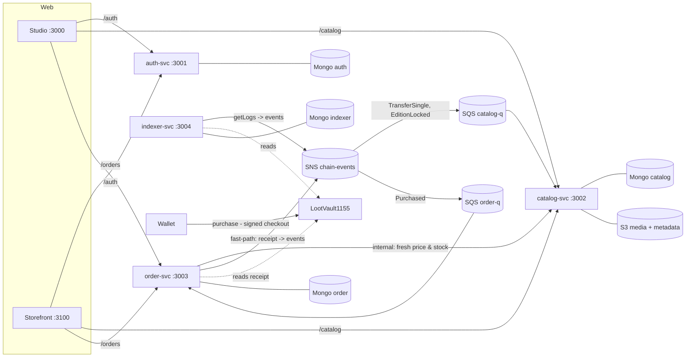

# Plan 3: Studio + Storefront web UI — Implementation Plan

> **For agentic workers:** REQUIRED SUB-SKILL: Use superpowers:subagent-driven-development (recommended) or superpowers:executing-plans to implement this plan task-by-task. Steps use checkbox (`- [ ]`) syntax for tracking.

**Goal:** Add the two web apps from spec §6 against the merged Plan 2 backend:
- **Studio** (:3000): publishers sign in, open a store, upload and publish NFTs, and watch sales.
- **Storefront** (:3100): buyers browse stores, filter, fill a cart and pay on-chain.

**Architecture:**
- **`packages/web-shared`** is consumed as TypeScript source through Next `transpilePackages`. It holds the typed API client and error mapping, the env and Next config, a shadcn-style UI kit, the wallet (wagmi, a demo wallet on anvil, SIWE session) and the cart store.
- **The two apps** are Next.js 16 App Router apps.
  - Public storefront pages are server components that fetch from the services directly.
  - Pages that need sign-in are client components that call same-origin `/api/<service>/*`. Next rewrites forward those calls to the services, so there is no CORS.
- **Purchase:** a buy runs `POST /orders/checkout` → wallet `purchase(...)` → wait for the receipt → `POST /orders/:id/confirm`, then polls on 202.

**Tech Stack:** Next.js 16.3, React 19.3, TypeScript 5.9, Tailwind CSS 4.3, TanStack Query 5, zustand 5, wagmi 3 + viem 2.57, recharts 3, sonner, lucide-react, class-variance-authority + clsx + tailwind-merge, vitest 5.

**Spec:** `docs/superpowers/specs/2026-10-03-lootvault-design.md` (§2 MVP, §6 Frontend). Read it together with `docs/superpowers/plans/2026-10-03-plan-2-carry-forwards.md` (the "Plan 3 must do" section).

## Global Constraints

- **Node and versions**
  - Node 22 via nvm. Prefix every node/npm command with `source ~/.nvm/nvm.sh && nvm use`. The default shell's Node 20 is too old.
  - The npm workspaces monorepo already lists `apps/*` and `packages/*`. Pin dependency versions exactly as in the `package.json` blocks.
- **Next.js 16, not 15.** Spec §6 says Next.js 15, but 16.3 is the current stable line (ruling).
  - In pages and layouts, `params` and `searchParams` are Promises.
  - Run `next typegen` before `tsc`.
  - `agentRules: false` stops `next dev` from writing AGENTS.md/CLAUDE.md.
- **UI copy is English.** The interview is in English for an Australian company (ruling). The Vietnamese strings in spec §6 map to these messages:
  - "Vừa hết hàng" → "Sold out just now"
  - "Phiên thanh toán hết hạn, thử lại" → "Checkout expired — try again"
  - "Bạn đã huỷ giao dịch" → "You cancelled the transaction"
- **Ports and API routing**
  - Studio runs on port **3000** and Storefront on **3100**.
  - Browser calls go to `NEXT_PUBLIC_API_URL=/api`. Next rewrites `/api/auth|catalog|orders/*` to `AUTH_URL`, `CATALOG_URL` and `ORDER_URL`, which also serve SSR.
  - Ruling: SSR uses one URL per service instead of spec §6's single `API_INTERNAL_URL`, because the services don't share an origin locally.
- **Environment**
  - Each app's `next.config.ts` loads the **root** `.env` through `lootVaultNextConfig`. It fails fast and names any missing key.
  - New keys go into `.env.example`, and `npm run bootstrap` (`ensure-env`) merges them into existing `.env` files.
- **Demo wallet**
  - Active only when `NEXT_PUBLIC_CHAIN_ID=31337`.
  - Anvil signs for its public dev accounts.
  - The roles are Publisher A (#3), Publisher B (#4), Buyer 1 (#5), Buyer 2 (#6) and Buyer 3 (#2).
  - The injected wallet (MetaMask) is always available.
- **JWT storage:** the JWT lives in localStorage under `lv:<app>:jwt`, one key per app. It is dropped on a 401 or when the account changes.
- **Cart:** stored per store in localStorage under `cart:<slug>`, one store per cart, with at most 10 copies per line.
- **Tests:** there are no automated UI tests (spec §2). Pure logic in web-shared is unit-tested with vitest. The apps are gated by `typecheck` and `next build`, then by the controller's browser walkthrough.
- **Code style:**
  - No `any`, no dead or commented-out code, and one responsibility per file.
  - Use server components for SEO pages, and client components only where interaction needs them.

---

### Task 1: `@lootvault/web-shared` core: API client, error messages, formatting, env and Next config

**Files:**
- Create: `packages/web-shared/package.json`, `packages/web-shared/tsconfig.json`, `packages/web-shared/src/api/auth.ts`, `packages/web-shared/src/api/catalog.ts`, `packages/web-shared/src/api/errors.ts`, `packages/web-shared/src/api/http.ts`, `packages/web-shared/src/api/index.ts`, `packages/web-shared/src/api/orders.ts`, `packages/web-shared/src/api/service-origin.ts`, `packages/web-shared/src/api/types.ts`, `packages/web-shared/src/api/upload.ts`, `packages/web-shared/src/env.ts`, `packages/web-shared/src/format.ts`, `packages/web-shared/src/next-config.ts`
- Test: `packages/web-shared/src/format.test.ts`, `packages/web-shared/src/api/errors.test.ts`, `packages/web-shared/src/api/http.test.ts`
- Modify: `package.json` (root: `test:web`, web-shared in `typecheck`), `.env.example` (web section), `.gitignore` (Next output)

**Interfaces:**
- **Consumes:** the Plan 2 HTTP API. Its routes and error envelope `{error:{code,message,details}}` are documented by Swagger at `/<prefix>/docs`.
- **Produces:**
  - `@lootvault/web-shared/api`:
    - `createApi({ baseUrl, getToken?, onUnauthorized?, init? })` returns `{ auth, catalog, orders }`. All calls are typed; see `api/types.ts`.
    - `ApiError` (`code`, `status`, `details`, readable `message`), `isApiError(error, code?)`, `serviceOrigin(service)`, `uploadImage(presign, file, onProgress)`, `MAX_IMAGE_BYTES`, and all API types.
  - `@lootvault/web-shared/format`: `formatEth(wei, maxDecimals=4)`, `ethToWei(input)`, `weiToEthInput(wei)`, `shortAddress(address)`, `formatDateTime(iso)`.
  - `@lootvault/web-shared/env`: `publicEnv`, the `NEXT_PUBLIC_*` values.
  - `@lootvault/web-shared/next-config`: `lootVaultNextConfig(appDir)`, which loads the root `.env`, validates it, and adds `transpilePackages`, `agentRules: false` and the `/api/*` rewrites.

- [ ] **Step 1: Add the package manifest and tsconfig**

`packages/web-shared/package.json`:
```json
{
  "name": "@lootvault/web-shared",
  "version": "0.1.0",
  "private": true,
  "description": "API client, wallet, session, cart and UI shared by the Studio and Storefront apps (consumed as TypeScript source)",
  "type": "module",
  "exports": {
    "./api": "./src/api/index.ts",
    "./cart": "./src/cart/cart-store.ts",
    "./env": "./src/env.ts",
    "./format": "./src/format.ts",
    "./next-config": "./src/next-config.ts",
    "./ui": "./src/ui/index.ts",
    "./wallet": "./src/wallet/index.ts",
    "./styles.css": "./src/styles.css"
  },
  "scripts": {
    "test": "vitest run",
    "typecheck": "tsc --noEmit"
  },
  "dependencies": {
    "@lootvault/shared": "*",
    "@tanstack/react-query": "^5.104.1",
    "class-variance-authority": "^0.7.1",
    "clsx": "^2.1.1",
    "lucide-react": "^1.51.0",
    "sonner": "^2.0.8",
    "tailwind-merge": "^3.7.0",
    "viem": "^2.57.2",
    "wagmi": "^3.7.7",
    "zustand": "^5.0.15"
  },
  "peerDependencies": {
    "next": "^16.3.8",
    "react": "^19.3.0",
    "react-dom": "^19.3.0"
  },
  "devDependencies": {
    "@types/react": "^19.3.0",
    "@types/react-dom": "^19.3.0",
    "vitest": "^5.0.3"
  }
}
```

`packages/web-shared/tsconfig.json`:
```json
{
  "extends": "../../tsconfig.base.json",
  "compilerOptions": {
    "lib": ["ES2023", "DOM", "DOM.Iterable"],
    "module": "esnext",
    "moduleResolution": "bundler",
    "jsx": "react-jsx",
    "isolatedModules": true,
    "noEmit": true,
    "declaration": false,
    "types": ["node"]
  },
  "include": ["src"]
}
```

Run: `source ~/.nvm/nvm.sh && nvm use && npm install`
Expected: the install succeeds and `node_modules/vitest` exists.

- [ ] **Step 2: Write the failing tests**

`packages/web-shared/src/format.test.ts`:
```ts
import { describe, expect, it } from "vitest";

import { ethToWei, formatEth, shortAddress, weiToEthInput } from "./format";

describe("formatEth", () => {
  it.each([
    ["15000000000000000", "0.015 ETH"],
    ["1000000000000000000", "1 ETH"],
    ["0", "0 ETH"],
    ["123456789000000000", "0.1234 ETH"],
    [2_500_000_000_000_000_000n, "2.5 ETH"],
  ])("%s wei -> %s", (wei, text) => {
    expect(formatEth(wei)).toBe(text);
  });

  it("honours maxDecimals", () => {
    expect(formatEth("123456789000000000", 2)).toBe("0.12 ETH");
  });

  it("keeps two significant digits of amounts smaller than maxDecimals instead of showing 0", () => {
    expect(formatEth("50000000000000")).toBe("0.00005 ETH");
    expect(formatEth("12345678901234")).toBe("0.000012 ETH");
    expect(formatEth("1")).toBe("0.000000000000000001 ETH");
  });
});

describe("ethToWei", () => {
  it.each([
    ["0.015", "15000000000000000"],
    ["1", "1000000000000000000"],
    [" 2.5 ", "2500000000000000000"],
    ["0.000000000000000001", "1"],
  ])("%s ETH -> %s wei", (input, wei) => {
    expect(ethToWei(input)).toBe(wei);
  });

  it.each(["", "0", "-1", "abc", "1e18", "0.0000000000000000001", "1,5"])("rejects %j", (input) => {
    expect(ethToWei(input)).toBeNull();
  });

  it("round-trips through weiToEthInput", () => {
    expect(weiToEthInput(ethToWei("0.015") ?? "")).toBe("0.015");
  });
});

it("shortens addresses", () => {
  expect(shortAddress("0x90F79bf6EB2c4f870365E785982E1f101E93b906")).toBe("0x90F7…b906");
});
```

`packages/web-shared/src/api/errors.test.ts`:
```ts
import { describe, expect, it } from "vitest";

import { ApiError } from "./errors";

const envelope = (code: string, message: string, details?: unknown) => ({ error: { code, message, details } });

describe("ApiError.fromResponse", () => {
  it("explains INSUFFICIENT_STOCK with the available quantity and keeps the details", () => {
    const error = ApiError.fromResponse(409, envelope("INSUFFICIENT_STOCK", 'Only 2 left of "Drake"', { itemId: "abc", available: 2 }));
    expect(error.code).toBe("INSUFFICIENT_STOCK");
    expect(error.message).toBe("Only 2 left. Lower the quantity and try again.");
    expect(error.detail("itemId")).toBe("abc");
  });

  it("says sold out when nothing is available", () => {
    expect(ApiError.fromResponse(409, envelope("INSUFFICIENT_STOCK", "x", { available: 0 })).message).toBe("Sold out: no copies are left.");
  });

  it("uses details.max for TOO_MANY_PENDING_ORDERS", () => {
    expect(ApiError.fromResponse(429, envelope("TOO_MANY_PENDING_ORDERS", "x", { max: 3 })).message).toBe(
      "You already have 3 open checkouts. Finish one or wait for it to expire.",
    );
  });

  it.each([
    ["ITEM_UNAVAILABLE", 409, "An item in your cart is no longer for sale."],
    ["MIXED_STORES", 400, "A cart can only hold items from one store."],
    ["CATALOG_UNAVAILABLE", 503, "The catalog is temporarily unavailable. Please try again in a moment."],
    ["SUPPLY_LOCKED", 409, "Supply is locked: the edition size was fixed on-chain at the first sale."],
    ["IMAGE_NOT_HOSTED", 400, "Upload the image through LootVault before saving."],
    ["TX_INVALID", 422, "The transaction did not succeed on-chain."],
    ["TX_MISMATCH", 422, "This transaction does not pay for this order."],
    ["SLUG_TAKEN", 409, "That store URL is already taken. Choose another slug."],
  ])("maps %s to a readable message", (code, status, message) => {
    expect(ApiError.fromResponse(status, envelope(code, "server text")).message).toBe(message);
  });

  it("treats 401 as an expired session, even without an envelope", () => {
    const error = ApiError.fromResponse(401, undefined);
    expect(error.code).toBe("UNAUTHORIZED");
    expect(error.isUnauthorized).toBe(true);
    expect(error.message).toBe("Your session has expired. Please sign in again.");
  });

  it("joins validation messages", () => {
    const error = ApiError.fromResponse(400, envelope("VALIDATION_FAILED", "Request validation failed", ["slug must be 3-32 chars", "name too long"]));
    expect(error.message).toBe("slug must be 3-32 chars. name too long.");
  });

  it("falls back to the server message for unknown codes, and to a generic one for non-JSON bodies", () => {
    expect(ApiError.fromResponse(418, envelope("TEAPOT", "I am a teapot")).message).toBe("I am a teapot");
    expect(ApiError.fromResponse(502, "<html>Bad gateway</html>").message).toBe("Something went wrong. Please try again.");
  });
});
```

`packages/web-shared/src/api/http.test.ts`:
```ts
import { afterEach, describe, expect, it, vi } from "vitest";

import { ApiError } from "./errors";
import { createHttpClient } from "./http";

const json = (status: number, body: unknown) => new Response(JSON.stringify(body), { status, headers: { "content-type": "application/json" } });

function client(token: string | null, onUnauthorized = vi.fn()) {
  return { http: createHttpClient({ baseUrl: (service) => `/api/${service}`, getToken: () => token, onUnauthorized }), onUnauthorized };
}

describe("createHttpClient", () => {
  afterEach(() => vi.unstubAllGlobals());

  it("builds the URL from the service and the query, skipping empty values, and sends the bearer token", async () => {
    const fetch = vi.fn().mockResolvedValue(json(200, { items: [] }));
    vi.stubGlobal("fetch", fetch);
    await client("jwt").http("catalog", "/stores/x/items", { query: { q: "drake", minPrice: undefined, inStock: true, sort: "" } });
    expect(fetch).toHaveBeenCalledWith("/api/catalog/stores/x/items?q=drake&inStock=true", expect.objectContaining({ method: "GET", headers: { authorization: "Bearer jwt" } }));
  });

  it("turns an error envelope into an ApiError and reports a 401 so the app can sign in again", async () => {
    vi.stubGlobal("fetch", vi.fn().mockResolvedValue(json(401, { error: { code: "UNAUTHORIZED", message: "Invalid or expired token" } })));
    const { http, onUnauthorized } = client("expired");
    await expect(http("orders", "/me")).rejects.toMatchObject({ code: "UNAUTHORIZED", status: 401 });
    expect(onUnauthorized).toHaveBeenCalledOnce();
  });

  it("maps an unreachable server to NETWORK_ERROR but lets other failures through", async () => {
    vi.stubGlobal("fetch", vi.fn().mockRejectedValue(new TypeError("fetch failed")));
    await expect(client(null).http("auth", "/nonce")).rejects.toBeInstanceOf(ApiError);

    const signal = new Error("Dynamic server usage");
    vi.stubGlobal("fetch", vi.fn().mockRejectedValue(signal));
    await expect(client(null).http("auth", "/nonce")).rejects.toBe(signal);
  });
});
```


- [ ] **Step 3: Run them and see them fail**

Run: `source ~/.nvm/nvm.sh && nvm use && npm test -w @lootvault/web-shared`
Expected: FAIL, with module-not-found errors for `./format`, `./errors` and `./http`.

- [ ] **Step 4: Implement**

`packages/web-shared/src/api/auth.ts`:
```ts
import type { Address, Hex } from "viem";

import type { HttpClient } from "./http";
import type { Session } from "./types";

/** auth-svc (`/auth`): Sign-In with Ethereum. */
export function authApi(http: HttpClient) {
  return {
    nonce: (address: Address) => http<{ nonce: string; expiresAt: string }>("auth", "/nonce", { query: { address } }),
    verify: (message: string, signature: Hex) => http<Session>("auth", "/verify", { method: "POST", body: { message, signature } }),
  };
}
```

`packages/web-shared/src/api/catalog.ts`:
```ts
import type { HttpClient } from "./http";
import type {
  CreateStoreInput,
  Holding,
  ImageType,
  Item,
  ItemInput,
  Page,
  PageQuery,
  PresignedUpload,
  PublicItem,
  Store,
  StoreItemsQuery,
} from "./types";

/** catalog-svc (`/catalog`): stores, items, uploads and holdings. */
export function catalogApi(http: HttpClient) {
  return {
    // Storefront (public)
    listStores: (query: PageQuery = {}) => http<Page<Store>>("catalog", "/stores", { query }),
    getStore: (slug: string) => http<Store>("catalog", `/stores/${encodeURIComponent(slug)}`),
    listStoreItems: (slug: string, query: StoreItemsQuery = {}) =>
      http<Page<Item>>("catalog", `/stores/${encodeURIComponent(slug)}/items`, { query }),
    /** LIVE items for everyone; drafts and hidden items for their owner only. */
    getItem: (id: string) => http<PublicItem>("catalog", `/items/${encodeURIComponent(id)}`),
    holdings: (address: string) => http<Holding[]>("catalog", `/holdings/${address}`),

    // Studio (signed in, acts on the caller's own store)
    myStore: () => http<Store>("catalog", "/stores/me"),
    createStore: (input: CreateStoreInput) => http<Store>("catalog", "/stores", { method: "POST", body: input }),
    myItems: (query: PageQuery = {}) => http<Page<Item>>("catalog", "/me/items", { query }),
    createItem: (input: ItemInput) => http<Item>("catalog", "/items", { method: "POST", body: input }),
    updateItem: (id: string, input: Partial<ItemInput>) => http<Item>("catalog", `/items/${id}`, { method: "PATCH", body: input }),
    publishItem: (id: string) => http<Item>("catalog", `/items/${id}/publish`, { method: "POST" }),
    unpublishItem: (id: string) => http<Item>("catalog", `/items/${id}/unpublish`, { method: "POST" }),
    presignUpload: (contentType: ImageType) =>
      http<PresignedUpload>("catalog", "/uploads/presign", { method: "POST", body: { contentType } }),
  };
}
```

`packages/web-shared/src/api/errors.ts`:
```ts
/** A failed backend call. `message` is ready to show to the user; `code` and `details` come from the error envelope. */
export class ApiError extends Error {
  constructor(
    readonly status: number,
    readonly code: string,
    message: string,
    readonly details?: unknown,
  ) {
    super(message);
    this.name = "ApiError";
  }

  /** Builds an ApiError from a `{ error: { code, message, details } }` body, or from whatever a proxy returned. */
  static fromResponse(status: number, body: unknown): ApiError {
    const envelope = isErrorEnvelope(body) ? body.error : undefined;
    const code = envelope?.code ?? (status === 401 ? "UNAUTHORIZED" : "HTTP_ERROR");
    return new ApiError(status, code, readableMessage(code, envelope?.details, envelope?.message), envelope?.details);
  }

  static network(): ApiError {
    return new ApiError(0, "NETWORK_ERROR", readableMessage("NETWORK_ERROR", undefined, undefined));
  }

  get isUnauthorized(): boolean {
    return this.status === 401;
  }

  /** A field of `details`, e.g. `available` and `itemId` of INSUFFICIENT_STOCK. */
  detail(key: string): unknown {
    return detailOf(this.details, key);
  }
}

/** True for an ApiError, optionally with a given code: `isApiError(error, "STORE_NOT_FOUND")`. */
export function isApiError(error: unknown, code?: string): error is ApiError {
  return error instanceof ApiError && (code === undefined || error.code === code);
}

const MESSAGES: Record<string, (details: unknown) => string> = {
  INSUFFICIENT_STOCK: (details) => {
    const available = detailOf(details, "available");
    if (available === 0) return "Sold out: no copies are left.";
    return `Only ${typeof available === "number" ? available : "a few"} left. Lower the quantity and try again.`;
  },
  ITEM_UNAVAILABLE: () => "An item in your cart is no longer for sale.",
  MIXED_STORES: () => "A cart can only hold items from one store.",
  TOO_MANY_PENDING_ORDERS: (details) => {
    const max = detailOf(details, "max");
    return `You already have ${typeof max === "number" ? max : "too many"} open checkouts. Finish one or wait for it to expire.`;
  },
  CATALOG_UNAVAILABLE: () => "The catalog is temporarily unavailable. Please try again in a moment.",
  CART_INVALID: () => "A cart holds 1-10 different items, with 1-10 copies of each.",
  SUPPLY_LOCKED: () => "Supply is locked: the edition size was fixed on-chain at the first sale.",
  IMAGE_NOT_HOSTED: () => "Upload the image through LootVault before saving.",
  TX_INVALID: () => "The transaction did not succeed on-chain.",
  TX_MISMATCH: () => "This transaction does not pay for this order.",
  SLUG_TAKEN: () => "That store URL is already taken. Choose another slug.",
  STORE_EXISTS: () => "This wallet already owns a store.",
  STORE_NOT_FOUND: () => "Store not found.",
  ITEM_NOT_FOUND: () => "Item not found.",
  ORDER_NOT_FOUND: () => "Order not found.",
  FORBIDDEN: () => "You do not have access to this.",
  UNAUTHORIZED: () => "Your session has expired. Please sign in again.",
  NONCE_INVALID: () => "The sign-in request expired. Please sign in again.",
  SIWE_DOMAIN_NOT_ALLOWED: () => "Sign-in is not allowed from this site.",
  SIWE_WRONG_CHAIN: () => "Your wallet is on the wrong network.",
  NETWORK_ERROR: () => "Cannot reach the server. Check your connection and try again.",
};

function readableMessage(code: string, details: unknown, serverMessage: string | undefined): string {
  const describe = MESSAGES[code];
  if (describe) return describe(details);
  if (code === "VALIDATION_FAILED" && Array.isArray(details)) return `${details.join(". ")}.`;
  return serverMessage ?? "Something went wrong. Please try again.";
}

function isErrorEnvelope(body: unknown): body is { error: { code: string; message?: string; details?: unknown } } {
  if (typeof body !== "object" || body === null || !("error" in body)) return false;
  const { error } = body;
  return typeof error === "object" && error !== null && "code" in error && typeof error.code === "string";
}

function detailOf(details: unknown, key: string): unknown {
  return typeof details === "object" && details !== null && key in details ? (details as Record<string, unknown>)[key] : undefined;
}
```

`packages/web-shared/src/api/http.ts`:
```ts
import { ApiError } from "./errors";

/** Backend services, named after their route prefix (`/auth`, `/catalog`, `/orders`). */
export const SERVICES = ["auth", "catalog", "orders"] as const;
export type Service = (typeof SERVICES)[number];

type QueryValue = string | number | boolean | undefined;

interface RequestOptions {
  method?: "GET" | "POST" | "PATCH";
  query?: object;
  body?: unknown;
}

export interface HttpClientOptions {
  /** Base URL of a service, including its prefix: `/api/catalog` in the browser, `http://localhost:3002/catalog` on the server. */
  baseUrl: (service: Service) => string;
  /** Bearer token for the current user, if signed in. */
  getToken?: () => string | null;
  /** Called on a 401 for an authenticated request, so the app can drop the session and ask for a new sign-in. */
  onUnauthorized?: () => void;
  /** Extra fetch options, e.g. `{ cache: "no-store" }` for server rendering. */
  init?: RequestInit;
}

export type HttpClient = <T>(service: Service, path: string, options?: RequestOptions) => Promise<T>;

export function createHttpClient({ baseUrl, getToken, onUnauthorized, init }: HttpClientOptions): HttpClient {
  return async <T>(service: Service, path: string, { method = "GET", query, body }: RequestOptions = {}) => {
    const token = getToken?.() ?? null;
    let response: Response;
    try {
      response = await fetch(`${baseUrl(service)}${path}${toQueryString(query)}`, {
        ...init,
        method,
        headers: {
          ...(body === undefined ? {} : { "content-type": "application/json" }),
          ...(token ? { authorization: `Bearer ${token}` } : {}),
        },
        body: body === undefined ? undefined : JSON.stringify(body),
      });
    } catch (error) {
      // fetch rejects with a TypeError when the server cannot be reached. Anything else (e.g. Next's
      // dynamic-rendering signal for `cache: "no-store"` during a build) must pass through untouched.
      throw error instanceof TypeError ? ApiError.network() : error;
    }
    const payload: unknown = await response.json().catch(() => undefined);
    if (!response.ok) {
      if (response.status === 401 && token) onUnauthorized?.();
      throw ApiError.fromResponse(response.status, payload);
    }
    return payload as T;
  };
}

function toQueryString(query: object | undefined): string {
  const params = new URLSearchParams();
  for (const [key, value] of Object.entries(query ?? {}) as [string, QueryValue][]) {
    if (value !== undefined && value !== "") params.set(key, String(value));
  }
  const text = params.toString();
  return text ? `?${text}` : "";
}
```

`packages/web-shared/src/api/index.ts`:
```ts
import { authApi } from "./auth";
import { catalogApi } from "./catalog";
import { createHttpClient, type HttpClientOptions } from "./http";
import { ordersApi } from "./orders";

export { ApiError, isApiError } from "./errors";
export { serviceOrigin } from "./service-origin";
export * from "./types";
export { MAX_IMAGE_BYTES, uploadImage } from "./upload";

/** Typed functions for every backend route, grouped by service: `api.catalog.getItem(id)`. */
export function createApi(options: HttpClientOptions) {
  const http = createHttpClient(options);
  return { auth: authApi(http), catalog: catalogApi(http), orders: ordersApi(http) };
}

export type Api = ReturnType<typeof createApi>;
```

`packages/web-shared/src/api/orders.ts`:
```ts
import type { Hex } from "viem";

import type { HttpClient } from "./http";
import type { CartLineInput, CheckoutResult, ConfirmResult, Order, OrdersQuery, Page, RecentSale, RecentSalesQuery, SalesStats } from "./types";

/** order-svc (`/orders`): checkout, payment confirmation, order history and sales stats. */
export function ordersApi(http: HttpClient) {
  return {
    checkout: (lines: CartLineInput[]) => http<CheckoutResult>("orders", "/checkout", { method: "POST", body: { lines } }),
    confirm: (id: string, txHash: Hex) => http<ConfirmResult>("orders", `/${id}/confirm`, { method: "POST", body: { txHash } }),
    get: (id: string) => http<Order>("orders", `/${id}`),
    mine: (query: OrdersQuery = {}) => http<Page<Order>>("orders", "/me", { query }),
    recentSales: (query: RecentSalesQuery) => http<RecentSale[]>("orders", "/recent-sales", { query }),

    // Seller (Studio)
    storeSales: (query: OrdersQuery = {}) => http<Page<Order>>("orders", "/store/me", { query }),
    storeStats: () => http<SalesStats>("orders", "/store/me/stats"),
  };
}
```

`packages/web-shared/src/api/service-origin.ts`:
```ts
import type { Service } from "./http";

/** Server-side env var holding each service's origin. Used for SSR fetches and for the `/api/*` rewrites. */
const ORIGIN_ENV: Record<Service, string> = { auth: "AUTH_URL", catalog: "CATALOG_URL", orders: "ORDER_URL" };

export const SERVICE_ORIGIN_ENV = Object.values(ORIGIN_ENV);

/** e.g. `http://localhost:3002` for "catalog". Server only: these variables are not exposed to the browser. */
export function serviceOrigin(service: Service): string {
  const origin = process.env[ORIGIN_ENV[service]];
  if (!origin) throw new Error(`${ORIGIN_ENV[service]} is not set`);
  return origin.replace(/\/+$/, "");
}
```

`packages/web-shared/src/api/types.ts`:
```ts
// JSON shapes of the backend routes. Money is always a decimal string of wei; dates are ISO strings.
import type { CheckoutWire } from "@lootvault/shared";
import type { Address, Hex } from "viem";

export interface Page<T> {
  items: T[];
  page: number;
  limit: number;
  total: number;
}

export interface PageQuery {
  page?: number;
  limit?: number;
}

export interface Session {
  accessToken: string;
  address: string;
  expiresAt: string;
}

export interface Store {
  id: string;
  slug: string;
  name: string;
  description: string;
  logoUrl: string | null;
  ownerAddress: string;
  createdAt: string;
}

export interface CreateStoreInput {
  slug: string;
  name: string;
  description?: string;
  logoUrl?: string;
}

export type ItemStatus = "DRAFT" | "LIVE" | "HIDDEN";

export interface Item {
  id: string;
  storeId: string;
  ownerAddress: string;
  tokenId: string;
  name: string;
  description: string;
  imageUrl: string;
  supply: number;
  sold: number;
  remaining: number;
  priceWei: string;
  status: ItemStatus;
  createdAt: string;
  updatedAt: string;
}

/** `GET /catalog/items/:id` adds the item's store. */
export interface PublicItem extends Item {
  store: { id: string; slug: string; name: string };
}

export interface ItemInput {
  name: string;
  description?: string;
  imageUrl: string;
  supply: number;
  priceWei: string;
}

export const STOREFRONT_SORTS = ["newest", "price_asc", "price_desc"] as const;
export type StorefrontSort = (typeof STOREFRONT_SORTS)[number];

export interface StoreItemsQuery extends PageQuery {
  q?: string;
  minPrice?: string;
  maxPrice?: string;
  inStock?: boolean;
  sort?: StorefrontSort;
}

export interface Holding {
  tokenId: string;
  balance: number;
  item: Item;
}

export const IMAGE_TYPES = ["image/png", "image/jpeg", "image/webp", "image/gif"] as const;
export type ImageType = (typeof IMAGE_TYPES)[number];

export interface PresignedUpload {
  url: string;
  fields: Record<string, string>;
  key: string;
  publicUrl: string;
}

export type OrderStatus = "PENDING" | "PAID" | "EXPIRED";

export interface OrderLine {
  itemId: string;
  tokenId: string;
  name: string;
  imageUrl: string;
  quantity: number;
  unitPriceWei: string;
}

export interface Order {
  id: string;
  orderId: Hex;
  buyer: string;
  storeId: string;
  storeSlug: string;
  sellerAddress: string;
  lines: OrderLine[];
  totalWei: string;
  feeWei: string | null;
  status: OrderStatus;
  deadline: string;
  txHash: Hex | null;
  paidAt: string | null;
  createdAt: string;
}

export interface OrdersQuery extends PageQuery {
  status?: OrderStatus;
}

export interface CartLineInput {
  itemId: string;
  quantity: number;
}

export interface CheckoutResult {
  order: Order;
  /** Everything the wallet needs for `LootVault1155.purchase(checkout, signature)` with `value`. */
  purchase: { chainId: number; contract: Address; checkout: CheckoutWire; signature: Hex; value: string };
}

/** `POST /orders/:id/confirm`: 200 PAID, or 202 PENDING_TX while the receipt is not available yet. */
export type ConfirmResult = { status: "PAID"; order: Order } | { status: "PENDING_TX" };

export interface SalesStats {
  grossWei: string;
  feeWei: string;
  netWei: string;
  ordersPaid: number;
  itemsSold: number;
  last7Days: { date: string; grossWei: string; orders: number }[];
}

export interface RecentSale {
  orderId: Hex;
  buyer: string;
  paidAt: string;
  txHash: Hex;
  totalWei: string;
  quantity: number;
}

export type RecentSalesQuery = ({ storeId: string } | { itemId: string }) & { limit?: number };
```

`packages/web-shared/src/api/upload.ts`:
```ts
import { ApiError } from "./errors";
import type { PresignedUpload } from "./types";

export const MAX_IMAGE_BYTES = 5 * 1024 * 1024;

/**
 * Sends a file straight to S3 with a presigned POST (fields first, file last) and resolves to its public URL.
 * Uses XMLHttpRequest because fetch cannot report upload progress.
 */
export function uploadImage(upload: PresignedUpload, file: File, onProgress: (percent: number) => void): Promise<string> {
  const form = new FormData();
  for (const [key, value] of Object.entries(upload.fields)) form.append(key, value);
  form.append("file", file);

  return new Promise((resolve, reject) => {
    const request = new XMLHttpRequest();
    request.upload.onprogress = (event) => {
      if (event.lengthComputable) onProgress(Math.round((event.loaded / event.total) * 100));
    };
    request.onload = () => {
      if (request.status >= 200 && request.status < 300) resolve(upload.publicUrl);
      else reject(new ApiError(request.status, "UPLOAD_FAILED", "The image upload was rejected. Use a PNG, JPEG, WebP or GIF up to 5 MB."));
    };
    request.onerror = () => reject(ApiError.network());
    request.open("POST", upload.url);
    request.send(form);
  });
}
```

`packages/web-shared/src/env.ts`:
```ts
declare global {
  namespace NodeJS {
    /** Checked at startup by `lootVaultNextConfig` (next-config.ts), so they are always set. */
    interface ProcessEnv {
      readonly NEXT_PUBLIC_API_URL: string;
      readonly NEXT_PUBLIC_CHAIN_ID: string;
      readonly NEXT_PUBLIC_RPC_URL: string;
      readonly NEXT_PUBLIC_STOREFRONT_URL: string;
    }
  }
}

/** Browser-safe settings. Each `process.env.NEXT_PUBLIC_*` must be spelled out so Next can inline it. */
export const publicEnv = {
  apiUrl: process.env.NEXT_PUBLIC_API_URL,
  chainId: Number(process.env.NEXT_PUBLIC_CHAIN_ID),
  rpcUrl: process.env.NEXT_PUBLIC_RPC_URL,
  storefrontUrl: process.env.NEXT_PUBLIC_STOREFRONT_URL,
};
```

`packages/web-shared/src/format.ts`:
```ts
import { formatEther, parseEther } from "viem";

/**
 * Wei (bigint or decimal string) -> "0.015 ETH", rounded down to `maxDecimals`.
 * A non-zero amount below that precision keeps two significant digits ("0.00005 ETH"), never "0 ETH".
 */
export function formatEth(wei: bigint | string, maxDecimals = 4): string {
  const [whole, fraction = ""] = formatEther(BigInt(wei)).split(".");
  let digits = fraction.slice(0, maxDecimals);
  if (whole === "0" && /^0*$/.test(digits) && /[1-9]/.test(fraction)) {
    const firstSignificant = fraction.search(/[1-9]/);
    digits = fraction.slice(0, firstSignificant + 2);
  }
  const trimmed = digits.replace(/0+$/, "");
  return `${whole}${trimmed ? `.${trimmed}` : ""} ETH`;
}

/** User input in ETH -> wei string, or null when it is not a positive amount with at most 18 decimals. */
export function ethToWei(input: string): string | null {
  const value = input.trim();
  if (!/^\d+(\.\d{1,18})?$/.test(value)) return null;
  const wei = parseEther(value);
  return wei > 0n ? wei.toString() : null;
}

/** Wei -> plain ETH number string for form fields ("0.015"). */
export function weiToEthInput(wei: string): string {
  return formatEther(BigInt(wei));
}

/** 0x90F79bf6EB2c4f870365E785982E1f101E93b906 -> 0x90F7…b906 */
export function shortAddress(address: string): string {
  return `${address.slice(0, 6)}…${address.slice(-4)}`;
}

export function formatDateTime(iso: string): string {
  return new Date(iso).toLocaleString("en-AU", { dateStyle: "medium", timeStyle: "short" });
}
```

`packages/web-shared/src/next-config.ts`:
```ts
import { existsSync } from "node:fs";
import path from "node:path";

import type { NextConfig } from "next";

import { SERVICES } from "./api/http";
import { SERVICE_ORIGIN_ENV, serviceOrigin } from "./api/service-origin";

const PUBLIC_ENV = ["NEXT_PUBLIC_API_URL", "NEXT_PUBLIC_CHAIN_ID", "NEXT_PUBLIC_RPC_URL", "NEXT_PUBLIC_STOREFRONT_URL"];

/**
 * Next only reads .env files from the app's own directory, but the monorepo keeps one root .env.
 * Load it (variables already in the environment win), then fail fast on anything the apps need.
 */
function loadRootEnv(appDir: string): void {
  const rootEnv = path.resolve(appDir, "../../.env");
  if (existsSync(rootEnv)) process.loadEnvFile(rootEnv);
  const missing = [...PUBLIC_ENV, ...SERVICE_ORIGIN_ENV].filter((key) => !process.env[key]);
  if (missing.length > 0) throw new Error(`Missing ${missing.join(", ")} in the root .env. Run \`npm run bootstrap\` to add new keys.`);
}

/** Config shared by Studio and Storefront. `appDir` is the app's directory (where next.config.ts lives). */
export function lootVaultNextConfig(appDir: string): NextConfig {
  loadRootEnv(appDir);
  return {
    // web-shared ships TypeScript source, compiled by each app.
    transpilePackages: ["@lootvault/web-shared"],
    // Keep `next dev` from writing AGENTS.md/CLAUDE.md into the apps.
    agentRules: false,
    // Browser calls go to same-origin /api/<service>/*, proxied to the service (no CORS, one public base URL).
    async rewrites() {
      return SERVICES.map((service) => ({ source: `/api/${service}/:path*`, destination: `${serviceOrigin(service)}/${service}/:path*` }));
    },
  };
}
```


- [ ] **Step 5: Wire up the root scripts, env and ignores**

Root `package.json` (full file):
```json
{
  "name": "lootvault",
  "private": true,
  "description": "Multi-store NFT marketplace: NestJS microservices, MongoDB, Next.js, Solidity, AWS",
  "workspaces": [
    "packages/*",
    "apps/*"
  ],
  "engines": {
    "node": ">=22.13.0"
  },
  "scripts": {
    "postinstall": "npm run build:packages",
    "build:packages": "npm run build -w @lootvault/shared && npm run build -w @lootvault/nest-common",
    "build": "npm run build:packages && npm run build -w @lootvault/auth-svc -w @lootvault/catalog-svc -w @lootvault/order-svc -w @lootvault/indexer-svc",
    "bootstrap": "node scripts/ensure-env.mjs && node scripts/aws-init.mjs && node scripts/deploy-local.mjs",
    "dev": "concurrently -k -n shared,common,auth,catalog,order,indexer -c gray,gray,blue,green,magenta,yellow \"npm run build:watch -w @lootvault/shared\" \"npm run build:watch -w @lootvault/nest-common\" \"npm run start:dev -w @lootvault/auth-svc\" \"npm run start:dev -w @lootvault/catalog-svc\" \"npm run start:dev -w @lootvault/order-svc\" \"npm run start:dev -w @lootvault/indexer-svc\"",
    "seed": "node scripts/seed.mjs",
    "demo:smoke": "node scripts/demo-smoke.mjs",
    "demo:race": "node scripts/demo-race.mjs",
    "doctor": "node scripts/doctor.mjs",
    "dlq:redrive": "node scripts/dlq-redrive.mjs",
    "test": "npm run test:scripts && npm run test:shared && npm run test:web && npm run typecheck && npm run test:services && npm run test:contracts",
    "typecheck": "npm run typecheck -w @lootvault/nest-common -w @lootvault/auth-svc -w @lootvault/catalog-svc -w @lootvault/order-svc -w @lootvault/indexer-svc -w @lootvault/web-shared",
    "test:scripts": "node --test \"scripts/**/*.test.mjs\"",
    "test:shared": "npm test -w @lootvault/shared",
    "test:web": "npm test -w @lootvault/web-shared",
    "test:services": "npm test -w @lootvault/nest-common -w @lootvault/auth-svc -w @lootvault/catalog-svc -w @lootvault/order-svc -w @lootvault/indexer-svc",
    "test:contracts": "npm test -w @lootvault/contracts",
    "deploy:local": "node scripts/deploy-local.mjs",
    "infra:up": "docker compose up -d --build --wait",
    "infra:down": "docker compose down",
    "infra:reset": "docker compose down -v"
  },
  "devDependencies": {
    "@aws-sdk/client-s3": "^3.1146.0",
    "@aws-sdk/client-sns": "^3.1146.0",
    "@aws-sdk/client-sqs": "^3.1146.0",
    "@nestjs/cli": "^11.0.24",
    "@nestjs/testing": "^11.2.7",
    "@types/express": "^5.0.6",
    "@types/jest": "^30.0.0",
    "@types/node": "^22.15.0",
    "@types/supertest": "^7.2.1",
    "concurrently": "^10.0.5",
    "jest": "^30.5.2",
    "mongodb-memory-server": "^11.3.0",
    "prettier": "^3.6.2",
    "supertest": "^7.3.1",
    "ts-jest": "^29.4.14",
    "typescript": "~5.9.3",
    "viem": "^2.57.2"
  }
}
```

Append to `.env.example`:
```diff
 SNS_TOPIC_ARN=
 CATALOG_QUEUE_URL=
 ORDER_QUEUE_URL=
+
+# ---------- Web apps (Studio :3000, Storefront :3100). Each next.config loads this root .env.
+# Server side (SSR and the /api/* rewrites): where the services listen. CATALOG_URL above is reused.
+AUTH_URL=http://localhost:3001
+ORDER_URL=http://localhost:3003
+# Browser side (inlined at build time)
+NEXT_PUBLIC_API_URL=/api
+NEXT_PUBLIC_CHAIN_ID=31337
+NEXT_PUBLIC_RPC_URL=http://127.0.0.1:8545
+NEXT_PUBLIC_STOREFRONT_URL=http://localhost:3100
```

Append to `.gitignore`:
```
.next/
next-env.d.ts
*.tsbuildinfo
```

Then run `source ~/.nvm/nvm.sh && nvm use && node scripts/ensure-env.mjs` to merge the new keys into your `.env`.
Expected: `Added 6 new key(s) to .env: AUTH_URL, ORDER_URL, NEXT_PUBLIC_API_URL, NEXT_PUBLIC_CHAIN_ID, NEXT_PUBLIC_RPC_URL, NEXT_PUBLIC_STOREFRONT_URL`.

- [ ] **Step 6: Run the tests and typecheck, and see them pass**

Run: `source ~/.nvm/nvm.sh && nvm use && npm test -w @lootvault/web-shared && npm run typecheck -w @lootvault/web-shared`
Expected: `Test Files 3 passed`, `Tests 37 passed` (format 20, errors 14, http 3), and `tsc` exits 0.

- [ ] **Step 7: Commit**

```bash
git add package.json package-lock.json .env.example .gitignore packages/web-shared
git commit -m "feat(web-shared): typed API client, readable API errors, ETH formatting, env and shared Next config

Constraint: Next reads .env only from the app dir, so lootVaultNextConfig loads the monorepo root .env and fails fast on missing keys
Rejected: one API_INTERNAL_URL for SSR | local services do not share an origin, so each service has its own URL
Confidence: high
Scope-risk: low
Co-Authored-By: <the model that authored the commit> <noreply@anthropic.com>"
```

---

### Task 2: `@lootvault/web-shared` UI kit: theme, primitives, `NftCard`, `PriceTag`, `TxStatusStepper`

**Files:**
- Create: `packages/web-shared/src/styles.css`, `packages/web-shared/src/ui/badge.tsx`, `packages/web-shared/src/ui/button.tsx`, `packages/web-shared/src/ui/card.tsx`, `packages/web-shared/src/ui/cn.ts`, `packages/web-shared/src/ui/feedback.tsx`, `packages/web-shared/src/ui/form.tsx`, `packages/web-shared/src/ui/index.ts`, `packages/web-shared/src/ui/nft-card.tsx`, `packages/web-shared/src/ui/order-status-badge.tsx`, `packages/web-shared/src/ui/price-tag.tsx`, `packages/web-shared/src/ui/table.tsx`, `packages/web-shared/src/ui/tx-status-stepper.tsx`

**Interfaces:**
- **Consumes:** `formatEth` (Task 1) and the `OrderStatus` type (Task 1).
- **Produces:**
  - `@lootvault/web-shared/ui`:
    - Primitives: `Badge`, `Button` and `buttonVariants`, the `Card*` components, `cn`, and the feedback components `EmptyState`, `ErrorState`, `LoadingState`, `Progress`, `Skeleton`.
    - Forms: `Field`, `Input`, `Select`, `Textarea`.
    - Tables: `Table`, `Th`, `Td`.
    - Marketplace components: `NftCard`, `StockBadge`, `OrderStatusBadge`, `PriceTag`, `TxStatusStepper`.
  - `@lootvault/web-shared/styles.css`, the Tailwind v4 theme tokens that each app imports.
  - shadcn-style components, hand-copied and without Radix: Tailwind plus `class-variance-authority`.

These are presentational components with no logic worth unit-testing (spec §2: no automated UI tests). The typecheck gates them here, and Tasks 4–5 gate them again through `next build`.

- [ ] **Step 1: Write the theme and components**

`packages/web-shared/src/styles.css`:
```css
/* Shared theme for Studio and Storefront. Import after "tailwindcss" in each app's globals.css. */
@source "./";

:root {
  --background: oklch(0.985 0.002 260);
  --foreground: oklch(0.21 0.02 265);
  --card: oklch(1 0 0);
  --muted: oklch(0.955 0.005 260);
  --muted-foreground: oklch(0.52 0.02 265);
  --border: oklch(0.91 0.006 260);
  --primary: oklch(0.55 0.21 277);
  --primary-foreground: oklch(0.99 0 0);
  --success: oklch(0.6 0.15 155);
  --warning: oklch(0.72 0.15 70);
  --destructive: oklch(0.58 0.22 25);
  --ring: oklch(0.55 0.21 277 / 0.4);
}

@media (prefers-color-scheme: dark) {
  :root {
    --background: oklch(0.17 0.01 265);
    --foreground: oklch(0.96 0.005 260);
    --card: oklch(0.21 0.012 265);
    --muted: oklch(0.26 0.012 265);
    --muted-foreground: oklch(0.7 0.015 265);
    --border: oklch(0.3 0.012 265);
    --primary: oklch(0.66 0.19 277);
    --primary-foreground: oklch(0.15 0.01 265);
    --ring: oklch(0.66 0.19 277 / 0.45);
  }
}

@theme inline {
  --color-background: var(--background);
  --color-foreground: var(--foreground);
  --color-card: var(--card);
  --color-muted: var(--muted);
  --color-muted-foreground: var(--muted-foreground);
  --color-border: var(--border);
  --color-primary: var(--primary);
  --color-primary-foreground: var(--primary-foreground);
  --color-success: var(--success);
  --color-warning: var(--warning);
  --color-destructive: var(--destructive);
  --color-ring: var(--ring);
  --font-sans: ui-sans-serif, system-ui, -apple-system, "Segoe UI", Roboto, "Helvetica Neue", Arial, sans-serif;
}

@layer base {
  * {
    border-color: var(--border);
  }
  body {
    background: var(--background);
    color: var(--foreground);
    font-family: var(--font-sans);
    -webkit-font-smoothing: antialiased;
  }
}
```

`packages/web-shared/src/ui/badge.tsx`:
```tsx
import { cva, type VariantProps } from "class-variance-authority";
import type { ComponentProps } from "react";

import { cn } from "./cn";

const badgeVariants = cva("inline-flex items-center gap-1 rounded-full px-2.5 py-0.5 text-xs font-medium", {
  variants: {
    tone: {
      neutral: "bg-muted text-muted-foreground",
      primary: "bg-primary/10 text-primary",
      success: "bg-success/15 text-success",
      warning: "bg-warning/15 text-warning",
      destructive: "bg-destructive/10 text-destructive",
    },
  },
  defaultVariants: { tone: "neutral" },
});

export type BadgeProps = ComponentProps<"span"> & VariantProps<typeof badgeVariants>;

export function Badge({ className, tone, ...props }: BadgeProps) {
  return <span className={cn(badgeVariants({ tone }), className)} {...props} />;
}
```

`packages/web-shared/src/ui/button.tsx`:
```tsx
import { cva, type VariantProps } from "class-variance-authority";
import type { ComponentProps } from "react";

import { cn } from "./cn";

export const buttonVariants = cva(
  "inline-flex items-center justify-center gap-2 whitespace-nowrap rounded-lg text-sm font-medium transition-colors focus-visible:outline-none focus-visible:ring-4 focus-visible:ring-ring disabled:pointer-events-none disabled:opacity-50 [&_svg]:size-4 [&_svg]:shrink-0",
  {
    variants: {
      variant: {
        primary: "bg-primary text-primary-foreground hover:bg-primary/90",
        outline: "border bg-card hover:bg-muted",
        ghost: "hover:bg-muted",
        destructive: "bg-destructive text-white hover:bg-destructive/90",
      },
      size: {
        sm: "h-8 px-3",
        md: "h-10 px-4",
        lg: "h-11 px-6 text-base",
        icon: "size-9",
      },
    },
    defaultVariants: { variant: "primary", size: "md" },
  },
);

type ButtonProps = ComponentProps<"button"> & VariantProps<typeof buttonVariants>;

export function Button({ className, variant, size, type = "button", ...props }: ButtonProps) {
  return <button type={type} className={cn(buttonVariants({ variant, size }), className)} {...props} />;
}
```

`packages/web-shared/src/ui/card.tsx`:
```tsx
import type { ComponentProps } from "react";

import { cn } from "./cn";

export function Card({ className, ...props }: ComponentProps<"div">) {
  return <div className={cn("rounded-xl border bg-card shadow-sm", className)} {...props} />;
}

export function CardHeader({ className, ...props }: ComponentProps<"div">) {
  return <div className={cn("flex flex-col gap-1 p-5 pb-0", className)} {...props} />;
}

export function CardTitle({ className, ...props }: ComponentProps<"h3">) {
  return <h3 className={cn("font-semibold leading-tight", className)} {...props} />;
}

export function CardDescription({ className, ...props }: ComponentProps<"p">) {
  return <p className={cn("text-sm text-muted-foreground", className)} {...props} />;
}

export function CardContent({ className, ...props }: ComponentProps<"div">) {
  return <div className={cn("p-5", className)} {...props} />;
}
```

`packages/web-shared/src/ui/cn.ts`:
```ts
import { type ClassValue, clsx } from "clsx";
import { twMerge } from "tailwind-merge";

/** Joins class names; later Tailwind classes win over earlier conflicting ones. */
export function cn(...inputs: ClassValue[]): string {
  return twMerge(clsx(inputs));
}
```

`packages/web-shared/src/ui/feedback.tsx`:
```tsx
import { AlertTriangle, Loader2 } from "lucide-react";
import type { ComponentProps, ReactNode } from "react";

import { cn } from "./cn";

export function Spinner({ className }: { className?: string }) {
  return <Loader2 aria-hidden className={cn("size-4 animate-spin", className)} />;
}

export function Skeleton({ className, ...props }: ComponentProps<"div">) {
  return <div className={cn("animate-pulse rounded-lg bg-muted", className)} {...props} />;
}

export function Progress({ value }: { value: number }) {
  return (
    <div role="progressbar" aria-valuenow={value} aria-valuemin={0} aria-valuemax={100} className="h-2 w-full overflow-hidden rounded-full bg-muted">
      <div className="h-full rounded-full bg-primary transition-[width]" style={{ width: `${value}%` }} />
    </div>
  );
}

/** Centered message for "nothing here yet", with an optional call to action. */
export function EmptyState({ icon, title, description, action }: { icon?: ReactNode; title: string; description?: string; action?: ReactNode }) {
  return (
    <div className="flex flex-col items-center justify-center gap-3 rounded-xl border border-dashed px-6 py-14 text-center">
      {icon ? <div className="text-muted-foreground [&_svg]:size-8">{icon}</div> : null}
      <div className="space-y-1">
        <p className="font-medium">{title}</p>
        {description ? <p className="max-w-sm text-sm text-muted-foreground">{description}</p> : null}
      </div>
      {action}
    </div>
  );
}

export function ErrorState({ title = "Something went wrong", message, action }: { title?: string; message: string; action?: ReactNode }) {
  return (
    <div role="alert" className="flex flex-col items-center justify-center gap-3 rounded-xl border border-destructive/30 bg-destructive/5 px-6 py-12 text-center">
      <AlertTriangle aria-hidden className="size-7 text-destructive" />
      <div className="space-y-1">
        <p className="font-medium">{title}</p>
        <p className="max-w-md text-sm text-muted-foreground">{message}</p>
      </div>
      {action}
    </div>
  );
}

export function LoadingState({ label = "Loading…" }: { label?: string }) {
  return (
    <div className="flex items-center justify-center gap-2 py-16 text-sm text-muted-foreground">
      <Spinner /> {label}
    </div>
  );
}
```

`packages/web-shared/src/ui/form.tsx`:
```tsx
import type { ComponentProps, ReactNode } from "react";

import { cn } from "./cn";

const fieldClass =
  "w-full rounded-lg border bg-card px-3 text-sm shadow-xs outline-none transition-colors placeholder:text-muted-foreground focus-visible:border-primary focus-visible:ring-4 focus-visible:ring-ring disabled:cursor-not-allowed disabled:opacity-60 aria-invalid:border-destructive";

export function Input({ className, ...props }: ComponentProps<"input">) {
  return <input className={cn(fieldClass, "h-10", className)} {...props} />;
}

export function Textarea({ className, ...props }: ComponentProps<"textarea">) {
  return <textarea className={cn(fieldClass, "min-h-24 py-2", className)} {...props} />;
}

export function Select({ className, ...props }: ComponentProps<"select">) {
  return <select className={cn(fieldClass, "h-10 pr-8", className)} {...props} />;
}

function Label({ className, ...props }: ComponentProps<"label">) {
  return <label className={cn("text-sm font-medium", className)} {...props} />;
}

/** Label, control and an optional hint or error underneath. */
export function Field({ label, htmlFor, hint, error, children }: { label: string; htmlFor: string; hint?: string; error?: string; children: ReactNode }) {
  return (
    <div className="flex flex-col gap-1.5">
      <Label htmlFor={htmlFor}>{label}</Label>
      {children}
      {error ? <p className="text-xs text-destructive">{error}</p> : hint ? <p className="text-xs text-muted-foreground">{hint}</p> : null}
    </div>
  );
}
```

`packages/web-shared/src/ui/index.ts`:
```ts
export { Badge, type BadgeProps } from "./badge";
export { Button, buttonVariants } from "./button";
export { Card, CardContent, CardDescription, CardHeader, CardTitle } from "./card";
export { cn } from "./cn";
export { EmptyState, ErrorState, LoadingState, Progress, Skeleton } from "./feedback";
export { Field, Input, Select, Textarea } from "./form";
export { NftCard, StockBadge } from "./nft-card";
export { OrderStatusBadge } from "./order-status-badge";
export { PriceTag } from "./price-tag";
export { Table, Td, Th } from "./table";
export { TxStatusStepper } from "./tx-status-stepper";
```

`packages/web-shared/src/ui/nft-card.tsx`:
```tsx
import Link from "next/link";
import type { ReactNode } from "react";

import { Badge } from "./badge";
import { PriceTag } from "./price-tag";

export function StockBadge({ remaining }: { remaining: number }) {
  if (remaining <= 0) return <Badge tone="destructive">Sold out</Badge>;
  return <Badge tone={remaining <= 3 ? "warning" : "neutral"}>{remaining} left</Badge>;
}

interface NftCardProps {
  href: string;
  name: string;
  imageUrl: string;
  priceWei: string;
  /** Top-right badge; defaults to nothing. Pass <StockBadge> on store pages. */
  badge?: ReactNode;
  footer?: ReactNode;
}

export function NftCard({ href, name, imageUrl, priceWei, badge, footer }: NftCardProps) {
  return (
    <Link href={href} className="group flex flex-col overflow-hidden rounded-xl border bg-card shadow-sm transition hover:-translate-y-0.5 hover:shadow-md">
      <div className="relative aspect-square overflow-hidden bg-muted">
        {/* Plain : media is served by S3 (moto locally); next/image would need per-environment remotePatterns. */}
        
        {badge ? <div className="absolute right-2 top-2 rounded-full bg-card/90 shadow-sm backdrop-blur">{badge}</div> : null}
      </div>
      <div className="flex flex-1 flex-col gap-1 p-3">
        <p className="truncate font-medium">{name}</p>
        <PriceTag wei={priceWei} className="text-sm" />
        {footer}
      </div>
    </Link>
  );
}
```

`packages/web-shared/src/ui/order-status-badge.tsx`:
```tsx
import type { OrderStatus } from "../api/types";
import { Badge, type BadgeProps } from "./badge";

const TONES: Record<OrderStatus, BadgeProps["tone"]> = { PAID: "success", PENDING: "warning", EXPIRED: "neutral" };
const LABELS: Record<OrderStatus, string> = { PAID: "Paid", PENDING: "Pending", EXPIRED: "Expired" };

export function OrderStatusBadge({ status }: { status: OrderStatus }) {
  return <Badge tone={TONES[status]}>{LABELS[status]}</Badge>;
}
```

`packages/web-shared/src/ui/price-tag.tsx`:
```tsx
import { formatEth } from "../format";
import { cn } from "./cn";

/** A wei amount shown in ETH. */
export function PriceTag({ wei, className }: { wei: bigint | string; className?: string }) {
  return <span className={cn("font-semibold tabular-nums", className)}>{formatEth(wei)}</span>;
}
```

`packages/web-shared/src/ui/table.tsx`:
```tsx
import type { ComponentProps } from "react";

import { cn } from "./cn";

export function Table({ className, ...props }: ComponentProps<"table">) {
  return (
    <div className="overflow-x-auto rounded-xl border bg-card">
      <table className={cn("w-full text-sm", className)} {...props} />
    </div>
  );
}

export function Th({ className, ...props }: ComponentProps<"th">) {
  return <th className={cn("border-b bg-muted/50 px-4 py-2.5 text-left text-xs font-medium uppercase tracking-wide text-muted-foreground", className)} {...props} />;
}

export function Td({ className, ...props }: ComponentProps<"td">) {
  return <td className={cn("border-b px-4 py-3 align-middle [tr:last-child_&]:border-0", className)} {...props} />;
}
```

`packages/web-shared/src/ui/tx-status-stepper.tsx`:
```tsx
import { Check, X } from "lucide-react";

import { cn } from "./cn";
import { Spinner } from "./feedback";

type StepperStatus = "running" | "error" | "done";

interface TxStatusStepperProps {
  steps: readonly string[];
  /** Index of the step in progress (or the one that failed). */
  current: number;
  status: StepperStatus;
  /** Shown under the failed step. */
  error?: string;
}

/** Vertical progress of a multi-step transaction; an error is shown at the step where it happened. */
export function TxStatusStepper({ steps, current, status, error }: TxStatusStepperProps) {
  return (
    <ol className="flex flex-col gap-3">
      {steps.map((label, index) => {
        const done = index < current || (status === "done" && index === current);
        const failed = status === "error" && index === current;
        const active = status === "running" && index === current;
        return (
          <li key={label} className="flex gap-3">
            <span
              className={cn(
                "flex size-6 shrink-0 items-center justify-center rounded-full border text-xs font-medium",
                done && "border-success bg-success text-white",
                failed && "border-destructive bg-destructive text-white",
                active && "border-primary text-primary",
                !done && !failed && !active && "text-muted-foreground",
              )}
            >
              {done ? <Check className="size-3.5" /> : failed ? <X className="size-3.5" /> : active ? <Spinner className="size-3.5" /> : index + 1}
            </span>
            <div className="flex flex-col pt-0.5">
              <span className={cn("text-sm", (active || failed) && "font-medium", !done && !active && !failed && "text-muted-foreground")}>{label}</span>
              {failed && error ? <span className="text-sm text-destructive">{error}</span> : null}
            </div>
          </li>
        );
      })}
    </ol>
  );
}
```


- [ ] **Step 2: Typecheck**

Run: `source ~/.nvm/nvm.sh && nvm use && npm run typecheck -w @lootvault/web-shared && npm test -w @lootvault/web-shared`
Expected: `tsc` exits 0, and the 37 tests still pass.

- [ ] **Step 3: Commit**

```bash
git add packages/web-shared/src/styles.css packages/web-shared/src/ui
git commit -m "feat(web-shared): UI kit — theme tokens, primitives, NftCard, PriceTag, TxStatusStepper

Rejected: Radix-based shadcn components | nothing here needs portals or focus traps yet; cva + Tailwind keeps the kit small and readable
Confidence: high
Scope-risk: low
Co-Authored-By: <the model that authored the commit> <noreply@anthropic.com>"
```

---

### Task 3: `@lootvault/web-shared` wallet and cart: wagmi + demo wallet, SIWE session, revert messages, cart store

**Files:**
- Create: `packages/web-shared/src/wallet/tx-errors.ts`, `packages/web-shared/src/cart/cart-store.ts`, `packages/web-shared/src/wallet/demo-wallet.ts`, `packages/web-shared/src/wallet/index.ts`, `packages/web-shared/src/wallet/providers.tsx`, `packages/web-shared/src/wallet/require-sign-in.tsx`, `packages/web-shared/src/wallet/session.tsx`, `packages/web-shared/src/wallet/use-siwe-login.ts`, `packages/web-shared/src/wallet/wagmi-config.ts`, `packages/web-shared/src/wallet/wallet-button.tsx`
- Test: `packages/web-shared/src/wallet/tx-errors.test.ts`, `packages/web-shared/src/cart/cart-store.test.ts`

**Interfaces:**
- **Consumes:**
  - `createApi`, `ApiError`, `Session` (Task 1);
  - `publicEnv` (Task 1);
  - `Button`, `Select`, `LoadingState` (Task 2);
  - `lootVault1155Abi` from `@lootvault/shared`.
- **Produces:**
  - `@lootvault/web-shared/wallet`:
    - **`Providers({ app, children })`.** It wraps wagmi, React Query and the session. A 401 anywhere drops the session.
    - **Session:** `useSession()`, which returns `{ session, address, signedIn, signOut }`; and `useApi()`, an API client carrying the session's JWT.
    - **Sign-in:** `useSiweLogin()`, which returns `{ signIn, pending, error }`; and `RequireSignIn`.
    - **Errors:** `describeTxError(error)`, which returns `{ code, message }` and decodes contract reverts and wallet rejections into readable text; and `errorMessage(error)`.
    - **`WalletButton`.** It shows a demo-role dropdown on chain 31337.
  - **`@lootvault/web-shared/cart`:** `createCartStore(slug, storage?)`, `useCart(slug, selector)`, `cartTotalWei(lines)`, `cartCount(lines)`, `MAX_LINE_QUANTITY`.
  - **Demo wallet.** It is a custom wagmi connector. Its requests go to anvil, which signs for its unlocked dev accounts. It switches between roles and reconnects after a reload.
    - Ruling: this deviates from spec §6's `mock` connector, which can do neither.

- [ ] **Step 1: Write the failing tests**

`packages/web-shared/src/wallet/tx-errors.test.ts`:
```ts
import { lootVault1155Abi } from "@lootvault/shared";
import {
  BaseError,
  ContractFunctionExecutionError,
  ContractFunctionRevertedError,
  encodeErrorResult,
  type Hex,
  UserRejectedRequestError,
  zeroAddress,
} from "viem";
import { describe, expect, it } from "vitest";

import { ApiError } from "../api/errors";
import { describeTxError, errorMessage } from "./tx-errors";

/** The shape viem/wagmi throw when simulating or sending `purchase` fails. */
function purchaseFailure(cause: BaseError) {
  return new ContractFunctionExecutionError(cause, { abi: lootVault1155Abi, functionName: "purchase", contractAddress: zeroAddress, args: [] });
}

function revert(data: Hex) {
  return purchaseFailure(new ContractFunctionRevertedError({ abi: lootVault1155Abi, data, functionName: "purchase" }));
}

const soldOut = revert(encodeErrorResult({ abi: lootVault1155Abi, errorName: "SoldOut", args: [1n] }));
const expired = revert(encodeErrorResult({ abi: lootVault1155Abi, errorName: "Expired" }));

describe("describeTxError", () => {
  it("decodes SoldOut from the contract ABI", () => {
    expect(describeTxError(soldOut)).toEqual({
      code: "SoldOut",
      message: "Just sold out. The quantity has been updated to what is left.",
    });
  });

  it("decodes Expired", () => {
    expect(describeTxError(expired)).toEqual({ code: "Expired", message: "The checkout session expired. Please try again." });
  });

  it.each(["WrongPayment", "EnforcedPause", "WrongBuyer", "InvalidSignature"] as const)("decodes %s", (errorName) => {
    expect(describeTxError(revert(encodeErrorResult({ abi: lootVault1155Abi, errorName }))).code).toBe(errorName);
  });

  it("recognises a rejection in the wallet", () => {
    const error = purchaseFailure(new UserRejectedRequestError(new Error("User denied transaction signature.")));
    expect(describeTxError(error)).toEqual({ code: "UserRejected", message: "You cancelled the request in your wallet." });
  });

  it("falls back to viem's short message, or the plain message", () => {
    const unknown = purchaseFailure(new BaseError("boom"));
    expect(describeTxError(unknown)).toEqual({ code: "Unknown", message: unknown.shortMessage });
    expect(describeTxError(new Error("plain"))).toEqual({ code: "Unknown", message: "plain" });
  });
});

describe("errorMessage", () => {
  it("uses the ApiError message for backend errors and the decoded revert otherwise", () => {
    expect(errorMessage(new ApiError(409, "SLUG_TAKEN", "taken"))).toBe("taken");
    expect(errorMessage(expired)).toBe("The checkout session expired. Please try again.");
  });
});
```

`packages/web-shared/src/cart/cart-store.test.ts`:
```ts
import { beforeEach, describe, expect, it } from "vitest";
import type { StateStorage } from "zustand/middleware";

import { cartCount, cartTotalWei, createCartStore, MAX_LINE_QUANTITY } from "./cart-store";

const drake = { itemId: "a1", name: "Ember Drake", imageUrl: "http://img/a1.png", priceWei: "10000000000000000" };
const lynx = { itemId: "b2", name: "Shadow Lynx", imageUrl: "http://img/b2.png", priceWei: "15000000000000000" };

function memoryStorage(): StateStorage & { data: Map<string, string> } {
  const data = new Map<string, string>();
  return {
    data,
    getItem: (key) => data.get(key) ?? null,
    setItem: (key, value) => void data.set(key, value),
    removeItem: (key) => void data.delete(key),
  };
}

describe("cart store", () => {
  let storage: ReturnType<typeof memoryStorage>;
  let cart: ReturnType<typeof createCartStore>;

  beforeEach(() => {
    storage = memoryStorage();
    cart = createCartStore("pixel-legends", storage);
  });

  it("adds items, merging repeated adds into one line", () => {
    cart.getState().add(drake, 1, 5);
    cart.getState().add(drake, 2, 5);
    cart.getState().add(lynx, 1, 5);
    expect(cart.getState().lines.map((l) => [l.itemId, l.quantity])).toEqual([
      ["a1", 3],
      ["b2", 1],
    ]);
  });

  it("caps a line at the available stock and at the per-line limit", () => {
    cart.getState().add(drake, 4, 3);
    expect(cart.getState().lines[0].quantity).toBe(3);
    cart.getState().add(lynx, 50, 100);
    expect(cart.getState().lines[1].quantity).toBe(MAX_LINE_QUANTITY);
  });

  it("does not add a sold-out item, and drops it if it was already in the cart", () => {
    cart.getState().add(drake, 1, 0);
    expect(cart.getState().lines).toEqual([]);
    cart.getState().add(lynx, 2, 5);
    cart.getState().add(lynx, 1, 0);
    expect(cart.getState().lines).toEqual([]);
  });

  it("lowers a line after SoldOut / INSUFFICIENT_STOCK and drops it at zero", () => {
    cart.getState().add(drake, 5, 10);
    cart.getState().add(lynx, 2, 10);
    cart.getState().capQuantity("a1", 2);
    cart.getState().capQuantity("b2", 0);
    expect(cart.getState().lines.map((l) => [l.itemId, l.quantity])).toEqual([["a1", 2]]);
  });

  it("keeps quantities between 1 and the limit when edited", () => {
    cart.getState().add(drake, 2, 10);
    cart.getState().setQuantity("a1", 0);
    expect(cart.getState().lines[0].quantity).toBe(1);
    cart.getState().setQuantity("a1", 99);
    expect(cart.getState().lines[0].quantity).toBe(MAX_LINE_QUANTITY);
  });

  it("removes and clears", () => {
    cart.getState().add(drake, 1, 10);
    cart.getState().add(lynx, 1, 10);
    cart.getState().remove("a1");
    expect(cart.getState().lines.map((l) => l.itemId)).toEqual(["b2"]);
    cart.getState().clear();
    expect(cart.getState().lines).toEqual([]);
  });

  it("persists one cart per store under cart:{slug}", async () => {
    cart.getState().add(drake, 2, 10);
    expect(JSON.parse(storage.data.get("cart:pixel-legends") ?? "{}").state.lines).toHaveLength(1);

    const reloaded = createCartStore("pixel-legends", storage);
    await reloaded.persist.rehydrate();
    expect(reloaded.getState().lines[0]).toMatchObject({ itemId: "a1", quantity: 2 });

    const otherStore = createCartStore("mythic-forge", storage);
    await otherStore.persist.rehydrate();
    expect(otherStore.getState().lines).toEqual([]);
  });

  it("totals price x quantity in wei and counts copies", () => {
    cart.getState().add(drake, 2, 10);
    cart.getState().add(lynx, 1, 10);
    expect(cartTotalWei(cart.getState().lines)).toBe(35_000_000_000_000_000n);
    expect(cartCount(cart.getState().lines)).toBe(3);
  });
});
```


- [ ] **Step 2: Run them and see them fail**

Run: `source ~/.nvm/nvm.sh && nvm use && npm test -w @lootvault/web-shared`
Expected: FAIL, because `./tx-errors` and `./cart-store` cannot be found. The 37 Task-1 tests still pass.

- [ ] **Step 3: Implement**

`packages/web-shared/src/wallet/tx-errors.ts`:
```ts
import { BaseError, ContractFunctionRevertedError, UserRejectedRequestError } from "viem";

import { ApiError } from "../api/errors";

/** LootVault1155 custom errors (ABI in @lootvault/shared) and what the buyer should read. */
const REVERT_MESSAGES = {
  SoldOut: "Just sold out. The quantity has been updated to what is left.",
  Expired: "The checkout session expired. Please try again.",
  InvalidLine: "This checkout contains an invalid item. Please refresh and try again.",
  PayoutFailed: "The seller's payout failed, so nothing was charged. Please try again later.",
  WrongPayment: "The payment amount does not match the order total.",
  OrderUsed: "This order has already been paid.",
  InvalidSignature: "The checkout signature is invalid. Please start the checkout again.",
  WrongBuyer: "This checkout belongs to a different wallet. Sign in with the wallet that created it.",
  CreatorMismatch: "An item's creator does not match the one on-chain.",
  EmptyCheckout: "The checkout has no items.",
  EnforcedPause: "Purchases are paused right now. Please try again later.",
} as const;

type RevertName = keyof typeof REVERT_MESSAGES;
const isKnownRevert = (name: string): name is RevertName => Object.hasOwn(REVERT_MESSAGES, name);

type TxErrorCode = RevertName | "UserRejected" | "Unknown";

interface TxError {
  code: TxErrorCode;
  message: string;
}

/** Turns a wallet or contract error from viem/wagmi into a code and a sentence for the user. */
export function describeTxError(error: unknown): TxError {
  if (!(error instanceof BaseError)) {
    return { code: "Unknown", message: error instanceof Error ? error.message : "The transaction failed." };
  }
  if (error.walk((cause) => cause instanceof UserRejectedRequestError)) {
    return { code: "UserRejected", message: "You cancelled the request in your wallet." };
  }
  const revert = error.walk((cause) => cause instanceof ContractFunctionRevertedError);
  if (revert instanceof ContractFunctionRevertedError) {
    const name = revert.data?.errorName;
    if (name && isKnownRevert(name)) return { code: name, message: REVERT_MESSAGES[name] };
  }
  return { code: "Unknown", message: error.shortMessage };
}

/** One readable sentence for any error the UI can meet: backend (ApiError) or wallet/contract (viem). */
export function errorMessage(error: unknown): string {
  return error instanceof ApiError ? error.message : describeTxError(error).message;
}
```

`packages/web-shared/src/cart/cart-store.ts`:
```ts
"use client";

import { useEffect } from "react";
import { useStore } from "zustand";
import { createJSONStorage, persist, type StateStorage } from "zustand/middleware";
import { createStore } from "zustand/vanilla";

/** order-svc accepts 1-10 different items per checkout, 1-10 copies each. */
const MAX_CART_LINES = 10;
export const MAX_LINE_QUANTITY = 10;

export interface CartLine {
  itemId: string;
  name: string;
  imageUrl: string;
  priceWei: string;
  quantity: number;
}

export interface CartState {
  lines: CartLine[];
  /** Adds copies of an item (merging with an existing line), capped by `available` and the per-line limit. */
  add: (line: Omit<CartLine, "quantity">, quantity: number, available: number) => void;
  setQuantity: (itemId: string, quantity: number) => void;
  /** Lowers a line to what is still available (after SoldOut or INSUFFICIENT_STOCK); removes it at 0. */
  capQuantity: (itemId: string, available: number) => void;
  remove: (itemId: string) => void;
  clear: () => void;
}

const clampQuantity = (quantity: number, max = MAX_LINE_QUANTITY) => Math.max(0, Math.min(Math.floor(quantity), max, MAX_LINE_QUANTITY));

/** One cart per store, persisted under `cart:{slug}`. `storage` is injectable for tests. */
export function createCartStore(slug: string, storage?: StateStorage) {
  return createStore<CartState>()(
    persist(
      (set) => ({
        lines: [],
        add: (line, quantity, available) =>
          set(({ lines }) => {
            const existing = lines.find((l) => l.itemId === line.itemId);
            const next = clampQuantity((existing?.quantity ?? 0) + quantity, available);
            if (existing) {
              return { lines: lines.map((l) => (l.itemId === line.itemId ? { ...l, ...line, quantity: next } : l)).filter((l) => l.quantity > 0) };
            }
            if (next === 0 || lines.length >= MAX_CART_LINES) return { lines };
            return { lines: [...lines, { ...line, quantity: next }] };
          }),
        setQuantity: (itemId, quantity) =>
          set(({ lines }) => ({
            lines: lines.map((l) => (l.itemId === itemId ? { ...l, quantity: Math.max(1, clampQuantity(quantity)) } : l)),
          })),
        capQuantity: (itemId, available) =>
          set(({ lines }) => ({
            lines: lines
              .map((l) => (l.itemId === itemId ? { ...l, quantity: Math.min(l.quantity, clampQuantity(available)) } : l))
              .filter((l) => l.quantity > 0),
          })),
        remove: (itemId) => set(({ lines }) => ({ lines: lines.filter((l) => l.itemId !== itemId) })),
        clear: () => set({ lines: [] }),
      }),
      {
        name: `cart:${slug}`,
        storage: createJSONStorage(() => storage ?? localStorage),
        partialize: ({ lines }) => ({ lines }),
        // Rehydrated in useCart after mount, so server and first client render agree (empty cart).
        skipHydration: true,
      },
    ),
  );
}

export function cartTotalWei(lines: CartLine[]): bigint {
  return lines.reduce((total, line) => total + BigInt(line.priceWei) * BigInt(line.quantity), 0n);
}

export function cartCount(lines: CartLine[]): number {
  return lines.reduce((count, line) => count + line.quantity, 0);
}

type CartStore = ReturnType<typeof createCartStore>;

const stores = new Map<string, CartStore>();

function cartStoreFor(slug: string): CartStore {
  let store = stores.get(slug);
  if (!store) {
    store = createCartStore(slug);
    stores.set(slug, store);
  }
  return store;
}

/** The cart of one store: `const lines = useCart(slug, (cart) => cart.lines)`. */
export function useCart<T>(slug: string, selector: (state: CartState) => T): T {
  const store = cartStoreFor(slug);
  useEffect(() => {
    if (!store.persist.hasHydrated()) void store.persist.rehydrate();
  }, [store]);
  return useStore(store, selector);
}
```

`packages/web-shared/src/wallet/demo-wallet.ts`:
```ts
import { type Address, getAddress, numberToHex, RpcRequestError } from "viem";
import { rpc } from "viem/utils";
import { createConnector } from "wagmi";

/**
 * anvil's default accounts (public test keys, local chain only), by demo role.
 * Same accounts as scripts/lib/accounts.mjs. Anvil keeps them unlocked, so the node signs for them:
 * the browser never holds a private key.
 */
export const DEMO_ROLES = [
  { id: "publisherA", label: "Publisher A", address: "0x90F79bf6EB2c4f870365E785982E1f101E93b906" }, // #3
  { id: "publisherB", label: "Publisher B", address: "0x15d34AAf54267DB7D7c367839AAf71A00a2C6A65" }, // #4
  { id: "buyer1", label: "Buyer 1", address: "0x9965507D1a55bcC2695C58ba16FB37d819B0A4dc" }, // #5
  { id: "buyer2", label: "Buyer 2", address: "0x976EA74026E726554dB657fA54763abd0C3a0aa9" }, // #6
  { id: "buyer3", label: "Buyer 3", address: "0x3C44CdDdB6a900fa2b585dd299e03d12FA4293BC" }, // #2 (also the fee treasury)
] as const satisfies readonly { id: string; label: string; address: Address }[];

type DemoRole = (typeof DEMO_ROLES)[number];
export type DemoRoleId = DemoRole["id"];

export const DEMO_WALLET_ID = "demoWallet";

export function demoRoleFor(address: string | undefined): DemoRole | undefined {
  return DEMO_ROLES.find((role) => role.address.toLowerCase() === address?.toLowerCase());
}

export type DemoWalletProperties = {
  /** Switches the account; when connected, the app sees an account change (and drops the old session). */
  selectRole(role: DemoRoleId): Promise<void>;
};

interface DemoWalletProvider {
  request(args: { method: string; params?: unknown }): Promise<unknown>;
}

type DemoWalletStorage = { "demoWallet.role": DemoRoleId; "demoWallet.connected": boolean };

/**
 * A wallet backed by anvil's unlocked accounts, in the spirit of wagmi's `mock` connector but with one
 * selectable account and a connection that survives reloads. Account and chain requests are answered
 * locally; `personal_sign` becomes anvil's `eth_sign`; everything else (eth_sendTransaction included)
 * goes to the node, which signs.
 */
export function demoWallet(rpcUrl: string) {
  let role: DemoRole = DEMO_ROLES[0];

  return createConnector<DemoWalletProvider, DemoWalletProperties, DemoWalletStorage>((config) => {
    const chainId = config.chains[0].id;

    async function forward(method: string, params: unknown): Promise<unknown> {
      const body = { method, params };
      const { result, error } = await rpc.http(rpcUrl, { body });
      if (error) throw new RpcRequestError({ body, error, url: rpcUrl });
      return result;
    }

    async function isAuthorized(): Promise<boolean> {
      return Boolean(await config.storage?.getItem("demoWallet.connected"));
    }

    const provider: DemoWalletProvider = {
      async request({ method, params }) {
        switch (method) {
          case "eth_chainId":
            return numberToHex(chainId);
          case "eth_accounts":
          case "eth_requestAccounts":
            return [role.address];
          case "personal_sign": {
            const [message, account] = params as [string, string];
            return forward("eth_sign", [account, message]);
          }
          default:
            return forward(method, params);
        }
      },
    };

    return {
      id: DEMO_WALLET_ID,
      name: "Demo wallet (anvil)",
      type: DEMO_WALLET_ID,
      async setup() {
        const saved = await config.storage?.getItem("demoWallet.role");
        role = DEMO_ROLES.find((r) => r.id === saved) ?? role;
      },
      async connect() {
        await config.storage?.setItem("demoWallet.connected", true);
        // wagmi types `accounts` by a generic flag (withCapabilities) this connector does not support.
        return { accounts: [getAddress(role.address)] as never, chainId };
      },
      async disconnect() {
        await config.storage?.removeItem("demoWallet.connected");
      },
      async getAccounts() {
        return [getAddress(role.address)];
      },
      async getChainId() {
        return chainId;
      },
      async getProvider() {
        return provider;
      },
      isAuthorized,
      async selectRole(id) {
        role = DEMO_ROLES.find((r) => r.id === id) ?? role;
        await config.storage?.setItem("demoWallet.role", role.id);
        if (await isAuthorized()) config.emitter.emit("change", { accounts: [getAddress(role.address)] });
      },
      onAccountsChanged(accounts) {
        config.emitter.emit("change", { accounts: accounts.map((account) => getAddress(account)) });
      },
      onChainChanged(id) {
        config.emitter.emit("change", { chainId: Number(id) });
      },
      onDisconnect() {
        config.emitter.emit("disconnect");
      },
    };
  });
}
```

`packages/web-shared/src/wallet/index.ts`:
```ts
export { Providers } from "./providers";
export { RequireSignIn } from "./require-sign-in";
export { useApi, useSession } from "./session";
export { describeTxError, errorMessage } from "./tx-errors";
export { useSiweLogin } from "./use-siwe-login";
export { WalletButton } from "./wallet-button";
```

`packages/web-shared/src/wallet/providers.tsx`:
```tsx
"use client";

import { QueryClient, QueryClientProvider } from "@tanstack/react-query";
import { type ReactNode, useState } from "react";
import { Toaster } from "sonner";
import { WagmiProvider } from "wagmi";

import { ApiError } from "../api";
import { type AppName, SessionProvider } from "./session";
import { createWagmiConfig } from "./wagmi-config";

/** Client errors (4xx) are final; network and server errors are retried twice. */
const retryTransient = (failureCount: number, error: Error) =>
  failureCount < 2 && !(error instanceof ApiError && error.status >= 400 && error.status < 500);

/** Everything a page needs on the client: wallet (wagmi), server state (TanStack Query), SIWE session and toasts. */
export function Providers({ app, children }: { app: AppName; children: ReactNode }) {
  const [wagmiConfig] = useState(createWagmiConfig);
  const [queryClient] = useState(() => new QueryClient({ defaultOptions: { queries: { retry: retryTransient, staleTime: 5_000 } } }));

  return (
    <WagmiProvider config={wagmiConfig}>
      <QueryClientProvider client={queryClient}>
        <SessionProvider app={app}>{children}</SessionProvider>
        <Toaster richColors position="bottom-right" />
      </QueryClientProvider>
    </WagmiProvider>
  );
}
```

`packages/web-shared/src/wallet/require-sign-in.tsx`:
```tsx
"use client";

import { ShieldCheck } from "lucide-react";
import type { ReactNode } from "react";

import { Button } from "../ui/button";
import { LoadingState } from "../ui/feedback";
import { useSession } from "./session";
import { useSiweLogin } from "./use-siwe-login";
import { WalletButton } from "./wallet-button";

/** Renders `children` only for a signed-in wallet; otherwise walks the user through connect and sign in. */
export function RequireSignIn({ title, description, children }: { title: string; description: string; children: ReactNode }) {
  const { address, walletStatus, session } = useSession();
  const login = useSiweLogin();

  if (walletStatus === "connecting" || walletStatus === "reconnecting") return <LoadingState label="Restoring your wallet…" />;
  if (session) return children;

  return (
    <div className="mx-auto flex max-w-md flex-col items-center gap-4 rounded-2xl border bg-card px-6 py-12 text-center shadow-sm">
      <div className="flex size-12 items-center justify-center rounded-full bg-primary/10 text-primary">
        <ShieldCheck className="size-6" />
      </div>
      <div className="space-y-1.5">
        <h1 className="text-xl font-semibold">{title}</h1>
        <p className="text-sm text-muted-foreground">{description}</p>
      </div>
      {address ? (
        <Button onClick={() => login.mutate()} disabled={login.isPending}>
          {login.isPending ? "Check your wallet…" : "Sign in with Ethereum"}
        </Button>
      ) : (
        <WalletButton />
      )}
    </div>
  );
}
```

`packages/web-shared/src/wallet/session.tsx`:
```tsx
"use client";

import { createContext, type ReactNode, useContext, useEffect, useState, useSyncExternalStore } from "react";
import { useConnection, useConnectionEffect } from "wagmi";
import { useStore } from "zustand";
import { createJSONStorage, persist } from "zustand/middleware";
import { createStore } from "zustand/vanilla";

import { type Api, createApi, type Session } from "../api";
import { publicEnv } from "../env";

export type AppName = "studio" | "storefront";

interface SessionState {
  session: Session | null;
  setSession: (session: Session) => void;
  clearSession: () => void;
}

/** The SIWE session (JWT) of one app, persisted in localStorage under `lv:{app}:jwt`. */
function createSessionStore(app: AppName) {
  return createStore<SessionState>()(
    persist(
      (set) => ({
        session: null,
        setSession: (session) => set({ session }),
        clearSession: () => set({ session: null }),
      }),
      {
        name: `lv:${app}:jwt`,
        storage: createJSONStorage(() => localStorage),
        partialize: ({ session }) => ({ session }),
        skipHydration: true,
      },
    ),
  );
}

type SessionStore = ReturnType<typeof createSessionStore>;

const isLive = (session: Session | null): session is Session => session !== null && Date.parse(session.expiresAt) > Date.now();

/** Browser API client: same-origin `/api/*` (rewritten by Next to the services), with the session's bearer token. */
function createBrowserApi(store: SessionStore): Api {
  return createApi({
    baseUrl: (service) => `${publicEnv.apiUrl}/${service}`,
    getToken: () => {
      const { session } = store.getState();
      return isLive(session) ? session.accessToken : null;
    },
    onUnauthorized: () => store.getState().clearSession(),
  });
}

const SessionContext = createContext<{ store: SessionStore; api: Api } | null>(null);

export function SessionProvider({ app, children }: { app: AppName; children: ReactNode }) {
  const [value] = useState(() => {
    const store = createSessionStore(app);
    return { store, api: createBrowserApi(store) };
  });
  const { address, status } = useConnection();

  useEffect(() => {
    void value.store.persist.rehydrate();
  }, [value.store]);

  // A session belongs to one wallet: drop it when the wallet disconnects or switches account.
  useConnectionEffect({ onDisconnect: () => value.store.getState().clearSession() });
  const session = useStore(value.store, (state) => state.session);
  useEffect(() => {
    if (status === "connected" && session && session.address !== address.toLowerCase()) value.store.getState().clearSession();
  }, [status, address, session, value.store]);

  return <SessionContext value={value}>{children}</SessionContext>;
}

function useSessionContext() {
  const context = useContext(SessionContext);
  if (!context) throw new Error("useSession must be used inside <SessionProvider>");
  return context;
}

/** The API client for client components. Sends the bearer token when signed in. */
export function useApi(): Api {
  return useSessionContext().api;
}

const subscribeNever = () => () => {};

/**
 * False while React hydrates server HTML, true afterwards. The wallet only exists in the browser, and wagmi may
 * reconnect before a streamed Suspense boundary hydrates, so wallet state is hidden until hydration is over.
 */
function useHydrated(): boolean {
  return useSyncExternalStore(subscribeNever, () => true, () => false);
}

/** Who is using the app: no wallet, a wallet without a session, or a signed-in wallet. */
export function useSession() {
  const { store } = useSessionContext();
  const session = useStore(store, (state) => state.session);
  const connection = useConnection();
  const hydrated = useHydrated();
  const address = hydrated ? connection.address : undefined;
  const status = hydrated ? connection.status : "disconnected";
  const signedIn = status === "connected" && address !== undefined && isLive(session) && session.address === address.toLowerCase();
  return {
    address,
    /** "connecting"/"reconnecting" while wagmi restores the wallet after a reload. */
    walletStatus: status,
    session: signedIn ? session : null,
    setSession: useStore(store, (state) => state.setSession),
    signOut: useStore(store, (state) => state.clearSession),
  };
}
```

`packages/web-shared/src/wallet/use-siwe-login.ts`:
```ts
"use client";

import { useMutation } from "@tanstack/react-query";
import { toast } from "sonner";
import { createSiweMessage } from "viem/siwe";
import { useConnection, useSignMessage } from "wagmi";

import { publicEnv } from "../env";
import { useApi, useSession } from "./session";
import { errorMessage } from "./tx-errors";

/** Sign-In with Ethereum: nonce -> EIP-4361 message -> wallet signature -> POST /auth/verify -> stored JWT. */
export function useSiweLogin() {
  const api = useApi();
  const { setSession } = useSession();
  const { address } = useConnection();
  const { mutateAsync: signMessage } = useSignMessage();

  return useMutation({
    mutationFn: async () => {
      if (!address) throw new Error("Connect a wallet first.");
      const { nonce } = await api.auth.nonce(address);
      const message = createSiweMessage({
        address,
        chainId: publicEnv.chainId,
        domain: window.location.host,
        uri: window.location.origin,
        nonce,
        version: "1",
        statement: "Sign in to LootVault",
      });
      return api.auth.verify(message, await signMessage({ message }));
    },
    onSuccess: setSession,
    onError: (error) => toast.error(errorMessage(error)),
  });
}
```

`packages/web-shared/src/wallet/wagmi-config.ts`:
```ts
import type { Chain } from "viem";
import { createConfig, http, injected } from "wagmi";
import { anvil, baseSepolia } from "wagmi/chains";

import { publicEnv } from "../env";
import { demoWallet } from "./demo-wallet";

const SUPPORTED_CHAINS: readonly Chain[] = [anvil, baseSepolia];

/** Chain from NEXT_PUBLIC_CHAIN_ID / NEXT_PUBLIC_RPC_URL; the injected wallet always, the demo wallet on anvil only. */
export function createWagmiConfig() {
  const chain = SUPPORTED_CHAINS.find((c) => c.id === publicEnv.chainId);
  if (!chain) throw new Error(`Unsupported NEXT_PUBLIC_CHAIN_ID ${publicEnv.chainId}`);
  return createConfig({
    chains: [chain],
    connectors: chain.id === anvil.id ? [injected(), demoWallet(publicEnv.rpcUrl)] : [injected()],
    transports: { [chain.id]: http(publicEnv.rpcUrl) },
    ssr: true,
  });
}
```

`packages/web-shared/src/wallet/wallet-button.tsx`:
```tsx
"use client";

import { ChevronDown, LogOut, Wallet } from "lucide-react";
import { useEffect, useRef, useState } from "react";
import { toast } from "sonner";
import { type Connector, useConnect, useConnectors, useDisconnect } from "wagmi";

import { shortAddress } from "../format";
import { Button } from "../ui/button";
import { Select } from "../ui/form";
import { DEMO_ROLES, DEMO_WALLET_ID, type DemoRoleId, type DemoWalletProperties, demoRoleFor } from "./demo-wallet";
import { useSession } from "./session";
import { errorMessage } from "./tx-errors";
import { useSiweLogin } from "./use-siwe-login";

type DemoConnector = Connector & DemoWalletProperties;
const isDemoWallet = (connector: Connector): connector is DemoConnector => connector.id === DEMO_WALLET_ID && "selectRole" in connector;

function RoleSelect({ value, onChange }: { value: DemoRoleId; onChange: (role: DemoRoleId) => void }) {
  return (
    <Select
      aria-label="Demo role"
      value={value}
      onChange={(event) => onChange(DEMO_ROLES.find((role) => role.id === event.target.value)?.id ?? value)}
    >
      {DEMO_ROLES.map((role) => (
        <option key={role.id} value={role.id}>
          {role.label} · {shortAddress(role.address)}
        </option>
      ))}
    </Select>
  );
}

/** Header wallet control: connect (browser or demo wallet), sign in, switch demo role, sign out, disconnect. */
export function WalletButton() {
  const { address, walletStatus, session, signOut } = useSession();
  const login = useSiweLogin();
  const connectors = useConnectors();
  const { mutate: connect, isPending: connecting } = useConnect({ mutation: { onError: (error) => toast.error(errorMessage(error)) } });
  const { mutate: disconnect } = useDisconnect();
  const [open, setOpen] = useState(false);
  const [roleToConnect, setRoleToConnect] = useState<DemoRoleId>(DEMO_ROLES[0].id);
  const menuRef = useRef<HTMLDivElement>(null);

  useEffect(() => {
    if (!open) return;
    const closeOnOutsideClick = (event: MouseEvent) => {
      if (event.target instanceof Node && !menuRef.current?.contains(event.target)) setOpen(false);
    };
    document.addEventListener("mousedown", closeOnOutsideClick);
    return () => document.removeEventListener("mousedown", closeOnOutsideClick);
  }, [open]);

  const demo = connectors.find(isDemoWallet);
  const browser = connectors.find((connector) => connector.id === "injected");
  const role = demoRoleFor(address);

  function choose(action: () => void) {
    action();
    setOpen(false);
  }

  async function connectDemo(wallet: DemoConnector) {
    await wallet.selectRole(roleToConnect);
    choose(() => connect({ connector: wallet }));
  }

  if (walletStatus === "connecting" || walletStatus === "reconnecting") {
    return (
      <Button variant="outline" size="sm" disabled>
        <Wallet /> Connecting…
      </Button>
    );
  }

  return (
    <div ref={menuRef} className="relative flex items-center gap-2">
      {address && !session ? (
        <Button size="sm" onClick={() => login.mutate()} disabled={login.isPending}>
          {login.isPending ? "Signing in…" : "Sign in"}
        </Button>
      ) : null}
      <Button variant="outline" size="sm" onClick={() => setOpen(!open)} aria-expanded={open} disabled={connecting}>
        <Wallet />
        {address ? (
          <span className="flex items-center gap-1.5">
            {role ? <span className="hidden font-semibold sm:inline">{role.label}</span> : null}
            <span className="font-mono text-xs">{shortAddress(address)}</span>
          </span>
        ) : (
          "Connect wallet"
        )}
        <ChevronDown />
      </Button>

      {open ? (
        <div className="absolute right-0 top-full z-50 mt-2 flex w-72 flex-col gap-3 rounded-xl border bg-card p-3 shadow-lg">
          {address ? (
            <>
              {role && demo ? (
                <div className="flex flex-col gap-1.5">
                  <p className="text-sm font-medium">Demo role</p>
                  <RoleSelect value={role.id} onChange={(id) => void demo.selectRole(id)} />
                </div>
              ) : null}
              {session ? (
                <Button variant="ghost" size="sm" className="justify-start" onClick={() => choose(signOut)}>
                  <LogOut /> Sign out
                </Button>
              ) : null}
              <Button variant="outline" size="sm" onClick={() => choose(() => disconnect())}>
                Disconnect
              </Button>
            </>
          ) : (
            <>
              {demo ? (
                <div className="flex flex-col gap-2 rounded-lg bg-muted/60 p-3">
                  <p className="text-sm font-medium">Demo wallet (local anvil)</p>
                  <RoleSelect value={roleToConnect} onChange={setRoleToConnect} />
                  <Button size="sm" onClick={() => void connectDemo(demo)}>
                    Connect demo wallet
                  </Button>
                </div>
              ) : null}
              {browser ? (
                <Button variant="outline" size="sm" onClick={() => choose(() => connect({ connector: browser }))}>
                  Browser wallet
                </Button>
              ) : null}
            </>
          )}
        </div>
      ) : null}
    </div>
  );
}
```


- [ ] **Step 4: Run the tests and typecheck, and see them pass**

Run: `source ~/.nvm/nvm.sh && nvm use && npm test -w @lootvault/web-shared && npm run typecheck -w @lootvault/web-shared`
Expected: `Test Files 5 passed`, `Tests 54 passed` (tx-errors 9, cart-store 8, plus 37), and `tsc` exits 0.

- [ ] **Step 5: Commit**

```bash
git add packages/web-shared/src/wallet packages/web-shared/src/cart
git commit -m "feat(web-shared): wagmi with an anvil demo wallet, SIWE session, readable revert messages, per-store cart

Constraint: the demo wallet exists only on chain 31337; anvil signs for its public dev accounts
Rejected: wagmi mock connector | it cannot switch roles or reconnect after reload
Confidence: high
Scope-risk: low
Co-Authored-By: <the model that authored the commit> <noreply@anthropic.com>"
```

---

### Task 4: Studio app (:3000): onboarding, dashboard, items, orders

**Files:**
- Create: `apps/studio/next.config.ts`, `apps/studio/package.json`, `apps/studio/postcss.config.mjs`, `apps/studio/src/app/dashboard/page.tsx`, `apps/studio/src/app/error.tsx`, `apps/studio/src/app/globals.css`, `apps/studio/src/app/items/[id]/page.tsx`, `apps/studio/src/app/items/new/page.tsx`, `apps/studio/src/app/items/page.tsx`, `apps/studio/src/app/layout.tsx`, `apps/studio/src/app/not-found.tsx`, `apps/studio/src/app/orders/page.tsx`, `apps/studio/src/app/page.tsx`, `apps/studio/src/components/image-upload.tsx`, `apps/studio/src/components/item-form.tsx`, `apps/studio/src/components/item-status-badge.tsx`, `apps/studio/src/components/onboarding-form.tsx`, `apps/studio/src/components/pager.tsx`, `apps/studio/src/components/publish-button.tsx`, `apps/studio/src/components/recent-sales.tsx`, `apps/studio/src/components/require-store.tsx`, `apps/studio/src/components/sales-chart.tsx`, `apps/studio/src/components/stat-card.tsx`, `apps/studio/src/components/studio-header.tsx`, `apps/studio/src/hooks/use-my-store.ts`, `apps/studio/tsconfig.json`

**Interfaces:**
- **Consumes:** everything from Tasks 1–3, plus these Plan 2 routes:
  - `GET /catalog/stores/me`, `POST /catalog/stores`
  - `POST /catalog/uploads/presign`
  - `GET /catalog/me/items`, `POST /catalog/items`, `PATCH /catalog/items/:id`, `POST /catalog/items/:id/publish|unpublish`
  - `GET /orders/store/me`, `GET /orders/store/me/stats`, `GET /orders/recent-sales`
- **Produces:** the pages in spec §6's Studio table:
  - `/` connects the wallet and signs in. If the publisher has no store, it shows onboarding; otherwise it goes to `/dashboard`.
  - `/dashboard` shows stat cards, a 7-day recharts chart and recent sales.
  - `/items` lists items in a table with publish, unpublish and edit actions.
  - `/items/new` and `/items/[id]` hold the item form: image upload with progress, then `parseEther`.
  - `/orders` lists the store's orders.
  - The header has a "View storefront" link.

- [ ] **Step 1: Write the app**

`apps/studio/next.config.ts`:
```ts
import { lootVaultNextConfig } from "@lootvault/web-shared/next-config";

export default lootVaultNextConfig(import.meta.dirname);
```

`apps/studio/package.json`:
```json
{
  "name": "@lootvault/studio",
  "version": "0.1.0",
  "private": true,
  "description": "Publisher dashboard: store, items, sales",
  "scripts": {
    "dev": "next dev --port 3000",
    "build": "next build",
    "start": "next start --port 3000",
    "typecheck": "next typegen && tsc --noEmit"
  },
  "dependencies": {
    "@lootvault/shared": "*",
    "@lootvault/web-shared": "*",
    "@tanstack/react-query": "^5.104.1",
    "lucide-react": "^1.51.0",
    "next": "^16.3.8",
    "react": "^19.3.0",
    "react-dom": "^19.3.0",
    "recharts": "^3.10.1",
    "sonner": "^2.0.8",
    "viem": "^2.57.2",
    "wagmi": "^3.7.7"
  },
  "devDependencies": {
    "@tailwindcss/postcss": "^4.3.3",
    "@types/react": "^19.3.0",
    "@types/react-dom": "^19.3.0",
    "tailwindcss": "^4.3.3"
  }
}
```

`apps/studio/postcss.config.mjs`:
```js
export default {
  plugins: { "@tailwindcss/postcss": {} },
};
```

`apps/studio/src/app/dashboard/page.tsx`:
```tsx
"use client";

import type { Store } from "@lootvault/web-shared/api";
import { formatEth } from "@lootvault/web-shared/format";
import { Button, Card, CardContent, CardHeader, CardTitle, ErrorState, Skeleton } from "@lootvault/web-shared/ui";
import { errorMessage, useApi } from "@lootvault/web-shared/wallet";
import { useQuery } from "@tanstack/react-query";
import { Coins, Layers, ShoppingBag, Wallet } from "lucide-react";

import { RecentSales } from "@/components/recent-sales";
import { RequireStore } from "@/components/require-store";
import { SalesChart } from "@/components/sales-chart";
import { StatCard } from "@/components/stat-card";

function Dashboard({ store }: { store: Store }) {
  const api = useApi();
  const stats = useQuery({ queryKey: ["store-stats", store.id], queryFn: () => api.orders.storeStats() });

  return (
    <div className="flex flex-col gap-6">
      <div>
        <h1 className="text-2xl font-semibold">{store.name}</h1>
        <p className="text-sm text-muted-foreground">Sales overview</p>
      </div>

      {stats.isPending ? (
        <div className="grid gap-4 sm:grid-cols-2 lg:grid-cols-4">
          {Array.from({ length: 4 }, (_, i) => (
            <Skeleton key={i} className="h-28" />
          ))}
        </div>
      ) : stats.isError ? (
        <ErrorState message={errorMessage(stats.error)} action={<Button variant="outline" onClick={() => stats.refetch()}>Try again</Button>} />
      ) : (
        <>
          <div className="grid gap-4 sm:grid-cols-2 lg:grid-cols-4">
            <StatCard label="Gross revenue" value={formatEth(stats.data.grossWei)} icon={<Coins />} />
            <StatCard label="Net revenue" value={formatEth(stats.data.netWei)} hint={`after ${formatEth(stats.data.feeWei)} platform fees`} icon={<Wallet />} />
            <StatCard label="Paid orders" value={stats.data.ordersPaid} icon={<ShoppingBag />} />
            <StatCard label="Copies sold" value={stats.data.itemsSold} icon={<Layers />} />
          </div>
          <div className="grid gap-4 lg:grid-cols-[2fr_1fr]">
            <Card>
              <CardHeader>
                <CardTitle>Last 7 days</CardTitle>
              </CardHeader>
              <CardContent>
                <SalesChart days={stats.data.last7Days} />
              </CardContent>
            </Card>
            <Card>
              <CardHeader>
                <CardTitle>Recent sales</CardTitle>
              </CardHeader>
              <CardContent className="pt-2">
                <RecentSales storeId={store.id} />
              </CardContent>
            </Card>
          </div>
        </>
      )}
    </div>
  );
}

export default function DashboardPage() {
  return <RequireStore>{(store) => <Dashboard store={store} />}</RequireStore>;
}
```

`apps/studio/src/app/error.tsx`:
```tsx
"use client";

import { Button, ErrorState } from "@lootvault/web-shared/ui";

export default function StudioError({ error, retry }: { error: Error & { digest?: string }; retry: () => void }) {
  return <ErrorState message={error.message} action={<Button variant="outline" onClick={() => retry()}>Try again</Button>} />;
}
```

`apps/studio/src/app/globals.css`:
```css
@import "tailwindcss";
@import "@lootvault/web-shared/styles.css";
```

`apps/studio/src/app/items/[id]/page.tsx`:
```tsx
"use client";

import { publicEnv } from "@lootvault/web-shared/env";
import { Button, buttonVariants, Card, CardContent, ErrorState, LoadingState } from "@lootvault/web-shared/ui";
import { errorMessage, useApi } from "@lootvault/web-shared/wallet";
import { useQuery } from "@tanstack/react-query";
import { ExternalLink } from "lucide-react";
import { useRouter } from "next/navigation";
import { use } from "react";

import { ItemForm } from "@/components/item-form";
import { ItemStatusBadge } from "@/components/item-status-badge";
import { PublishButton } from "@/components/publish-button";
import { RequireStore } from "@/components/require-store";

function EditItem({ id, slug }: { id: string; slug: string }) {
  const api = useApi();
  const router = useRouter();
  // Owners read their drafts and hidden items through the public item route (it accepts the owner's token).
  const item = useQuery({ queryKey: ["my-items", "item", id], queryFn: () => api.catalog.getItem(id) });

  if (item.isPending) return <LoadingState label="Loading item…" />;
  if (item.isError) return <ErrorState message={errorMessage(item.error)} action={<Button variant="outline" onClick={() => item.refetch()}>Try again</Button>} />;

  return (
    <div className="flex flex-col gap-6">
      <div className="flex flex-wrap items-center justify-between gap-3">
        <div className="flex items-center gap-3">
          <h1 className="text-2xl font-semibold">{item.data.name}</h1>
          <ItemStatusBadge status={item.data.status} />
        </div>
        <div className="flex items-center gap-2">
          {item.data.status === "LIVE" ? (
            <a href={`${publicEnv.storefrontUrl}/s/${slug}/items/${id}`} target="_blank" rel="noreferrer" className={buttonVariants({ variant: "ghost", size: "sm" })}>
              View in storefront <ExternalLink />
            </a>
          ) : null}
          <PublishButton item={item.data} />
        </div>
      </div>
      <p className="text-sm text-muted-foreground">
        {item.data.sold} of {item.data.supply} copies sold · token #{item.data.tokenId}
      </p>
      <Card>
        <CardContent>
          <ItemForm key={item.data.updatedAt} item={item.data} onSaved={() => router.push("/items")} />
        </CardContent>
      </Card>
    </div>
  );
}

export default function EditItemPage({ params }: PageProps<"/items/[id]">) {
  const { id } = use(params);
  return <RequireStore>{(store) => <EditItem id={id} slug={store.slug} />}</RequireStore>;
}
```

`apps/studio/src/app/items/new/page.tsx`:
```tsx
"use client";

import { Card, CardContent } from "@lootvault/web-shared/ui";
import { useRouter } from "next/navigation";

import { ItemForm } from "@/components/item-form";
import { RequireStore } from "@/components/require-store";

export default function NewItemPage() {
  const router = useRouter();
  return (
    <RequireStore>
      {() => (
        <div className="flex flex-col gap-6">
          <div>
            <h1 className="text-2xl font-semibold">New item</h1>
            <p className="text-sm text-muted-foreground">Saved as a draft. Publish it from the items list when it is ready.</p>
          </div>
          <Card>
            <CardContent>
              <ItemForm onSaved={() => router.push("/items")} />
            </CardContent>
          </Card>
        </div>
      )}
    </RequireStore>
  );
}
```

`apps/studio/src/app/items/page.tsx`:
```tsx
"use client";

import { formatEth } from "@lootvault/web-shared/format";
import { Button, buttonVariants, EmptyState, ErrorState, LoadingState, Table, Td, Th } from "@lootvault/web-shared/ui";
import { errorMessage, useApi } from "@lootvault/web-shared/wallet";
import { keepPreviousData, useQuery } from "@tanstack/react-query";
import { Package, Pencil, Plus } from "lucide-react";
import Link from "next/link";
import { useState } from "react";

import { ItemStatusBadge } from "@/components/item-status-badge";
import { Pager } from "@/components/pager";
import { PublishButton } from "@/components/publish-button";
import { RequireStore } from "@/components/require-store";

const PAGE_SIZE = 20;

function ItemsTable({ storeId }: { storeId: string }) {
  const api = useApi();
  const [page, setPage] = useState(1);
  const items = useQuery({
    queryKey: ["my-items", storeId, page],
    queryFn: () => api.catalog.myItems({ page, limit: PAGE_SIZE }),
    placeholderData: keepPreviousData,
  });

  if (items.isPending) return <LoadingState label="Loading items…" />;
  if (items.isError) return <ErrorState message={errorMessage(items.error)} action={<Button variant="outline" onClick={() => items.refetch()}>Try again</Button>} />;
  if (items.data.total === 0) {
    return (
      <EmptyState
        icon={<Package />}
        title="No items yet"
        description="Create your first NFT edition. It stays a draft until you publish it."
        action={<Link href="/items/new" className={buttonVariants()}><Plus /> New item</Link>}
      />
    );
  }

  return (
    <div className="flex flex-col gap-4">
      <Table>
        <thead>
          <tr>
            <Th>Item</Th>
            <Th>Status</Th>
            <Th className="text-right">Price</Th>
            <Th className="text-right">Sold</Th>
            <Th className="text-right">Actions</Th>
          </tr>
        </thead>
        <tbody>
          {items.data.items.map((item) => (
            <tr key={item.id}>
              <Td>
                <div className="flex items-center gap-3">
                  
                  <span className="font-medium">{item.name}</span>
                </div>
              </Td>
              <Td>
                <ItemStatusBadge status={item.status} />
              </Td>
              <Td className="text-right tabular-nums">{formatEth(item.priceWei)}</Td>
              <Td className="text-right tabular-nums">
                {item.sold}/{item.supply}
              </Td>
              <Td>
                <div className="flex justify-end gap-2">
                  <PublishButton item={item} />
                  <Link href={`/items/${item.id}`} className={buttonVariants({ variant: "ghost", size: "sm" })}>
                    <Pencil /> Edit
                  </Link>
                </div>
              </Td>
            </tr>
          ))}
        </tbody>
      </Table>
      <Pager page={page} limit={PAGE_SIZE} total={items.data.total} onPage={setPage} />
    </div>
  );
}

export default function ItemsPage() {
  return (
    <RequireStore>
      {(store) => (
        <div className="flex flex-col gap-6">
          <div className="flex flex-wrap items-center justify-between gap-3">
            <div>
              <h1 className="text-2xl font-semibold">Items</h1>
              <p className="text-sm text-muted-foreground">Drafts, live and hidden editions of {store.name}.</p>
            </div>
            <Link href="/items/new" className={buttonVariants()}>
              <Plus /> New item
            </Link>
          </div>
          <ItemsTable storeId={store.id} />
        </div>
      )}
    </RequireStore>
  );
}
```

`apps/studio/src/app/layout.tsx`:
```tsx
import { Providers } from "@lootvault/web-shared/wallet";
import type { Metadata } from "next";
import type { ReactNode } from "react";

import { StudioHeader } from "@/components/studio-header";
import "./globals.css";

export const metadata: Metadata = {
  title: { default: "LootVault Studio", template: "%s · LootVault Studio" },
  description: "Run your LootVault store: list NFT editions, publish them and track sales.",
};

export default function RootLayout({ children }: { children: ReactNode }) {
  return (
    <html lang="en">
      <body className="min-h-dvh">
        <Providers app="studio">
          <StudioHeader />
          <main className="mx-auto w-full max-w-6xl px-4 py-8 sm:px-6">{children}</main>
        </Providers>
      </body>
    </html>
  );
}
```

`apps/studio/src/app/not-found.tsx`:
```tsx
import { buttonVariants, EmptyState } from "@lootvault/web-shared/ui";
import Link from "next/link";

export default function NotFound() {
  return (
    <EmptyState
      title="Page not found"
      description="This page does not exist in LootVault Studio."
      action={<Link href="/dashboard" className={buttonVariants({ variant: "outline" })}>Back to the dashboard</Link>}
    />
  );
}
```

`apps/studio/src/app/orders/page.tsx`:
```tsx
"use client";

import type { OrderStatus } from "@lootvault/web-shared/api";
import { formatDateTime, shortAddress } from "@lootvault/web-shared/format";
import { Button, cn, EmptyState, ErrorState, LoadingState, OrderStatusBadge, PriceTag, Table, Td, Th } from "@lootvault/web-shared/ui";
import { errorMessage, useApi } from "@lootvault/web-shared/wallet";
import { keepPreviousData, useQuery } from "@tanstack/react-query";
import { Receipt } from "lucide-react";
import { useState } from "react";

import { Pager } from "@/components/pager";
import { RequireStore } from "@/components/require-store";

const PAGE_SIZE = 20;
const FILTERS: { label: string; status?: OrderStatus }[] = [
  { label: "All" },
  { label: "Paid", status: "PAID" },
  { label: "Pending", status: "PENDING" },
  { label: "Expired", status: "EXPIRED" },
];

function SalesTable({ storeId }: { storeId: string }) {
  const api = useApi();
  const [status, setStatus] = useState<OrderStatus>();
  const [page, setPage] = useState(1);
  const orders = useQuery({
    queryKey: ["store-sales", storeId, status, page],
    queryFn: () => api.orders.storeSales({ status, page, limit: PAGE_SIZE }),
    placeholderData: keepPreviousData,
  });

  return (
    <div className="flex flex-col gap-4">
      <div className="flex gap-1">
        {FILTERS.map((filter) => (
          <Button
            key={filter.label}
            size="sm"
            variant="ghost"
            className={cn(filter.status === status && "bg-muted font-semibold")}
            onClick={() => {
              setStatus(filter.status);
              setPage(1);
            }}
          >
            {filter.label}
          </Button>
        ))}
      </div>
      {orders.isPending ? (
        <LoadingState label="Loading orders…" />
      ) : orders.isError ? (
        <ErrorState message={errorMessage(orders.error)} action={<Button variant="outline" onClick={() => orders.refetch()}>Try again</Button>} />
      ) : orders.data.total === 0 ? (
        <EmptyState icon={<Receipt />} title="No orders" description="Orders appear here as soon as a buyer checks out." />
      ) : (
        <>
          <Table>
            <thead>
              <tr>
                <Th>Date</Th>
                <Th>Buyer</Th>
                <Th>Items</Th>
                <Th>Status</Th>
                <Th className="text-right">Total</Th>
              </tr>
            </thead>
            <tbody>
              {orders.data.items.map((order) => (
                <tr key={order.id}>
                  <Td className="whitespace-nowrap">{formatDateTime(order.paidAt ?? order.createdAt)}</Td>
                  <Td className="font-mono text-xs">{shortAddress(order.buyer)}</Td>
                  <Td>
                    {order.lines.map((line) => (
                      <div key={line.itemId}>
                        {line.quantity} × {line.name}
                      </div>
                    ))}
                  </Td>
                  <Td>
                    <OrderStatusBadge status={order.status} />
                  </Td>
                  <Td className="text-right">
                    <PriceTag wei={order.totalWei} />
                  </Td>
                </tr>
              ))}
            </tbody>
          </Table>
          <Pager page={page} limit={PAGE_SIZE} total={orders.data.total} onPage={setPage} />
        </>
      )}
    </div>
  );
}

export default function OrdersPage() {
  return (
    <RequireStore>
      {(store) => (
        <div className="flex flex-col gap-6">
          <div>
            <h1 className="text-2xl font-semibold">Orders</h1>
            <p className="text-sm text-muted-foreground">Every checkout for {store.name}, newest first.</p>
          </div>
          <SalesTable storeId={store.id} />
        </div>
      )}
    </RequireStore>
  );
}
```

`apps/studio/src/app/page.tsx`:
```tsx
"use client";

import { isApiError } from "@lootvault/web-shared/api";
import { Button, ErrorState, LoadingState } from "@lootvault/web-shared/ui";
import { errorMessage, RequireSignIn } from "@lootvault/web-shared/wallet";
import { useRouter } from "next/navigation";
import { useEffect } from "react";

import { OnboardingForm } from "@/components/onboarding-form";
import { useMyStore } from "@/hooks/use-my-store";

function StoreHome() {
  const store = useMyStore();
  const router = useRouter();

  useEffect(() => {
    if (store.data) router.replace("/dashboard");
  }, [store.data, router]);

  if (isApiError(store.error, "STORE_NOT_FOUND")) return <OnboardingForm />;
  if (store.isError) {
    return <ErrorState message={errorMessage(store.error)} action={<Button variant="outline" onClick={() => store.refetch()}>Try again</Button>} />;
  }
  return <LoadingState label="Opening your store…" />;
}

export default function HomePage() {
  return (
    <RequireSignIn title="Welcome to LootVault Studio" description="Sell NFT editions of your game cards. Connect your wallet and sign in to open or manage your store.">
      <StoreHome />
    </RequireSignIn>
  );
}
```

`apps/studio/src/components/image-upload.tsx`:
```tsx
"use client";

import { IMAGE_TYPES, type ImageType, MAX_IMAGE_BYTES, uploadImage } from "@lootvault/web-shared/api";
import { cn, Progress } from "@lootvault/web-shared/ui";
import { errorMessage, useApi } from "@lootvault/web-shared/wallet";
import { ImagePlus } from "lucide-react";
import { useId, useState } from "react";

const isImageType = (type: string): type is ImageType => IMAGE_TYPES.some((allowed) => allowed === type);

/** Picks an image and uploads it to S3 through a presigned POST, showing progress. Reports the public URL. */
export function ImageUpload({ value, onChange, label, invalid }: { value: string; onChange: (url: string) => void; label: string; invalid?: boolean }) {
  const api = useApi();
  const inputId = useId();
  const [progress, setProgress] = useState<number | null>(null);
  const [error, setError] = useState<string | null>(null);

  async function upload(file: File) {
    setError(null);
    if (!isImageType(file.type)) return setError("Use a PNG, JPEG, WebP or GIF image.");
    if (file.size > MAX_IMAGE_BYTES) return setError("The image must be 5 MB or smaller.");
    setProgress(0);
    try {
      const presigned = await api.catalog.presignUpload(file.type);
      onChange(await uploadImage(presigned, file, setProgress));
    } catch (uploadError) {
      setError(errorMessage(uploadError));
    } finally {
      setProgress(null);
    }
  }

  return (
    <div className="flex flex-col gap-2">
      <label
        htmlFor={inputId}
        className={cn(
          "relative flex aspect-square w-full max-w-56 cursor-pointer flex-col items-center justify-center gap-2 overflow-hidden rounded-xl border-2 border-dashed bg-muted/40 text-sm text-muted-foreground transition-colors hover:border-primary hover:text-primary",
          invalid && "border-destructive",
        )}
      >
        {value ? (
          
        ) : (
          <>
            <ImagePlus className="size-7" />
            {label}
          </>
        )}
      </label>
      <input
        id={inputId}
        type="file"
        accept={IMAGE_TYPES.join(",")}
        className="sr-only"
        disabled={progress !== null}
        onChange={(event) => {
          const file = event.target.files?.[0];
          if (file) void upload(file);
          event.target.value = "";
        }}
      />
      {progress !== null ? (
        <div className="flex max-w-56 items-center gap-2 text-xs text-muted-foreground">
          <Progress value={progress} /> {progress}%
        </div>
      ) : value ? (
        <p className="text-xs text-muted-foreground">Click the image to replace it.</p>
      ) : null}
      {error ? <p className="text-xs text-destructive">{error}</p> : null}
    </div>
  );
}
```

`apps/studio/src/components/item-form.tsx`:
```tsx
"use client";

import { isApiError, type Item, type ItemInput } from "@lootvault/web-shared/api";
import { ethToWei, weiToEthInput } from "@lootvault/web-shared/format";
import { Button, Field, Input, Textarea } from "@lootvault/web-shared/ui";
import { errorMessage, useApi } from "@lootvault/web-shared/wallet";
import { useMutation, useQueryClient } from "@tanstack/react-query";
import { type FormEvent, useState } from "react";
import { toast } from "sonner";

import { ImageUpload } from "./image-upload";

type FieldErrors = Partial<Record<"image" | "supply" | "price", string>>;

/** Create a draft (no `item`) or edit an existing item. Supply is read-only once a copy has sold. */
export function ItemForm({ item, onSaved }: { item?: Item; onSaved: (item: Item) => void }) {
  const api = useApi();
  const queryClient = useQueryClient();
  const [imageUrl, setImageUrl] = useState(item?.imageUrl ?? "");
  const [name, setName] = useState(item?.name ?? "");
  const [description, setDescription] = useState(item?.description ?? "");
  const [supply, setSupply] = useState(String(item?.supply ?? 10));
  const [price, setPrice] = useState(item ? weiToEthInput(item.priceWei) : "");
  const [errors, setErrors] = useState<FieldErrors>({});
  const supplyLocked = (item?.sold ?? 0) > 0;

  const save = useMutation({
    mutationFn: (input: ItemInput) => (item ? api.catalog.updateItem(item.id, input) : api.catalog.createItem(input)),
    onSuccess: async (saved) => {
      await queryClient.invalidateQueries({ queryKey: ["my-items"] });
      toast.success(item ? "Changes saved" : `${saved.name} saved as a draft`);
      onSaved(saved);
    },
    onError: (error) => {
      if (isApiError(error, "SUPPLY_LOCKED")) setErrors({ supply: error.message });
      else if (isApiError(error, "IMAGE_NOT_HOSTED")) setErrors({ image: error.message });
      else toast.error(errorMessage(error));
    },
  });

  function submit(event: FormEvent) {
    event.preventDefault();
    const priceWei = ethToWei(price);
    const copies = Number(supply);
    const next: FieldErrors = {
      image: imageUrl ? undefined : "Upload an image.",
      supply: Number.isInteger(copies) && copies >= 1 && copies <= 10_000 ? undefined : "Between 1 and 10,000 copies.",
      price: priceWei ? undefined : "Enter a price in ETH, for example 0.01.",
    };
    setErrors(next);
    if (!priceWei || Object.values(next).some(Boolean)) return;
    save.mutate({ name, description, imageUrl, supply: copies, priceWei });
  }

  return (
    <form onSubmit={submit} className="grid gap-8 md:grid-cols-[16rem_1fr]">
      <div className="flex flex-col gap-1.5">
        <span className="text-sm font-medium">Image</span>
        <ImageUpload value={imageUrl} onChange={setImageUrl} label="Upload artwork" invalid={errors.image !== undefined} />
        {errors.image ? <p className="text-xs text-destructive">{errors.image}</p> : null}
      </div>
      <div className="flex flex-col gap-4">
        <Field label="Name" htmlFor="name">
          <Input id="name" required maxLength={80} value={name} onChange={(event) => setName(event.target.value)} placeholder="Ember Drake" />
        </Field>
        <Field label="Description" htmlFor="description">
          <Textarea id="description" maxLength={1000} value={description} onChange={(event) => setDescription(event.target.value)} />
        </Field>
        <div className="grid gap-4 sm:grid-cols-2">
          <Field
            label="Supply (copies)"
            htmlFor="supply"
            error={errors.supply}
            hint={supplyLocked ? "Locked: the edition size was fixed on-chain at the first sale." : "Editable until the first sale."}
          >
            <Input
              id="supply"
              type="number"
              min={1}
              max={10_000}
              value={supply}
              disabled={supplyLocked}
              aria-invalid={errors.supply !== undefined}
              onChange={(event) => setSupply(event.target.value)}
            />
          </Field>
          <Field label="Price (ETH)" htmlFor="price" error={errors.price}>
            <Input id="price" inputMode="decimal" value={price} aria-invalid={errors.price !== undefined} onChange={(event) => setPrice(event.target.value)} placeholder="0.01" />
          </Field>
        </div>
        <div className="flex justify-end">
          <Button type="submit" disabled={save.isPending}>
            {save.isPending ? "Saving…" : item ? "Save changes" : "Create draft"}
          </Button>
        </div>
      </div>
    </form>
  );
}
```

`apps/studio/src/components/item-status-badge.tsx`:
```tsx
import type { ItemStatus } from "@lootvault/web-shared/api";
import { Badge, type BadgeProps } from "@lootvault/web-shared/ui";

const TONES: Record<ItemStatus, BadgeProps["tone"]> = { LIVE: "success", DRAFT: "neutral", HIDDEN: "warning" };
const LABELS: Record<ItemStatus, string> = { LIVE: "Live", DRAFT: "Draft", HIDDEN: "Hidden" };

export function ItemStatusBadge({ status }: { status: ItemStatus }) {
  return <Badge tone={TONES[status]}>{LABELS[status]}</Badge>;
}
```

`apps/studio/src/components/onboarding-form.tsx`:
```tsx
"use client";

import { isApiError } from "@lootvault/web-shared/api";
import { Button, Card, CardContent, CardDescription, CardHeader, CardTitle, Field, Input, Textarea } from "@lootvault/web-shared/ui";
import { errorMessage, useApi } from "@lootvault/web-shared/wallet";
import { useMutation, useQueryClient } from "@tanstack/react-query";
import { type FormEvent, useState } from "react";
import { toast } from "sonner";

import { ImageUpload } from "./image-upload";

const SLUG = /^[a-z0-9][a-z0-9-]{1,30}[a-z0-9]$/;

const slugify = (name: string) =>
  name
    .toLowerCase()
    .replace(/[^a-z0-9]+/g, "-")
    .replace(/^-+|-+$/g, "")
    .slice(0, 32);

/** First visit of a wallet without a store: name, URL slug, description and logo. */
export function OnboardingForm() {
  const api = useApi();
  const queryClient = useQueryClient();
  const [name, setName] = useState("");
  const [slug, setSlug] = useState("");
  const [slugEdited, setSlugEdited] = useState(false);
  const [description, setDescription] = useState("");
  const [logoUrl, setLogoUrl] = useState("");
  const [slugError, setSlugError] = useState<string>();

  const createStore = useMutation({
    mutationFn: () => api.catalog.createStore({ name, slug, description: description || undefined, logoUrl: logoUrl || undefined }),
    onSuccess: (store) => {
      toast.success(`${store.name} is open for business`);
      return queryClient.invalidateQueries({ queryKey: ["my-store"] });
    },
    onError: (error) => {
      if (isApiError(error, "SLUG_TAKEN")) setSlugError(error.message);
      else toast.error(errorMessage(error));
    },
  });

  function submit(event: FormEvent) {
    event.preventDefault();
    if (!SLUG.test(slug)) return setSlugError("3-32 characters: lower-case letters, digits and inner dashes.");
    setSlugError(undefined);
    createStore.mutate();
  }

  return (
    <Card className="mx-auto max-w-2xl">
      <CardHeader>
        <CardTitle className="text-xl">Open your store</CardTitle>
        <CardDescription>One store per wallet. You can list items as soon as it exists.</CardDescription>
      </CardHeader>
      <CardContent>
        <form onSubmit={submit} className="grid gap-6 sm:grid-cols-[1fr_14rem]">
          <div className="flex flex-col gap-4">
            <Field label="Store name" htmlFor="name">
              <Input
                id="name"
                required
                maxLength={60}
                value={name}
                onChange={(event) => {
                  setName(event.target.value);
                  if (!slugEdited) setSlug(slugify(event.target.value));
                }}
                placeholder="Pixel Legends"
              />
            </Field>
            <Field label="Store URL" htmlFor="slug" hint={`/s/${slug || "your-store"}`} error={slugError}>
              <Input
                id="slug"
                required
                value={slug}
                aria-invalid={slugError !== undefined}
                onChange={(event) => {
                  setSlugEdited(true);
                  setSlug(event.target.value.toLowerCase());
                }}
                placeholder="pixel-legends"
              />
            </Field>
            <Field label="Description" htmlFor="description">
              <Textarea id="description" maxLength={500} value={description} onChange={(event) => setDescription(event.target.value)} />
            </Field>
          </div>
          <div className="flex flex-col gap-1.5">
            <span className="text-sm font-medium">Logo</span>
            <ImageUpload value={logoUrl} onChange={setLogoUrl} label="Upload logo" />
          </div>
          <Button type="submit" size="lg" className="sm:col-span-2" disabled={createStore.isPending}>
            {createStore.isPending ? "Creating…" : "Create store"}
          </Button>
        </form>
      </CardContent>
    </Card>
  );
}
```

`apps/studio/src/components/pager.tsx`:
```tsx
import { Button } from "@lootvault/web-shared/ui";
import { ChevronLeft, ChevronRight } from "lucide-react";

/** Previous / next for an offset-paginated list ({ page, limit, total }). */
export function Pager({ page, limit, total, onPage }: { page: number; limit: number; total: number; onPage: (page: number) => void }) {
  const pages = Math.max(1, Math.ceil(total / limit));
  if (pages === 1) return null;
  return (
    <div className="flex items-center justify-end gap-2 text-sm">
      <Button variant="outline" size="sm" disabled={page <= 1} onClick={() => onPage(page - 1)}>
        <ChevronLeft /> Previous
      </Button>
      <span className="text-muted-foreground">
        Page {page} of {pages}
      </span>
      <Button variant="outline" size="sm" disabled={page >= pages} onClick={() => onPage(page + 1)}>
        Next <ChevronRight />
      </Button>
    </div>
  );
}
```

`apps/studio/src/components/publish-button.tsx`:
```tsx
"use client";

import type { Item } from "@lootvault/web-shared/api";
import { Button } from "@lootvault/web-shared/ui";
import { errorMessage, useApi } from "@lootvault/web-shared/wallet";
import { useMutation, useQueryClient } from "@tanstack/react-query";
import { toast } from "sonner";

/** Publish (DRAFT/HIDDEN -> LIVE) or unpublish (LIVE -> HIDDEN) an item. */
export function PublishButton({ item }: { item: Item }) {
  const api = useApi();
  const queryClient = useQueryClient();
  const live = item.status === "LIVE";
  const toggle = useMutation({
    mutationFn: () => (live ? api.catalog.unpublishItem(item.id) : api.catalog.publishItem(item.id)),
    onSuccess: (updated) => {
      toast.success(updated.status === "LIVE" ? `${updated.name} is live` : `${updated.name} is hidden from the storefront`);
      return queryClient.invalidateQueries({ queryKey: ["my-items"] });
    },
    onError: (error) => toast.error(errorMessage(error)),
  });

  return (
    <Button variant={live ? "outline" : "primary"} size="sm" disabled={toggle.isPending} onClick={() => toggle.mutate()}>
      {live ? "Unpublish" : "Publish"}
    </Button>
  );
}
```

`apps/studio/src/components/recent-sales.tsx`:
```tsx
"use client";

import { formatDateTime, shortAddress } from "@lootvault/web-shared/format";
import { EmptyState, ErrorState, PriceTag, Skeleton } from "@lootvault/web-shared/ui";
import { errorMessage, useApi } from "@lootvault/web-shared/wallet";
import { useQuery } from "@tanstack/react-query";
import { Receipt } from "lucide-react";

export function RecentSales({ storeId }: { storeId: string }) {
  const api = useApi();
  const sales = useQuery({ queryKey: ["recent-sales", storeId], queryFn: () => api.orders.recentSales({ storeId, limit: 8 }) });

  if (sales.isPending) return <Skeleton className="h-48" />;
  if (sales.isError) return <ErrorState message={errorMessage(sales.error)} />;
  if (sales.data.length === 0) return <EmptyState icon={<Receipt />} title="No sales yet" description="Paid orders show up here." />;

  return (
    <ul className="divide-y">
      {sales.data.map((sale) => (
        <li key={sale.orderId} className="flex items-center justify-between gap-3 py-3 text-sm">
          <div className="flex flex-col">
            <span className="font-mono text-xs">{shortAddress(sale.buyer)}</span>
            <span className="text-xs text-muted-foreground">
              {sale.quantity} {sale.quantity === 1 ? "copy" : "copies"} · {formatDateTime(sale.paidAt)}
            </span>
          </div>
          <PriceTag wei={sale.totalWei} />
        </li>
      ))}
    </ul>
  );
}
```

`apps/studio/src/components/require-store.tsx`:
```tsx
"use client";

import { isApiError, type Store } from "@lootvault/web-shared/api";
import { Button, buttonVariants, EmptyState, ErrorState, LoadingState } from "@lootvault/web-shared/ui";
import { errorMessage, RequireSignIn } from "@lootvault/web-shared/wallet";
import { Store as StoreIcon } from "lucide-react";
import Link from "next/link";
import type { ReactNode } from "react";

import { useMyStore } from "@/hooks/use-my-store";

function StoreGate({ children }: { children: (store: Store) => ReactNode }) {
  const store = useMyStore();
  if (store.isPending) return <LoadingState label="Loading your store…" />;
  if (store.isError) {
    if (isApiError(store.error, "STORE_NOT_FOUND")) {
      return (
        <EmptyState
          icon={<StoreIcon />}
          title="You don't have a store yet"
          description="Create your store first, then come back here."
          action={<Link href="/" className={buttonVariants()}>Create your store</Link>}
        />
      );
    }
    return <ErrorState message={errorMessage(store.error)} action={<Button variant="outline" onClick={() => store.refetch()}>Try again</Button>} />;
  }
  return children(store.data);
}

/** Studio pages: signed in, with a store. `children` receives the store. */
export function RequireStore({ children }: { children: (store: Store) => ReactNode }) {
  return (
    <RequireSignIn title="Sign in to LootVault Studio" description="Connect the wallet that owns your store and sign in to continue.">
      <StoreGate>{children}</StoreGate>
    </RequireSignIn>
  );
}
```

`apps/studio/src/components/sales-chart.tsx`:
```tsx
"use client";

import type { SalesStats } from "@lootvault/web-shared/api";
import { formatEth } from "@lootvault/web-shared/format";
import { Bar, BarChart, CartesianGrid, ResponsiveContainer, Tooltip, XAxis, YAxis } from "recharts";
import { formatEther } from "viem";

/** Gross revenue per day for the last 7 days (UTC), in ETH. */
export function SalesChart({ days }: { days: SalesStats["last7Days"] }) {
  const data = days.map((day) => ({
    label: new Date(`${day.date}T00:00:00Z`).toLocaleDateString("en-AU", { weekday: "short", day: "numeric", timeZone: "UTC" }),
    eth: Number(formatEther(BigInt(day.grossWei))),
    grossWei: day.grossWei,
    orders: day.orders,
  }));

  return (
    <ResponsiveContainer width="100%" height={260}>
      <BarChart data={data} margin={{ top: 8, right: 8, left: 0, bottom: 0 }}>
        <CartesianGrid vertical={false} stroke="var(--border)" />
        <XAxis dataKey="label" tickLine={false} axisLine={false} fontSize={12} stroke="var(--muted-foreground)" />
        <YAxis
          tickLine={false}
          axisLine={false}
          fontSize={12}
          stroke="var(--muted-foreground)"
          tickFormatter={(eth: number) => eth.toLocaleString("en-AU", { maximumSignificantDigits: 2 })}
        />
        <Tooltip
          cursor={{ fill: "var(--muted)" }}
          contentStyle={{ background: "var(--card)", border: "1px solid var(--border)", borderRadius: 8, fontSize: 12 }}
          formatter={(_value, _name, entry) => [`${formatEth(entry.payload.grossWei)} · ${entry.payload.orders} orders`, "Revenue"]}
        />
        <Bar dataKey="eth" fill="var(--primary)" radius={[6, 6, 0, 0]} maxBarSize={44} />
      </BarChart>
    </ResponsiveContainer>
  );
}
```

`apps/studio/src/components/stat-card.tsx`:
```tsx
import { Card, CardContent } from "@lootvault/web-shared/ui";
import type { ReactNode } from "react";

export function StatCard({ label, value, hint, icon }: { label: string; value: ReactNode; hint?: string; icon: ReactNode }) {
  return (
    <Card>
      <CardContent className="flex items-start justify-between gap-3">
        <div className="flex flex-col gap-1">
          <span className="text-sm text-muted-foreground">{label}</span>
          <span className="text-2xl font-semibold tabular-nums">{value}</span>
          {hint ? <span className="text-xs text-muted-foreground">{hint}</span> : null}
        </div>
        <div className="rounded-lg bg-primary/10 p-2 text-primary [&_svg]:size-5">{icon}</div>
      </CardContent>
    </Card>
  );
}
```

`apps/studio/src/components/studio-header.tsx`:
```tsx
"use client";

import { publicEnv } from "@lootvault/web-shared/env";
import { buttonVariants, cn } from "@lootvault/web-shared/ui";
import { WalletButton } from "@lootvault/web-shared/wallet";
import { ExternalLink, Gem } from "lucide-react";
import Link from "next/link";
import { usePathname } from "next/navigation";

import { useMyStore } from "@/hooks/use-my-store";

const NAV = [
  { href: "/dashboard", label: "Dashboard" },
  { href: "/items", label: "Items" },
  { href: "/orders", label: "Orders" },
];

export function StudioHeader() {
  const pathname = usePathname();
  const { data: store } = useMyStore();

  return (
    <header className="sticky top-0 z-40 border-b bg-background/85 backdrop-blur">
      <div className="mx-auto flex max-w-6xl flex-wrap items-center gap-x-6 gap-y-2 px-4 py-3 sm:px-6">
        <Link href="/" className="flex items-center gap-2 font-semibold">
          <Gem className="size-5 text-primary" />
          LootVault <span className="font-normal text-muted-foreground">Studio</span>
        </Link>
        {store ? (
          <nav className="order-last flex w-full gap-1 sm:order-none sm:w-auto">
            {NAV.map((item) => (
              <Link
                key={item.href}
                href={item.href}
                className={cn(
                  "rounded-lg px-3 py-1.5 text-sm text-muted-foreground transition-colors hover:bg-muted hover:text-foreground",
                  pathname.startsWith(item.href) && "bg-muted font-medium text-foreground",
                )}
              >
                {item.label}
              </Link>
            ))}
          </nav>
        ) : null}
        <div className="ml-auto flex items-center gap-2">
          {store ? (
            <a href={`${publicEnv.storefrontUrl}/s/${store.slug}`} target="_blank" rel="noreferrer" className={buttonVariants({ variant: "ghost", size: "sm" })}>
              View storefront <ExternalLink />
            </a>
          ) : null}
          <WalletButton />
        </div>
      </div>
    </header>
  );
}
```

`apps/studio/src/hooks/use-my-store.ts`:
```ts
"use client";

import { useApi, useSession } from "@lootvault/web-shared/wallet";
import { useQuery } from "@tanstack/react-query";

/** The signed-in publisher's store. Fails with ApiError STORE_NOT_FOUND until onboarding creates it. */
export function useMyStore() {
  const api = useApi();
  const { session } = useSession();
  return useQuery({
    queryKey: ["my-store", session?.address],
    queryFn: () => api.catalog.myStore(),
    enabled: session !== null,
  });
}
```

`apps/studio/tsconfig.json`:
```json
{
  "compilerOptions": {
    "target": "ES2022",
    "lib": [
      "dom",
      "dom.iterable",
      "ES2023"
    ],
    "strict": true,
    "skipLibCheck": true,
    "noEmit": true,
    "esModuleInterop": true,
    "module": "esnext",
    "moduleResolution": "bundler",
    "resolveJsonModule": true,
    "isolatedModules": true,
    "jsx": "react-jsx",
    "incremental": true,
    "plugins": [
      {
        "name": "next"
      }
    ],
    "paths": {
      "@/*": [
        "./src/*"
      ]
    },
    "allowJs": true
  },
  "include": [
    "next-env.d.ts",
    "src/**/*.ts",
    "src/**/*.tsx",
    ".next/types/**/*.ts",
    ".next/dev/types/**/*.ts"
  ],
  "exclude": [
    "node_modules"
  ]
}
```


- [ ] **Step 2: Install, typecheck and build**

Run: `source ~/.nvm/nvm.sh && nvm use && npm install && npm run typecheck -w @lootvault/studio && npm run build -w @lootvault/studio`
Expected: `next typegen` and `tsc` exit 0, and `next build` prints the route table: `/`, `/dashboard`, `/items`, `/items/[id]`, `/items/new`, `/orders`.

- [ ] **Step 3: Smoke-check against the running backend**

The backend must be running (`npm run dev`, or the 4 services). Then:
Run: `source ~/.nvm/nvm.sh && nvm use && (npm run dev -w @lootvault/studio &) && until curl -sf -o /dev/null http://localhost:3000; do sleep 2; done && curl -s http://localhost:3000 | grep -o "LootVault Studio" | head -1`
Expected: `LootVault Studio`.

Stop the dev server afterwards with `lsof -tiTCP:3000 -sTCP:LISTEN | xargs kill`, and check that `apps/studio` contains no `AGENTS.md` or `CLAUDE.md`.

- [ ] **Step 4: Commit**

```bash
git add apps/studio package-lock.json
git commit -m "feat(studio): publisher app — onboarding, dashboard, items, orders

Confidence: high
Scope-risk: low
Co-Authored-By: <the model that authored the commit> <noreply@anthropic.com>"
```

---

### Task 5: Storefront app (:3100): stores, filtered store pages, item pages with OG tags, cart, checkout, My collection

**Files:**
- Create: `apps/storefront/next.config.ts`, `apps/storefront/package.json`, `apps/storefront/postcss.config.mjs`, `apps/storefront/src/app/error.tsx`, `apps/storefront/src/app/globals.css`, `apps/storefront/src/app/items/[id]/page.tsx`, `apps/storefront/src/app/layout.tsx`, `apps/storefront/src/app/me/page.tsx`, `apps/storefront/src/app/not-found.tsx`, `apps/storefront/src/app/page.tsx`, `apps/storefront/src/app/s/[slug]/cart/page.tsx`, `apps/storefront/src/app/s/[slug]/items/[id]/page.tsx`, `apps/storefront/src/app/s/[slug]/layout.tsx`, `apps/storefront/src/app/s/[slug]/page.tsx`, `apps/storefront/src/components/cart-link.tsx`, `apps/storefront/src/components/item-recent-sales.tsx`, `apps/storefront/src/components/pagination.tsx`, `apps/storefront/src/components/purchase-panel.tsx`, `apps/storefront/src/components/purchase-progress.tsx`, `apps/storefront/src/components/quantity-picker.tsx`, `apps/storefront/src/components/sign-in-to-buy.tsx`, `apps/storefront/src/components/site-header.tsx`, `apps/storefront/src/components/store-card.tsx`, `apps/storefront/src/components/store-filters.tsx`, `apps/storefront/src/components/store-grid.tsx`, `apps/storefront/src/components/store-items.tsx`, `apps/storefront/src/components/store-logo.tsx`, `apps/storefront/src/hooks/use-purchase.ts`, `apps/storefront/src/lib/server-api.ts`, `apps/storefront/src/lib/store-filters.ts`, `apps/storefront/tsconfig.json`

**Interfaces:**
- **Consumes:** everything from Tasks 1–3, plus these Plan 2 routes:
  - `GET /catalog/stores`, `GET /catalog/stores/:slug`, `GET /catalog/stores/:slug/items`, `GET /catalog/items/:id`, `GET /catalog/holdings/:address`
  - `POST /orders/checkout`, `POST /orders/:id/confirm`, `GET /orders/:id`, `GET /orders/me`, `GET /orders/recent-sales`
  - The contract call `purchase(checkout, signature)`, with `value`.
- **Produces:** the pages in spec §6's Storefront table:
  - `/` lists stores. It is server-rendered.
  - `/s/[slug]` shows a store. Search, min/max price, in-stock and sort all live in URL search params. The page is server-rendered and paginated, and each item shows an "N left" or "Sold out" badge. An unknown store returns a real 404.
  - `/s/[slug]/items/[id]` shows an item. `generateMetadata` emits OG/Twitter tags. The page has a quantity picker, Add to cart and Buy now, and recent sales. A missing item returns a real 404, which is why this route has no `loading.tsx`.
  - `/s/[slug]/cart` is a per-store cart that checks out in a single transaction.
  - `/me` shows My collection and My orders.
  - `/items/[id]` is a short link that redirects (307) to the canonical item URL.
- **Purchase flow:**
  - `usePurchase` drives the `TxStatusStepper` through checkout, wallet, block, confirm and paid. On a 202 it polls `GET /orders/:id` every 2s.
  - On `SoldOut` it refreshes the item and caps the cart line.
  - When a step fails, the stepper shows the readable error at that step.

- [ ] **Step 1: Write the app**

`apps/storefront/next.config.ts`:
```ts
import { lootVaultNextConfig } from "@lootvault/web-shared/next-config";

export default lootVaultNextConfig(import.meta.dirname);
```

`apps/storefront/package.json`:
```json
{
  "name": "@lootvault/storefront",
  "version": "0.1.0",
  "private": true,
  "description": "Buyer storefront: stores, items, cart, checkout, collection",
  "scripts": {
    "dev": "next dev --port 3100",
    "build": "next build",
    "start": "next start --port 3100",
    "typecheck": "next typegen && tsc --noEmit"
  },
  "dependencies": {
    "@lootvault/shared": "*",
    "@lootvault/web-shared": "*",
    "@tanstack/react-query": "^5.104.1",
    "lucide-react": "^1.51.0",
    "next": "^16.3.8",
    "react": "^19.3.0",
    "react-dom": "^19.3.0",
    "sonner": "^2.0.8",
    "viem": "^2.57.2",
    "wagmi": "^3.7.7"
  },
  "devDependencies": {
    "@tailwindcss/postcss": "^4.3.3",
    "@types/react": "^19.3.0",
    "@types/react-dom": "^19.3.0",
    "tailwindcss": "^4.3.3"
  }
}
```

`apps/storefront/postcss.config.mjs`:
```js
export default {
  plugins: { "@tailwindcss/postcss": {} },
};
```

`apps/storefront/src/app/error.tsx`:
```tsx
"use client";

import { Button, ErrorState } from "@lootvault/web-shared/ui";

export default function StorefrontError({ retry }: { error: Error & { digest?: string }; retry: () => void }) {
  return (
    <ErrorState
      message="We could not load this page. The marketplace may be briefly unavailable."
      action={<Button variant="outline" onClick={() => retry()}>Try again</Button>}
    />
  );
}
```

`apps/storefront/src/app/globals.css`:
```css
@import "tailwindcss";
@import "@lootvault/web-shared/styles.css";
```

`apps/storefront/src/app/items/[id]/page.tsx`:
```tsx
import { redirect } from "next/navigation";

import { getItem } from "@/lib/server-api";

/** Short item link (`/items/{id}`), used where only the item id is known, e.g. holdings in My collection. */
export default async function ItemRedirect({ params }: PageProps<"/items/[id]">) {
  const { id } = await params;
  const item = await getItem(id);
  redirect(`/s/${item.store.slug}/items/${item.id}`);
}
```

`apps/storefront/src/app/layout.tsx`:
```tsx
import { Providers } from "@lootvault/web-shared/wallet";
import type { Metadata } from "next";
import type { ReactNode } from "react";

import { SiteHeader } from "@/components/site-header";
import "./globals.css";

export const metadata: Metadata = {
  metadataBase: new URL(process.env.NEXT_PUBLIC_STOREFRONT_URL),
  title: { default: "LootVault", template: "%s · LootVault" },
  description: "Collect NFT editions of game cards from independent stores.",
};

export default function RootLayout({ children }: { children: ReactNode }) {
  return (
    <html lang="en">
      <body className="min-h-dvh">
        <Providers app="storefront">
          <SiteHeader />
          <main className="mx-auto w-full max-w-6xl px-4 py-8 sm:px-6">{children}</main>
        </Providers>
      </body>
    </html>
  );
}
```

`apps/storefront/src/app/me/page.tsx`:
```tsx
"use client";

import { formatDateTime } from "@lootvault/web-shared/format";
import { Badge, Button, buttonVariants, cn, EmptyState, ErrorState, LoadingState, NftCard, OrderStatusBadge, PriceTag } from "@lootvault/web-shared/ui";
import { errorMessage, RequireSignIn, useApi, useSession } from "@lootvault/web-shared/wallet";
import { useQuery } from "@tanstack/react-query";
import { Gem, Receipt } from "lucide-react";
import Link from "next/link";
import { useState } from "react";

function Collection({ address }: { address: string }) {
  const api = useApi();
  const holdings = useQuery({ queryKey: ["holdings", address], queryFn: () => api.catalog.holdings(address) });

  if (holdings.isPending) return <LoadingState label="Loading your collection…" />;
  if (holdings.isError) return <ErrorState message={errorMessage(holdings.error)} action={<Button variant="outline" onClick={() => holdings.refetch()}>Try again</Button>} />;
  if (holdings.data.length === 0) {
    return (
      <EmptyState
        icon={<Gem />}
        title="No NFTs yet"
        description="Items you buy show up here a few seconds after payment."
        action={<Link href="/" className={buttonVariants({ variant: "outline" })}>Browse stores</Link>}
      />
    );
  }
  return (
    <div className="grid grid-cols-2 gap-4 sm:grid-cols-3 lg:grid-cols-4">
      {holdings.data.map(({ tokenId, balance, item }) => (
        <NftCard key={tokenId} href={`/items/${item.id}`} name={item.name} imageUrl={item.imageUrl} priceWei={item.priceWei} badge={<Badge tone="primary">× {balance}</Badge>} />
      ))}
    </div>
  );
}

function Orders({ address }: { address: string }) {
  const api = useApi();
  const orders = useQuery({ queryKey: ["my-orders", address], queryFn: () => api.orders.mine({ limit: 50 }) });

  if (orders.isPending) return <LoadingState label="Loading your orders…" />;
  if (orders.isError) return <ErrorState message={errorMessage(orders.error)} action={<Button variant="outline" onClick={() => orders.refetch()}>Try again</Button>} />;
  if (orders.data.items.length === 0) return <EmptyState icon={<Receipt />} title="No orders yet" description="Your checkouts and payments appear here." />;

  return (
    <ul className="flex flex-col gap-3">
      {orders.data.items.map((order) => (
        <li key={order.id} className="flex flex-col gap-3 rounded-xl border bg-card p-4 sm:flex-row sm:items-center">
          <div className="flex -space-x-3">
            {order.lines.slice(0, 3).map((line) => (
              
            ))}
          </div>
          <div className="min-w-0 flex-1">
            <p className="truncate font-medium">{order.lines.map((line) => `${line.quantity} × ${line.name}`).join(", ")}</p>
            <p className="text-sm text-muted-foreground">
              <Link href={`/s/${order.storeSlug}`} className="hover:underline">
                {order.storeSlug}
              </Link>{" "}
              · {formatDateTime(order.paidAt ?? order.createdAt)}
            </p>
          </div>
          <div className="flex items-center gap-3">
            <OrderStatusBadge status={order.status} />
            <PriceTag wei={order.totalWei} />
          </div>
        </li>
      ))}
    </ul>
  );
}

const TABS = [
  { id: "collection", label: "My collection" },
  { id: "orders", label: "My orders" },
] as const;

function Account() {
  const { session } = useSession();
  const [tab, setTab] = useState<(typeof TABS)[number]["id"]>("collection");
  if (!session) return null;

  return (
    <div className="flex flex-col gap-6">
      <div className="flex gap-1 border-b">
        {TABS.map(({ id, label }) => (
          <button
            key={id}
            type="button"
            onClick={() => setTab(id)}
            className={cn("-mb-px border-b-2 px-4 py-2 text-sm", tab === id ? "border-primary font-medium" : "border-transparent text-muted-foreground hover:text-foreground")}
          >
            {label}
          </button>
        ))}
      </div>
      {tab === "collection" ? <Collection address={session.address} /> : <Orders address={session.address} />}
    </div>
  );
}

export default function MePage() {
  return (
    <RequireSignIn title="Your collection" description="Connect your wallet and sign in to see the NFTs you own and your orders.">
      <Account />
    </RequireSignIn>
  );
}
```

`apps/storefront/src/app/not-found.tsx`:
```tsx
import { buttonVariants, EmptyState } from "@lootvault/web-shared/ui";
import Link from "next/link";

export default function NotFound() {
  return (
    <EmptyState
      title="Not found"
      description="This store or item does not exist, or is no longer for sale."
      action={<Link href="/" className={buttonVariants({ variant: "outline" })}>Browse stores</Link>}
    />
  );
}
```

`apps/storefront/src/app/page.tsx`:
```tsx
import { Skeleton } from "@lootvault/web-shared/ui";
import { Suspense } from "react";

import { StoreGrid } from "@/components/store-grid";

export default function StoresPage() {
  return (
    <div className="flex flex-col gap-8">
      <section className="rounded-2xl bg-gradient-to-br from-primary/15 via-primary/5 to-transparent px-6 py-10 sm:px-10">
        <h1 className="text-3xl font-semibold tracking-tight sm:text-4xl">Collect cards from independent stores</h1>
        <p className="mt-2 max-w-xl text-muted-foreground">Limited NFT editions, paid on-chain in one transaction. Every store sets its own prices and edition sizes.</p>
      </section>
      <section className="flex flex-col gap-4">
        <h2 className="text-lg font-semibold">Stores</h2>
        <Suspense fallback={<Skeleton className="h-32" />}>
          <StoreGrid />
        </Suspense>
      </section>
    </div>
  );
}
```

`apps/storefront/src/app/s/[slug]/cart/page.tsx`:
```tsx
"use client";

import { isApiError } from "@lootvault/web-shared/api";
import { cartTotalWei, MAX_LINE_QUANTITY, useCart } from "@lootvault/web-shared/cart";
import { Button, buttonVariants, Card, CardContent, EmptyState, PriceTag } from "@lootvault/web-shared/ui";
import { describeTxError, useApi, useSession } from "@lootvault/web-shared/wallet";
import { ShoppingCart, Trash2 } from "lucide-react";
import Link from "next/link";
import { use } from "react";
import { toast } from "sonner";

import { PurchaseProgress } from "@/components/purchase-progress";
import { QuantityPicker } from "@/components/quantity-picker";
import { SignInToBuy } from "@/components/sign-in-to-buy";
import { usePurchase } from "@/hooks/use-purchase";

export default function CartPage({ params }: PageProps<"/s/[slug]/cart">) {
  const { slug } = use(params);
  const api = useApi();
  const { session } = useSession();
  const { lines, setQuantity, capQuantity, remove, clear } = useCart(slug, (cart) => cart);

  /** Brings the cart back in line with the stock after the checkout or the contract refused it. */
  async function syncStock(error: unknown) {
    if (isApiError(error, "INSUFFICIENT_STOCK") || isApiError(error, "ITEM_UNAVAILABLE")) {
      const itemId = error.detail("itemId");
      const available = error.detail("available");
      if (typeof itemId === "string") capQuantity(itemId, typeof available === "number" ? available : 0);
    } else if (describeTxError(error).code === "SoldOut") {
      const items = await Promise.all(lines.map((line) => api.catalog.getItem(line.itemId).catch(() => null)));
      lines.forEach((line, index) => capQuantity(line.itemId, items[index]?.status === "LIVE" ? items[index].remaining : 0));
    }
  }

  const { state, purchase } = usePurchase({ onError: (error) => void syncStock(error) });
  const busy = state.status === "running";

  async function checkout() {
    const order = await purchase(lines.map(({ itemId, quantity }) => ({ itemId, quantity })));
    if (order) {
      clear();
      toast.success("Payment confirmed. Your NFTs are in your collection.");
    }
  }

  if (lines.length === 0) {
    return (
      <div className="flex flex-col gap-6">
        {state.status === "done" ? <PurchaseProgress state={state} /> : null}
        <EmptyState
          icon={<ShoppingCart />}
          title="Your cart is empty"
          description="Add items from this store, then pay for all of them in one transaction."
          action={<Link href={`/s/${slug}`} className={buttonVariants({ variant: "outline" })}>Browse the store</Link>}
        />
      </div>
    );
  }

  return (
    <div className="grid gap-6 lg:grid-cols-[1fr_22rem]">
      <ul className="flex flex-col divide-y rounded-xl border bg-card">
        {lines.map((line) => (
          <li key={line.itemId} className="flex items-center gap-4 p-4">
            
            <div className="min-w-0 flex-1">
              <Link href={`/s/${slug}/items/${line.itemId}`} className="block truncate font-medium hover:underline">
                {line.name}
              </Link>
              <PriceTag wei={line.priceWei} className="text-sm text-muted-foreground" />
            </div>
            <QuantityPicker value={line.quantity} max={MAX_LINE_QUANTITY} onChange={(quantity) => setQuantity(line.itemId, quantity)} disabled={busy} />
            <Button variant="ghost" size="icon" aria-label={`Remove ${line.name}`} onClick={() => remove(line.itemId)} disabled={busy}>
              <Trash2 />
            </Button>
          </li>
        ))}
      </ul>
      <Card className="h-fit">
        <CardContent className="flex flex-col gap-4">
          <div className="flex items-center justify-between">
            <span className="text-muted-foreground">Total</span>
            <PriceTag wei={cartTotalWei(lines)} className="text-xl" />
          </div>
          <p className="text-xs text-muted-foreground">One transaction pays for every item. Prices and stock are checked again at checkout.</p>
          {session ? (
            <Button size="lg" onClick={() => void checkout()} disabled={busy}>
              {busy ? "Processing…" : "Checkout"}
            </Button>
          ) : (
            <SignInToBuy />
          )}
          <PurchaseProgress state={state} />
        </CardContent>
      </Card>
    </div>
  );
}
```

`apps/storefront/src/app/s/[slug]/items/[id]/page.tsx`:
```tsx
import { PriceTag, Skeleton, StockBadge } from "@lootvault/web-shared/ui";
import type { Metadata } from "next";
import Link from "next/link";
import { notFound } from "next/navigation";
import { Suspense } from "react";

import { ItemRecentSales } from "@/components/item-recent-sales";
import { PurchasePanel } from "@/components/purchase-panel";
import { getItem } from "@/lib/server-api";

/** The item, if it belongs to this store (a stale or hand-edited URL with another slug is a 404). */
async function itemOfStore(params: PageProps<"/s/[slug]/items/[id]">["params"]) {
  const { slug, id } = await params;
  const item = await getItem(id);
  if (item.store.slug !== slug) notFound();
  return item;
}

export async function generateMetadata({ params }: PageProps<"/s/[slug]/items/[id]">): Promise<Metadata> {
  const item = await itemOfStore(params);
  const title = `${item.name} · ${item.store.name}`;
  const description = item.description || `${item.name}, a limited NFT edition from ${item.store.name}.`;
  return {
    title,
    description,
    alternates: { canonical: `/s/${item.store.slug}/items/${item.id}` },
    openGraph: { title, description, type: "website", url: `/s/${item.store.slug}/items/${item.id}`, images: [{ url: item.imageUrl, alt: item.name }] },
    twitter: { card: "summary_large_image", title, description, images: [item.imageUrl] },
  };
}

export default async function ItemPage({ params }: PageProps<"/s/[slug]/items/[id]">) {
  const item = await itemOfStore(params);

  return (
    <div className="flex flex-col gap-10">
      <div className="grid gap-8 md:grid-cols-2">
        <div className="overflow-hidden rounded-2xl border bg-muted">
          
        </div>
        <div className="flex flex-col gap-5">
          <div className="flex flex-col gap-2">
            <Link href={`/s/${item.store.slug}`} className="text-sm text-muted-foreground hover:underline">
              {item.store.name}
            </Link>
            <h1 className="text-3xl font-semibold tracking-tight">{item.name}</h1>
            <div className="flex items-center gap-3">
              <PriceTag wei={item.priceWei} className="text-2xl" />
              <StockBadge remaining={item.remaining} />
            </div>
            <p className="text-sm text-muted-foreground">
              {item.sold} of {item.supply} sold · edition of {item.supply}
            </p>
          </div>
          {item.description ? <p className="whitespace-pre-line leading-relaxed">{item.description}</p> : null}
          <PurchasePanel item={item} slug={item.store.slug} />
        </div>
      </div>
      <section className="flex flex-col gap-3">
        <h2 className="text-lg font-semibold">Recent sales</h2>
        <Suspense fallback={<Skeleton className="h-24" />}>
          <ItemRecentSales itemId={item.id} />
        </Suspense>
      </section>
    </div>
  );
}
```

`apps/storefront/src/app/s/[slug]/layout.tsx`:
```tsx
import Link from "next/link";

import { CartLink } from "@/components/cart-link";
import { StoreLogo } from "@/components/store-logo";
import { getStore } from "@/lib/server-api";

export default async function StoreLayout({ children, params }: LayoutProps<"/s/[slug]">) {
  const { slug } = await params;
  const store = await getStore(slug);

  return (
    <div className="flex flex-col gap-6">
      <header className="flex flex-wrap items-center gap-4">
        <StoreLogo store={store} className="size-16" />
        <div className="min-w-0 flex-1">
          <Link href={`/s/${store.slug}`} className="text-2xl font-semibold hover:underline">
            {store.name}
          </Link>
          {store.description ? <p className="text-sm text-muted-foreground">{store.description}</p> : null}
        </div>
        <CartLink slug={store.slug} />
      </header>
      {children}
    </div>
  );
}
```

`apps/storefront/src/app/s/[slug]/page.tsx`:
```tsx
import type { Metadata } from "next";
import { Suspense } from "react";

import { StoreFilters } from "@/components/store-filters";
import { StoreItems, StoreItemsSkeleton } from "@/components/store-items";
import { getStore } from "@/lib/server-api";
import { parseStoreFilters, storeHref } from "@/lib/store-filters";

export async function generateMetadata({ params }: PageProps<"/s/[slug]">): Promise<Metadata> {
  const store = await getStore((await params).slug);
  return { title: store.name, description: store.description || `NFT editions from ${store.name} on LootVault.` };
}

export default async function StorePage({ params, searchParams }: PageProps<"/s/[slug]">) {
  const { slug } = await params;
  const filters = parseStoreFilters(await searchParams);

  return (
    <div className="flex flex-col gap-6">
      <StoreFilters slug={slug} filters={filters} />
      {/* Keyed by the URL so every new search shows the skeleton while the server renders the results. */}
      <Suspense key={storeHref(slug, filters)} fallback={<StoreItemsSkeleton />}>
        <StoreItems slug={slug} filters={filters} />
      </Suspense>
    </div>
  );
}
```

`apps/storefront/src/components/cart-link.tsx`:
```tsx
"use client";

import { cartCount, useCart } from "@lootvault/web-shared/cart";
import { buttonVariants } from "@lootvault/web-shared/ui";
import { ShoppingCart } from "lucide-react";
import Link from "next/link";

export function CartLink({ slug }: { slug: string }) {
  const count = useCart(slug, (cart) => cartCount(cart.lines));
  return (
    <Link href={`/s/${slug}/cart`} className={buttonVariants({ variant: "outline" })}>
      <ShoppingCart /> Cart
      {count > 0 ? <span className="rounded-full bg-primary px-2 text-xs text-primary-foreground">{count}</span> : null}
    </Link>
  );
}
```

`apps/storefront/src/components/item-recent-sales.tsx`:
```tsx
import { formatDateTime, shortAddress } from "@lootvault/web-shared/format";
import { PriceTag } from "@lootvault/web-shared/ui";

import { serverApi } from "@/lib/server-api";

/** Last paid orders for one item. Streams in after the item; a failure only hides this section. */
export async function ItemRecentSales({ itemId }: { itemId: string }) {
  const sales = await serverApi.orders.recentSales({ itemId, limit: 5 }).catch(() => null);
  if (sales === null) return <p className="text-sm text-muted-foreground">Recent sales are unavailable right now.</p>;
  if (sales.length === 0) return <p className="text-sm text-muted-foreground">No sales yet. Be the first collector.</p>;

  return (
    <ul className="divide-y rounded-xl border bg-card">
      {sales.map((sale) => (
        <li key={sale.orderId} className="flex items-center justify-between gap-3 px-4 py-3 text-sm">
          <span>
            <span className="font-mono text-xs">{shortAddress(sale.buyer)}</span> bought {sale.quantity}
          </span>
          <span className="flex items-center gap-3 text-muted-foreground">
            <span className="hidden sm:inline">{formatDateTime(sale.paidAt)}</span>
            <PriceTag wei={sale.totalWei} className="text-foreground" />
          </span>
        </li>
      ))}
    </ul>
  );
}
```

`apps/storefront/src/components/pagination.tsx`:
```tsx
import { buttonVariants, cn } from "@lootvault/web-shared/ui";
import { ChevronLeft, ChevronRight } from "lucide-react";
import Link from "next/link";

/** Previous / next links; `href(page)` keeps the other search params. */
export function Pagination({ page, pages, href }: { page: number; pages: number; href: (page: number) => string }) {
  if (pages <= 1) return null;
  const linkClass = (disabled: boolean) => cn(buttonVariants({ variant: "outline", size: "sm" }), disabled && "pointer-events-none opacity-50");
  return (
    <nav aria-label="Pagination" className="flex items-center justify-center gap-3 text-sm">
      <Link href={href(page - 1)} aria-disabled={page <= 1} className={linkClass(page <= 1)}>
        <ChevronLeft /> Previous
      </Link>
      <span className="text-muted-foreground">
        Page {page} of {pages}
      </span>
      <Link href={href(page + 1)} aria-disabled={page >= pages} className={linkClass(page >= pages)}>
        Next <ChevronRight />
      </Link>
    </nav>
  );
}
```

`apps/storefront/src/components/purchase-panel.tsx`:
```tsx
"use client";

import type { PublicItem } from "@lootvault/web-shared/api";
import { MAX_LINE_QUANTITY, useCart } from "@lootvault/web-shared/cart";
import { Button } from "@lootvault/web-shared/ui";
import { useSession } from "@lootvault/web-shared/wallet";
import { ShoppingCart } from "lucide-react";
import { useRouter } from "next/navigation";
import { useState } from "react";
import { toast } from "sonner";

import { usePurchase } from "@/hooks/use-purchase";

import { PurchaseProgress } from "./purchase-progress";
import { QuantityPicker } from "./quantity-picker";
import { SignInToBuy } from "./sign-in-to-buy";

/** Quantity, "Add to cart" and "Buy now" for one item. Stock comes from the server render and refreshes after a purchase. */
export function PurchasePanel({ item, slug }: { item: PublicItem; slug: string }) {
  const router = useRouter();
  const { session } = useSession();
  const addToCart = useCart(slug, (cart) => cart.add);
  const max = Math.min(item.remaining, MAX_LINE_QUANTITY);
  const [wanted, setWanted] = useState(1);
  const quantity = Math.min(wanted, max); // the stock can drop after a refresh
  // Any failure may mean the stock moved (SoldOut, INSUFFICIENT_STOCK): re-render the page with fresh numbers.
  const { state, purchase } = usePurchase({ onError: () => router.refresh() });
  const busy = state.status === "running";

  if (item.remaining <= 0) return <p className="font-medium text-destructive">Sold out</p>;

  function add() {
    addToCart({ itemId: item.id, name: item.name, imageUrl: item.imageUrl, priceWei: item.priceWei }, quantity, item.remaining);
    toast.success(`Added ${quantity} × ${item.name} to your cart`, {
      action: { label: "View cart", onClick: () => router.push(`/s/${slug}/cart`) },
    });
  }

  async function buyNow() {
    const order = await purchase([{ itemId: item.id, quantity }]);
    if (order) {
      toast.success(`You own ${quantity} × ${item.name}`);
      router.refresh();
    }
  }

  return (
    <div className="flex flex-col gap-4">
      <div className="flex items-center gap-3">
        <QuantityPicker value={quantity} max={max} onChange={setWanted} disabled={busy} />
        <span className="text-sm text-muted-foreground">max {max} per order</span>
      </div>
      <div className="flex flex-wrap gap-2">
        <Button variant="outline" size="lg" onClick={add} disabled={busy}>
          <ShoppingCart /> Add to cart
        </Button>
        {session ? (
          <Button size="lg" onClick={() => void buyNow()} disabled={busy}>
            {busy ? "Processing…" : "Buy now"}
          </Button>
        ) : (
          <SignInToBuy />
        )}
      </div>
      <PurchaseProgress state={state} />
    </div>
  );
}
```

`apps/storefront/src/components/purchase-progress.tsx`:
```tsx
"use client";

import { buttonVariants, TxStatusStepper } from "@lootvault/web-shared/ui";
import Link from "next/link";

import { PURCHASE_STEPS, type PurchaseState } from "@/hooks/use-purchase";

/** The stepper for a purchase in progress, plus a link to the collection once paid. */
export function PurchaseProgress({ state }: { state: PurchaseState }) {
  if (state.status === "idle") return null;
  return (
    <div className="flex flex-col gap-4 rounded-xl border bg-muted/30 p-4">
      <TxStatusStepper steps={PURCHASE_STEPS} current={state.step} status={state.status} error={state.status === "error" ? state.error : undefined} />
      {state.status === "done" ? (
        <Link href="/me" className={buttonVariants({ variant: "outline", size: "sm" })}>
          View my collection
        </Link>
      ) : null}
    </div>
  );
}
```

`apps/storefront/src/components/quantity-picker.tsx`:
```tsx
"use client";

import { Button } from "@lootvault/web-shared/ui";
import { Minus, Plus } from "lucide-react";

export function QuantityPicker({ value, max, onChange, disabled }: { value: number; max: number; onChange: (value: number) => void; disabled?: boolean }) {
  return (
    <div className="inline-flex items-center rounded-lg border bg-card">
      <Button variant="ghost" size="icon" aria-label="Fewer" disabled={disabled || value <= 1} onClick={() => onChange(value - 1)}>
        <Minus />
      </Button>
      <span className="w-8 text-center text-sm font-medium tabular-nums" aria-live="polite">
        {value}
      </span>
      <Button variant="ghost" size="icon" aria-label="More" disabled={disabled || value >= max} onClick={() => onChange(value + 1)}>
        <Plus />
      </Button>
    </div>
  );
}
```

`apps/storefront/src/components/sign-in-to-buy.tsx`:
```tsx
"use client";

import { Button } from "@lootvault/web-shared/ui";
import { useSession, useSiweLogin, WalletButton } from "@lootvault/web-shared/wallet";

/** Shown instead of the buy button until the wallet is connected and signed in. */
export function SignInToBuy() {
  const { address } = useSession();
  const login = useSiweLogin();
  if (!address) {
    return (
      <div className="flex flex-col items-start gap-2 text-sm text-muted-foreground">
        Connect a wallet to buy.
        <WalletButton />
      </div>
    );
  }
  return (
    <Button size="lg" onClick={() => login.mutate()} disabled={login.isPending}>
      {login.isPending ? "Check your wallet…" : "Sign in to buy"}
    </Button>
  );
}
```

`apps/storefront/src/components/site-header.tsx`:
```tsx
import { WalletButton } from "@lootvault/web-shared/wallet";
import { Gem } from "lucide-react";
import Link from "next/link";

export function SiteHeader() {
  return (
    <header className="sticky top-0 z-40 border-b bg-background/85 backdrop-blur">
      <div className="mx-auto flex max-w-6xl flex-wrap items-center gap-x-4 gap-y-2 px-4 py-3 sm:px-6">
        <Link href="/" className="flex items-center gap-2 font-semibold">
          <Gem className="size-5 text-primary" />
          LootVault
        </Link>
        <nav className="order-last flex w-full gap-1 text-sm sm:order-none sm:w-auto">
          <Link href="/" className="rounded-lg px-3 py-1.5 text-muted-foreground hover:bg-muted hover:text-foreground">
            Stores
          </Link>
          <Link href="/me" className="rounded-lg px-3 py-1.5 text-muted-foreground hover:bg-muted hover:text-foreground">
            My collection
          </Link>
        </nav>
        <div className="ml-auto">
          <WalletButton />
        </div>
      </div>
    </header>
  );
}
```

`apps/storefront/src/components/store-card.tsx`:
```tsx
import type { Store } from "@lootvault/web-shared/api";
import Link from "next/link";

import { StoreLogo } from "./store-logo";

export function StoreCard({ store }: { store: Store }) {
  return (
    <Link href={`/s/${store.slug}`} className="flex gap-4 rounded-xl border bg-card p-5 shadow-sm transition hover:-translate-y-0.5 hover:shadow-md">
      <StoreLogo store={store} className="size-14" />
      <div className="min-w-0">
        <p className="truncate font-semibold">{store.name}</p>
        <p className="line-clamp-2 text-sm text-muted-foreground">{store.description || "No description yet."}</p>
      </div>
    </Link>
  );
}
```

`apps/storefront/src/components/store-filters.tsx`:
```tsx
import { buttonVariants, Input, Select } from "@lootvault/web-shared/ui";
import { Search } from "lucide-react";
import Form from "next/form";
import Link from "next/link";

import type { StoreFilters as Filters } from "@/lib/store-filters";

const SORT_LABELS = { newest: "Newest", price_asc: "Price: low to high", price_desc: "Price: high to low" } as const;

/** A plain GET form: submitting navigates to /s/{slug}?q=…, so the server renders the results and the URL is shareable. */
export function StoreFilters({ slug, filters }: { slug: string; filters: Filters }) {
  return (
    <Form action={`/s/${slug}`} className="grid gap-3 rounded-xl border bg-card p-4 shadow-sm sm:grid-cols-2 lg:grid-cols-[2fr_1fr_1fr_auto_1.3fr_auto]">
      <label className="relative sm:col-span-2 lg:col-span-1">
        <span className="sr-only">Search</span>
        <Search className="pointer-events-none absolute left-3 top-1/2 size-4 -translate-y-1/2 text-muted-foreground" />
        <Input name="q" defaultValue={filters.q} placeholder="Search items" className="pl-9" />
      </label>
      <Input name="minPrice" defaultValue={filters.minPrice} inputMode="decimal" placeholder="Min ETH" aria-label="Minimum price in ETH" />
      <Input name="maxPrice" defaultValue={filters.maxPrice} inputMode="decimal" placeholder="Max ETH" aria-label="Maximum price in ETH" />
      <label className="flex h-10 items-center gap-2 whitespace-nowrap text-sm">
        <input type="checkbox" name="inStock" value="true" defaultChecked={filters.inStock} className="size-4 accent-[var(--primary)]" />
        In stock
      </label>
      <Select name="sort" defaultValue={filters.sort} aria-label="Sort">
        {Object.entries(SORT_LABELS).map(([value, label]) => (
          <option key={value} value={value}>
            {label}
          </option>
        ))}
      </Select>
      <div className="flex gap-2">
        <button type="submit" className={buttonVariants({ className: "flex-1" })}>
          Apply
        </button>
        <Link href={`/s/${slug}`} className={buttonVariants({ variant: "ghost" })}>
          Reset
        </Link>
      </div>
    </Form>
  );
}
```

`apps/storefront/src/components/store-grid.tsx`:
```tsx
import { EmptyState } from "@lootvault/web-shared/ui";
import { Store as StoreIcon } from "lucide-react";

import { serverApi } from "@/lib/server-api";

import { StoreCard } from "./store-card";

export async function StoreGrid() {
  const stores = await serverApi.catalog.listStores({ limit: 50 });
  if (stores.items.length === 0) {
    return <EmptyState icon={<StoreIcon />} title="No stores yet" description="Publishers open stores in LootVault Studio." />;
  }
  return (
    <div className="grid gap-4 sm:grid-cols-2 lg:grid-cols-3">
      {stores.items.map((store) => (
        <StoreCard key={store.id} store={store} />
      ))}
    </div>
  );
}
```

`apps/storefront/src/components/store-items.tsx`:
```tsx
import { EmptyState, NftCard, Skeleton, StockBadge } from "@lootvault/web-shared/ui";
import { SearchX } from "lucide-react";

import { orNotFound, serverApi } from "@/lib/server-api";
import { PAGE_SIZE, type StoreFilters, storeHref, toItemsQuery } from "@/lib/store-filters";

import { Pagination } from "./pagination";

/** The filtered, paginated grid of a store's live items. */
export async function StoreItems({ slug, filters }: { slug: string; filters: StoreFilters }) {
  const items = await orNotFound(serverApi.catalog.listStoreItems(slug, toItemsQuery(filters)));

  if (items.items.length === 0) {
    return <EmptyState icon={<SearchX />} title="No items match" description="Try another search or clear the filters." />;
  }
  return (
    <div className="flex flex-col gap-6">
      <p className="text-sm text-muted-foreground">
        {items.total} {items.total === 1 ? "item" : "items"}
      </p>
      <div className="grid grid-cols-2 gap-4 sm:grid-cols-3 lg:grid-cols-4">
        {items.items.map((item) => (
          <NftCard
            key={item.id}
            href={`/s/${slug}/items/${item.id}`}
            name={item.name}
            imageUrl={item.imageUrl}
            priceWei={item.priceWei}
            badge={<StockBadge remaining={item.remaining} />}
          />
        ))}
      </div>
      <Pagination page={filters.page} pages={Math.ceil(items.total / PAGE_SIZE)} href={(page) => storeHref(slug, filters, { page })} />
    </div>
  );
}

export function StoreItemsSkeleton() {
  return (
    <div className="grid grid-cols-2 gap-4 sm:grid-cols-3 lg:grid-cols-4">
      {Array.from({ length: 8 }, (_, i) => (
        <Skeleton key={i} className="aspect-[3/4]" />
      ))}
    </div>
  );
}
```

`apps/storefront/src/components/store-logo.tsx`:
```tsx
import type { Store } from "@lootvault/web-shared/api";
import { cn } from "@lootvault/web-shared/ui";

/** The store's logo, or its initial on an accent tile. */
export function StoreLogo({ store, className }: { store: Pick<Store, "name" | "logoUrl">; className?: string }) {
  if (store.logoUrl) return ;
  return (
    <div className={cn("flex shrink-0 items-center justify-center rounded-xl bg-primary/10 text-xl font-semibold text-primary", className)}>
      {store.name.charAt(0).toUpperCase()}
    </div>
  );
}
```

`apps/storefront/src/hooks/use-purchase.ts`:
```ts
"use client";

import { checkoutFromWire, lootVault1155Abi } from "@lootvault/shared";
import type { Api, CartLineInput, Order } from "@lootvault/web-shared/api";
import { errorMessage, useApi } from "@lootvault/web-shared/wallet";
import { useState } from "react";
import type { Hex } from "viem";
import { useConfig, useConnection } from "wagmi";
import { simulateContract, waitForTransactionReceipt, writeContract } from "wagmi/actions";

export const PURCHASE_STEPS = ["Create order", "Confirm in your wallet", "Wait for the block", "Confirm payment", "Paid"] as const;
/** Index of each step in PURCHASE_STEPS. */
const STEP = { create: 0, sign: 1, mine: 2, confirm: 3, paid: 4 } as const;

const POLL_INTERVAL_MS = 2_000;
const POLL_TIMEOUT_MS = 60_000;

export type PurchaseState =
  | { status: "idle" }
  | { status: "running"; step: number }
  | { status: "error"; step: number; error: string }
  | { status: "done"; step: number; order: Order };

/** POST /orders/:id/confirm; on 202 (receipt not indexed yet) poll GET /orders/:id until PAID. */
async function confirmPayment(api: Api, orderId: string, txHash: Hex): Promise<Order> {
  const result = await api.orders.confirm(orderId, txHash);
  if (result.status === "PAID") return result.order;
  for (const deadline = Date.now() + POLL_TIMEOUT_MS; Date.now() < deadline; ) {
    await new Promise((resolve) => setTimeout(resolve, POLL_INTERVAL_MS));
    const order = await api.orders.get(orderId);
    if (order.status === "PAID") return order;
  }
  throw new Error("Payment is taking longer than usual. It will appear in My orders once confirmed.");
}

/**
 * The purchase flow behind TxStatusStepper: create the order (signed checkout) -> purchase() in the wallet ->
 * wait for the receipt -> confirm with order-svc. A failure stops at its step; `onError` gets the raw error
 * so the caller can react (refresh stock after SoldOut, lower the cart after INSUFFICIENT_STOCK, …).
 */
export function usePurchase({ onError }: { onError?: (error: unknown) => void } = {}) {
  const api = useApi();
  const config = useConfig();
  const { address } = useConnection();
  const [state, setState] = useState<PurchaseState>({ status: "idle" });

  async function purchase(lines: CartLineInput[]): Promise<Order | null> {
    let step: number = STEP.create;
    const advance = (next: number) => {
      step = next;
      setState({ status: "running", step });
    };
    try {
      advance(STEP.create);
      const { order, purchase: tx } = await api.orders.checkout(lines);

      advance(STEP.sign);
      const { request } = await simulateContract(config, {
        account: address,
        address: tx.contract,
        abi: lootVault1155Abi,
        functionName: "purchase",
        args: [checkoutFromWire(tx.checkout), tx.signature],
        value: BigInt(tx.value),
        chainId: tx.chainId,
      });
      const hash = await writeContract(config, request);

      advance(STEP.mine);
      const receipt = await waitForTransactionReceipt(config, { hash, chainId: tx.chainId });
      if (receipt.status !== "success") throw new Error("The transaction reverted on-chain. Nothing was charged except gas.");

      advance(STEP.confirm);
      const paid = await confirmPayment(api, order.id, hash);
      setState({ status: "done", step: STEP.paid, order: paid });
      return paid;
    } catch (error) {
      setState({ status: "error", step, error: errorMessage(error) });
      onError?.(error);
      return null;
    }
  }

  return { state, purchase };
}
```

`apps/storefront/src/lib/server-api.ts`:
```ts
import { createApi, isApiError, serviceOrigin } from "@lootvault/web-shared/api";
import { notFound } from "next/navigation";
import { cache } from "react";

/** API client for server components: calls the services directly, never cached (stock changes all the time). */
export const serverApi = createApi({
  baseUrl: (service) => `${serviceOrigin(service)}/${service}`,
  init: { cache: "no-store" },
});

/** Resolves a lookup, turning a backend 404 into the route's not-found page. */
export async function orNotFound<T>(request: Promise<T>): Promise<T> {
  try {
    return await request;
  } catch (error) {
    if (isApiError(error) && error.status === 404) notFound();
    throw error;
  }
}

// Memoised per request, so a layout, its page and generateMetadata share one fetch.
export const getStore = cache((slug: string) => orNotFound(serverApi.catalog.getStore(slug)));
export const getItem = cache((id: string) => orNotFound(serverApi.catalog.getItem(id)));
```

`apps/storefront/src/lib/store-filters.ts`:
```ts
import { STOREFRONT_SORTS, type StoreItemsQuery, type StorefrontSort } from "@lootvault/web-shared/api";
import { ethToWei } from "@lootvault/web-shared/format";

export const PAGE_SIZE = 12;

/** The store page's search, filters, sort and page, exactly as they appear in the URL (prices in ETH). */
export interface StoreFilters {
  q: string;
  minPrice: string;
  maxPrice: string;
  inStock: boolean;
  sort: StorefrontSort;
  page: number;
}

type SearchParams = Record<string, string | string[] | undefined>;

const first = (value: string | string[] | undefined) => (Array.isArray(value) ? value[0] : value)?.trim() ?? "";
const isSort = (value: string): value is StorefrontSort => STOREFRONT_SORTS.some((sort) => sort === value);

export function parseStoreFilters(params: SearchParams): StoreFilters {
  const sort = first(params.sort);
  const page = Number.parseInt(first(params.page), 10);
  return {
    q: first(params.q),
    minPrice: first(params.minPrice),
    maxPrice: first(params.maxPrice),
    inStock: first(params.inStock) === "true",
    sort: isSort(sort) ? sort : "newest",
    page: Number.isInteger(page) && page > 0 ? page : 1,
  };
}

/** Filters -> catalog query (prices converted to wei; an invalid price is ignored). */
export function toItemsQuery(filters: StoreFilters): StoreItemsQuery {
  return {
    q: filters.q || undefined,
    minPrice: ethToWei(filters.minPrice) ?? undefined,
    maxPrice: ethToWei(filters.maxPrice) ?? undefined,
    inStock: filters.inStock || undefined,
    sort: filters.sort,
    page: filters.page,
    limit: PAGE_SIZE,
  };
}

/** URL of the store page with the same filters and some changed, e.g. another page. Defaults are left out. */
export function storeHref(slug: string, filters: StoreFilters, change: Partial<StoreFilters> = {}): string {
  const next = { ...filters, ...change };
  const params = new URLSearchParams();
  if (next.q) params.set("q", next.q);
  if (next.minPrice) params.set("minPrice", next.minPrice);
  if (next.maxPrice) params.set("maxPrice", next.maxPrice);
  if (next.inStock) params.set("inStock", "true");
  if (next.sort !== "newest") params.set("sort", next.sort);
  if (next.page > 1) params.set("page", String(next.page));
  const query = params.toString();
  return `/s/${slug}${query ? `?${query}` : ""}`;
}
```

`apps/storefront/tsconfig.json`:
```json
{
  "compilerOptions": {
    "target": "ES2022",
    "lib": [
      "dom",
      "dom.iterable",
      "ES2023"
    ],
    "strict": true,
    "skipLibCheck": true,
    "noEmit": true,
    "esModuleInterop": true,
    "module": "esnext",
    "moduleResolution": "bundler",
    "resolveJsonModule": true,
    "isolatedModules": true,
    "jsx": "react-jsx",
    "incremental": true,
    "plugins": [
      {
        "name": "next"
      }
    ],
    "paths": {
      "@/*": [
        "./src/*"
      ]
    },
    "allowJs": true
  },
  "include": [
    "next-env.d.ts",
    "src/**/*.ts",
    "src/**/*.tsx",
    ".next/types/**/*.ts",
    ".next/dev/types/**/*.ts"
  ],
  "exclude": [
    "node_modules"
  ]
}
```


- [ ] **Step 2: Install, typecheck and build**

Run: `source ~/.nvm/nvm.sh && nvm use && npm install && npm run typecheck -w @lootvault/storefront && npm run build -w @lootvault/storefront`
Expected: `tsc` exits 0, and `next build` lists `/`, `/items/[id]`, `/me`, `/s/[slug]`, `/s/[slug]/cart` and `/s/[slug]/items/[id]`.

- [ ] **Step 3: Smoke-check the server rendering against the running, seeded backend**

Run: `source ~/.nvm/nvm.sh && nvm use && (npm run dev -w @lootvault/storefront &) && until curl -sf -o /dev/null http://localhost:3100; do sleep 2; done`
Then check each of these:
- `curl -s http://localhost:3100 | grep -c "Pixel Legends"` prints ≥ 1. The seeded store is server-rendered.
- `curl -s "http://localhost:3100/s/pixel-legends?q=lynx" | grep -c "Shadow Lynx"` prints ≥ 1.
- `curl -s "http://localhost:3100/s/pixel-legends?q=lynx" | grep -c "Sun Phoenix"` prints 0. The search ran on the server.
- `curl -s -o /dev/null -w "%{http_code}" http://localhost:3100/s/no-such-store` prints `404`.
- `curl -s -o /dev/null -w "%{http_code}" http://localhost:3100/s/pixel-legends/items/000000000000000000000000` prints `404`.
- Take any item id from the store page. The item page HTML contains `<meta property="og:title"` and `og:image`.

Stop the dev server afterwards with `lsof -tiTCP:3100 -sTCP:LISTEN | xargs kill`.

- [ ] **Step 4: Commit**

```bash
git add apps/storefront package-lock.json
git commit -m "feat(storefront): buyer app — stores, filtered store pages, item pages, cart, checkout, collection

Constraint: filters live in URL search params so pages render on the server and links are shareable
Constraint: the item route has no loading.tsx, so a missing item answers a real 404 (a streaming boundary would commit 200 first)
Confidence: high
Scope-risk: low
Co-Authored-By: <the model that authored the commit> <noreply@anthropic.com>"
```

---

### Task 6: Root wiring: `dev`, `build` and `typecheck` include both apps; doctor checks; README

**Files:**
- Modify: `package.json` (root), `scripts/doctor.mjs`, `README.md`

**Interfaces:**
- **Produces:**
  - `npm run dev` starts all 4 services plus Studio and Storefront.
  - `npm run build` and `npm run typecheck` cover both apps.
  - `npm run doctor` reports Studio on :3000 and Storefront on :3100. These checks are informational, like the service checks.

- [ ] **Step 1: Root `package.json`** (full file)

```json
{
  "name": "lootvault",
  "private": true,
  "description": "Multi-store NFT marketplace: NestJS microservices, MongoDB, Next.js, Solidity, AWS",
  "workspaces": [
    "packages/*",
    "apps/*"
  ],
  "engines": {
    "node": ">=22.13.0"
  },
  "scripts": {
    "postinstall": "npm run build:packages",
    "build:packages": "npm run build -w @lootvault/shared && npm run build -w @lootvault/nest-common",
    "build": "npm run build:packages && npm run build -w @lootvault/auth-svc -w @lootvault/catalog-svc -w @lootvault/order-svc -w @lootvault/indexer-svc -w @lootvault/studio -w @lootvault/storefront",
    "bootstrap": "node scripts/ensure-env.mjs && node scripts/aws-init.mjs && node scripts/deploy-local.mjs",
    "dev": "concurrently -k -n shared,common,auth,catalog,order,indexer,studio,storefront -c gray,gray,blue,green,magenta,yellow,cyan,red \"npm run build:watch -w @lootvault/shared\" \"npm run build:watch -w @lootvault/nest-common\" \"npm run start:dev -w @lootvault/auth-svc\" \"npm run start:dev -w @lootvault/catalog-svc\" \"npm run start:dev -w @lootvault/order-svc\" \"npm run start:dev -w @lootvault/indexer-svc\" \"npm run dev -w @lootvault/studio\" \"npm run dev -w @lootvault/storefront\"",
    "seed": "node scripts/seed.mjs",
    "demo:smoke": "node scripts/demo-smoke.mjs",
    "demo:race": "node scripts/demo-race.mjs",
    "doctor": "node scripts/doctor.mjs",
    "dlq:redrive": "node scripts/dlq-redrive.mjs",
    "test": "npm run test:scripts && npm run test:shared && npm run test:web && npm run typecheck && npm run test:services && npm run test:contracts",
    "typecheck": "npm run typecheck -w @lootvault/nest-common -w @lootvault/auth-svc -w @lootvault/catalog-svc -w @lootvault/order-svc -w @lootvault/indexer-svc -w @lootvault/web-shared -w @lootvault/studio -w @lootvault/storefront",
    "test:scripts": "node --test \"scripts/**/*.test.mjs\"",
    "test:shared": "npm test -w @lootvault/shared",
    "test:web": "npm test -w @lootvault/web-shared",
    "test:services": "npm test -w @lootvault/nest-common -w @lootvault/auth-svc -w @lootvault/catalog-svc -w @lootvault/order-svc -w @lootvault/indexer-svc",
    "test:contracts": "npm test -w @lootvault/contracts",
    "deploy:local": "node scripts/deploy-local.mjs",
    "infra:up": "docker compose up -d --build --wait",
    "infra:down": "docker compose down",
    "infra:reset": "docker compose down -v"
  },
  "devDependencies": {
    "@aws-sdk/client-s3": "^3.1146.0",
    "@aws-sdk/client-sns": "^3.1146.0",
    "@aws-sdk/client-sqs": "^3.1146.0",
    "@nestjs/cli": "^11.0.24",
    "@nestjs/testing": "^11.2.7",
    "@types/express": "^5.0.6",
    "@types/jest": "^30.0.0",
    "@types/node": "^22.15.0",
    "@types/supertest": "^7.2.1",
    "concurrently": "^10.0.5",
    "jest": "^30.5.2",
    "mongodb-memory-server": "^11.3.0",
    "prettier": "^3.6.2",
    "supertest": "^7.3.1",
    "ts-jest": "^29.4.14",
    "typescript": "~5.9.3",
    "viem": "^2.57.2"
  }
}
```

- [ ] **Step 2: Add the doctor checks**

Insert into `scripts/doctor.mjs`, right before the final `console.log(failures === 0 ...)` line:
```js
// Web apps (ports from their `dev` scripts), informational like the services. The first dev request compiles the page.
for (const [name, port] of Object.entries({ studio: 3000, storefront: 3100 })) {
  try {
    const response = await fetch(`http://localhost:${port}/`, { signal: AbortSignal.timeout(15_000) });
    console.log(`${response.ok ? "✔" : "○"} ${name} on http://localhost:${port}${response.ok ? "" : ` — HTTP ${response.status}`}`);
  } catch {
    console.log(`○ ${name} on http://localhost:${port} — not running (start everything with \`npm run dev\`)`);
  }
}
```

- [ ] **Step 3: Update the README**

Replace `README.md` in full:
`README.md`:
````markdown
# LootVault

A multi-store NFT marketplace for game collectibles. Publishers open a store and list editions of digital cards; collectors browse, fill a cart and pay on-chain. Ownership and payment live on an EVM chain, and everything else is NestJS microservices on MongoDB.

**What it demonstrates**
- **Microservices with clear boundaries.**
  - `auth` signs users in with Sign-In with Ethereum.
  - `catalog` owns stores and items and handles search.
  - `order` runs checkout, payment confirmation and stats.
  - `indexer` reads the chain.
  - Each service has its own database.
- **A deliberately "dumb" smart contract.** Prices, discounts and limits live off-chain, in a checkout the platform signs with EIP-712. The contract enforces only signatures, replay protection, the supply cap and exact payment.
- **No overselling.** A soft stock check runs at checkout. The on-chain supply cap is the hard guarantee: `npm run demo:race` sends 20 buyers after 5 copies, exactly 5 win, and the database matches the chain.
- **Hybrid payment confirmation.**
  - A fast path confirms an order right after its transaction is mined.
  - An indexer acts as a safety net for transactions the fast path never saw.
  - Both publish identical event ids, and every consumer uses an inbox in the same Mongo transaction as its state change, so each event takes effect exactly once.
- **AWS-native messaging.** SNS fans out to SQS queues with dead-letter queues. Locally this runs on moto; on AWS, Lambda triggers replace the in-process pollers.

## Architecture



## Run it locally

Prerequisites: Docker, and Node 22. `nvm use` reads `.nvmrc`.

```bash
nvm use
npm install
npm run infra:up        # mongo (replica set), moto (S3/SNS/SQS), anvil (persistent chain)
npm run bootstrap       # .env, AWS resources, contract deploy (all idempotent)
npm run dev             # 4 services in watch mode + Studio and Storefront (keep this terminal open)
```

In a second terminal:

```bash
npm run seed            # 2 stores x 6 NFTs, through the public APIs
npm run demo:smoke      # publish -> checkout -> pay -> confirm -> projections
npm run demo:race       # 20 buyers race for 5 copies
npm run doctor          # health of everything above
```

| App | URL |
|---|---|
| Studio (publishers) | http://localhost:3000 |
| Storefront (buyers) | http://localhost:3100 |

| Service | URL | Swagger |
|---|---|---|
| auth-svc | http://localhost:3001/auth | http://localhost:3001/auth/docs |
| catalog-svc | http://localhost:3002/catalog | http://localhost:3002/catalog/docs |
| order-svc | http://localhost:3003/orders | http://localhost:3003/orders/docs |
| indexer-svc | http://localhost:3004/indexer/health | http://localhost:3004/indexer/docs |

Local wallets are anvil's public test accounts. `scripts/lib/accounts.mjs` lists them by role:
- #3 and #4 are the publishers;
- #5 and #6 are the buyers.

## Web apps

Two Next.js 16 apps (App Router, React 19, Tailwind v4, TanStack Query, wagmi + viem) share `packages/web-shared`:

| Studio `:3000` | Storefront `:3100` |
|---|---|
| `/` connect, sign in, open a store (name, slug, logo) | `/` all stores |
| `/dashboard` revenue, orders, copies sold, 7-day chart, recent sales | `/s/[slug]` search, price and stock filters, sort and pages, all in the URL and server-rendered |
| `/items` publish, unpublish, edit | `/s/[slug]/items/[id]` OG tags, quantity, add to cart or buy now, recent sales |
| `/items/new`, `/items/[id]` image upload (presigned POST), name, supply, price in ETH | `/s/[slug]/cart` one cart per store, paid in one transaction |
| `/orders` sales, filtered by status | `/me` my collection and my orders |

- **Demo wallet.** On anvil (`NEXT_PUBLIC_CHAIN_ID=31337`), "Connect wallet" offers a demo wallet with a role picker: Publisher A and B, Buyer 1, 2 and 3. It uses anvil's unlocked accounts, so the node signs; no browser extension is needed. MetaMask (injected) works too.
- **Where things live.** `web-shared/src/api` has one typed module per service (`auth.ts`, `catalog.ts`, `orders.ts`) and maps error codes to readable messages. `web-shared/src/wallet` has the wagmi config, the SIWE session and the contract revert messages. Public pages are server components; pages that need a signed-in wallet are client components.
- **Env.** Both apps read the root `.env` (see the "Web apps" section of `.env.example`). The browser calls same-origin `/api/<service>/*`, which Next rewrites to the service.

## Scripts

| Command | What it does |
|---|---|
| `npm test` | All suites: scripts, shared, web-shared (vitest), typecheck, the 5 NestJS packages, and the contract (Hardhat) |
| `npm run build` | Builds the packages, all 4 services and both web apps |
| `npm run bootstrap` | Merges new keys from `.env.example` into `.env`, creates the S3, SNS and SQS resources, and deploys the contract unless it is already on-chain (`deploy:local -- --force` redeploys) |
| `npm run doctor` | Checks Node, `.env`, Mongo, moto, chain, contract, signer key, AWS resources and that the dead-letter queues are empty, and reports whether each service and web app is up |
| `npm run dlq:redrive` | Moves every message from the catalog and order dead-letter queues back to their source queues (after you fixed what made a consumer fail) |
| `npm run infra:reset` | Wipes all local state (volumes). Afterwards run `infra:up`, `bootstrap`, `dev` and `seed` again |

## Layout

```
apps/        auth-svc · catalog-svc · order-svc · indexer-svc   (NestJS 11) · studio · storefront   (Next.js 16)
packages/    contracts (Hardhat 3, Solidity) · shared (EIP-712, events, ABI) · nest-common (config, errors, auth, inbox, SNS/SQS)
             web-shared (API client, wallet, session, cart, UI kit for the web apps)
scripts/     bootstrap, seed, demos, doctor
docs/        design spec, plans, decision records
```

## Known limitations

These are deliberate MVP trade-offs, each with a guard in place:

- **`TransferBatch` is not indexed.** Purchases mint one `TransferSingle` per line, so `sold` and holdings are always correct for sales. A later `safeBatchTransferFrom` between wallets is not reflected in "My collection".
- **Soft stock can be held by many wallets.** One buyer can hold at most `MAX_PENDING_ORDERS_PER_BUYER` open checkouts (default 3, otherwise `429 TOO_MANY_PENDING_ORDERS`), and an unpaid checkout expires after `CHECKOUT_TTL_SECONDS`. Someone with many wallets can still reserve stock for a few minutes, but the on-chain supply cap means nothing is ever oversold.
- **Confirmations.** `CONFIRMATIONS` is 0 locally. On a public chain, set it to 3 or more. The fast path then answers `202 PENDING_TX` until the receipt is deep enough, and the indexer lags the head by the same amount, so a reorg cannot leave an order `PAID` without a real transaction.
- **A publisher can shrink supply while a signed checkout is open.** The first sale then locks the edition on-chain at the `maxSupply` that checkout was signed with, and `EditionLocked` overwrites the catalog's `supply` to match the chain. Catalog and chain stay consistent; the publisher's edit is reverted, and that is visible in the studio. After the lock (`editionLocked`), supply edits are refused with `409 SUPPLY_LOCKED`.
- **After `infra:reset` or a new chain**, the indexer cursor from the old chain is gone together with the volumes. Redeploying to a new contract address starts a fresh cursor automatically.

## Troubleshooting

- **`AWS resources` fails in `npm run doctor`.** moto keeps its state in memory and loses it when its container restarts. Run `npm run bootstrap`, then `npm run seed -- --force` if you need the seed images back.
- **`LootVault1155 deployed` fails.** The chain volume was wiped. Run `npm run infra:reset`, then the full bootstrap again (`infra:up`, `bootstrap`, `dev`, `seed`). Running only `bootstrap` redeploys the contract on the new chain, but the indexer cursor and the Mongo projections (catalog sold counts and holdings, orders) still belong to the old chain, so the new chain would never be indexed. The indexer logs `cursor N is ahead of chain head M: the chain was reset` when it sees this.
- **`Dead-letter queues empty` fails.** A consumer gave up on a message after 5 receives. Read the catalog or order service log for the error, fix the cause, then run `npm run dlq:redrive` to put the messages back on their queues. Handlers are idempotent (inbox), so redriving is safe.
- **anvil's image is built locally** from Debian and GitHub Releases rather than pulled from ghcr.io, which returned 403 in some environments.

The design spec is in `docs/superpowers/specs/2026-10-03-lootvault-design.md`.
````

- [ ] **Step 4: Run the full gate**

Run: `source ~/.nvm/nvm.sh && nvm use && npm run build && npm run typecheck && npm test`
Expected: everything exits 0. The suites are:
- scripts: 15
- shared: 20
- web-shared: 54
- nest-common: 42
- auth: 6
- catalog: 22
- order: 43
- indexer: 8
- contracts: 30

That is 240 in total.

Then, with the stack up, run `npm run dev` in the background, then `npm run doctor`.
Expected: every check passes, including `✔ studio on http://localhost:3000` and `✔ storefront on http://localhost:3100`.

- [ ] **Step 5: Commit**

```bash
git add package.json scripts/doctor.mjs README.md
git commit -m "chore: run Studio and Storefront with dev, build and typecheck; doctor checks; README

Confidence: high
Scope-risk: low
Co-Authored-By: <the model that authored the commit> <noreply@anthropic.com>"
```

- [ ] **Step 6: Controller browser walkthrough (acceptance)**

The controller runs this in a real browser, on the running stack:
1. **Studio** (:3000), as Buyer 2 through the demo wallet:
   - Connect, then sign in.
   - Onboarding: name the store, upload a logo, create the store. You land on `/dashboard`.
2. **Items:** New item, upload artwork, supply 5, price 0.01. Create the draft, then publish it.
3. **Storefront** (:3100), as Buyer 1:
   - Open the store and filter by search and in-stock.
   - Open the item and Buy now. The stepper reaches **Paid**.
   - Add 2 of another item to the cart, then check out from the cart.
4. **`/me`** shows both holdings and both orders.
5. **Studio dashboard** shows gross, net and fee (a non-zero fee is never shown as "0 ETH"), the 7-day chart, and recent sales.
